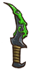
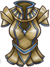

<!-- source: action=render -->

<b>中毒</b>是一种<a href="pages/%E5%87%8F%E7%9B%8A%E6%95%88%E6%9E%9C.html" title="减益效果">减益效果</a>。每2秒，每层造成1点伤害。第一次结算在第1.95秒。

<h2>与中毒有关的物品</h2>
<table class="styled items nostyle-list sortable">
<tbody><tr>
<th class="unsortable">
</th>
<th><b>名称</b>
</th>
<th class="unsortable"><b>效果</b>
</th>
<th><b>职业</b>
</th>
<th><b>稀有度</b>
</th>
<th><b>价格</b>
</th></tr>
<tr>
<td>

</td>
<td><a href="pages/%E5%82%A8%E7%89%A9%E6%A3%BA%E6%9D%90.html" title="储物棺材">储物棺材</a>
</td>
<td>
<ul><li>增加8格背包槽位。</li>
<li><b>棺材内物品激活时：</b>将有25%几率施加一层。</li></ul>
</td>
<td><a href="pages/%E6%94%B6%E5%89%B2%E8%80%85.html" title="收割者">收割者</a>
</td>
<td data-sort-value="6"><a href="pages/%E7%89%B9%E5%88%AB.html" title="特别">特别</a>
</td>
<td>20
</td></tr>
<tr>
<td>

</td>
<td><a href="pages/%E5%89%A7%E6%AF%92%E5%8C%95%E9%A6%96.html" title="剧毒匕首">剧毒匕首</a>
</td>
<td>
<ul><li><b>击中对手时：</b>施加2层。</li>
<li><b><a href="pages/%E7%9C%A9%E6%99%95.html" title="眩晕">眩晕</a>对手：</b>触发额外攻击。</li></ul>
</td>
<td><a href="pages/%E9%80%9A%E7%94%A8.html" title="通用">通用</a>
</td>
<td data-sort-value="3"><a href="pages/%E5%8F%B2%E8%AF%97.html" title="史诗">史诗</a>
</td>
<td>11
</td></tr>
<tr>
<td>

</td>
<td><a href="pages/%E5%89%A7%E6%AF%92%E5%B8%B8%E6%98%A5%E8%97%A4.html" title="剧毒常春藤">剧毒常春藤</a>
</td>
<td>
<ul><li>每有一个的物品，就会获得5%的几率<a href="pages/%E6%8A%B5%E6%8A%97.html" title="抵抗">抵抗</a><a href="pages/%E5%87%8F%E7%9B%8A%E6%95%88%E6%9E%9C.html" title="减益效果">减益效果</a>。</li>
<li><b>获得时：</b>向对手施加2层。</li>
<li><b>对手拥有至少18层时：</b>受到的伤害+25%。</li></ul>
</td>
<td><a href="pages/%E6%B8%B8%E4%BE%A0.html" title="游侠">游侠</a>
</td>
<td data-sort-value="6"><a href="pages/%E7%89%B9%E5%88%AB.html" title="特别">特别</a>
</td>
<td>10
</td></tr>
<tr>
<td>

</td>
<td><a href="pages/%E5%89%A7%E6%AF%92%E7%9F%9B.html" title="剧毒矛">剧毒矛</a>
</td>
<td>

<b>击中对手：</b>向对手施加3层，同时想自己施加2层。每有一个的空槽位或物品，破坏6点。

</td>
<td><a href="pages/%E9%80%9A%E7%94%A8.html" title="通用">通用</a>
</td>
<td data-sort-value="4"><a href="pages/%E4%BC%A0%E8%AF%B4.html" title="传说">传说</a>
</td>
<td>13
</td></tr>
<tr>
<td>

</td>
<td><a href="pages/%E5%89%A7%E6%AF%92%E8%9B%87%E6%9D%96.html" title="剧毒蛇杖">剧毒蛇杖</a>
</td>
<td>
<ul><li><b>攻击时：</b>消耗4点来获得2点伤害加成。每造成4点伤害，向对手施加1层。</li>
<li>你有35%的几率施加双倍的。</li></ul>
</td>
<td><a href="pages/%E9%80%9A%E7%94%A8.html" title="通用">通用</a>
</td>
<td data-sort-value="4"><a href="pages/%E4%BC%A0%E8%AF%B4.html" title="传说">传说</a>
</td>
<td>17
</td></tr>
<tr>
<td>

</td>
<td><a href="pages/%E5%89%A7%E6%AF%92%E8%9B%99.html" title="剧毒蛙">剧毒蛙</a>
</td>
<td>
<ul><li><b>的物品获得10层<a href="pages/%E5%A2%9E%E7%9B%8A%E6%95%88%E6%9E%9C.html" title="增益效果">增益效果</a>：</b><a href="pages/%E6%81%A2%E5%A4%8D.html" class="mw-disambig" title="恢复">恢复</a>12点生命值。</li>
<li><b>的物品消耗10层<a href="pages/%E5%A2%9E%E7%9B%8A%E6%95%88%E6%9E%9C.html" title="增益效果">增益效果</a>：</b>向对手施加2层，并获得1点。</li>
<li><b>每2.4s：</b>向对手施加2层，并获得1点。</li></ul>
</td>
<td><a href="pages/%E6%94%B6%E5%89%B2%E8%80%85.html" title="收割者">收割者</a>
</td>
<td data-sort-value="4"><a href="pages/%E4%BC%A0%E8%AF%B4.html" title="传说">传说</a>
</td>
<td>9
</td></tr>
<tr>
<td>

</td>
<td><a href="pages/%E5%89%A7%E6%AF%92%E9%BB%8F%E9%BB%8F.html" title="剧毒黏黏">剧毒黏黏</a>
</td>
<td>

<b>的物品激活达到5次：</b><a href="pages/%E6%81%A2%E5%A4%8D.html" class="mw-disambig" title="恢复">恢复</a>9点生命值并施加给对手4层。

</td>
<td><a href="pages/%E6%94%B6%E5%89%B2%E8%80%85.html" title="收割者">收割者</a>
</td>
<td data-sort-value="3"><a href="pages/%E5%8F%B2%E8%AF%97.html" title="史诗">史诗</a>
</td>
<td>12
</td></tr>
<tr>
<td>

</td>
<td><a href="pages/%E5%A4%A7%E8%92%9C%E6%8C%82%E5%A3%81.html" title="大蒜挂壁">大蒜挂壁</a>
</td>
<td>
<ul><li>的<a href="pages/%E5%A4%A7%E8%92%9C.html" title="大蒜">大蒜</a>获得+5点。</li>
<li><b>的物品每获得13点：</b>向对手施加1层。</li></ul>
</td>
<td><a href="pages/%E9%80%9A%E7%94%A8.html" title="通用">通用</a>
</td>
<td data-sort-value="6"><a href="pages/%E7%89%B9%E5%88%AB.html" title="特别">特别</a>
</td>
<td>5
</td></tr>
<tr>
<td>

</td>
<td><a href="pages/%E5%BC%BA%E5%8A%9B%E7%94%9F%E5%91%BD%E9%AD%94%E8%8D%AF.html" title="强力生命魔药">强力生命魔药</a>
</td>
<td>

<b>当你的生命值低于50%时：</b>消耗此魔药，<a href="pages/%E6%81%A2%E5%A4%8D.html" class="mw-disambig" title="恢复">恢复</a>24点生命值并获得3层，<a href="pages/%E5%87%80%E5%8C%96.html" title="净化">净化</a>4层。

</td>
<td><a href="pages/%E9%80%9A%E7%94%A8.html" title="通用">通用</a>
</td>
<td data-sort-value="3"><a href="pages/%E5%8F%B2%E8%AF%97.html" title="史诗">史诗</a>
</td>
<td>8
</td></tr>
<tr>
<td>

</td>
<td><a href="pages/%E5%BC%BA%E5%8A%9B%E7%98%9F%E7%96%AB%E7%83%A7%E7%93%B6.html" title="强力瘟疫烧瓶">强力瘟疫烧瓶</a>
</td>
<td>

<b>对手<a href="pages/%E6%81%A2%E5%A4%8D.html" class="mw-disambig" title="恢复">恢复</a>生命值时：</b>消耗此魔药并向对手施加3层并对自己施加1层。经过3.5s后，再向对手施加3层。

</td>
<td><a href="pages/%E6%94%B6%E5%89%B2%E8%80%85.html" title="收割者">收割者</a>
</td>
<td data-sort-value="4"><a href="pages/%E4%BC%A0%E8%AF%B4.html" title="传说">传说</a>
</td>
<td>10
</td></tr>
<tr>
<td>

</td>
<td><a href="pages/%E5%BD%A9%E8%99%B9%E8%B6%85%E7%BA%A7%E8%87%B3%E5%B0%8A%E9%BB%8F%E9%BB%8F.html" title="彩虹超级至尊黏黏">彩虹超级至尊黏黏</a>
</td>
<td>

<b>的物品激活达到9次：</b><a href="pages/%E6%81%A2%E5%A4%8D.html" class="mw-disambig" title="恢复">恢复</a>40点生命值，获得20点和2层，施加3层和3层。的武器伤害+4。

</td>
<td><a href="pages/%E6%94%B6%E5%89%B2%E8%80%85.html" title="收割者">收割者</a>
</td>
<td data-sort-value="5"><a href="pages/%E7%A5%9E%E7%BA%A7.html" title="神级">神级</a>
</td>
<td>55
</td></tr>
<tr>
<td>

</td>
<td><a href="pages/%E6%AD%BB%E7%A5%9E%E9%95%B0%E5%88%80.html" title="死神镰刀">死神镰刀</a>
</td>
<td>
<ul><li>的物品造成+100% 。</li>
<li><b>对手身上的达到25层时：</b>获得65%的<a href="pages/%E6%9A%B4%E5%87%BB.html" title="暴击">暴击</a>率加成。</li></ul>
</td>
<td><a href="pages/%E6%94%B6%E5%89%B2%E8%80%85.html" title="收割者">收割者</a>
</td>
<td data-sort-value="4"><a href="pages/%E4%BC%A0%E8%AF%B4.html" title="传说">传说</a>
</td>
<td>12
</td></tr>
<tr>
<td>

</td>
<td><a href="pages/%E6%B0%B4%E9%93%B6%E5%85%83%E7%B4%A0.html" title="水银元素">水银元素</a>
</td>
<td>
<ul><li><b>造成/伤害时：</b>获得造成伤害的45%作为。</li>
<li><b>每5s：</b>每有一个不重复的的武器，恢复1点<a href="pages/%E8%80%90%E5%8A%9B.html" title="耐力">耐力</a>。</li>
<li><b>每次消耗1点耐力：</b>向对手施加2层，还对自身施加2层。</li></ul>
</td>
<td><a href="pages/%E5%86%92%E9%99%A9%E5%AE%B6.html" title="冒险家">冒险家</a>
</td>
<td data-sort-value="6"><a href="pages/%E7%89%B9%E5%88%AB.html" title="特别">特别</a>
</td>
<td>10
</td></tr>
<tr>
<td>

</td>
<td><a href="pages/%E7%94%9F%E5%91%BD%E9%AD%94%E8%8D%AF.html" title="生命魔药">生命魔药</a>
</td>
<td>

<b>当你的生命值低于50%时：</b>消耗此魔药，<a href="pages/%E6%81%A2%E5%A4%8D.html" class="mw-disambig" title="恢复">恢复</a>12点生命值并<a href="pages/%E5%87%80%E5%8C%96.html" title="净化">净化</a>4层。

</td>
<td><a href="pages/%E9%80%9A%E7%94%A8.html" title="通用">通用</a>
</td>
<td data-sort-value="2"><a href="pages/%E7%BD%95%E8%A7%81.html" title="罕见">罕见</a>
</td>
<td>4
</td></tr>
<tr>
<td>

</td>
<td><a href="pages/%E7%98%9F%E7%96%AB%E7%83%A7%E7%93%B6.html" title="瘟疫烧瓶">瘟疫烧瓶</a>
</td>
<td>
<ul><li><b>当你的对手<a href="pages/%E6%81%A2%E5%A4%8D.html" class="mw-disambig" title="恢复">恢复</a>生命值时：</b>消耗此魔药，向对手施加3层的同时，对自己也施加1层。</li></ul>
</td>
<td><a href="pages/%E9%80%9A%E7%94%A8.html" title="通用">通用</a>
</td>
<td data-sort-value="3"><a href="pages/%E5%8F%B2%E8%AF%97.html" title="史诗">史诗</a>
</td>
<td>7
</td></tr>
<tr>
<td>

</td>
<td><a href="pages/%E7%A5%9E%E5%9C%A3%E6%8A%A4%E7%94%B2.html" title="神圣护甲">神圣护甲</a>
</td>
<td>
<ul><li><b>战斗开始时：</b>获得65点。每有一个的物品获得2层。</li>
<li><b>每2.2s：</b><a href="pages/%E5%87%80%E5%8C%96.html" title="净化">净化</a>2层。</li></ul>
</td>
<td><a href="pages/%E9%80%9A%E7%94%A8.html" title="通用">通用</a>
</td>
<td data-sort-value="4"><a href="pages/%E4%BC%A0%E8%AF%B4.html" title="传说">传说</a>
</td>
<td>12
</td></tr>
<tr>
<td>

</td>
<td><a href="pages/%E7%BF%A1%E7%BF%A0.html" title="翡翠">翡翠</a>
</td>
<td>

放入武器槽：

<b>击中对手：</b> 将有35/50/80/80/80% 的几率向对手施加1/1/1/2/4层。

 
放入护甲或其他槽：

将有10/15/20/25/40%的几率抵挡。

 
放入背包：

<b>3/4/4/3.5/3s后：</b>获得1/2/3/4/7层。

</td>
<td><a href="pages/%E9%80%9A%E7%94%A8.html" title="通用">通用</a>
</td>
<td data-sort-value="0"><a href="pages/Varies.html" class="mw-redirect" title="Varies">Varies</a>
</td>
<td>1/2/4/8/16
</td></tr>
<tr>
<td>

</td>
<td><a href="pages/%E7%BF%A1%E7%BF%A0%E5%B9%BC%E9%BE%99.html" title="翡翠幼龙">翡翠幼龙</a>
</td>
<td>
<ul><li><b>战斗开始时：</b>获得3点。</li>
<li><b>击中对手时：</b>施加3层。</li></ul>
</td>
<td><a href="pages/%E7%81%AB%E7%84%B0%E9%AD%94%E5%AF%BC%E5%A3%AB.html" title="火焰魔导士">火焰魔导士</a>
</td>
<td data-sort-value="5"><a href="pages/%E7%A5%9E%E7%BA%A7.html" title="神级">神级</a>
</td>
<td>14
</td></tr>
<tr>
<td>

</td>
<td><a href="pages/%E8%85%90%E8%B4%A5%E7%86%8A%E7%8C%AB%E4%B9%8B%E9%94%85.html" title="腐败熊猫之锅">腐败熊猫之锅</a>
</td>
<td>
<ul><li><b>的食物激活时：</b>向对手施加1层。</li></ul>
</td>
<td><a href="pages/%E9%80%9A%E7%94%A8.html" title="通用">通用</a>
</td>
<td data-sort-value="4"><a href="pages/%E4%BC%A0%E8%AF%B4.html" title="传说">传说</a>
</td>
<td>11
</td></tr>
<tr>
<td>

</td>
<td><a href="pages/%E8%87%B4%E5%B9%BB%E8%98%91%E8%8F%87.html" title="致幻蘑菇">致幻蘑菇</a>
</td>
<td>

<b>每3.6s：</b>施加1层。

</td>
<td><a href="pages/%E6%94%B6%E5%89%B2%E8%80%85.html" title="收割者">收割者</a>
</td>
<td data-sort-value="2"><a href="pages/%E7%BD%95%E8%A7%81.html" title="罕见">罕见</a>
</td>
<td>3
</td></tr>
<tr>
<td>

</td>
<td><a href="pages/%E8%87%B4%E6%AD%BB%E8%98%91%E8%8F%87.html" title="致死蘑菇">致死蘑菇</a>
</td>
<td>

<b>每2.9s：</b>向对手施加3层并让对手的生命<a href="pages/%E6%81%A2%E5%A4%8D.html" class="mw-disambig" title="恢复">恢复</a>效果削弱10%。

</td>
<td><a href="pages/%E6%94%B6%E5%89%B2%E8%80%85.html" title="收割者">收割者</a>
</td>
<td data-sort-value="5"><a href="pages/%E7%A5%9E%E7%BA%A7.html" title="神级">神级</a>
</td>
<td>10
</td></tr>
<tr>
<td>

</td>
<td><a href="pages/%E8%9B%87%E8%9B%87.html" title="蛇蛇">蛇蛇</a>
</td>
<td>
<ul><li>每有一点将获得4%的几率阻止对手身上的被<a href="pages/%E5%87%80%E5%8C%96.html" title="净化">净化</a>。</li>
<li><b>战斗开始时：</b>每有一个的宠物，将获得4点和50点最大生命值。</li>
<li><b>每2.2s：</b>向对手施加2层。</li></ul>
</td>
<td><a href="pages/%E6%94%B6%E5%89%B2%E8%80%85.html" title="收割者">收割者</a>
</td>
<td data-sort-value="6"><a href="pages/%E7%89%B9%E5%88%AB.html" title="特别">特别</a>
</td>
<td>10
</td></tr>
<tr>
<td>

</td>
<td><a href="pages/%E9%A2%A0%E8%8C%84%E5%89%A7%E6%AF%92%E5%BC%93.html" title="颠茄剧毒弓">颠茄剧毒弓</a>
</td>
<td>
<ul><li><b>的<a href="pages/%E6%AD%A6%E5%99%A8.html" title="武器">武器</a>每造成5点伤害：</b>颠茄剧毒弓的下一次攻击向对手施加+1层。</li>
<li>对手身上每有一层，则颠茄剧毒弓的伤害+0.5。</li></ul>
</td>
<td><a href="pages/%E6%B8%B8%E4%BE%A0.html" title="游侠">游侠</a>
</td>
<td data-sort-value="4"><a href="pages/%E4%BC%A0%E8%AF%B4.html" title="传说">传说</a>
</td>
<td>14
</td></tr>
<tr>
<td>

</td>
<td><a href="pages/%E9%A2%A0%E8%8C%84%E5%89%A7%E6%AF%92%E7%9F%AD%E5%BC%93.html" title="颠茄剧毒短弓">颠茄剧毒短弓</a>
</td>
<td>

<b>击中对手时：</b>有70%的几率施加2层和一层随机<a href="pages/%E5%87%8F%E7%9B%8A%E6%95%88%E6%9E%9C.html" title="减益效果">减益效果</a>。

</td>
<td><a href="pages/%E6%B8%B8%E4%BE%A0.html" title="游侠">游侠</a>
</td>
<td data-sort-value="4"><a href="pages/%E4%BC%A0%E8%AF%B4.html" title="传说">传说</a>
</td>
<td>11
</td></tr>
<tr>
<td>

</td>
<td><a href="pages/%E9%BB%91%E8%89%B2%E5%A3%AB%E5%85%B5.html" title="黑色士兵">黑色士兵</a>
</td>
<td>
<ul><li><b>吃掉其他棋子时：</b>获得3点。</li>
<li><b>被吃掉时：</b>向对手施加2层。</li></ul>
</td>
<td><a href="pages/%E9%AD%94%E6%B3%95%E5%B8%88.html" title="魔法师">魔法师</a>
</td>
<td data-sort-value="1"><a href="pages/%E6%99%AE%E9%80%9A.html" title="普通">普通</a>
</td>
<td>1
</td></tr>
<tr>
<td>

</td>
<td><a href="pages/%E9%BC%A0%E9%BC%A0.html" title="鼠鼠">鼠鼠</a>
</td>
<td>
<ul><li><b>每3.3s：</b>造成5点伤害。有75%的几率向对手施加1层。还有10%的几率向对手施加1层。</li>
<li>'每有一个的宠物或食物，效果触发快15%。</li></ul>
</td>
<td><a href="pages/%E6%B8%B8%E4%BE%A0.html" title="游侠">游侠</a>
</td>
<td data-sort-value="1"><a href="pages/%E6%99%AE%E9%80%9A.html" title="普通">普通</a>
</td>
<td>4
</td></tr>
<tr>
<td>

</td>
<td><a href="pages/%E9%BE%99%E7%88%AA.html" title="龙爪">龙爪</a>
</td>
<td>
<ul><li>有10%的几率<a href="pages/%E6%8A%B5%E6%8A%97.html" title="抵抗">抵抗</a>。</li>
<li><b> <a href="pages/%E7%8B%82%E6%88%98%E5%A3%AB%E4%B9%8B%E6%80%92.html" title="狂战士之怒">狂战士之怒</a>期间:</b> 的物品触发快40%。</li></ul>
</td>
<td><a href="pages/%E7%8B%82%E6%88%98%E5%A3%AB.html" title="狂战士">狂战士</a>
</td>
<td data-sort-value="3"><a href="pages/%E5%8F%B2%E8%AF%97.html" title="史诗">史诗</a>
</td>
<td>4
</td></tr></tbody></table>
<!-- 
NewPP limit report
Cached time: 20251214110816
Cache expiry: 2592000
Reduced expiry: false
Complications: []
CPU time usage: 0.307 seconds
Real time usage: 0.394 seconds
Preprocessor visited node count: 1371/1000000
Revision size: 538/4194304 bytes
Post‐expand include size: 36796/4194304 bytes
Template argument size: 9940/4194304 bytes
Highest expansion depth: 6/100
Expensive parser function count: 0/500
Unstrip recursion depth: 0/20
Unstrip post‐expand size: 0/10000000 bytes
Number of processed Cargo queries: 1
Time spent processing Cargo queries: 0.133 s (avg. 0.133 s)
Number of Cargo row insertion attempts: 0
-->
<!--
Transclusion expansion time report (%,ms,calls,template)
100.00%   44.447      1 -total
 93.67%   41.634     27 Template:Item_table/row
  5.06%    2.248     27 Template:图标/金币
  4.85%    2.156      9 Template:图标/收割者
  4.83%    2.146      1 Template:图标/狂战士
  4.39%    1.951      4 Template:图标/游侠
  4.22%    1.874      1 Template:图标/火焰魔导士
  4.04%    1.795      1 Template:图标/魔法师
  3.94%    1.753      1 Template:图标/冒险家
  3.56%    1.581     10 Template:图标/通用
-->

<!-- Saved in parser cache with key backpackbattles_zh:pcache:idhash:1269-0!canonical!zh-cn and timestamp 20251214110816 and revision id 3923. Rendering was triggered because: page_view
 -->

