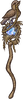
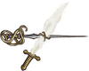

冒险家

**冒险家**是一个[可玩角色](pages/%E8%A7%92%E8%89%B2.html#%E5%8F%AF%E7%8E%A9%E8%A7%92%E8%89%B2 "角色")。冒险家会使用多种[职业](pages/%E8%A7%92%E8%89%B2.html)的物品或者[细绳](pages/%E7%BB%86%E7%BB%B3.html)组合通用物品。

冒险家和[魔法师](pages/%E9%AD%94%E6%B3%95%E5%B8%88.html)一起，在[背包乱斗](pages/%E8%83%8C%E5%8C%85%E4%B9%B1%E6%96%97.html)的正式版中推出。

物品
--

### 初始物品

#### 给予之袋

*   [给予之袋](pages/%E7%BB%99%E4%BA%88%E4%B9%8B%E8%A2%8B.html)
*   2x [皮包](pages/%E7%9A%AE%E5%8C%85.html)
*   [西兰花](pages/%E8%A5%BF%E5%85%B0%E8%8A%B1.html)
*   [大蒜](pages/%E5%A4%A7%E8%92%9C.html)

#### 针线包

*   [针线包](pages/%E9%92%88%E7%BA%BF%E5%8C%85.html)
*   2x [皮包](pages/%E7%9A%AE%E5%8C%85.html)
*   [木剑](pages/%E6%9C%A8%E5%89%91.html)
*   2x [石头](pages/%E7%9F%B3%E5%A4%B4.html)

#### 惊喜袋

*   [惊喜袋](pages/%E6%83%8A%E5%96%9C%E8%A2%8B.html)

### 专属物品

|  | **名称** | **效果** | **物品类型** | **稀有度** | **价格** |
| --- | --- | --- | --- | --- | --- |
|  | [西兰花](pages/%E8%A5%BF%E5%85%B0%E8%8A%B1.html) | **每6s：**获得2点。如果你至少有5点，则会获得2层。 |  [食物](pages/%E9%A3%9F%E7%89%A9.html) | [罕见](pages/%E7%BD%95%E8%A7%81.html) | 4  |
|  | [宝藏箱](pages/%E5%AE%9D%E8%97%8F%E7%AE%B1.html) | **购买此物品时：**用价值10枚的物品代替此宝藏箱。可能包含物品！ | [配饰](pages/%E9%85%8D%E9%A5%B0.html) | [史诗](pages/%E5%8F%B2%E8%AF%97.html) | 7  |
|  | [细绳](pages/%E7%BB%86%E7%BB%B3.html) | **的物品激活时：**有20%的几率获得2点最大生命值。每有一个的通用物品，几率再增加20%。 | [配饰](pages/%E9%85%8D%E9%A5%B0.html) | [普通](pages/%E6%99%AE%E9%80%9A.html) | 2  |

### 合成

这些[合成物品](pages/%E5%90%88%E6%88%90%E9%85%8D%E6%96%B9.html)是冒险家专属。

|  | **名称** | **效果** | **物品类型** | **稀有度** | **价格** |
| --- | --- | --- | --- | --- | --- |
|  | [大得离谱的荆棘剑](pages/%E5%A4%A7%E5%BE%97%E7%A6%BB%E8%B0%B1%E7%9A%84%E8%8D%86%E6%A3%98%E5%89%91.html) | * **当你至少有5层：**耐力消耗减少到2，冷却时间降低到2s。 * **击中对手：**消耗3层来获得6层，还会获得6层。 * 每有一层或，造成的伤害+2。 |    [武器](pages/%E6%AD%A6%E5%99%A8.html) | [神级](pages/%E7%A5%9E%E7%BA%A7.html) | 31  |
|  | [回旋镖](pages/%E5%9B%9E%E6%97%8B%E9%95%96.html) | * **击中对手：**耐力消耗减少20%。有50%的几率偷取一层随机[增益效果](pages/%E5%A2%9E%E7%9B%8A%E6%95%88%E6%9E%9C.html)。 |  [武器](pages/%E6%AD%A6%E5%99%A8.html) | [罕见](pages/%E7%BD%95%E8%A7%81.html) | 8  |
|  | [西兰花黏黏](pages/%E8%A5%BF%E5%85%B0%E8%8A%B1%E9%BB%8F%E9%BB%8F.html) | **的物品激活达到6次：**获得3点。如果你至少有5点，则会获得3层。 |  [宠物](pages/%E5%AE%A0%E7%89%A9.html) | [史诗](pages/%E5%8F%B2%E8%AF%97.html) | 10  |
|  | [匕首回旋镖](pages/%E5%8C%95%E9%A6%96%E5%9B%9E%E6%97%8B%E9%95%96.html) | * **击中对手：**减少耐力消耗20%。有70%的几率偷取一层随机[增益效果](pages/%E5%A2%9E%E7%9B%8A%E6%95%88%E6%9E%9C.html)。 * **[眩晕](pages/%E7%9C%A9%E6%99%95.html)对手时：**触发一次额外攻击。 |  [武器](pages/%E6%AD%A6%E5%99%A8.html) | [史诗](pages/%E5%8F%B2%E8%AF%97.html) | 12  |
|  | [黏黏龙骑士](pages/%E9%BB%8F%E9%BB%8F%E9%BE%99%E9%AA%91%E5%A3%AB.html) | * **战斗开始时：**获得5层。[反弹](pages/%E5%8F%8D%E5%BC%B9.html)4层减益效果。 * **击中对手：**[恢复](pages/%E6%81%A2%E5%A4%8D.html)生命值10点。 * **的物品激活时：**快进15%冷却时间。 |    [武器](pages/%E6%AD%A6%E5%99%A8.html), [宠物](pages/%E5%AE%A0%E7%89%A9.html) | [神级](pages/%E7%A5%9E%E7%BA%A7.html) | 18  |
|  | [工作服](pages/%E5%B7%A5%E4%BD%9C%E6%9C%8D.html) | * **商店刷新时：**有35%的几率出现交易机会。 * **战斗开始时：**获得70点。[抵抗](pages/%E6%8A%B5%E6%8A%97.html)6层[减益效果](pages/%E5%87%8F%E7%9B%8A%E6%95%88%E6%9E%9C.html)。 | [护甲](pages/%E6%8A%A4%E7%94%B2.html) | [史诗](pages/%E5%8F%B2%E8%AF%97.html) | 13  |
|  | [心形盾牌](pages/%E5%BF%83%E5%BD%A2%E7%9B%BE%E7%89%8C.html) | * 的物品获得的+30%,生命值[恢复](pages/%E6%81%A2%E5%A4%8D.html)效果加强30%，且有30%的几率复制获得的。 * **被攻击时（）：**有30%的几率抵挡14点伤害，移除对手0.7点[耐力](pages/%E8%80%90%E5%8A%9B.html)并获得1层（最高20层）。 * **消耗7层：**还能抵挡和伤害，并获得150的最大生命值（单次触发）。 |  [盾牌](pages/%E7%9B%BE%E7%89%8C.html) | [神级](pages/%E7%A5%9E%E7%BA%A7.html) | 26  |
|  | [英雄盾牌](pages/%E8%8B%B1%E9%9B%84%E7%9B%BE%E7%89%8C.html) | * **战斗开始时：**的武器获得+1 +15%伤害加成。 * **被攻击时（）：**有30%的几率抵挡15点伤害并移除对手0.4点[耐力](pages/%E8%80%90%E5%8A%9B.html)。 | [盾牌](pages/%E7%9B%BE%E7%89%8C.html) | [罕见](pages/%E7%BD%95%E8%A7%81.html) | 10  |
|  | [小鸟法杖](pages/%E5%B0%8F%E9%B8%9F%E6%B3%95%E6%9D%96.html) | * **攻击时：**消耗3点：获得2点伤害加成。 * 的物品触发速度快10%（最高10次）。 * 移除对手2点。 |    [武器](pages/%E6%AD%A6%E5%99%A8.html), [宠物](pages/%E5%AE%A0%E7%89%A9.html) | [神级](pages/%E7%A5%9E%E7%BA%A7.html) | 18  |
|  | [宝石存钱罐](pages/%E5%AE%9D%E7%9F%B3%E5%AD%98%E9%92%B1%E7%BD%90.html) | * [宝石](pages/%E5%AE%9D%E7%9F%B3.html)将在商店出售。 * **进入商店时：**生成2个[宝石](pages/%E5%AE%9D%E7%9F%B3.html)碎片。 * **战斗开始时：**每有一个镶入槽位的[宝石](pages/%E5%AE%9D%E7%9F%B3.html)，获得4点最大生命值。 | [配饰](pages/%E9%85%8D%E9%A5%B0.html) | [史诗](pages/%E5%8F%B2%E8%AF%97.html) | 10  |
|  | [彩虹巨大西兰花黏黏](pages/%E5%BD%A9%E8%99%B9%E5%B7%A8%E5%A4%A7%E8%A5%BF%E5%85%B0%E8%8A%B1%E9%BB%8F%E9%BB%8F.html) | **的物品激活达到9次：**[恢复](pages/%E6%81%A2%E5%A4%8D.html)生命值40点，获得20点，还有2层和2层，向对手施加3层，且的武器获得4点伤害加成。 |    [宠物](pages/%E5%AE%A0%E7%89%A9.html) | [神级](pages/%E7%A5%9E%E7%BA%A7.html) | 53  |
|  | [麻绳](pages/%E9%BA%BB%E7%BB%B3.html) | **的物品激活时：**的物品触发速度快10%，持续6s（多个麻绳效果不叠加，最多50%）。 | [配饰](pages/%E9%85%8D%E9%A5%B0.html) | [罕见](pages/%E7%BD%95%E8%A7%81.html) | 4  |
|  | [剑剪刀](pages/%E5%89%91%E5%89%AA%E5%88%80.html) | * **消耗3点：**向两位玩家同时施加10层，持续5s（无法叠加）。 * **攻击落空：**获得5点。 * **击中对手：**消耗3点来获得3点伤害加成和1层。 * 对手每有一层，造成的伤害+1。 |   [武器](pages/%E6%AD%A6%E5%99%A8.html) | [神级](pages/%E7%A5%9E%E7%BA%A7.html) | 24  |
|  | [超长矛](pages/%E8%B6%85%E9%95%BF%E7%9F%9B.html) | * **击中对手：**每有一个的空格，摧毁对手12点。你的对手受到的伤害+5%。 |  [武器](pages/%E6%AD%A6%E5%99%A8.html) | [史诗](pages/%E5%8F%B2%E8%AF%97.html) | 14  |

### 子职业

这些是冒险家的[子职业](pages/%E5%AD%90%E8%81%8C%E4%B8%9A.html) 物品。

|  | **名称** | **效果** | **物品类型** | **稀有度** | **价格** |
| --- | --- | --- | --- | --- | --- |
|  | [水银元素](pages/%E6%B0%B4%E9%93%B6%E5%85%83%E7%B4%A0.html)（武器大师） | * **造成/伤害时：**获得造成伤害的45%作为。 * **每5s：**每有一个不重复的的武器，恢复1点[耐力](pages/%E8%80%90%E5%8A%9B.html)。 * **每次消耗1点耐力：**向对手施加2层，还对自身施加2层。 | [宠物](pages/%E5%AE%A0%E7%89%A9.html) | [特别](pages/%E7%89%B9%E5%88%AB.html) | 10  |
|  | [天平](pages/%E5%A4%A9%E5%B9%B3.html)（商人） | * **商店刷新时:**有40%的几率出现[交易](pages/%E4%BA%A4%E6%98%93.html)机会。 * **每2.8s：**根据你现有最少的项，获得4点或3层。 * 对比和两侧物品。 * 在价值较低侧，每价值一枚，天平触发速度快2%。 * **如果两侧价值差距小于5：**和侧物品触发速度快30%。 | [配饰](pages/%E9%85%8D%E9%A5%B0.html) | [特别](pages/%E7%89%B9%E5%88%AB.html) | 10  |
|  | [软呢帽](pages/%E8%BD%AF%E5%91%A2%E5%B8%BD.html)（考古学家） | * 找到物品的几率+65%。 * 你能多携带+3个物品。 * **战斗开始时：**每有一个的物品，获得1点，且每有一个的物品，还会获得3点。 * **每2.3s：**消耗1点来偷取2层其他[增益效果](pages/%E5%A2%9E%E7%9B%8A%E6%95%88%E6%9E%9C.html)。 * 基于几率触发的的物品获得25%触发[几率](pages/%E5%87%A0%E7%8E%87.html)加成。 | [头盔](pages/%E5%A4%B4%E7%9B%94.html) | [特别](pages/%E7%89%B9%E5%88%AB.html) | 10  |
|  | [乌龟](pages/%E4%B9%8C%E9%BE%9F.html)（盾牌大师） | * 的盾牌抵挡伤害增加100%。 * **战斗开始时：**两位玩家的伤害同时削减35%，持续7s。 * **每13s：**获得50点，还有你的最大生命值的20%作为。 |  [宠物](pages/%E5%AE%A0%E7%89%A9.html) | [特别](pages/%E7%89%B9%E5%88%AB.html) | 10  |
|  | [尤克里里](pages/%E5%B0%A4%E5%85%8B%E9%87%8C%E9%87%8C.html)（吟游诗人） | * **的物品激活时：**随机快进一个非物品冷却时间20%。 * 你的生命[恢复](pages/%E6%81%A2%E5%A4%8D.html)效果加强20%。 * +15%的几率复制获得的[增益效果](pages/%E5%A2%9E%E7%9B%8A%E6%95%88%E6%9E%9C.html)。 **每6s：**[恢复](pages/%E6%81%A2%E5%A4%8D.html)生命值30点，或获得5层随机[增益效果](pages/%E5%A2%9E%E7%9B%8A%E6%95%88%E6%9E%9C.html)，或向对手施加4层。 * 每有一个的物品，触发速度快10%。 |  [配饰](pages/%E9%85%8D%E9%A5%B0.html) | [特别](pages/%E7%89%B9%E5%88%AB.html) | 10  |

### 专属技能

|  | **名称** | **效果** | **物品类型** | **稀有度** | **价格** |
| --- | --- | --- | --- | --- | --- |
|  | [双持武器](pages/%E5%8F%8C%E6%8C%81%E6%AD%A6%E5%99%A8.html) | 如果你正好拥有两把消耗[耐力](pages/%E8%80%90%E5%8A%9B.html)的武器，两把武器的攻击速度都加快20%且耐力消耗-30%。 | [技能](pages/%E6%8A%80%E8%83%BD.html) | [特别](pages/%E7%89%B9%E5%88%AB.html) | 5  |
|  | [升级](pages/%E5%8D%87%E7%BA%A7.html) | * **每5s：**获得10点最大生命值，1点[耐力](pages/%E8%80%90%E5%8A%9B.html)，还有1点和1点。 * 在第3回合后的每回合触发速度都会快10%。 | [技能](pages/%E6%8A%80%E8%83%BD.html) | [特别](pages/%E7%89%B9%E5%88%AB.html) | 5  |

### 职业背包

|  | **名称** | **效果** | **物品类型** | **稀有度** | **价格** |
| --- | --- | --- | --- | --- | --- |
|  | [给予之袋](pages/%E7%BB%99%E4%BA%88%E4%B9%8B%E8%A2%8B.html) | * 增加6格背包槽位。 * 所有职业的物品将在商店出售。 * **进入商店时：**花费全部来生成一个随机物品。 * **背包内职业物品激活时：**获得0.1点最大[耐力](pages/%E8%80%90%E5%8A%9B.html)。 | [背包](pages/%E8%83%8C%E5%8C%85.html) | [特别](pages/%E7%89%B9%E5%88%AB.html) | 16  |
|  | [针线包](pages/%E9%92%88%E7%BA%BF%E5%8C%85.html) | * 增加6格背包槽位。 * **购买[细绳](pages/%E7%BB%86%E7%BB%B3.html)时：**商店有70%几率刷新一个新细绳。 * 背包内的打造物品触发快15%，还有15%的几率复制获得的[增益效果](pages/%E5%A2%9E%E7%9B%8A%E6%95%88%E6%9E%9C.html)。 | [背包](pages/%E8%83%8C%E5%8C%85.html) | [特别](pages/%E7%89%B9%E5%88%AB.html) | 16  |

| [物品](pages/%E7%89%A9%E5%93%81.html) |
| --- |
| |  [通用](pages/%E9%80%9A%E7%94%A8.html) | | --- | |  [游侠](pages/%E6%B8%B8%E4%BE%A0.html) | | --- | |  [收割者](pages/%E6%94%B6%E5%89%B2%E8%80%85.html) | | --- | |  [火焰魔导士](pages/%E7%81%AB%E7%84%B0%E9%AD%94%E5%AF%BC%E5%A3%AB.html) | | --- | |  [狂战士](pages/%E7%8B%82%E6%88%98%E5%A3%AB.html) | | --- | |  [魔法师](pages/%E9%AD%94%E6%B3%95%E5%B8%88.html) | | --- | |  [冒险家](pages/%E5%86%92%E9%99%A9%E5%AE%B6.html) | | --- | |  [宝藏箱](pages/%E5%AE%9D%E8%97%8F%E7%AE%B1.html)•  [宝石存钱罐](pages/%E5%AE%9D%E7%9F%B3%E5%AD%98%E9%92%B1%E7%BD%90.html)•  [匕首回旋镖](pages/%E5%8C%95%E9%A6%96%E5%9B%9E%E6%97%8B%E9%95%96.html)•  [彩虹巨大西兰花黏黏](pages/%E5%BD%A9%E8%99%B9%E5%B7%A8%E5%A4%A7%E8%A5%BF%E5%85%B0%E8%8A%B1%E9%BB%8F%E9%BB%8F.html)•  [超长矛](pages/%E8%B6%85%E9%95%BF%E7%9F%9B.html)•  [大得离谱的荆棘剑](pages/%E5%A4%A7%E5%BE%97%E7%A6%BB%E8%B0%B1%E7%9A%84%E8%8D%86%E6%A3%98%E5%89%91.html)•  [给予之袋](pages/%E7%BB%99%E4%BA%88%E4%B9%8B%E8%A2%8B.html)•  [工作服](pages/%E5%B7%A5%E4%BD%9C%E6%9C%8D.html)•  [回旋镖](pages/%E5%9B%9E%E6%97%8B%E9%95%96.html)•  [剑剪刀](pages/%E5%89%91%E5%89%AA%E5%88%80.html)•  [麻绳](pages/%E9%BA%BB%E7%BB%B3.html)•  [黏黏龙骑士](pages/%E9%BB%8F%E9%BB%8F%E9%BE%99%E9%AA%91%E5%A3%AB.html)•  [软呢帽](pages/%E8%BD%AF%E5%91%A2%E5%B8%BD.html)•  [升级](pages/%E5%8D%87%E7%BA%A7.html)•  [双持武器](pages/%E5%8F%8C%E6%8C%81%E6%AD%A6%E5%99%A8.html)•  [水银元素](pages/%E6%B0%B4%E9%93%B6%E5%85%83%E7%B4%A0.html)•  [天平](pages/%E5%A4%A9%E5%B9%B3.html)•  [乌龟](pages/%E4%B9%8C%E9%BE%9F.html)•  [西兰花](pages/%E8%A5%BF%E5%85%B0%E8%8A%B1.html)•  [西兰花黏黏](pages/%E8%A5%BF%E5%85%B0%E8%8A%B1%E9%BB%8F%E9%BB%8F.html)•  [细绳](pages/%E7%BB%86%E7%BB%B3.html)•  [小鸟法杖](pages/%E5%B0%8F%E9%B8%9F%E6%B3%95%E6%9D%96.html)•  [心形盾牌](pages/%E5%BF%83%E5%BD%A2%E7%9B%BE%E7%89%8C.html)•  [英雄盾牌](pages/%E8%8B%B1%E9%9B%84%E7%9B%BE%E7%89%8C.html)•  [尤克里里](pages/%E5%B0%A4%E5%85%8B%E9%87%8C%E9%87%8C.html)•  [针线包](pages/%E9%92%88%E7%BA%BF%E5%8C%85.html) | |

衣柜
--

Q版皮肤需要在设置里打开。

*    
默认

（Default） 
*    
宝藏猎人

（TreasureHunter） 

*    
默认

（Default） 
*    
宝藏猎人

（TreasureHunter）
