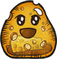
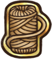

**增益效果**会给角色带来各种正面效果。除非另有说明，否则**增益效果**将持续到战斗结束。每个**增益效果**都是可叠加的。

**[充能](pages/%E5%85%85%E8%83%BD.html):** 每层增加1点武器伤害。

**[狂热](pages/%E7%8B%82%E7%83%AD.html):** 每层使所有物品触发快2%。

**[幸运](pages/%E5%B9%B8%E8%BF%90.html):** 每点增加5%命中率。

**[魔法](pages/%E9%AD%94%E6%B3%95.html):**[魔法](pages/%E9%AD%94%E6%B3%95%E5%B1%9E%E6%80%A7.html) 物品的消耗物。

**[恢复](pages/%E6%81%A2%E5%A4%8D%EF%BC%88%E5%A2%9E%E7%9B%8A%E6%95%88%E6%9E%9C%EF%BC%89.html):**每2秒，每层恢复1点生命值。

**[尖刺](pages/%E5%B0%96%E5%88%BA.html):**当被敌人用[近战武器](pages/%E8%BF%91%E6%88%98%E6%AD%A6%E5%99%A8.html)击中时，每层造成1点伤害。（最高造成100%伤害的量）

**[吸血](pages/%E5%90%B8%E8%A1%80.html):** 当使用[近战武器](pages/%E8%BF%91%E6%88%98%E6%AD%A6%E5%99%A8.html)击中敌人时，每层恢复1点生命值。（最高恢复100%伤害的量）

增益相关效果
------

*   **偷取增益效果**：移除对手增益效果并获得相应的增益效果，受“保护你的增益效果不被移除”和“复制获得的增益效果”影响。
*   **复制获得的增益效果**：几率获得双倍的增益，会被[无效化](pages/%E6%97%A0%E6%95%88%E5%8C%96.html)抵消。几率达到100%后无法额外获得双倍以上的增益。
*   **保护你的增益效果不被移除**：防止被移除和偷取增益效果。
*   **重新获得/返回消耗的增益效果**：消耗增益效果时再次获得，本物体可受复制获得的增益效果影响。若超过100%可以获得额外的增益（电表倒转）。

增益效果物品列表
--------

|  | **名称** | **效果** | **职业** | **稀有度** | **价格** |
| --- | --- | --- | --- | --- | --- |
|  | [一坨煤炭](pages/%E4%B8%80%E5%9D%A8%E7%85%A4%E7%82%AD.html) | 放入武器槽： **击中对手时：**有70%的几率造成+1点额外伤害。 放入护甲或其他槽： * **战斗开始时：**获得8点。 * 还会[抵抗](pages/%E6%8A%B5%E6%8A%97.html)1层[减益效果](pages/%E5%87%8F%E7%9B%8A%E6%95%88%E6%9E%9C.html)。 放入背包： **在3s后：**获得一个随机[增益效果](pages/%E5%A2%9E%E7%9B%8A%E6%95%88%E6%9E%9C)，向对手施加一个随机[减益效果](pages__%E5%87%8F%E7%9B%8A%E6%95%88%E6%9E%9C.html.html)。 |  [通用](pages/%E9%80%9A%E7%94%A8.html) | [普通](pages/%E6%99%AE%E9%80%9A.html) | 2 |
|  | [一碗零食](pages/%E4%B8%80%E7%A2%97%E9%9B%B6%E9%A3%9F.html) | * **每4s：**获得2层随机[增益效果](pages/%E5%A2%9E%E7%9B%8A%E6%95%88%E6%9E%9C.html)，且的食物触发快25%（最高100%）。 * 你所有的宠物有20%的几率激活两次。 * [森林之友](pages/%E6%A3%AE%E6%9E%97%E4%B9%8B%E5%8F%8B.html)会在商店出现。 |  [游侠](pages/%E6%B8%B8%E4%BE%A0.html) | [特别](pages/%E7%89%B9%E5%88%AB.html) | 10 |
|  | [不恐怖幽灵](pages/%E4%B8%8D%E6%81%90%E6%80%96%E5%B9%BD%E7%81%B5.html) | * 以你恢复量的30%作为伤害。 * **每3s：**消耗一个随机[增益效果](pages/%E5%A2%9E%E7%9B%8A%E6%95%88%E6%9E%9C)来[恢复](pages__%E6%81%A2%E5%A4%8D.html.html)生命值12点。 |  [通用](pages/%E9%80%9A%E7%94%A8.html) | [特别](pages/%E7%89%B9%E5%88%AB.html) | 10 |
|  | [不稳定重组器](pages/%E4%B8%8D%E7%A8%B3%E5%AE%9A%E9%87%8D%E7%BB%84%E5%99%A8.html) | * **进入商店时：**分解的物品。根据分解物品的总价值生成新物品。 * **每4s：**获得1层随机[增益效果](pages/%E5%A2%9E%E7%9B%8A%E6%95%88%E6%9E%9C)并[净化](pages__%E5%87%80%E5%8C%96.html)1层[减益效果](pages__%E5%87%8F%E7%9B%8A%E6%95%88%E6%9E%9C.html.html)。 |  [通用](pages/%E9%80%9A%E7%94%A8.html) | [史诗](pages/%E5%8F%B2%E8%AF%97.html) | 6 |
|  | [剧毒蛙](pages/%E5%89%A7%E6%AF%92%E8%9B%99.html) | * **的物品获得10层[增益效果](pages/%E5%A2%9E%E7%9B%8A%E6%95%88%E6%9E%9C)：**[恢复](pages__%E6%81%A2%E5%A4%8D.html.html)12点生命值。 * **的物品消耗10层[增益效果](pages/%E5%A2%9E%E7%9B%8A%E6%95%88%E6%9E%9C.html)：**向对手施加2层，并获得1点。 * **每2.4s：**向对手施加2层，并获得1点。 |  [收割者](pages/%E6%94%B6%E5%89%B2%E8%80%85.html) | [传说](pages/%E4%BC%A0%E8%AF%B4.html) | 9 |
|  | [匕首回旋镖](pages/%E5%8C%95%E9%A6%96%E5%9B%9E%E6%97%8B%E9%95%96.html) | * **击中对手：**减少耐力消耗20%。有70%的几率偷取一层随机[增益效果](pages/%E5%A2%9E%E7%9B%8A%E6%95%88%E6%9E%9C.html)。 * **[眩晕](pages/%E7%9C%A9%E6%99%95.html)对手时：**触发一次额外攻击。 |  [冒险家](pages/%E5%86%92%E9%99%A9%E5%AE%B6.html) | [史诗](pages/%E5%8F%B2%E8%AF%97.html) | 12 |
|  | [双重彩虹](pages/%E5%8F%8C%E9%87%8D%E5%BD%A9%E8%99%B9.html) | * 有20%的几率复制从物品处获得的增益效果。 * **每6s：**获得一层随机[增益效果](pages/%E5%A2%9E%E7%9B%8A%E6%95%88%E6%9E%9C.html)。 * 每有一个的物品，双重彩虹的触发速度快30%。 |  [通用](pages/%E9%80%9A%E7%94%A8.html) | [特别](pages/%E7%89%B9%E5%88%AB.html) | 5 |
|  | [哈洛德，仇恨之帽](pages/%E5%93%88%E6%B4%9B%E5%BE%B7%EF%BC%8C%E4%BB%87%E6%81%A8%E4%B9%8B%E5%B8%BD.html) | * **每3s：**获得5层随机[增益效果](pages/%E5%A2%9E%E7%9B%8A%E6%95%88%E6%9E%9C)，对手获得5层随机[增益效果](http:____backpackbattles.wiki.gg__zh__wiki__%E5%A2%9E%E7%9B%8A%E6%95%88%E6%9E%9C.html)。 * **每次对手有[增益效果](pages/%E5%A2%9E%E7%9B%8A%E6%95%88%E6%9E%9C.html)被移除：**的物品获得4%[暴击](pages/%E6%9A%B4%E5%87%BB.html)几率加成。 * **每次对自己施加减益效果：**有75%的几率获得1层。 * 向对手造成生命值恢复量的15%伤害（每有一个的物品，再+5%）。 |  [魔法师](pages/%E9%AD%94%E6%B3%95%E5%B8%88.html) | [特别](pages/%E7%89%B9%E5%88%AB.html) | 10 |
|  | [回旋镖](pages/%E5%9B%9E%E6%97%8B%E9%95%96.html) | * **击中对手：**耐力消耗减少20%。有50%的几率偷取一层随机[增益效果](pages/%E5%A2%9E%E7%9B%8A%E6%95%88%E6%9E%9C.html)。 |  [冒险家](pages/%E5%86%92%E9%99%A9%E5%AE%B6.html) | [罕见](pages/%E7%BD%95%E8%A7%81.html) | 8 |
|  | [国王黏黏](pages/%E5%9B%BD%E7%8E%8B%E9%BB%8F%E9%BB%8F.html) | * **的物品激活达到6次：**获得35点生命值[恢复](pages/%E6%81%A2%E5%A4%8D.html)，保护3层[增益效果](http://backpackbattles.wiki.gg/zh/wiki/%E5%A2%9E%E7%9B%8A%E6%95%88%E6%9E%9C)不被移除，消耗4点在1.5s内变为[无敌](pages/%E6%97%A0%E6%95%8C.html)（可触发3次）。 * 镶嵌的[宝石](pages/%E5%AE%9D%E7%9F%B3.html)获得50%效果增强。 |  [通用](pages/%E9%80%9A%E7%94%A8.html) | [神级](pages/%E7%A5%9E%E7%BA%A7.html) | 23 |
|  | [圣诞礼物](pages/%E5%9C%A3%E8%AF%9E%E7%A4%BC%E7%89%A9.html) | * **进入商店时：**花费所有来生成更高价值的随机物品。 * **战斗开始时：**获得5层随机[增益效果](pages/%E5%A2%9E%E7%9B%8A%E6%95%88%E6%9E%9C.html)。 |  [通用](pages/%E9%80%9A%E7%94%A8.html) | [特别](pages/%E7%89%B9%E5%88%AB.html) | 10 |
|  | [奶酪](pages/%E5%A5%B6%E9%85%AA.html) | **每3.8s:**获得10点最大生命值和1个随机[增益效果](pages/%E5%A2%9E%E7%9B%8A%E6%95%88%E6%9E%9C.html)。 |  [狂战士](pages/%E7%8B%82%E6%88%98%E5%A3%AB.html) | [传说](pages/%E4%BC%A0%E8%AF%B4.html) | 8 |
|  | [奶酪黏黏](pages/%E5%A5%B6%E9%85%AA%E9%BB%8F%E9%BB%8F.html) | **的物品激活达到5次：**获得22点最大生命值和2层随机[增益效果](pages/%E5%A2%9E%E7%9B%8A%E6%95%88%E6%9E%9C.html)。 |  [狂战士](pages/%E7%8B%82%E6%88%98%E5%A3%AB.html) | [神级](pages/%E7%A5%9E%E7%BA%A7.html) | 14 |
|  | [小丑牌](pages/%E5%B0%8F%E4%B8%91%E7%89%8C.html) | * **翻开时：**获得6层随机[增益效果](pages/%E5%A2%9E%E7%9B%8A%E6%95%88%E6%9E%9C.html)。 * **之前每有一个对子：**抵抗一次[暴击](pages/%E6%9A%B4%E5%87%BB.html)， * **之前每有一个三条：**你的武器消耗的[耐力](pages/%E8%80%90%E5%8A%9B.html)减少25%。 * **之前每有一个四条：**随机激活2张翻开的卡牌（小丑牌除外）。 |  [收割者](pages/%E6%94%B6%E5%89%B2%E8%80%85.html) | [神级](pages/%E7%A5%9E%E7%BA%A7.html) | 5 |
|  | [尤克里里](pages/%E5%B0%A4%E5%85%8B%E9%87%8C%E9%87%8C.html) | * **的物品激活时：**随机快进一个非物品冷却时间20%。 * 你的生命[恢复](pages/%E6%81%A2%E5%A4%8D.html)效果加强20%。 * +15%的几率复制获得的[增益效果](pages/%E5%A2%9E%E7%9B%8A%E6%95%88%E6%9E%9C.html)。 **每6s：**[恢复](pages/%E6%81%A2%E5%A4%8D.html)生命值30点，或获得5层随机[增益效果](http://backpackbattles.wiki.gg/zh/wiki/%E5%A2%9E%E7%9B%8A%E6%95%88%E6%9E%9C)，或向对手施加4层。 * 每有一个的物品，触发速度快10%。 |  [冒险家](pages/%E5%86%92%E9%99%A9%E5%AE%B6.html) | [特别](pages/%E7%89%B9%E5%88%AB.html) | 10 |
|  | [巨大四叶草](pages/%E5%B7%A8%E5%A4%A7%E5%9B%9B%E5%8F%B6%E8%8D%89.html) | * **进入商店时:** 生成两个[幸运四叶草](pages/%E5%B9%B8%E8%BF%90%E5%9B%9B%E5%8F%B6%E8%8D%89.html) * 打折几率+5% * 找到物品的几率+20%. * **点数达到15时：** 获得22层其他[增益效果](pages/%E5%A2%9E%E7%9B%8A%E6%95%88%E6%9E%9C.html)。 |  [游侠](pages/%E6%B8%B8%E4%BE%A0.html) | [特别](pages/%E7%89%B9%E5%88%AB.html) | 10 |
|  | [幽灵猫头鹰](pages/%E5%B9%BD%E7%81%B5%E7%8C%AB%E5%A4%B4%E9%B9%B0.html) | * 的物品有17%的几率复制获得的[增益效果](pages/%E5%A2%9E%E7%9B%8A%E6%95%88%E6%9E%9C.html)。 * **每3.2s：**消耗1点来获得2点。在[疲惫](pages/%E7%96%B2%E6%83%AB.html)期间会获得8点。 * 你只能拥有1只[幽灵动物伙伴](pages/%E5%B9%BD%E7%81%B5%E5%8A%A8%E7%89%A9%E4%BC%99%E4%BC%B4.html)。 |  [魔法师](pages/%E9%AD%94%E6%B3%95%E5%B8%88.html) | [传说](pages/%E4%BC%A0%E8%AF%B4.html) | 5 |
|  | [开心炸弹](pages/%E5%BC%80%E5%BF%83%E7%82%B8%E5%BC%B9.html) | * **12s后：**消耗你所有的[增益效果](pages/%E5%A2%9E%E7%9B%8A%E6%95%88%E6%9E%9C.html)，你的对手每消耗一个增益效果就会多受到+4%的伤害。造成30点伤害。 |  [通用](pages/%E9%80%9A%E7%94%A8.html) | [特别](pages/%E7%89%B9%E5%88%AB.html) | 7 |
|  | [强力神圣魔药](pages/%E5%BC%BA%E5%8A%9B%E7%A5%9E%E5%9C%A3%E9%AD%94%E8%8D%AF.html) | **如果你的减益效果达到10层：**消耗此魔药并[净化](pages/%E5%87%80%E5%8C%96.html)10层[减益效果](pages/%E5%87%8F%E7%9B%8A%E6%95%88%E6%9E%9C.html)，还会获得8层随机[增益效果](http://backpackbattles.wiki.gg/zh/wiki/%E5%A2%9E%E7%9B%8A%E6%95%88%E6%9E%9C)。 |  [收割者](pages/%E6%94%B6%E5%89%B2%E8%80%85.html) | [神级](pages/%E7%A5%9E%E7%BA%A7.html) | 15 |
|  | [彩虹徽章](pages/%E5%BD%A9%E8%99%B9%E5%BE%BD%E7%AB%A0.html) | * 可获得所有职业物品。 * **7s后：**每种[增益效果](pages/%E5%A2%9E%E7%9B%8A%E6%95%88%E6%9E%9C.html)都获得1层。 |  [通用](pages/%E9%80%9A%E7%94%A8.html) | [特别](pages/%E7%89%B9%E5%88%AB.html) | 5 |
|  | [彩虹杀戮者黏黏](pages/%E5%BD%A9%E8%99%B9%E6%9D%80%E6%88%AE%E8%80%85%E9%BB%8F%E9%BB%8F.html) | **的物品激活达到9次：**获得40点最大生命值、20点、2层和2层随机[增益效果](pages/%E5%A2%9E%E7%9B%8A%E6%95%88%E6%9E%9C.html)，向对手施加3层，的武器伤害+4。 |  [狂战士](pages/%E7%8B%82%E6%88%98%E5%A3%AB.html) | [神级](pages/%E7%A5%9E%E7%BA%A7.html) | 57 |
|  | [彩虹球](pages/%E5%BD%A9%E8%99%B9%E7%90%83.html) | * **开始战斗时：**每有一个…… * 的物品：获得2点。 * 的物品：获得1点。 * 的物品：[恢复](pages/%E6%81%A2%E5%A4%8D%EF%BC%88%E6%9C%BA%E5%88%B6%EF%BC%89.html)效果增强4%。 * 的物品：向对手施加一个随机[减益效果](pages/%E5%87%8F%E7%9B%8A%E6%95%88%E6%9E%9C.html)。 * **每8s：**获得每种[增益效果](pages/%E5%A2%9E%E7%9B%8A%E6%95%88%E6%9E%9C.html)1层。 |  [通用](pages/%E9%80%9A%E7%94%A8.html) | [神级](pages/%E7%A5%9E%E7%BA%A7.html) | 14 |
|  | [彩虹魔棒](pages/%E5%BD%A9%E8%99%B9%E9%AD%94%E6%A3%92.html) | * **每4.5s：**获得每种[增益效果](pages/%E5%A2%9E%E7%9B%8A%E6%95%88%E6%9E%9C.html)1层。 * 如果你最少有20点，20点或者20层：消耗5//（扣除你现有最多的项）来获得5层。 |  [魔法师](pages/%E9%AD%94%E6%B3%95%E5%B8%88.html) | [神级](pages/%E7%A5%9E%E7%BA%A7.html) | 18 |
|  | [彩虹魔药](pages/%E5%BD%A9%E8%99%B9%E9%AD%94%E8%8D%AF.html) | * 所有法杖将在商店出售。 * **战斗开始时：**每有一个不重复的的[魔法书](pages/%E9%AD%94%E6%B3%95%E4%B9%A6.html)，获得1点最大[耐力](pages/%E8%80%90%E5%8A%9B.html)和1点。每有一个不重复的的法杖，获得5层随机[增益效果](pages/%E5%A2%9E%E7%9B%8A%E6%95%88%E6%9E%9C.html)。 * **每次消耗20层增益效果：**消耗此魔药并触发2瓶不重复的[魔药](pages/%E9%AD%94%E8%8D%AF.html)效果。 |  [魔法师](pages/%E9%AD%94%E6%B3%95%E5%B8%88.html) | [特别](pages/%E7%89%B9%E5%88%AB.html) | 10 |
|  | [彩虹鲜艳糖果黏黏](pages/%E5%BD%A9%E8%99%B9%E9%B2%9C%E8%89%B3%E7%B3%96%E6%9E%9C%E9%BB%8F%E9%BB%8F.html) | **的物品激活达到9次：**[恢复](pages/%E6%81%A2%E5%A4%8D.html)40点生命值，获得20点，还有2层，2层你现有层数最多的[增益效果](pages/%E5%A2%9E%E7%9B%8A%E6%95%88%E6%9E%9C.html)。向对手施加3层，的武器获得4点伤害加成。 |  [魔法师](pages/%E9%AD%94%E6%B3%95%E5%B8%88.html) | [神级](pages/%E7%A5%9E%E7%BA%A7.html) | 56 |
|  | [投资机会](pages/%E6%8A%95%E8%B5%84%E6%9C%BA%E4%BC%9A.html) | * **进入商场时：**获得1枚。 * **的物品消耗[增益效果](pages/%E5%A2%9E%E7%9B%8A%E6%95%88%E6%9E%9C.html)时：**获得4点最大生命值。 |  [通用](pages/%E9%80%9A%E7%94%A8.html) | [特别](pages/%E7%89%B9%E5%88%AB.html) | 5 |
|  | [捕梦网](pages/%E6%8D%95%E6%A2%A6%E7%BD%91.html) | * 你可以拥有无限数量的[幽灵动物伙伴](pages/%E5%B9%BD%E7%81%B5%E5%8A%A8%E7%89%A9%E4%BC%99%E4%BC%B4.html)。 * **战斗开始时：**减少30%受到的伤害，持续2s，且每有一只不重复的的[宠物](pages/%E5%AE%A0%E7%89%A9.html)，持续时间再+1s。 * **8s后：**获得当前[增益](pages/%E5%A2%9E%E7%9B%8A%E6%95%88%E6%9E%9C.html)的30%。 |  [魔法师](pages/%E9%AD%94%E6%B3%95%E5%B8%88.html) | [特别](pages/%E7%89%B9%E5%88%AB.html) | 10 |
|  | [改良的拼图背包](pages/%E6%94%B9%E8%89%AF%E7%9A%84%E6%8B%BC%E5%9B%BE%E8%83%8C%E5%8C%85.html) | * 增加4格背包槽位。 * 背包内物品有20%的几率复制获得的[增益效果](pages/%E5%A2%9E%E7%9B%8A%E6%95%88%E6%9E%9C.html)。 |  [魔法师](pages/%E9%AD%94%E6%B3%95%E5%B8%88.html) | [罕见](pages/%E7%BD%95%E8%A7%81.html) | 5 |
|  | [松鼠](pages/%E6%9D%BE%E9%BC%A0.html) | * **每4s：**偷取一个随机[增益效果](pages/%E5%A2%9E%E7%9B%8A%E6%95%88%E6%9E%9C.html)。 * '每有一个的宠物或食物，效果触发快15%。 |  [游侠](pages/%E6%B8%B8%E4%BE%A0.html) | [罕见](pages/%E7%BD%95%E8%A7%81.html) | 5 |
|  | [松鼠射手](pages/%E6%9D%BE%E9%BC%A0%E5%B0%84%E6%89%8B.html) | * **击中对手：**随机偷取对手一个[增益效果](pages/%E5%A2%9E%E7%9B%8A%E6%95%88%E6%9E%9C.html)。 * 每有一个的[宠物](pages/%E5%AE%A0%E7%89%A9.html)或[食物](pages/%E9%A3%9F%E7%89%A9.html)，松鼠射手的效果触发快15%。 |  [游侠](pages/%E6%B8%B8%E4%BE%A0.html) | [史诗](pages/%E5%8F%B2%E8%AF%97.html) | 9 |
|  | [死亡莲花](pages/%E6%AD%BB%E4%BA%A1%E8%8E%B2%E8%8A%B1.html) | * **每3.2s：**获得3点并移除对手3层[增益效果](pages/%E5%A2%9E%E7%9B%8A%E6%95%88%E6%9E%9C.html)，消耗1点来生成1.5点[耐力](pages/%E8%80%90%E5%8A%9B.html)。 * 每有一个的物品，此物品触发快10%。 |  [收割者](pages/%E6%94%B6%E5%89%B2%E8%80%85.html),  [魔法师](pages/%E9%AD%94%E6%B3%95%E5%B8%88.html) | [神级](pages/%E7%A5%9E%E7%BA%A7.html) | 10 |
|  | [浆果提灯](pages/%E6%B5%86%E6%9E%9C%E6%8F%90%E7%81%AF.html) | * 你有20%的几率阻止[增益效果](pages/%E5%A2%9E%E7%9B%8A%E6%95%88%E6%9E%9C.html)被移除（每有一个的物品几率+5%）。 **每2.1s：**消耗1点来[净化](pages/%E5%87%80%E5%8C%96.html)3层[减益效果](pages/%E5%87%8F%E7%9B%8A%E6%95%88%E6%9E%9C.html)。如果你没有减益效果，则获得1点和1层。 |  [魔法师](pages/%E9%AD%94%E6%B3%95%E5%B8%88.html) | [传说](pages/%E4%BC%A0%E8%AF%B4.html) | 10 |
|  | [炼金护符](pages/%E7%82%BC%E9%87%91%E6%8A%A4%E7%AC%A6.html) | * **战斗开始时：** 获得3层随机[增益效果](pages/%E5%A2%9E%E7%9B%8A%E6%95%88%E6%9E%9C.html)。 * 的[魔药](pages/%E9%AD%94%E8%8D%AF.html)被消耗时：在2.5秒后，有70%的几率触发被消耗魔药的效果。 |  [通用](pages/%E9%80%9A%E7%94%A8.html) | [罕见](pages/%E7%BD%95%E8%A7%81.html) | 6 |
|  | [燃烧旗帜](pages/%E7%87%83%E7%83%A7%E6%97%97%E5%B8%9C.html) | * 有25%的几率阻止你的[增益效果](pages/%E5%A2%9E%E7%9B%8A%E6%95%88%E6%9E%9C)和对手的[减益效果](pages__%E5%87%8F%E7%9B%8A%E6%95%88%E6%9E%9C.html)被[净化](pages__%E5%87%80%E5%8C%96.html.html)。 * **的物品激活时：**有80%的几率向对手施加1层，持续5s。 * **每3.8s：**[净化](pages/%E5%87%80%E5%8C%96.html)对手2层[增益效果](http://backpackbattles.wiki.gg/zh/wiki/%E5%A2%9E%E7%9B%8A%E6%95%88%E6%9E%9C)并获得2层。 |  [火焰魔导士](pages/%E7%81%AB%E7%84%B0%E9%AD%94%E5%AF%BC%E5%A3%AB.html) | [特别](pages/%E7%89%B9%E5%88%AB.html) | 10 |
|  | [牧羊人的曲柄杖](pages/%E7%89%A7%E7%BE%8A%E4%BA%BA%E7%9A%84%E6%9B%B2%E6%9F%84%E6%9D%96.html) | * **战斗开始时：**的武器获得2点伤害。 * 有35%的几率保护你的[增益效果](pages/%E5%A2%9E%E7%9B%8A%E6%95%88%E6%9E%9C.html)不被移除。 * 还有50%的几率[抵抗](pages/%E6%8A%B5%E6%8A%97.html) 和。 |  [通用](pages/%E9%80%9A%E7%94%A8.html) | [罕见](pages/%E7%BD%95%E8%A7%81.html) | 8 |
|  | [白色国王](pages/%E7%99%BD%E8%89%B2%E5%9B%BD%E7%8E%8B.html) | * **吃掉其他棋子时：**获得1层。 * **白色棋子吃掉其他棋子时：**获得1层随机[增益效果](pages/%E5%A2%9E%E7%9B%8A%E6%95%88%E6%9E%9C)。如果这个白色棋子是第一次吃掉其他棋子，则获得2层[增益效果](http:____backpackbattles.wiki.gg__zh__wiki__%E5%A2%9E%E7%9B%8A%E6%95%88%E6%9E%9C.html)。 |  [魔法师](pages/%E9%AD%94%E6%B3%95%E5%B8%88.html) | [神级](pages/%E7%A5%9E%E7%BA%A7.html) | 5 |
|  | [稳定重组器](pages/%E7%A8%B3%E5%AE%9A%E9%87%8D%E7%BB%84%E5%99%A8.html) | * **进入商店时：**分解的物品。根据分解物品的总价值生成新的物品。 * **每2.5s：**获得1层随机[增益效果](pages/%E5%A2%9E%E7%9B%8A%E6%95%88%E6%9E%9C)并[净化](pages__%E5%87%80%E5%8C%96.html)一层[减益效果](pages__%E5%87%8F%E7%9B%8A%E6%95%88%E6%9E%9C.html.html)。 |  [通用](pages/%E9%80%9A%E7%94%A8.html) | [特别](pages/%E7%89%B9%E5%88%AB.html) | 6 |
|  | [紫水晶幼龙](pages/%E7%B4%AB%E6%B0%B4%E6%99%B6%E5%B9%BC%E9%BE%99.html) | * **战斗开始时：**向对手施加4层随机[减益效果](pages/%E5%87%8F%E7%9B%8A%E6%95%88%E6%9E%9C.html)。 * **击中对手时：**移除对手一个随机[增益效果](pages/%E5%A2%9E%E7%9B%8A%E6%95%88%E6%9E%9C.html)。 |  [火焰魔导士](pages/%E7%81%AB%E7%84%B0%E9%AD%94%E5%AF%BC%E5%A3%AB.html) | [神级](pages/%E7%A5%9E%E7%BA%A7.html) | 14 |
|  | [细绳徽章](pages/%E7%BB%86%E7%BB%B3%E5%BE%BD%E7%AB%A0.html) | * 可获得[冒险家](pages/%E5%86%92%E9%99%A9%E5%AE%B6.html)物品。 * **购买细绳时：**商店有40%的几率刷新一个新[细绳](pages/%E7%BB%86%E7%BB%B3.html)。 * 的打造物品触发速度快20%，还有20%的几率复制获得的[增益效果](pages/%E5%A2%9E%E7%9B%8A%E6%95%88%E6%9E%9C.html)。 |  [通用](pages/%E9%80%9A%E7%94%A8.html) | [特别](pages/%E7%89%B9%E5%88%AB.html) | 5 |
|  | [老虎符文](pages/%E8%80%81%E8%99%8E%E7%AC%A6%E6%96%87.html) | 放入武器槽： **击中敌人时：**有50%的几率获得1层。 放入护甲或其他槽： **获得10层[增益效果](pages/%E5%A2%9E%E7%9B%8A%E6%95%88%E6%9E%9C.html)时：**获得4点。 放入背包： 复制你获得的增益效果的几率+12%。 |  [狂战士](pages/%E7%8B%82%E6%88%98%E5%A3%AB.html) | [传说](pages/%E4%BC%A0%E8%AF%B4.html) | 4 |
|  | [背包盛宴](pages/%E8%83%8C%E5%8C%85%E7%9B%9B%E5%AE%B4.html) | * [腰包](pages/%E8%85%B0%E5%8C%85.html)触发速度+5%。 * [耐力包](pages/%E8%80%90%E5%8A%9B%E5%8C%85.html)获得5%基础[耐力](pages/%E8%80%90%E5%8A%9B.html)恢复。 * [魔药腰带](pages/%E9%AD%94%E8%8D%AF%E8%85%B0%E5%B8%A6.html)当背包内[魔药](pages/%E9%AD%94%E8%8D%AF.html)被消耗时，获得2层[增益效果](http://backpackbattles.wiki.gg/zh/wiki/%E5%A2%9E%E7%9B%8A%E6%95%88%E6%9E%9C)。 * [守护钱包](pages/%E5%AE%88%E6%8A%A4%E9%92%B1%E5%8C%85.html)获得+15点。 |  [通用](pages/%E9%80%9A%E7%94%A8.html) | [特别](pages/%E7%89%B9%E5%88%AB.html) | 5 |
|  | [能量护符](pages/%E8%83%BD%E9%87%8F%E6%8A%A4%E7%AC%A6.html) | * **战斗开始时：**的物品触发快100%，持续1s。 * **[增益效果](pages/%E5%A2%9E%E7%9B%8A%E6%95%88%E6%9E%9C)消耗时：**返回25%消耗的[增益效果](http:____backpackbattles.wiki.gg__zh__wiki__%E5%A2%9E%E7%9B%8A%E6%95%88%E6%9E%9C.html)。 |  [通用](pages/%E9%80%9A%E7%94%A8.html) | [罕见](pages/%E7%BD%95%E8%A7%81.html) | 6 |
|  | [萨满面具](pages/%E8%90%A8%E6%BB%A1%E9%9D%A2%E5%85%B7.html) | * 卢恩[符文](pages/%E7%AC%A6%E6%96%87.html)将在商店售出。 * **战斗开始时：**每有1个放入槽位的宝石，获得1点。 * **每3.2s：**消耗2点以获得5层随机[增益效果](pages/%E5%A2%9E%E7%9B%8A%E6%95%88%E6%9E%9C.html)。 |  [狂战士](pages/%E7%8B%82%E6%88%98%E5%A3%AB.html) | [特别](pages/%E7%89%B9%E5%88%AB.html) | 10 |
|  | [蓝宝石幼龙](pages/%E8%93%9D%E5%AE%9D%E7%9F%B3%E5%B9%BC%E9%BE%99.html) | * **战斗开始时：**获得6点。 * **击中对手时：**消耗1点来获得8点，并获得一个另外的[增益效果](pages/%E5%A2%9E%E7%9B%8A%E6%95%88%E6%9E%9C.html)。 |  [火焰魔导士](pages/%E7%81%AB%E7%84%B0%E9%AD%94%E5%AF%BC%E5%A3%AB.html) | [神级](pages/%E7%A5%9E%E7%BA%A7.html) | 14 |
|  | [虚无之刃](pages/%E8%99%9A%E6%97%A0%E4%B9%8B%E5%88%83.html) | **击中对手：**消耗1点来获得2点伤害加成。消耗1层来移除对手3层[增益效果](pages/%E5%A2%9E%E7%9B%8A%E6%95%88%E6%9E%9C)，如果对手没有[增益效果](http:____backpackbattles.wiki.gg__zh__wiki__%E5%A2%9E%E7%9B%8A%E6%95%88%E6%9E%9C.html)，则此物品的攻击速度加快5%。 |  [魔法师](pages/%E9%AD%94%E6%B3%95%E5%B8%88.html) | [神级](pages/%E7%A5%9E%E7%BA%A7.html) | 10 |
|  | [蟾蜍](pages/%E8%9F%BE%E8%9C%8D.html) | * **的物品获得10层[增益效果](pages/%E5%A2%9E%E7%9B%8A%E6%95%88%E6%9E%9C)时：**[恢复](pages__%E6%81%A2%E5%A4%8D.html.html)12点生命。 * **的物品消耗掉10层[增益效果](pages/%E5%A2%9E%E7%9B%8A%E6%95%88%E6%9E%9C.html)时：**获得1点和1层。 * **每3.8s：**获得1点和1层。 |  [收割者](pages/%E6%94%B6%E5%89%B2%E8%80%85.html) | [史诗](pages/%E5%8F%B2%E8%AF%97.html) | 6 |
|  | [财富之吻](pages/%E8%B4%A2%E5%AF%8C%E4%B9%8B%E5%90%BB.html) | * 基于几率触发的的物品获得30%触发[几率](pages/%E5%87%A0%E7%8E%87.html)加成。 * **每4s：**获得1点。如果你至少有5点，则随机获得一层其他[增益效果](pages/%E5%A2%9E%E7%9B%8A%E6%95%88%E6%9E%9C.html)。 |  [通用](pages/%E9%80%9A%E7%94%A8.html) | [特别](pages/%E7%89%B9%E5%88%AB.html) | 5 |
|  | [软呢帽](pages/%E8%BD%AF%E5%91%A2%E5%B8%BD.html) | * 找到物品的几率+65%。 * 你能多携带+3个物品。 * **战斗开始时：**每有一个的物品，获得1点，且每有一个的物品，还会获得3点。 * **每2.3s：**消耗1点来偷取2层其他[增益效果](pages/%E5%A2%9E%E7%9B%8A%E6%95%88%E6%9E%9C.html)。 * 基于几率触发的的物品获得25%触发[几率](pages/%E5%87%A0%E7%8E%87.html)加成。 |  [冒险家](pages/%E5%86%92%E9%99%A9%E5%AE%B6.html) | [特别](pages/%E7%89%B9%E5%88%AB.html) | 10 |
|  | [针线包](pages/%E9%92%88%E7%BA%BF%E5%8C%85.html) | * 增加6格背包槽位。 * **购买[细绳](pages/%E7%BB%86%E7%BB%B3.html)时：**商店有70%几率刷新一个新细绳。 * 背包内的打造物品触发快15%，还有15%的几率复制获得的[增益效果](pages/%E5%A2%9E%E7%9B%8A%E6%95%88%E6%9E%9C.html)。 |  [冒险家](pages/%E5%86%92%E9%99%A9%E5%AE%B6.html) | [特别](pages/%E7%89%B9%E5%88%AB.html) | 16 |
|  | [锁链鞭](pages/%E9%94%81%E9%93%BE%E9%9E%AD.html) | * 每移除对手身上一层增益效果，造成的伤害+1. * **击中对手时：**移除对手2层随机[增益效果](pages/%E5%A2%9E%E7%9B%8A%E6%95%88%E6%9E%9C.html)。 * 在[狂战士之怒](pages/%E7%8B%82%E6%88%98%E5%A3%AB%E4%B9%8B%E6%80%92.html)期间额外获得10生命[恢复](pages/%E6%81%A2%E5%A4%8D.html)。 |  [狂战士](pages/%E7%8B%82%E6%88%98%E5%A3%AB.html) | [传说](pages/%E4%BC%A0%E8%AF%B4.html) | 8 |
|  | [附魔武器](pages/%E9%99%84%E9%AD%94%E6%AD%A6%E5%99%A8.html) | * 的[武器](pages/%E6%AD%A6%E5%99%A8.html)的攻击效果有20%的几率再次触发。 * **每5.2s：**获得1层你现有层数最少的[增益效果](pages/%E5%A2%9E%E7%9B%8A%E6%95%88%E6%9E%9C.html)。 |  [通用](pages/%E9%80%9A%E7%94%A8.html) | [特别](pages/%E7%89%B9%E5%88%AB.html) | 5 |
|  | [霜冻魔镜](pages/%E9%9C%9C%E5%86%BB%E9%AD%94%E9%95%9C.html) | * 有20%的几率[反弹](pages/%E5%8F%8D%E5%BC%B9.html) [减益效果](pages/%E5%87%8F%E7%9B%8A%E6%95%88%E6%9E%9C.html)（每有一个的物品，反弹几率+2%）。 * **6s后:**获得20%你现有的[增益效果](pages/%E5%A2%9E%E7%9B%8A%E6%95%88%E6%9E%9C.html)（最高20层）。 |  [魔法师](pages/%E9%AD%94%E6%B3%95%E5%B8%88.html) | [神级](pages/%E7%A5%9E%E7%BA%A7.html) | 10 |
|  | [骷髅蒂姆](pages/%E9%AA%B7%E9%AB%85%E8%92%82%E5%A7%86.html) | 放入武器槽： **击中对手时：**有+50%的几率偷取一个随机[增益效果](pages/%E5%A2%9E%E7%9B%8A%E6%95%88%E6%9E%9C.html)。 放入护甲或其他槽： 有25%的几率抵御暴击或[减益效果](pages/%E5%87%8F%E7%9B%8A%E6%95%88%E6%9E%9C.html)。 放入背包： **对手生命值低于30%时：**[恢复](pages/%E6%81%A2%E5%A4%8D.html)50点生命值，获得5层。 |  [通用](pages/%E9%80%9A%E7%94%A8.html) | [特别](pages/%E7%89%B9%E5%88%AB.html) | 10 |
|  | [魔法杯糕](pages/%E9%AD%94%E6%B3%95%E6%9D%AF%E7%B3%95.html) | * **每6s：**[恢复](pages/%E6%81%A2%E5%A4%8D.html)10点生命值并获得2层你现有层数最多的[增益效果](http://backpackbattles.wiki.gg/zh/wiki/%E5%A2%9E%E7%9B%8A%E6%95%88%E6%9E%9C)。 |  [魔法师](pages/%E9%AD%94%E6%B3%95%E5%B8%88.html) | [传说](pages/%E4%BC%A0%E8%AF%B4.html) | 6 |
|  | [魔法杯糕黏黏](pages/%E9%AD%94%E6%B3%95%E6%9D%AF%E7%B3%95%E9%BB%8F%E9%BB%8F.html) | 的物品激活达到6次：[恢复](pages/%E6%81%A2%E5%A4%8D.html)30点生命值并获得2层你现有层数最多的[增益效果](http://backpackbattles.wiki.gg/zh/wiki/%E5%A2%9E%E7%9B%8A%E6%95%88%E6%9E%9C)。 |  [魔法师](pages/%E9%AD%94%E6%B3%95%E5%B8%88.html) | [传说](pages/%E4%BC%A0%E8%AF%B4.html) | 12 |
|  | [魔法球](pages/%E9%AD%94%E6%B3%95%E7%90%83.html) | * **的物品激活时：**将有50%的几率获得1点。 * **消耗35点：**随机获得20层其他[增益效果](pages/%E5%A2%9E%E7%9B%8A%E6%95%88%E6%9E%9C.html)（单次触发）。 |  [通用](pages/%E9%80%9A%E7%94%A8.html) | [史诗](pages/%E5%8F%B2%E8%AF%97.html) | 6 |
|  | [魔药腰带](pages/%E9%AD%94%E8%8D%AF%E8%85%B0%E5%B8%A6.html) | * 增加4格背包槽位。 * **当背包内第一瓶魔药被消耗：**获得一个随机[增益效果](pages/%E5%A2%9E%E7%9B%8A%E6%95%88%E6%9E%9C.html)。 * **当背包内4瓶魔药被消耗时：**[净化](pages/%E5%87%80%E5%8C%96.html)10层[减益效果](pages/%E5%87%8F%E7%9B%8A%E6%95%88%E6%9E%9C.html)。 |  [通用](pages/%E9%80%9A%E7%94%A8.html) | [传说](pages/%E4%BC%A0%E8%AF%B4.html) | 5 |
|  | [黑暗心之容器](pages/%E9%BB%91%E6%9A%97%E5%BF%83%E4%B9%8B%E5%AE%B9%E5%99%A8.html) | * **每4s：**偷取2层[增益效果](pages/%E5%A2%9E%E7%9B%8A%E6%95%88%E6%9E%9C.html)，优先偷取。 * 每有一个的物品，效果触发快20%。 * **消耗7层：**获得100点最大生命值，还有4层，并且你的对手[生命恢复](pages/%E6%81%A2%E5%A4%8D%EF%BC%88%E6%9C%BA%E5%88%B6%EF%BC%89.html)效果减低40%（单次触发）。 |  [通用](pages/%E9%80%9A%E7%94%A8.html) | [神级](pages/%E7%A5%9E%E7%BA%A7.html) | 19 |
|  | [黑色国王](pages/%E9%BB%91%E8%89%B2%E5%9B%BD%E7%8E%8B.html) | * **吃掉其他棋子时：**你的武器攻击速度加快5%。 * **黑色棋子吃掉其他棋子时：**移除对手1层随机[增益效果](pages/%E5%A2%9E%E7%9B%8A%E6%95%88%E6%9E%9C)。如果这个黑色棋子是第一次吃掉其他棋子，则移除2层[增益效果](http:____backpackbattles.wiki.gg__zh__wiki__%E5%A2%9E%E7%9B%8A%E6%95%88%E6%9E%9C.html)。 |  [魔法师](pages/%E9%AD%94%E6%B3%95%E5%B8%88.html) | [神级](pages/%E7%A5%9E%E7%BA%A7.html) | 5 |
|  | [黑色皇后](pages/%E9%BB%91%E8%89%B2%E7%9A%87%E5%90%8E.html) | * **吃掉其他棋子时：**偷取一层[增益效果](pages/%E5%A2%9E%E7%9B%8A%E6%95%88%E6%9E%9C)。如果是第一次触发，则偷取4层[增益效果](http:____backpackbattles.wiki.gg__zh__wiki__%E5%A2%9E%E7%9B%8A%E6%95%88%E6%9E%9C.html)。 * **被吃掉时：**[眩晕](pages/%E7%9C%A9%E6%99%95.html)对手，持续1.3s。 |  [魔法师](pages/%E9%AD%94%E6%B3%95%E5%B8%88.html) | [传说](pages/%E4%BC%A0%E8%AF%B4.html) | 9 |

| [物品](pages/%E7%89%A9%E5%93%81.html) |
| --- |
| | [配饰](pages/%E9%85%8D%E9%A5%B0.html) | | --- | | [武器](pages/%E6%AD%A6%E5%99%A8.html) | | --- | | [护甲](pages/%E6%8A%A4%E7%94%B2.html) | | --- | | [背包](pages/%E8%83%8C%E5%8C%85.html) | | --- | | [食物](pages/%E9%A3%9F%E7%89%A9.html) | | --- | | [宝石](pages/%E5%AE%9D%E7%9F%B3.html) | | --- | | [手套](pages/%E6%89%8B%E5%A5%97.html) | | --- | | [头盔](pages/%E5%A4%B4%E7%9B%94.html) | | --- | | [宠物](pages/%E5%AE%A0%E7%89%A9.html) | | --- | | [卡牌](pages/%E5%8D%A1%E7%89%8C.html) | | --- | | [魔药](pages/%E9%AD%94%E8%8D%AF.html) | | --- | | [盾牌](pages/%E7%9B%BE%E7%89%8C.html) | | --- | | [鞋子](pages/%E9%9E%8B%E5%AD%90.html) | | --- | | [技能](pages/%E6%8A%80%E8%83%BD.html) | | --- | | [魔法卷轴](pages/%E9%AD%94%E6%B3%95%E5%8D%B7%E8%BD%B4.html) | | --- | | [魔法书](pages/%E9%AD%94%E6%B3%95%E4%B9%A6.html) | | --- | | [棋子](pages/%E6%A3%8B%E5%AD%90.html) | | --- | |
