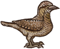
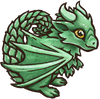
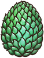

**幸运**是一个[增益效果](pages/%E5%A2%9E%E7%9B%8A%E6%95%88%E6%9E%9C.html)。

每个增加5%[命中率](pages/%E5%91%BD%E4%B8%AD%E7%8E%87.html)。

与幸运有关的物品
--------

|  | **名称** | **效果** | **职业** | **稀有度** | **价格** |
| --- | --- | --- | --- | --- | --- |
|  | [乌鸦](pages/%E4%B9%8C%E9%B8%A6.html) | * **每3s：**的物品触发速度快6%，且有6%的几率复制施加的[减益效果](pages/%E5%87%8F%E7%9B%8A%E6%95%88%E6%9E%9C.html)（最高10次）。偷取对手1点。 |  [收割者](pages/%E6%94%B6%E5%89%B2%E8%80%85.html) | [神级](pages/%E7%A5%9E%E7%BA%A7.html) | 13 |
|  | [全能狼崽](pages/%E5%85%A8%E8%83%BD%E7%8B%BC%E5%B4%BD.html) | * **每3.2s：**随机获得以下加成中的一种1点、1层、1层。 * 每有一个的[宠物](pages/%E5%AE%A0%E7%89%A9.html)，触发效果快10%。 |  [狂战士](pages/%E7%8B%82%E6%88%98%E5%A3%AB.html) | [传说](pages/%E4%BC%A0%E8%AF%B4.html) | 7 |
|  | [剑剪刀](pages/%E5%89%91%E5%89%AA%E5%88%80.html) | * **消耗3点：**向两位玩家同时施加10层，持续5s（无法叠加）。 * **攻击落空：**获得5点。 * **击中对手：**消耗3点来获得3点伤害加成和1层。 * 对手每有一层，造成的伤害+1。 |  [冒险家](pages/%E5%86%92%E9%99%A9%E5%AE%B6.html) | [神级](pages/%E7%A5%9E%E7%BA%A7.html) | 24 |
|  | [升级](pages/%E5%8D%87%E7%BA%A7.html) | * **每5s：**获得10点最大生命值，1点[耐力](pages/%E8%80%90%E5%8A%9B.html)，还有1点和1点。 * 在第3回合后的每回合触发速度都会快10%。 |  [冒险家](pages/%E5%86%92%E9%99%A9%E5%AE%B6.html) | [特别](pages/%E7%89%B9%E5%88%AB.html) | 5 |
|  | [命运小姐](pages/%E5%91%BD%E8%BF%90%E5%B0%8F%E5%A7%90.html) | **每2.1s：**消耗1点获得3层你现有层数最多的增益效果。 |  [收割者](pages/%E6%94%B6%E5%89%B2%E8%80%85.html) | [史诗](pages/%E5%8F%B2%E8%AF%97.html) | 7 |
|  | [大自然编年史：林木](pages/%E5%A4%A7%E8%87%AA%E7%84%B6%E7%BC%96%E5%B9%B4%E5%8F%B2%EF%BC%9A%E6%9E%97%E6%9C%A8.html) | * **每2.5s：**消耗1层来获得1点和2层。 * 每有一个的[魔法卷轴](pages/%E9%AD%94%E6%B3%95%E5%8D%B7%E8%BD%B4.html)，此物品的触发速度快10%（的[魔法卷轴](pages/%E9%AD%94%E6%B3%95%E5%8D%B7%E8%BD%B4.html)算作2次）。 |  [魔法师](pages/%E9%AD%94%E6%B3%95%E5%B8%88.html) | [史诗](pages/%E5%8F%B2%E8%AF%97.html) | 6 |
|  | [天命弓](pages/%E5%A4%A9%E5%91%BD%E5%BC%93.html) | * **开始战斗时：**获得5点。 * **的[武器](pages/%E6%AD%A6%E5%99%A8.html) [暴击](pages/%E6%9A%B4%E5%87%BB.html)时：**天命弓下次攻击计算两次。 |  [游侠](pages/%E6%B8%B8%E4%BE%A0.html) | [传说](pages/%E4%BC%A0%E8%AF%B4.html) | 11 |
|  | [天命短弓](pages/%E5%A4%A9%E5%91%BD%E7%9F%AD%E5%BC%93.html) | **击中对手时：**有85%的几率获得1点。 |  [游侠](pages/%E6%B8%B8%E4%BE%A0.html) | [史诗](pages/%E5%8F%B2%E8%AF%97.html) | 8 |
|  | [姜饼杰瑞](pages/%E5%A7%9C%E9%A5%BC%E6%9D%B0%E7%91%9E.html) | * **战斗开始时：**获得40最大生命值。 * **每3s：**消耗1点，1层还有1点，获得1层，3层还有20点最大生命值。 |  [通用](pages/%E9%80%9A%E7%94%A8.html) | [特别](pages/%E7%89%B9%E5%88%AB.html) | 8 |
|  | [小鸟法杖](pages/%E5%B0%8F%E9%B8%9F%E6%B3%95%E6%9D%96.html) | * **攻击时：**消耗3点：获得2点伤害加成。 * 的物品触发速度快10%（最高10次）。 * 移除对手2点。 |  [冒险家](pages/%E5%86%92%E9%99%A9%E5%AE%B6.html) | [神级](pages/%E7%A5%9E%E7%BA%A7.html) | 18 |
|  | [巨大四叶草](pages/%E5%B7%A8%E5%A4%A7%E5%9B%9B%E5%8F%B6%E8%8D%89.html) | * **进入商店时:** 生成两个[幸运四叶草](pages/%E5%B9%B8%E8%BF%90%E5%9B%9B%E5%8F%B6%E8%8D%89.html) * 打折几率+5% * 找到物品的几率+20%. * **点数达到15时：** 获得22层其他[增益效果](pages/%E5%A2%9E%E7%9B%8A%E6%95%88%E6%9E%9C.html)。 |  [游侠](pages/%E6%B8%B8%E4%BE%A0.html) | [特别](pages/%E7%89%B9%E5%88%AB.html) | 10 |
|  | [平衡魔棒](pages/%E5%B9%B3%E8%A1%A1%E9%AD%94%E6%A3%92.html) | * **每3.3s：**根据你现有最少的项，获得1点或一点或一层。 * 如果你至少有10点，10点或者10层：消耗1//（扣除你现有最多的项）来获得一层。 |  [魔法师](pages/%E9%AD%94%E6%B3%95%E5%B8%88.html) | [普通](pages/%E6%99%AE%E9%80%9A.html) | 4 |
|  | [幸运四叶草](pages/%E5%B9%B8%E8%BF%90%E5%9B%9B%E5%8F%B6%E8%8D%89.html) | **战斗开始时：**获得1点。 |  [游侠](pages/%E6%B8%B8%E4%BE%A0.html) | [罕见](pages/%E7%BD%95%E8%A7%81.html) | 2 |
|  | [幸运存钱罐](pages/%E5%B9%B8%E8%BF%90%E5%AD%98%E9%92%B1%E7%BD%90.html) | * **进入商店：**获得1枚。 * **战斗开始时：**获得2点。 * 物品的几率触发类效果提高12%的触发[几率](pages/%E5%87%A0%E7%8E%87.html)。 |  [游侠](pages/%E6%B8%B8%E4%BE%A0.html) | [史诗](pages/%E5%8F%B2%E8%AF%97.html) | 7 |
|  | [幽灵猫](pages/%E5%B9%BD%E7%81%B5%E7%8C%AB.html) | * 的物品+25%的几率造成[暴击](pages/%E6%9A%B4%E5%87%BB.html)。 * **每4s：**消耗1点来获得1点和1层。 * 你只能拥有1只[幽灵动物伙伴](pages/%E5%B9%BD%E7%81%B5%E5%8A%A8%E7%89%A9%E4%BC%99%E4%BC%B4.html)。 |  [魔法师](pages/%E9%AD%94%E6%B3%95%E5%B8%88.html) | [传说](pages/%E4%BC%A0%E8%AF%B4.html) | 5 |
|  | [彩虹魔棒](pages/%E5%BD%A9%E8%99%B9%E9%AD%94%E6%A3%92.html) | * **每4.5s：**获得每种[增益效果](pages/%E5%A2%9E%E7%9B%8A%E6%95%88%E6%9E%9C.html)1层。 * 如果你最少有20点，20点或者20层：消耗5//（扣除你现有最多的项）来获得5层。 |  [魔法师](pages/%E9%AD%94%E6%B3%95%E5%B8%88.html) | [神级](pages/%E7%A5%9E%E7%BA%A7.html) | 18 |
|  | [快乐小火](pages/%E5%BF%AB%E4%B9%90%E5%B0%8F%E7%81%AB.html) | * **每2.9s：**消耗1点来获得2层。 * 每有一个的物品，效果触发快10%。 * **层数达到20时：**获得5点。 * **层数达到40时：**获得15层。 * **层数达到60时：**造成100点伤害。 |  [火焰魔导士](pages/%E7%81%AB%E7%84%B0%E9%AD%94%E5%AF%BC%E5%A3%AB.html) | [特别](pages/%E7%89%B9%E5%88%AB.html) | 10 |
|  | [护甲全能狼崽](pages/%E6%8A%A4%E7%94%B2%E5%85%A8%E8%83%BD%E7%8B%BC%E5%B4%BD.html) | * **每2.8s：**随机获得以下加成中的一种，1点、1层、1层。 * 每有一个的[宠物](pages/%E5%AE%A0%E7%89%A9.html)，效果触发快10%。每有一个的[食物](pages/%E9%A3%9F%E7%89%A9.html)，效果触发快20%。 |  [狂战士](pages/%E7%8B%82%E6%88%98%E5%A3%AB.html) | [神级](pages/%E7%A5%9E%E7%BA%A7.html) | 7 |
|  | [橡子颈圈](pages/%E6%A9%A1%E5%AD%90%E9%A2%88%E5%9C%88.html) | 每有一点，的物品暴击率增加5%。 |  [游侠](pages/%E6%B8%B8%E4%BE%A0.html) | [史诗](pages/%E5%8F%B2%E8%AF%97.html) | 8 |
|  | [歪脖鸟](pages/%E6%AD%AA%E8%84%96%E9%B8%9F.html) | * **每3s：**的物品触发快5%（最多10次）。移除对手1点。 |  [通用](pages/%E9%80%9A%E7%94%A8.html) | [传说](pages/%E4%BC%A0%E8%AF%B4.html) | 6 |
|  | [死亡莲花](pages/%E6%AD%BB%E4%BA%A1%E8%8E%B2%E8%8A%B1.html) | * **每3.2s：**获得3点并移除对手3层[增益效果](pages/%E5%A2%9E%E7%9B%8A%E6%95%88%E6%9E%9C.html)，消耗1点来生成1.5点[耐力](pages/%E8%80%90%E5%8A%9B.html)。 * 每有一个的物品，此物品触发快10%。 |  [收割者](pages/%E6%94%B6%E5%89%B2%E8%80%85.html),  [魔法师](pages/%E9%AD%94%E6%B3%95%E5%B8%88.html) | [神级](pages/%E7%A5%9E%E7%BA%A7.html) | 10 |
|  | [浆果提灯](pages/%E6%B5%86%E6%9E%9C%E6%8F%90%E7%81%AF.html) | * 你有20%的几率阻止[增益效果](pages/%E5%A2%9E%E7%9B%8A%E6%95%88%E6%9E%9C.html)被移除（每有一个的物品几率+5%）。 **每2.1s：**消耗1点来[净化](pages/%E5%87%80%E5%8C%96.html)3层[减益效果](pages/%E5%87%8F%E7%9B%8A%E6%95%88%E6%9E%9C.html)。如果你没有减益效果，则获得1点和1层。 |  [魔法师](pages/%E9%AD%94%E6%B3%95%E5%B8%88.html) | [传说](pages/%E4%BC%A0%E8%AF%B4.html) | 10 |
|  | [牌堆](pages/%E7%89%8C%E5%A0%86.html) | * [卡牌](pages/%E5%8D%A1%E7%89%8C.html)将会在商店中出售。 * **战斗开始时：** 获得2点。并开始翻开的卡牌。 |  [收割者](pages/%E6%94%B6%E5%89%B2%E8%80%85.html) | [罕见](pages/%E7%BD%95%E8%A7%81.html) | 3 |
|  | [白色士兵](pages/%E7%99%BD%E8%89%B2%E5%A3%AB%E5%85%B5.html) | * **吃掉其他棋子时：**获得2层。 * **被吃掉时：**获得1点。 |  [魔法师](pages/%E9%AD%94%E6%B3%95%E5%B8%88.html) | [普通](pages/%E6%99%AE%E9%80%9A.html) | 1 |
|  | [白色百合花项圈](pages/%E7%99%BD%E8%89%B2%E7%99%BE%E5%90%88%E8%8A%B1%E9%A1%B9%E5%9C%88.html) | * **的物品激活时：**有35%的几率获得1点和一层。 * 每有1层或，的物品获得1%暴击加成。 |  [游侠](pages/%E6%B8%B8%E4%BE%A0.html) | [传说](pages/%E4%BC%A0%E8%AF%B4.html) | 8 |
|  | [皮质靴](pages/%E7%9A%AE%E8%B4%A8%E9%9D%B4.html) | **当你的生命值低于70%时：**获得1点和15点，还有1层（单次触发）。 |  [通用](pages/%E9%80%9A%E7%94%A8.html) | [史诗](pages/%E5%8F%B2%E8%AF%97.html) | 6 |
|  | [石靴](pages/%E7%9F%B3%E9%9D%B4.html) | **当生命值低于70%时：**获得1点，1层，还有45点。7s内，来自/的伤害减少35%（单次触发）。 |  [通用](pages/%E9%80%9A%E7%94%A8.html) | [传说](pages/%E4%BC%A0%E8%AF%B4.html) | 12 |
|  | [穿甲箭](pages/%E7%A9%BF%E7%94%B2%E7%AE%AD.html) | * 的武器暴击伤害+50%，并在暴击时移除对手15点。 * **当的物品激活时：**有40%的几率获得1点。 |  [游侠](pages/%E6%B8%B8%E4%BE%A0.html) | [特别](pages/%E7%89%B9%E5%88%AB.html) | 10 |
|  | [笛子](pages/%E7%AC%9B%E5%AD%90.html) | * **每4.7s：**随机获得14或2点[耐力](pages/%E8%80%90%E5%8A%9B.html)或2 * 每有一个的物品，笛子效果触发快10%。 |  [通用](pages/%E9%80%9A%E7%94%A8.html) | [史诗](pages/%E5%8F%B2%E8%AF%97.html) | 6 |
|  | [红色兰花项圈](pages/%E7%BA%A2%E8%89%B2%E5%85%B0%E8%8A%B1%E9%A1%B9%E5%9C%88.html) | 每有一点，的物品偷取3%生命值（最高50%）。且每有一层，获得暴击几率加成4%。 |  [游侠](pages/%E6%B8%B8%E4%BE%A0.html) | [传说](pages/%E4%BC%A0%E8%AF%B4.html) | 8 |
|  | [终极升腾](pages/%E7%BB%88%E6%9E%81%E5%8D%87%E8%85%BE.html) | * **10s后：**每有一个…… * 的物品：获得1点和2层。 * 的物品：获得15点，向对手施加1层。 * 的物品：获得3层。 * 的物品：偷取1层增益效果。 * 每有一个的[魔法卷轴](pages/%E9%AD%94%E6%B3%95%E5%8D%B7%E8%BD%B4.html)，此物品触发速度快50%。 |  [魔法师](pages/%E9%AD%94%E6%B3%95%E5%B8%88.html) | [特别](pages/%E7%89%B9%E5%88%AB.html) | 5 |
|  | [绿叶徽章](pages/%E7%BB%BF%E5%8F%B6%E5%BE%BD%E7%AB%A0.html) | * 可获得[游侠](pages/%E6%B8%B8%E4%BE%A0.html)物品。 * 每有1点，的物品获得2%暴击加成。 * **每2.2s：**获得1点。 |  [通用](pages/%E9%80%9A%E7%94%A8.html) | [特别](pages/%E7%89%B9%E5%88%AB.html) | 5 |
|  | [翡翠幼龙](pages/%E7%BF%A1%E7%BF%A0%E5%B9%BC%E9%BE%99.html) | * **战斗开始时：**获得3点。 * **击中对手时：**施加3层。 |  [火焰魔导士](pages/%E7%81%AB%E7%84%B0%E9%AD%94%E5%AF%BC%E5%A3%AB.html) | [神级](pages/%E7%A5%9E%E7%BA%A7.html) | 14 |
|  | [翡翠龙蛋](pages/%E7%BF%A1%E7%BF%A0%E9%BE%99%E8%9B%8B.html) | * **战斗开始时：**获得3点。 * 在你的背包中2回合后孵化。 |  [火焰魔导士](pages/%E7%81%AB%E7%84%B0%E9%AD%94%E5%AF%BC%E5%A3%AB.html) | [传说](pages/%E4%BC%A0%E8%AF%B4.html) | 10 |
|  | [舞龙](pages/%E8%88%9E%E9%BE%99.html) | * 每层将获得+0.5点伤害加成。 * 每有一点将获得2%的几率抵挡减益效果。 * **战斗开始时：**每个的物品将获得2层和2点。 |  [通用](pages/%E9%80%9A%E7%94%A8.html) | [特别](pages/%E7%89%B9%E5%88%AB.html) | 9 |
|  | [萝卜](pages/%E8%90%9D%E5%8D%9C.html) | * **每2.7s：**随机[净化](pages/%E5%87%80%E5%8C%96.html)1个[减益效果](pages/%E5%87%8F%E7%9B%8A%E6%95%88%E6%9E%9C.html)。如果你有4点以上，将有55%的几率获得1层。 |  [游侠](pages/%E6%B8%B8%E4%BE%A0.html) | [罕见](pages/%E7%BD%95%E8%A7%81.html) | 3 |
|  | [萨满面具](pages/%E8%90%A8%E6%BB%A1%E9%9D%A2%E5%85%B7.html) | * 卢恩[符文](pages/%E7%AC%A6%E6%96%87.html)将在商店售出。 * **战斗开始时：**每有1个放入槽位的宝石，获得1点。 * **每3.2s：**消耗2点以获得5层随机[增益效果](pages/%E5%A2%9E%E7%9B%8A%E6%95%88%E6%9E%9C.html)。 |  [狂战士](pages/%E7%8B%82%E6%88%98%E5%A3%AB.html) | [特别](pages/%E7%89%B9%E5%88%AB.html) | 10 |
|  | [蓝色鼠尾草花项圈](pages/%E8%93%9D%E8%89%B2%E9%BC%A0%E5%B0%BE%E8%8D%89%E8%8A%B1%E9%A1%B9%E5%9C%88.html) | **的武器击中对手：**每有一点，有5%的几率获得3点。 |  [游侠](pages/%E6%B8%B8%E4%BE%A0.html) | [传说](pages/%E4%BC%A0%E8%AF%B4.html) | 8 |
|  | [蓝莓](pages/%E8%93%9D%E8%8E%93.html) | **每3.5s：**获得1点。如果你至少有10点，则改为获得1点。 |  [通用](pages/%E9%80%9A%E7%94%A8.html) | [罕见](pages/%E7%BD%95%E8%A7%81.html) | 2 |
|  | [虚无之刃](pages/%E8%99%9A%E6%97%A0%E4%B9%8B%E5%88%83.html) | **击中对手：**消耗1点来获得2点伤害加成。消耗1层来移除对手3层[增益效果](pages/%E5%A2%9E%E7%9B%8A%E6%95%88%E6%9E%9C.html)，如果对手没有[增益效果](pages/%E5%A2%9E%E7%9B%8A%E6%95%88%E6%9E%9C.html)，则此物品的攻击速度加快5%。 |  [魔法师](pages/%E9%AD%94%E6%B3%95%E5%B8%88.html) | [神级](pages/%E7%A5%9E%E7%BA%A7.html) | 10 |
|  | [蛇蛇](pages/%E8%9B%87%E8%9B%87.html) | * 每有一点将获得4%的几率阻止对手身上的被[净化](pages/%E5%87%80%E5%8C%96.html)。 * **战斗开始时：**每有一个的宠物，将获得4点和50点最大生命值。 * **每2.2s：**向对手施加2层。 |  [收割者](pages/%E6%94%B6%E5%89%B2%E8%80%85.html) | [特别](pages/%E7%89%B9%E5%88%AB.html) | 10 |
|  | [蟾蜍](pages/%E8%9F%BE%E8%9C%8D.html) | * **的物品获得10层[增益效果](pages/%E5%A2%9E%E7%9B%8A%E6%95%88%E6%9E%9C.html)时：**[恢复](pages/%E6%81%A2%E5%A4%8D.html)12点生命。 * **的物品消耗掉10层[增益效果](pages/%E5%A2%9E%E7%9B%8A%E6%95%88%E6%9E%9C.html)时：**获得1点和1层。 * **每3.8s：**获得1点和1层。 |  [收割者](pages/%E6%94%B6%E5%89%B2%E8%80%85.html) | [史诗](pages/%E5%8F%B2%E8%AF%97.html) | 6 |
|  | [西兰花](pages/%E8%A5%BF%E5%85%B0%E8%8A%B1.html) | **每6s：**获得2点。如果你至少有5点，则会获得2层。 |  [冒险家](pages/%E5%86%92%E9%99%A9%E5%AE%B6.html) | [罕见](pages/%E7%BD%95%E8%A7%81.html) | 4 |
|  | [西兰花黏黏](pages/%E8%A5%BF%E5%85%B0%E8%8A%B1%E9%BB%8F%E9%BB%8F.html) | **的物品激活达到6次：**获得3点。如果你至少有5点，则会获得3层。 |  [冒险家](pages/%E5%86%92%E9%99%A9%E5%AE%B6.html) | [史诗](pages/%E5%8F%B2%E8%AF%97.html) | 10 |
|  | [财富之吻](pages/%E8%B4%A2%E5%AF%8C%E4%B9%8B%E5%90%BB.html) | * 基于几率触发的的物品获得30%触发[几率](pages/%E5%87%A0%E7%8E%87.html)加成。 * **每4s：**获得1点。如果你至少有5点，则随机获得一层其他[增益效果](pages/%E5%A2%9E%E7%9B%8A%E6%95%88%E6%9E%9C.html)。 |  [通用](pages/%E9%80%9A%E7%94%A8.html) | [特别](pages/%E7%89%B9%E5%88%AB.html) | 5 |
|  | [软呢帽](pages/%E8%BD%AF%E5%91%A2%E5%B8%BD.html) | * 找到物品的几率+65%。 * 你能多携带+3个物品。 * **战斗开始时：**每有一个的物品，获得1点，且每有一个的物品，还会获得3点。 * **每2.3s：**消耗1点来偷取2层其他[增益效果](pages/%E5%A2%9E%E7%9B%8A%E6%95%88%E6%9E%9C.html)。 * 基于几率触发的的物品获得25%触发[几率](pages/%E5%87%A0%E7%8E%87.html)加成。 |  [冒险家](pages/%E5%86%92%E9%99%A9%E5%AE%B6.html) | [特别](pages/%E7%89%B9%E5%88%AB.html) | 10 |
|  | [酷炫西洋剑](pages/%E9%85%B7%E7%82%AB%E8%A5%BF%E6%B4%8B%E5%89%91.html) | * **击中对手：**消耗3点获得3点伤害加成。 * **未命中：**获得3点。 |  [通用](pages/%E9%80%9A%E7%94%A8.html) | [神级](pages/%E7%A5%9E%E7%BA%A7.html) | 12 |
|  | [阿拉丁神灯](pages/%E9%98%BF%E6%8B%89%E4%B8%81%E7%A5%9E%E7%81%AF.html) | * **每1.6s：**根据你现有最少的项，获得1点或1层或1点。 * **消耗7点，7点，7层，7点和27点生命值：**使的武器+27点伤害（单次触发）。 |  [通用](pages/%E9%80%9A%E7%94%A8.html) | [神级](pages/%E7%A5%9E%E7%BA%A7.html) | 11 |
|  | [露营背包](pages/%E9%9C%B2%E8%90%A5%E8%83%8C%E5%8C%85.html) | * 增加6格背包槽位。 * 包内物品获得12%[暴击](pages/%E6%9A%B4%E5%87%BB.html)几率加成，每有一点，包内物品还会获得3%[暴击](pages/%E6%9A%B4%E5%87%BB.html)加成。 |  [游侠](pages/%E6%B8%B8%E4%BE%A0.html) | [特别](pages/%E7%89%B9%E5%88%AB.html) | 16 |
|  | [黑桃A](pages/%E9%BB%91%E6%A1%83A.html) | * **翻开时：**你的下一次攻击为暴击。 * 如果之前翻开的卡牌数量是奇数，获得2点和3层。 |  [收割者](pages/%E6%94%B6%E5%89%B2%E8%80%85.html) | [罕见](pages/%E7%BD%95%E8%A7%81.html) | 3 |
|  | [龙的巢穴](pages/%E9%BE%99%E7%9A%84%E5%B7%A2%E7%A9%B4.html) | * **战斗开始时：**获得4点，4层，4点，还有4层。 * **的[龙](pages/%E9%BE%99.html)攻击时：**[恢复](pages/%E6%81%A2%E5%A4%8D.html)7点生命值。 * 的龙蛋只需1回合即可孵化。 * 商店会出售更多的龙蛋。 |  [火焰魔导士](pages/%E7%81%AB%E7%84%B0%E9%AD%94%E5%AF%BC%E5%A3%AB.html) | [特别](pages/%E7%89%B9%E5%88%AB.html) | 10 |

| [v](pages/Template:%E6%B8%B8%E6%88%8F%E6%9C%BA%E5%88%B6.html) · [d](pages/Template_talk:%E6%B8%B8%E6%88%8F%E6%9C%BA%E5%88%B6.html) · [e](pages/Template:%E6%B8%B8%E6%88%8F%E6%9C%BA%E5%88%B6.html) [游戏机制](pages/%E6%B8%B8%E6%88%8F%E6%9C%BA%E5%88%B6.html) |
| --- |
|  |
| 物品栏和商店 | [物品栏](pages/%E7%89%A9%E5%93%81%E6%A0%8F.html) • [合成配方](pages/%E5%90%88%E6%88%90%E9%85%8D%E6%96%B9.html) • [商店机制](pages/%E6%B8%B8%E6%88%8F%E6%9C%BA%E5%88%B6.html#%E5%95%86%E5%BA%97%E6%9C%BA%E5%88%B6 "游戏机制") • [稀有度](pages/%E7%A8%80%E6%9C%89%E5%BA%A6.html) • [宝藏](pages/%E5%AE%9D%E8%97%8F.html) • [交易](pages/%E4%BA%A4%E6%98%93.html) |
|  |
| 战斗 | [伤害](pages/%E4%BC%A4%E5%AE%B3.html) • [命中率](pages/%E5%91%BD%E4%B8%AD%E7%8E%87.html) • [冷却](pages/%E5%86%B7%E5%8D%B4.html) • [暴击](pages/%E6%9A%B4%E5%87%BB.html) • [狂战士之怒](pages/%E7%8B%82%E6%88%98%E5%A3%AB%E4%B9%8B%E6%80%92.html) •  [护盾](pages/%E6%8A%A4%E7%9B%BE.html) • [恢复](pages/%E6%81%A2%E5%A4%8D%EF%BC%88%E6%9C%BA%E5%88%B6%EF%BC%89.html) • [疲惫](pages/%E7%96%B2%E6%83%AB.html) • [无敌](pages/%E6%97%A0%E6%95%8C.html) • [承受伤害](pages/%E6%89%BF%E5%8F%97%E4%BC%A4%E5%AE%B3.html) • [无效化](pages/%E6%97%A0%E6%95%88%E5%8C%96.html) • [反弹](pages/%E5%8F%8D%E5%BC%B9.html) • [复活](pages/%E5%A4%8D%E6%B4%BB.html) • [抵抗](pages/%E6%8A%B5%E6%8A%97.html) • [眩晕](pages/%E7%9C%A9%E6%99%95.html) • [净化](pages/%E5%87%80%E5%8C%96.html) • [不治](pages/%E4%B8%8D%E6%B2%BB.html) • [几率](pages/%E5%87%A0%E7%8E%87.html) |
|  |
| [增益效果](pages/%E5%A2%9E%E7%9B%8A%E6%95%88%E6%9E%9C.html) |  [充能](pages/%E5%85%85%E8%83%BD.html) •  [狂热](pages/%E7%8B%82%E7%83%AD.html) •  [幸运](pages/%E5%B9%B8%E8%BF%90.html) •  [魔法](pages/%E9%AD%94%E6%B3%95.html) •  [恢复](pages/%E6%81%A2%E5%A4%8D.html) •  [尖刺](pages/%E5%B0%96%E5%88%BA.html) •  [吸血](pages/%E5%90%B8%E8%A1%80.html) |
|  |
| [减益效果](pages/%E5%87%8F%E7%9B%8A%E6%95%88%E6%9E%9C.html) |  [致盲](pages/%E8%87%B4%E7%9B%B2.html) •  [冰冷](pages/%E5%86%B0%E5%86%B7.html) •  [中毒](pages/%E4%B8%AD%E6%AF%92.html) |
|  |
| 其他 | [主客场](pages/%E4%B8%BB%E5%AE%A2%E5%9C%BA.html) • [战斗日志](pages/%E6%88%98%E6%96%97%E6%97%A5%E5%BF%97.html) • [游戏胜负](pages/%E6%B8%B8%E6%88%8F%E6%9C%BA%E5%88%B6.html#%E6%B8%B8%E6%88%8F%E8%83%9C%E8%B4%9F "游戏机制") • [游戏模式](pages/%E6%B8%B8%E6%88%8F%E6%9C%BA%E5%88%B6.html#%E6%B8%B8%E6%88%8F%E6%A8%A1%E5%BC%8F "游戏机制") |
