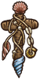

**恢复**是一种表示玩家回血的[游戏机制](pages/%E6%B8%B8%E6%88%8F%E6%9C%BA%E5%88%B6.html)。下文中的恢复量指玩家实际回复的生命数值。关于，见[恢复（增益效果）](pages/%E6%81%A2%E5%A4%8D%EF%BC%88%E5%A2%9E%E7%9B%8A%E6%95%88%E6%9E%9C%EF%BC%89.html)。

恢复效果的增减
-------

恢复效果增强

恢复效果降低

恢复效果是加减运算的，可以被降低到0。

恢复效果的增减也会影响到[吸血](pages/%E5%90%B8%E8%A1%80.html)和[血之黏黏](pages/%E8%A1%80%E4%B9%8B%E9%BB%8F%E9%BB%8F.html)等物品的生命偷取效果。

### 计算方法

恢复量=恢复生命值数量×(1 0 0%+恢复效果增强%−恢复效果降低%)

### 示例

*   [小蜗](pages/%E5%B0%8F%E8%9C%97.html)：恢复40点生命
*   [吸血鬼梳子](pages/%E5%90%B8%E8%A1%80%E9%AC%BC%E6%A2%B3%E5%AD%90.html): 生命恢复效果增强30%
*   对手拥有2个[腐败头盔](pages/%E8%85%90%E8%B4%A5%E5%A4%B4%E7%9B%94.html)：生命恢复效果降低 2×3 0%=6 0%
*   对手在护甲或其他槽位镶嵌了1颗[优质紫水晶](pages/%E7%B4%AB%E6%B0%B4%E6%99%B6.html)：生命恢复效果降低 30%

4 0×(1 0 0%+3 0%−(6 0%+3 0%))=4 0×4 0%=1 6

恢复相关物品
------

|  | **名称** | **效果** | **职业** | **稀有度** | **价格** |
| --- | --- | --- | --- | --- | --- |
|  | [不恐怖幽灵](pages/%E4%B8%8D%E6%81%90%E6%80%96%E5%B9%BD%E7%81%B5.html) | * 以你恢复量的30%作为伤害。 * **每3s：**消耗一个随机[增益效果](pages/%E5%A2%9E%E7%9B%8A%E6%95%88%E6%9E%9C.html)来[恢复](pages/%E6%81%A2%E5%A4%8D.html)生命值12点。 |  [通用](pages/%E9%80%9A%E7%94%A8.html) | [特别](pages/%E7%89%B9%E5%88%AB.html) | 10 |
|  | [不愈法杖](pages/%E4%B8%8D%E6%84%88%E6%B3%95%E6%9D%96.html) | **每2s：**[恢复](pages/%E6%81%A2%E5%A4%8D.html)25生命值。消耗4点：2s内，向对手造成你治疗量100%的伤害。 |  [收割者](pages/%E6%94%B6%E5%89%B2%E8%80%85.html) | [神级](pages/%E7%A5%9E%E7%BA%A7.html) | 17 |
|  | [世界树树叶](pages/%E4%B8%96%E7%95%8C%E6%A0%91%E6%A0%91%E5%8F%B6.html) | * **战斗开始时：**每有一个的物品，获得2点和1层。 * **每次消耗5点：**[获得](pages/%E6%81%A2%E5%A4%8D.html)15点生命并[净化](pages/%E5%87%80%E5%8C%96.html)2种随机[减益效果](pages/%E5%87%8F%E7%9B%8A%E6%95%88%E6%9E%9C.html)。 |  [游侠](pages/%E6%B8%B8%E4%BE%A0.html) | [特别](pages/%E7%89%B9%E5%88%AB.html) | 10 |
|  | [亡灵庇护](pages/%E4%BA%A1%E7%81%B5%E5%BA%87%E6%8A%A4.html) | * 物品的最大生命值提升效果+20%。 * **过量治疗时：**过量治疗的生命值增加为最大生命值。 * **每7s：**[恢复](pages/%E6%81%A2%E5%A4%8D.html)10点生命值，且每有一个的物品，生命值恢复+4。 |  [通用](pages/%E9%80%9A%E7%94%A8.html) | [特别](pages/%E7%89%B9%E5%88%AB.html) | 5 |
|  | [光之圣典](pages/%E5%85%89%E4%B9%8B%E5%9C%A3%E5%85%B8.html) | * **每3s：**消耗1点来获得1层，并[恢复](pages/%E6%81%A2%E5%A4%8D.html)12点生命值。 * 每有一个的[魔法卷轴](pages/%E9%AD%94%E6%B3%95%E5%8D%B7%E8%BD%B4.html)，此物品的触发速度快10%（的魔法卷轴算作2次）。 |  [魔法师](pages/%E9%AD%94%E6%B3%95%E5%B8%88.html) | [神级](pages/%E7%A5%9E%E7%BA%A7.html) | 6 |
|  | [光之黏黏](pages/%E5%85%89%E4%B9%8B%E9%BB%8F%E9%BB%8F.html) | * **的物品激活达到6次：**[恢复](pages/%E6%81%A2%E5%A4%8D.html)25点生命值。向对手施加7层，持续3s。 |  [通用](pages/%E9%80%9A%E7%94%A8.html) | [神级](pages/%E7%A5%9E%E7%BA%A7.html) | 16 |
|  | [剧毒蛙](pages/%E5%89%A7%E6%AF%92%E8%9B%99.html) | * **的物品获得10层[增益效果](pages/%E5%A2%9E%E7%9B%8A%E6%95%88%E6%9E%9C.html)：**[恢复](pages/%E6%81%A2%E5%A4%8D.html)12点生命值。 * **的物品消耗10层[增益效果](pages/%E5%A2%9E%E7%9B%8A%E6%95%88%E6%9E%9C.html)：**向对手施加2层，并获得1点。 * **每2.4s：**向对手施加2层，并获得1点。 |  [收割者](pages/%E6%94%B6%E5%89%B2%E8%80%85.html) | [传说](pages/%E4%BC%A0%E8%AF%B4.html) | 9 |
|  | [剧毒黏黏](pages/%E5%89%A7%E6%AF%92%E9%BB%8F%E9%BB%8F.html) | **的物品激活达到5次：**[恢复](pages/%E6%81%A2%E5%A4%8D.html)9点生命值并施加给对手4层。 |  [收割者](pages/%E6%94%B6%E5%89%B2%E8%80%85.html) | [史诗](pages/%E5%8F%B2%E8%AF%97.html) | 12 |
|  | [吸血匕首](pages/%E5%90%B8%E8%A1%80%E5%8C%95%E9%A6%96.html) | * **击中对手时：**获得1层（每场战斗最高5层）。每有一个的物品，[恢复](pages/%E6%81%A2%E5%A4%8D.html)4点生命值。 * **[眩晕](pages/%E7%9C%A9%E6%99%95.html)对手：**触发额外攻击。 |  [通用](pages/%E9%80%9A%E7%94%A8.html) | [传说](pages/%E4%BC%A0%E8%AF%B4.html) | 12 |
|  | [吸血鬼梳子](pages/%E5%90%B8%E8%A1%80%E9%AC%BC%E6%A2%B3%E5%AD%90.html) | * **战斗开始时：**获得6层。 * 的武器将会偷取25%生命值（每有一个的物品，效果增强8%）。 * 生命[恢复](pages/%E6%81%A2%E5%A4%8D.html)效果增强30%。 |  [收割者](pages/%E6%94%B6%E5%89%B2%E8%80%85.html) | [特别](pages/%E7%89%B9%E5%88%AB.html) | 10 |
|  | [国王王冠](pages/%E5%9B%BD%E7%8E%8B%E7%8E%8B%E5%86%A0.html) | * **每2.4s：**[恢复](pages/%E6%81%A2%E5%A4%8D.html)8点生命值，并保护1层增益效果不被移除。 * **消耗10点：**在2.5s内[无敌](pages/%E6%97%A0%E6%95%8C.html)（单次触发）。 * 镶嵌的[宝石](pages/%E5%AE%9D%E7%9F%B3.html)获得50%效果增强。 |  [通用](pages/%E9%80%9A%E7%94%A8.html) | [神级](pages/%E7%A5%9E%E7%BA%A7.html) | 17 |
|  | [国王黏黏](pages/%E5%9B%BD%E7%8E%8B%E9%BB%8F%E9%BB%8F.html) | * **的物品激活达到6次：**获得35点生命值[恢复](pages/%E6%81%A2%E5%A4%8D.html)，保护3层[增益效果](pages/%E5%A2%9E%E7%9B%8A%E6%95%88%E6%9E%9C.html)不被移除，消耗4点在1.5s内变为[无敌](pages/%E6%97%A0%E6%95%8C.html)（可触发3次）。 * 镶嵌的[宝石](pages/%E5%AE%9D%E7%9F%B3.html)获得50%效果增强。 |  [通用](pages/%E9%80%9A%E7%94%A8.html) | [神级](pages/%E7%A5%9E%E7%BA%A7.html) | 23 |
|  | [大煮锅](pages/%E5%A4%A7%E7%85%AE%E9%94%85.html) | * **进入商店时：**升级一个相邻的魔药。 * **每2.7s：**[恢复](pages/%E6%81%A2%E5%A4%8D.html)20点生命值，或获得6点，或获得5层。 * 每有一个的食物或魔药，效果触发快15%。 |  [收割者](pages/%E6%94%B6%E5%89%B2%E8%80%85.html) | [特别](pages/%E7%89%B9%E5%88%AB.html) | 10 |
|  | [小蜗](pages/%E5%B0%8F%E8%9C%97.html) | * [净化](pages/%E5%87%80%E5%8C%96.html)类效果触发时有25%的几率再额外净化一层[减益效果](pages/%E5%87%8F%E7%9B%8A%E6%95%88%E6%9E%9C.html)。 * **每12s：**[净化](pages/%E5%87%80%E5%8C%96.html)6层[减益效果](pages/%E5%87%8F%E7%9B%8A%E6%95%88%E6%9E%9C.html)并[恢复](pages/%E6%81%A2%E5%A4%8D.html)40点生命值。 * 每有一个的[魔药](pages/%E9%AD%94%E8%8D%AF.html)，效果触发快15%。 |  [通用](pages/%E9%80%9A%E7%94%A8.html) | [罕见](pages/%E7%BD%95%E8%A7%81.html) | 6 |
|  | [尤克里里](pages/%E5%B0%A4%E5%85%8B%E9%87%8C%E9%87%8C.html) | * **的物品激活时：**随机快进一个非物品冷却时间20%。 * 你的生命[恢复](pages/%E6%81%A2%E5%A4%8D.html)效果加强20%。 * +15%的几率复制获得的[增益效果](pages/%E5%A2%9E%E7%9B%8A%E6%95%88%E6%9E%9C.html)。 **每6s：**[恢复](pages/%E6%81%A2%E5%A4%8D.html)生命值30点，或获得5层随机[增益效果](pages/%E5%A2%9E%E7%9B%8A%E6%95%88%E6%9E%9C.html)，或向对手施加4层。 * 每有一个的物品，触发速度快10%。 |  [冒险家](pages/%E5%86%92%E9%99%A9%E5%AE%B6.html) | [特别](pages/%E7%89%B9%E5%88%AB.html) | 10 |
|  | [幽灵獾](pages/%E5%B9%BD%E7%81%B5%E7%8D%BE.html) | * **每4.2s：**消耗1点来获得20点最大生命值，且每有一个的物品，还会获得2的最大生命值加成。 * **当生命值低于50%时：**[恢复](pages/%E6%81%A2%E5%A4%8D.html)最大生命值的20%（单次触发）。 * 你只能拥有1只[幽灵动物伙伴](pages/%E5%B9%BD%E7%81%B5%E5%8A%A8%E7%89%A9%E4%BC%99%E4%BC%B4.html)。 |  [魔法师](pages/%E9%AD%94%E6%B3%95%E5%B8%88.html) | [传说](pages/%E4%BC%A0%E8%AF%B4.html) | 5 |
|  | [强力恶魔烧瓶](pages/%E5%BC%BA%E5%8A%9B%E6%81%B6%E9%AD%94%E7%83%A7%E7%93%B6.html) | **当你对手的生命值降低到50%或你的生命值减低到25%时：**消耗此魔药，根据对手身上的[减益效果](pages/%E5%87%8F%E7%9B%8A%E6%95%88%E6%9E%9C.html)层数，每层造成带有100%生命偷取效果的0.6点伤害。在3s内，对手生命值[恢复](pages/%E6%81%A2%E5%A4%8D.html)效果降低30%。 |  [收割者](pages/%E6%94%B6%E5%89%B2%E8%80%85.html) | [神级](pages/%E7%A5%9E%E7%BA%A7.html) | 14 |
|  | [强力生命魔药](pages/%E5%BC%BA%E5%8A%9B%E7%94%9F%E5%91%BD%E9%AD%94%E8%8D%AF.html) | **当你的生命值低于50%时：**消耗此魔药，[恢复](pages/%E6%81%A2%E5%A4%8D.html)24点生命值并获得3层，[净化](pages/%E5%87%80%E5%8C%96.html)4层。 |  [通用](pages/%E9%80%9A%E7%94%A8.html) | [史诗](pages/%E5%8F%B2%E8%AF%97.html) | 8 |
|  | [强力瘟疫烧瓶](pages/%E5%BC%BA%E5%8A%9B%E7%98%9F%E7%96%AB%E7%83%A7%E7%93%B6.html) | **对手[恢复](pages/%E6%81%A2%E5%A4%8D.html)生命值时：**消耗此魔药并向对手施加3层并对自己施加1层。经过3.5s后，再向对手施加3层。 |  [收割者](pages/%E6%94%B6%E5%89%B2%E8%80%85.html) | [传说](pages/%E4%BC%A0%E8%AF%B4.html) | 10 |
|  | [彩虹巨大西兰花黏黏](pages/%E5%BD%A9%E8%99%B9%E5%B7%A8%E5%A4%A7%E8%A5%BF%E5%85%B0%E8%8A%B1%E9%BB%8F%E9%BB%8F.html) | **的物品激活达到9次：**[恢复](pages/%E6%81%A2%E5%A4%8D.html)生命值40点，获得20点，还有2层和2层，向对手施加3层，且的武器获得4点伤害加成。 |  [冒险家](pages/%E5%86%92%E9%99%A9%E5%AE%B6.html) | [神级](pages/%E7%A5%9E%E7%BA%A7.html) | 53 |
|  | [彩虹球](pages/%E5%BD%A9%E8%99%B9%E7%90%83.html) | * **开始战斗时：**每有一个…… * 的物品：获得2点。 * 的物品：获得1点。 * 的物品：[恢复](pages/%E6%81%A2%E5%A4%8D%E6%95%88%E6%9E%9C.html)效果增强4%。 * 的物品：向对手施加一个随机[减益效果](pages/%E5%87%8F%E7%9B%8A%E6%95%88%E6%9E%9C.html)。 * **每8s：**获得每种[增益效果](pages/%E5%A2%9E%E7%9B%8A%E6%95%88%E6%9E%9C.html)1层。 |  [通用](pages/%E9%80%9A%E7%94%A8.html) | [神级](pages/%E7%A5%9E%E7%BA%A7.html) | 14 |
|  | [彩虹究极布丁黏黏](pages/%E5%BD%A9%E8%99%B9%E7%A9%B6%E6%9E%81%E5%B8%83%E4%B8%81%E9%BB%8F%E9%BB%8F.html) | * **的物品激活达到9次：**[恢复](pages/%E6%81%A2%E5%A4%8D.html)40点血量，获得20点，还有2层和2层，并施加3层。并给予的武器+4点伤害。 |  [游侠](pages/%E6%B8%B8%E4%BE%A0.html) | [神级](pages/%E7%A5%9E%E7%BA%A7.html) | 55 |
|  | [彩虹终极圆圆浓稠黏黏](pages/%E5%BD%A9%E8%99%B9%E7%BB%88%E6%9E%81%E5%9C%86%E5%9C%86%E6%B5%93%E7%A8%A0%E9%BB%8F%E9%BB%8F.html) | **的物品激活达到9次：**[恢复](pages/%E6%81%A2%E5%A4%8D.html)40点生命值并获得20点，还获得2层和4层，向对手施加3层。的武器伤害+4。 |  [火焰魔导士](pages/%E7%81%AB%E7%84%B0%E9%AD%94%E5%AF%BC%E5%A3%AB.html) | [神级](pages/%E7%A5%9E%E7%BA%A7.html) | 54 |
|  | [彩虹超级至尊黏黏](pages/%E5%BD%A9%E8%99%B9%E8%B6%85%E7%BA%A7%E8%87%B3%E5%B0%8A%E9%BB%8F%E9%BB%8F.html) | **的物品激活达到9次：**[恢复](pages/%E6%81%A2%E5%A4%8D.html)40点生命值，获得20点和2层，施加3层和3层。的武器伤害+4。 |  [收割者](pages/%E6%94%B6%E5%89%B2%E8%80%85.html) | [神级](pages/%E7%A5%9E%E7%BA%A7.html) | 55 |
|  | [彩虹鲜艳糖果黏黏](pages/%E5%BD%A9%E8%99%B9%E9%B2%9C%E8%89%B3%E7%B3%96%E6%9E%9C%E9%BB%8F%E9%BB%8F.html) | **的物品激活达到9次：**[恢复](pages/%E6%81%A2%E5%A4%8D.html)40点生命值，获得20点，还有2层，2层你现有层数最多的[增益效果](pages/%E5%A2%9E%E7%9B%8A%E6%95%88%E6%9E%9C.html)。向对手施加3层，的武器获得4点伤害加成。 |  [魔法师](pages/%E9%AD%94%E6%B3%95%E5%B8%88.html) | [神级](pages/%E7%A5%9E%E7%BA%A7.html) | 56 |
|  | [心之容器](pages/%E5%BF%83%E4%B9%8B%E5%AE%B9%E5%99%A8.html) | * **每3s：**获得1层。 * **消耗7层：**获得100点最大生命值，2层，且生命[恢复](pages/%E6%81%A2%E5%A4%8D.html)效果增加15%（单词触发）。 |  [通用](pages/%E9%80%9A%E7%94%A8.html) | [神级](pages/%E7%A5%9E%E7%BA%A7.html) | 12 |
|  | [心形盾牌](pages/%E5%BF%83%E5%BD%A2%E7%9B%BE%E7%89%8C.html) | * 的物品获得的+30%,生命值[恢复](pages/%E6%81%A2%E5%A4%8D.html)效果加强30%，且有30%的几率复制获得的。 * **被攻击时（）：**有30%的几率抵挡14点伤害，移除对手0.7点[耐力](pages/%E8%80%90%E5%8A%9B.html)并获得1层（最高20层）。 * **消耗7层：**还能抵挡和伤害，并获得150的最大生命值（单次触发）。 |  [冒险家](pages/%E5%86%92%E9%99%A9%E5%AE%B6.html) | [神级](pages/%E7%A5%9E%E7%BA%A7.html) | 26 |
|  | [急速小蜗](pages/%E6%80%A5%E9%80%9F%E5%B0%8F%E8%9C%97.html) | * [净化](pages/%E5%87%80%E5%8C%96.html)效果时有25%的几率再次净化一个额外[减益效果](pages/%E5%87%8F%E7%9B%8A%E6%95%88%E6%9E%9C.html)。 * **每11s：**获得2层，[净化](pages/%E5%87%80%E5%8C%96.html)6层减益效果并[恢复](pages/%E6%81%A2%E5%A4%8D.html)40点生命值。 * 每有一个的魔药，触发速度快30%。 |  [火焰魔导士](pages/%E7%81%AB%E7%84%B0%E9%AD%94%E5%AF%BC%E5%A3%AB.html) | [史诗](pages/%E5%8F%B2%E8%AF%97.html) | 8 |
|  | [恋人](pages/%E6%81%8B%E4%BA%BA.html) | * **翻开时：**造成带有100%生命偷取效果的7点伤害。 * 如果之前翻开的卡牌数量是偶数，获得2层且你的生命[恢复](pages/%E6%81%A2%E5%A4%8D%E6%9C%BA%E5%88%B6.html)效果加强6%。 |  [收割者](pages/%E6%94%B6%E5%89%B2%E8%80%85.html) | [普通](pages/%E6%99%AE%E9%80%9A.html) | 3 |
|  | [日耀护甲](pages/%E6%97%A5%E8%80%80%E6%8A%A4%E7%94%B2.html) | * 的物品获得属性。 * **战斗开始时：**获得70点。每有一个的物品，获得1层。 * **每3s：**消耗1层来获得12点生命[恢复](pages/%E6%81%A2%E5%A4%8D.html)，并移除2层减益效果。 |  [火焰魔导士](pages/%E7%81%AB%E7%84%B0%E9%AD%94%E5%AF%BC%E5%A3%AB.html) | [神级](pages/%E7%A5%9E%E7%BA%A7.html) | 14 |
|  | [极乐小鸟](pages/%E6%9E%81%E4%B9%90%E5%B0%8F%E9%B8%9F.html) | * **每2.7s：**有7%的几率复制从物品处获得的增益效果，生命[恢复](pages/%E6%81%A2%E5%A4%8D.html)效果+7%，触发速度+7%（最多10次）。 |  [通用](pages/%E9%80%9A%E7%94%A8.html) | [神级](pages/%E7%A5%9E%E7%BA%A7.html) | 20 |
|  | [水元素](pages/%E6%B0%B4%E5%85%83%E7%B4%A0.html) | * **击中对手：**获得2点。每有一个的物品，就有10%的几率再获得2点。 * 每有一个的物品，攻击速度快10%。 * **消耗10点：**击中对手时[恢复](pages/%E6%81%A2%E5%A4%8D.html)10点生命值（单次触发）。 * **消耗20点：**获得15点伤害加成（单次触发）。 * **消耗30点：**击中对手时向对手施加3层（单次触发）。 |  [魔法师](pages/%E9%AD%94%E6%B3%95%E5%B8%88.html) | [特别](pages/%E7%89%B9%E5%88%AB.html) | 10 |
|  | [火辣香蕉](pages/%E7%81%AB%E8%BE%A3%E9%A6%99%E8%95%89.html) | * **的香蕉激活时：**有75%的几率获得1层。 * **每消耗1点[耐力](pages/%E8%80%90%E5%8A%9B.html)：**[恢复](pages/%E6%81%A2%E5%A4%8D.html)3点生命值。 |  [通用](pages/%E9%80%9A%E7%94%A8.html) | [特别](pages/%E7%89%B9%E5%88%AB.html) | 5 |
|  | [爱的拼图背包](pages/%E7%88%B1%E7%9A%84%E6%8B%BC%E5%9B%BE%E8%83%8C%E5%8C%85.html) | * 增加4格背包槽位。 * 背包内物品的生命[恢复](pages/%E6%81%A2%E5%A4%8D.html)效果加强20%。 * **战斗开始时：**获得7点最大生命值。 |  [魔法师](pages/%E9%AD%94%E6%B3%95%E5%B8%88.html) | [普通](pages/%E6%99%AE%E9%80%9A.html) | 5 |
|  | [生命护符](pages/%E7%94%9F%E5%91%BD%E6%8A%A4%E7%AC%A6.html) | * **战斗开始时：**获得20点生命值上限。 * 你的[恢复](pages/%E6%81%A2%E5%A4%8D%E6%95%88%E6%9E%9C.html)效果增强20%。 |  [通用](pages/%E9%80%9A%E7%94%A8.html) | [罕见](pages/%E7%BD%95%E8%A7%81.html) | 6 |
|  | [生命魔药](pages/%E7%94%9F%E5%91%BD%E9%AD%94%E8%8D%AF.html) | **当你的生命值低于50%时：**消耗此魔药，[恢复](pages/%E6%81%A2%E5%A4%8D.html)12点生命值并[净化](pages/%E5%87%80%E5%8C%96.html)4层。 |  [通用](pages/%E9%80%9A%E7%94%A8.html) | [罕见](pages/%E7%BD%95%E8%A7%81.html) | 4 |
|  | [瘟疫烧瓶](pages/%E7%98%9F%E7%96%AB%E7%83%A7%E7%93%B6.html) | * **当你的对手[恢复](pages/%E6%81%A2%E5%A4%8D.html)生命值时：**消耗此魔药，向对手施加3层的同时，对自己也施加1层。 |  [通用](pages/%E9%80%9A%E7%94%A8.html) | [史诗](pages/%E5%8F%B2%E8%AF%97.html) | 7 |
|  | [白色主教](pages/%E7%99%BD%E8%89%B2%E4%B8%BB%E6%95%99.html) | * **吃掉其他棋子时：**[净化](pages/%E5%87%80%E5%8C%96.html)10层[减益效果](pages/%E5%87%8F%E7%9B%8A%E6%95%88%E6%9E%9C.html)。 * **被吃掉时：**生命[恢复](pages/%E6%81%A2%E5%A4%8D.html)效果增加25%。 |  [魔法师](pages/%E9%AD%94%E6%B3%95%E5%B8%88.html) | [罕见](pages/%E7%BD%95%E8%A7%81.html) | 3 |
|  | [紫水晶](pages/%E7%B4%AB%E6%B0%B4%E6%99%B6.html) | 放入武器槽： **击中对手：** 将有25/35/50/75/100% 的几率移除对手2个随机增益效果。 放入护甲或其他槽： 对手的生命值[恢复](pages/%E6%81%A2%E5%A4%8D.html)效果降低12/18/25/30/45%。 放入背包： **每3.2/2.5/2/1.6/1s：**[净化](pages/%E5%87%80%E5%8C%96.html)自身1个随机减益效果。 |  [通用](pages/%E9%80%9A%E7%94%A8.html) | [Varies](pages/Varies.html) | 1/2/4/8/16 |
|  | [红宝石](pages/%E7%BA%A2%E5%AE%9D%E7%9F%B3.html) | 放入武器槽： **击中对手：**偷取造成伤害量的7/10/15/20/35%为生命值。 放入护甲或其他槽： 生命值[恢复效果](pages/%E6%81%A2%E5%A4%8D%E6%95%88%E6%9E%9C.html)增强10/15/20/25/40%。 放入背包： **5s后：**造成带有150%生命偷取效果的4/6/10/15/35点伤害。 |  [通用](pages/%E9%80%9A%E7%94%A8.html) | [Varies](pages/Varies.html) | 1/2/4/8/16 |
|  | [红辣椒](pages/%E7%BA%A2%E8%BE%A3%E6%A4%92.html) | * **每4.5s：**获得1层并[恢复](pages/%E6%81%A2%E5%A4%8D.html)5点生命值。当你至少有10层时，还会[净化](pages/%E5%87%80%E5%8C%96.html)1层[减益效果](pages/%E5%87%8F%E7%9B%8A%E6%95%88%E6%9E%9C.html)。 |  [火焰魔导士](pages/%E7%81%AB%E7%84%B0%E9%AD%94%E5%AF%BC%E5%A3%AB.html) | [罕见](pages/%E7%BD%95%E8%A7%81.html) | 5 |
|  | [腐败头盔](pages/%E8%85%90%E8%B4%A5%E5%A4%B4%E7%9B%94.html) | * **战斗开始时：**5s内受到的伤害减少25%。 * **对手获得增益效果时：**有15%的几率使增益[无效](pages/%E6%97%A0%E6%95%88.html)。 * 对手的生命[恢复](pages/%E6%81%A2%E5%A4%8D.html)效果减弱30%。 |  [通用](pages/%E9%80%9A%E7%94%A8.html) | [传说](pages/%E4%BC%A0%E8%AF%B4.html) | 14 |
|  | [致死蘑菇](pages/%E8%87%B4%E6%AD%BB%E8%98%91%E8%8F%87.html) | **每2.9s：**向对手施加3层并让对手的生命[恢复](pages/%E6%81%A2%E5%A4%8D.html)效果削弱10%。 |  [收割者](pages/%E6%94%B6%E5%89%B2%E8%80%85.html) | [神级](pages/%E7%A5%9E%E7%BA%A7.html) | 10 |
|  | [菠萝](pages/%E8%8F%A0%E8%90%9D.html) | **每3.3s：**获得1层并[恢复](pages/%E6%81%A2%E5%A4%8D.html)4点生命值。 |  [通用](pages/%E9%80%9A%E7%94%A8.html) | [传说](pages/%E4%BC%A0%E8%AF%B4.html) | 6 |
|  | [藤条编织篮](pages/%E8%97%A4%E6%9D%A1%E7%BC%96%E7%BB%87%E7%AF%AE.html) | * 增加9背包槽位。 * 你的[恢复](pages/%E6%81%A2%E5%A4%8D.html)效果增强10%（篮子内每有一个物品，获得5%增强）。 * 在第1和第10回合，商店打折几率增加20%。 |  [游侠](pages/%E6%B8%B8%E4%BE%A0.html) | [特别](pages/%E7%89%B9%E5%88%AB.html) | 20 |
|  | [蟾蜍](pages/%E8%9F%BE%E8%9C%8D.html) | * **的物品获得10层[增益效果](pages/%E5%A2%9E%E7%9B%8A%E6%95%88%E6%9E%9C.html)时：**[恢复](pages/%E6%81%A2%E5%A4%8D.html)12点生命。 * **的物品消耗掉10层[增益效果](pages/%E5%A2%9E%E7%9B%8A%E6%95%88%E6%9E%9C.html)时：**获得1点和1层。 * **每3.8s：**获得1点和1层。 |  [收割者](pages/%E6%94%B6%E5%89%B2%E8%80%85.html) | [史诗](pages/%E5%8F%B2%E8%AF%97.html) | 6 |
|  | [贝壳图腾](pages/%E8%B4%9D%E5%A3%B3%E5%9B%BE%E8%85%BE.html) | * **每3.6s：**如果你的生命值高于70%，获得1层。否则将会[恢复](pages/%E6%81%A2%E5%A4%8D.html)生命值8点。 * 每有一个的物品，耐力值消耗-15%。 |  [通用](pages/%E9%80%9A%E7%94%A8.html) | [罕见](pages/%E7%BD%95%E8%A7%81.html) | 5 |
|  | [辉耀王冠](pages/%E8%BE%89%E8%80%80%E7%8E%8B%E5%86%A0.html) | * **每2.4s：**[净化](pages/%E5%87%80%E5%8C%96.html)1层并[恢复](pages/%E6%81%A2%E5%A4%8D.html)5点生命值。 * **消耗10点：**变为[无敌](pages/%E6%97%A0%E6%95%8C.html)，持续2s（单次触发）。 |  [通用](pages/%E9%80%9A%E7%94%A8.html) | [神级](pages/%E7%A5%9E%E7%BA%A7.html) | 12 |
|  | [辣椒黏黏](pages/%E8%BE%A3%E6%A4%92%E9%BB%8F%E9%BB%8F.html) | * **的物品激活达到6次：**[恢复](pages/%E6%81%A2%E5%A4%8D.html)15点生命值并获得2层。 |  [火焰魔导士](pages/%E7%81%AB%E7%84%B0%E9%AD%94%E5%AF%BC%E5%A3%AB.html) | [史诗](pages/%E5%8F%B2%E8%AF%97.html) | 11 |
|  | [锁链鞭](pages/%E9%94%81%E9%93%BE%E9%9E%AD.html) | * 每移除对手身上一层增益效果，造成的伤害+1. * **击中对手时：**移除对手2层随机[增益效果](pages/%E5%A2%9E%E7%9B%8A%E6%95%88%E6%9E%9C.html)。 * 在[狂战士之怒](pages/%E7%8B%82%E6%88%98%E5%A3%AB%E4%B9%8B%E6%80%92.html)期间额外获得10生命[恢复](pages/%E6%81%A2%E5%A4%8D.html)。 |  [狂战士](pages/%E7%8B%82%E6%88%98%E5%A3%AB.html) | [传说](pages/%E4%BC%A0%E8%AF%B4.html) | 8 |
|  | [闪光蜗牛壳](pages/%E9%97%AA%E5%85%89%E8%9C%97%E7%89%9B%E5%A3%B3.html) | **5秒后：**[恢复](pages/%E6%81%A2%E5%A4%8D%E6%95%88%E6%9E%9C.html)生命5点（每个的物品增加3点）。 |  [通用](pages/%E9%80%9A%E7%94%A8.html) | [普通](pages/%E6%99%AE%E9%80%9A.html) | 2 |
|  | [香蕉](pages/%E9%A6%99%E8%95%89.html) | **每5s：**[恢复](pages/%E6%81%A2%E5%A4%8D.html)4点生命和1点[耐力](pages/%E8%80%90%E5%8A%9B.html)。 |  [通用](pages/%E9%80%9A%E7%94%A8.html) | [普通](pages/%E6%99%AE%E9%80%9A.html) | 3 |
|  | [骷髅蒂姆](pages/%E9%AA%B7%E9%AB%85%E8%92%82%E5%A7%86.html) | 放入武器槽： **击中对手时：**有+50%的几率偷取一个随机[增益效果](pages/%E5%A2%9E%E7%9B%8A%E6%95%88%E6%9E%9C.html)。 放入护甲或其他槽： 有25%的几率抵御暴击或[减益效果](pages/%E5%87%8F%E7%9B%8A%E6%95%88%E6%9E%9C.html)。 放入背包： **对手生命值低于30%时：**[恢复](pages/%E6%81%A2%E5%A4%8D.html)50点生命值，获得5层。 |  [通用](pages/%E9%80%9A%E7%94%A8.html) | [特别](pages/%E7%89%B9%E5%88%AB.html) | 10 |
|  | [魔法卷轴：净化祝福](pages/%E9%AD%94%E6%B3%95%E5%8D%B7%E8%BD%B4%EF%BC%9A%E5%87%80%E5%8C%96%E7%A5%9D%E7%A6%8F.html) | * **每2.4s：**[净化](pages/%E5%87%80%E5%8C%96.html)一层[减益效果](pages/%E5%87%8F%E7%9B%8A%E6%95%88%E6%9E%9C.html)。如果你没有[减益效果](pages/%E5%87%8F%E7%9B%8A%E6%95%88%E6%9E%9C.html)，则[恢复](pages/%E6%81%A2%E5%A4%8D.html)8点生命值。 * 每有一个的物品，卷轴的触发速度快10%。 |  [魔法师](pages/%E9%AD%94%E6%B3%95%E5%B8%88.html) | [史诗](pages/%E5%8F%B2%E8%AF%97.html) | 5 |
|  | [魔法杯糕](pages/%E9%AD%94%E6%B3%95%E6%9D%AF%E7%B3%95.html) | * **每6s：**[恢复](pages/%E6%81%A2%E5%A4%8D.html)10点生命值并获得2层你现有层数最多的[增益效果](pages/%E5%A2%9E%E7%9B%8A%E6%95%88%E6%9E%9C.html)。 |  [魔法师](pages/%E9%AD%94%E6%B3%95%E5%B8%88.html) | [传说](pages/%E4%BC%A0%E8%AF%B4.html) | 6 |
|  | [魔法杯糕黏黏](pages/%E9%AD%94%E6%B3%95%E6%9D%AF%E7%B3%95%E9%BB%8F%E9%BB%8F.html) | 的物品激活达到6次：[恢复](pages/%E6%81%A2%E5%A4%8D.html)30点生命值并获得2层你现有层数最多的[增益效果](pages/%E5%A2%9E%E7%9B%8A%E6%95%88%E6%9E%9C.html)。 |  [魔法师](pages/%E9%AD%94%E6%B3%95%E5%B8%88.html) | [传说](pages/%E4%BC%A0%E8%AF%B4.html) | 12 |
|  | [鹿木守护](pages/%E9%B9%BF%E6%9C%A8%E5%AE%88%E6%8A%A4.html) | * 受到的伤害减少15%。 * 每有一个的物品，[狂战士之怒](pages/%E7%8B%82%E6%88%98%E5%A3%AB%E4%B9%8B%E6%80%92.html)持续时间加长0.8s。 * **[狂战士之怒](pages/%E7%8B%82%E6%88%98%E5%A3%AB%E4%B9%8B%E6%80%92.html)期间每1s：**[恢复](pages/%E6%81%A2%E5%A4%8D.html)8点生命值并获得3点。 |  [狂战士](pages/%E7%8B%82%E6%88%98%E5%A3%AB.html) | [特别](pages/%E7%89%B9%E5%88%AB.html) | 10 |
|  | [黏宝宝](pages/%E9%BB%8F%E5%AE%9D%E5%AE%9D.html) | **的物品激活3次时：**[恢复](pages/%E6%81%A2%E5%A4%8D.html)4点生命值。 |  [通用](pages/%E9%80%9A%E7%94%A8.html) | [普通](pages/%E6%99%AE%E9%80%9A.html) | 2 |
|  | [黏黏](pages/%E9%BB%8F%E9%BB%8F.html) | * **的物品激活达到5次：**[恢复](pages/%E6%81%A2%E5%A4%8D.html)9点生命值。 |  [通用](pages/%E9%80%9A%E7%94%A8.html) | [罕见](pages/%E7%BD%95%E8%A7%81.html) | 6 |
|  | [黏黏龙骑士](pages/%E9%BB%8F%E9%BB%8F%E9%BE%99%E9%AA%91%E5%A3%AB.html) | * **战斗开始时：**获得5层。[反弹](pages/%E5%8F%8D%E5%BC%B9.html)4层减益效果。 * **击中对手：**[恢复](pages/%E6%81%A2%E5%A4%8D.html)生命值10点。 * **的物品激活时：**快进15%冷却时间。 |  [冒险家](pages/%E5%86%92%E9%99%A9%E5%AE%B6.html) | [神级](pages/%E7%A5%9E%E7%BA%A7.html) | 18 |
|  | [黑暗心之容器](pages/%E9%BB%91%E6%9A%97%E5%BF%83%E4%B9%8B%E5%AE%B9%E5%99%A8.html) | * **每4s：**偷取2层[增益效果](pages/%E5%A2%9E%E7%9B%8A%E6%95%88%E6%9E%9C.html)，优先偷取。 * 每有一个的物品，效果触发快20%。 * **消耗7层：**获得100点最大生命值，还有4层，并且你的对手[生命恢复](pages/%E6%81%A2%E5%A4%8D%E6%95%88%E6%9E%9C.html)效果减低40%（单次触发）。 |  [通用](pages/%E9%80%9A%E7%94%A8.html) | [神级](pages/%E7%A5%9E%E7%BA%A7.html) | 19 |
|  | [黑色主教](pages/%E9%BB%91%E8%89%B2%E4%B8%BB%E6%95%99.html) | * **吃掉其他棋子时：**向对手施加5层随机[减益效果](pages/%E5%87%8F%E7%9B%8A%E6%95%88%E6%9E%9C.html)。 * **被吃掉时：**削弱对手20%的生命[恢复](pages/%E6%81%A2%E5%A4%8D.html)效果，还会削弱20%获得的最大生命值。 |  [魔法师](pages/%E9%AD%94%E6%B3%95%E5%B8%88.html) | [罕见](pages/%E7%BD%95%E8%A7%81.html) | 3 |
|  | [龙的巢穴](pages/%E9%BE%99%E7%9A%84%E5%B7%A2%E7%A9%B4.html) | * **战斗开始时：**获得4点，4层，4点，还有4层。 * **的[龙](pages/%E9%BE%99.html)攻击时：**[恢复](pages/%E6%81%A2%E5%A4%8D.html)7点生命值。 * 的龙蛋只需1回合即可孵化。 * 商店会出售更多的龙蛋。 |  [火焰魔导士](pages/%E7%81%AB%E7%84%B0%E9%AD%94%E5%AF%BC%E5%A3%AB.html) | [特别](pages/%E7%89%B9%E5%88%AB.html) | 10 |

| [v](pages/Template:%E6%B8%B8%E6%88%8F%E6%9C%BA%E5%88%B6.html) · [d](pages/Template_talk:%E6%B8%B8%E6%88%8F%E6%9C%BA%E5%88%B6.html) · [e](pages/Template:%E6%B8%B8%E6%88%8F%E6%9C%BA%E5%88%B6.html) [游戏机制](pages/%E6%B8%B8%E6%88%8F%E6%9C%BA%E5%88%B6.html) |
| --- |
|  |
| 物品栏和商店 | [物品栏](pages/%E7%89%A9%E5%93%81%E6%A0%8F.html) • [合成配方](pages/%E5%90%88%E6%88%90%E9%85%8D%E6%96%B9.html) • [商店机制](pages/%E6%B8%B8%E6%88%8F%E6%9C%BA%E5%88%B6.html#%E5%95%86%E5%BA%97%E6%9C%BA%E5%88%B6 "游戏机制") • [稀有度](pages/%E7%A8%80%E6%9C%89%E5%BA%A6.html) • [宝藏](pages/%E5%AE%9D%E8%97%8F.html) • [交易](pages/%E4%BA%A4%E6%98%93.html) |
|  |
| 战斗 | [伤害](pages/%E4%BC%A4%E5%AE%B3.html) • [命中率](pages/%E5%91%BD%E4%B8%AD%E7%8E%87.html) • [冷却](pages/%E5%86%B7%E5%8D%B4.html) • [暴击](pages/%E6%9A%B4%E5%87%BB.html) • [狂战士之怒](pages/%E7%8B%82%E6%88%98%E5%A3%AB%E4%B9%8B%E6%80%92.html) •  [护盾](pages/%E6%8A%A4%E7%9B%BE.html) • [恢复](pages/%E6%81%A2%E5%A4%8D%E6%95%88%E6%9E%9C.html) • [最大生命值](pages/%E6%9C%80%E5%A4%A7%E7%94%9F%E5%91%BD%E5%80%BC.html) • [疲惫](pages/%E7%96%B2%E6%83%AB.html) • [无敌](pages/%E6%97%A0%E6%95%8C.html) • [承受伤害](pages/%E6%89%BF%E5%8F%97%E4%BC%A4%E5%AE%B3.html) • [无效化](pages/%E6%97%A0%E6%95%88%E5%8C%96.html) • [反弹](pages/%E5%8F%8D%E5%BC%B9.html) • [复活](pages/%E5%A4%8D%E6%B4%BB.html) • [抵抗](pages/%E6%8A%B5%E6%8A%97.html) • [眩晕](pages/%E7%9C%A9%E6%99%95.html) • [净化](pages/%E5%87%80%E5%8C%96.html) • [不治](pages/%E4%B8%8D%E6%B2%BB.html) • [几率](pages/%E5%87%A0%E7%8E%87.html) |
|  |
| [增益效果](pages/%E5%A2%9E%E7%9B%8A%E6%95%88%E6%9E%9C.html) |  [充能](pages/%E5%85%85%E8%83%BD.html) •  [狂热](pages/%E7%8B%82%E7%83%AD.html) •  [幸运](pages/%E5%B9%B8%E8%BF%90.html) •  [魔法](pages/%E9%AD%94%E6%B3%95.html) •  [恢复](pages/%E6%81%A2%E5%A4%8D.html) •  [尖刺](pages/%E5%B0%96%E5%88%BA.html) •  [吸血](pages/%E5%90%B8%E8%A1%80.html) |
|  |
| [减益效果](pages/%E5%87%8F%E7%9B%8A%E6%95%88%E6%9E%9C.html) |  [致盲](pages/%E8%87%B4%E7%9B%B2.html) •  [冰冷](pages/%E5%86%B0%E5%86%B7.html) •  [中毒](pages/%E4%B8%AD%E6%AF%92.html) |
|  |
| 其他 | [主客场](pages/%E4%B8%BB%E5%AE%A2%E5%9C%BA.html) • [战斗日志](pages/%E6%88%98%E6%96%97%E6%97%A5%E5%BF%97.html) • [游戏胜负](pages/%E6%B8%B8%E6%88%8F%E6%9C%BA%E5%88%B6.html#%E6%B8%B8%E6%88%8F%E8%83%9C%E8%B4%9F "游戏机制") • [游戏模式](pages/%E6%B8%B8%E6%88%8F%E6%9C%BA%E5%88%B6.html#%E6%B8%B8%E6%88%8F%E6%A8%A1%E5%BC%8F "游戏机制") |
