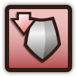

**承受伤害**是一种[游戏机制](pages/%E6%B8%B8%E6%88%8F%E6%9C%BA%E5%88%B6.html)。可以改变受到的所有[伤害](pages/%E4%BC%A4%E5%AE%B3.html)的数值。

不同承受伤害效果物品加法计算，如果承受伤害减少则称为**伤害减弱**，反之则称为**承受额外伤害**。

伤害减弱

赋予**伤害减弱**的物品：

*    [坚韧头盔](pages/%E5%9D%9A%E9%9F%A7%E5%A4%B4%E7%9B%94.html)
*    [石制头盔](pages/%E7%9F%B3%E5%88%B6%E5%A4%B4%E7%9B%94.html)
*    [腐败头盔](pages/%E8%85%90%E8%B4%A5%E5%A4%B4%E7%9B%94.html)
*    [龙鳞护甲](pages/%E9%BE%99%E9%B3%9E%E6%8A%A4%E7%94%B2.html)
*    [旅行包](pages/%E6%97%85%E8%A1%8C%E5%8C%85.html)
*    [鹿木守护](pages/%E9%B9%BF%E6%9C%A8%E5%AE%88%E6%8A%A4.html)
*    [捕梦网](pages/%E6%8D%95%E6%A2%A6%E7%BD%91.html)
*    [狼徽章](pages/%E7%8B%BC%E5%BE%BD%E7%AB%A0.html)
*    [投石手](pages/%E6%8A%95%E7%9F%B3%E6%89%8B.html)
*    [别着急](pages/%E5%88%AB%E7%9D%80%E6%80%A5.html)

承受额外伤害

赋予**承受额外伤害**的物品：

*    [超长矛](pages/%E8%B6%85%E9%95%BF%E7%9F%9B.html)
*    [剧毒常春藤](pages/%E5%89%A7%E6%AF%92%E5%B8%B8%E6%98%A5%E8%97%A4.html)
*    [开心炸弹](pages/%E5%BC%80%E5%BF%83%E7%82%B8%E5%BC%B9.html)

| [v](pages/Template:%E6%B8%B8%E6%88%8F%E6%9C%BA%E5%88%B6.html) · [d](pages/Template_talk:%E6%B8%B8%E6%88%8F%E6%9C%BA%E5%88%B6.html) · [e](pages/Template:%E6%B8%B8%E6%88%8F%E6%9C%BA%E5%88%B6.html) [游戏机制](pages/%E6%B8%B8%E6%88%8F%E6%9C%BA%E5%88%B6.html) |
| --- |
|  |
| 物品栏和商店 | [物品栏](pages/%E7%89%A9%E5%93%81%E6%A0%8F.html) • [合成配方](pages/%E5%90%88%E6%88%90%E9%85%8D%E6%96%B9.html) • [商店机制](pages/%E6%B8%B8%E6%88%8F%E6%9C%BA%E5%88%B6.html#%E5%95%86%E5%BA%97%E6%9C%BA%E5%88%B6 "游戏机制") • [稀有度](pages/%E7%A8%80%E6%9C%89%E5%BA%A6.html) • [宝藏](pages/%E5%AE%9D%E8%97%8F.html) • [交易](pages/%E4%BA%A4%E6%98%93.html) |
|  |
| 战斗 | [伤害](pages/%E4%BC%A4%E5%AE%B3.html) • [命中率](pages/%E5%91%BD%E4%B8%AD%E7%8E%87.html) • [冷却](pages/%E5%86%B7%E5%8D%B4.html) • [暴击](pages/%E6%9A%B4%E5%87%BB.html) • [狂战士之怒](pages/%E7%8B%82%E6%88%98%E5%A3%AB%E4%B9%8B%E6%80%92.html) •  [护盾](pages/%E6%8A%A4%E7%9B%BE.html) • [恢复](pages/%E6%81%A2%E5%A4%8D%EF%BC%88%E6%9C%BA%E5%88%B6%EF%BC%89.html) • [最大生命值](pages/%E6%9C%80%E5%A4%A7%E7%94%9F%E5%91%BD%E5%80%BC.html) • [疲惫](pages/%E7%96%B2%E6%83%AB.html) • [无敌](pages/%E6%97%A0%E6%95%8C.html) • [承受伤害](pages/%E6%89%BF%E5%8F%97%E4%BC%A4%E5%AE%B3.html) • [无效化](pages/%E6%97%A0%E6%95%88%E5%8C%96.html) • [反弹](pages/%E5%8F%8D%E5%BC%B9.html) • [复活](pages/%E5%A4%8D%E6%B4%BB.html) • [抵抗](pages/%E6%8A%B5%E6%8A%97.html) • [眩晕](pages/%E7%9C%A9%E6%99%95.html) • [净化](pages/%E5%87%80%E5%8C%96.html) • [不治](pages/%E4%B8%8D%E6%B2%BB.html) • [几率](pages/%E5%87%A0%E7%8E%87.html) |
|  |
| [增益效果](pages/%E5%A2%9E%E7%9B%8A%E6%95%88%E6%9E%9C.html) |  [充能](pages/%E5%85%85%E8%83%BD.html) •  [狂热](pages/%E7%8B%82%E7%83%AD.html) •  [幸运](pages/%E5%B9%B8%E8%BF%90.html) •  [魔法](pages/%E9%AD%94%E6%B3%95.html) •  [恢复](pages/%E6%81%A2%E5%A4%8D.html) •  [尖刺](pages/%E5%B0%96%E5%88%BA.html) •  [吸血](pages/%E5%90%B8%E8%A1%80.html) |
|  |
| [减益效果](pages/%E5%87%8F%E7%9B%8A%E6%95%88%E6%9E%9C.html) |  [致盲](pages/%E8%87%B4%E7%9B%B2.html) •  [冰冷](pages/%E5%86%B0%E5%86%B7.html) •  [中毒](pages/%E4%B8%AD%E6%AF%92.html) |
|  |
| 其他 | [主客场](pages/%E4%B8%BB%E5%AE%A2%E5%9C%BA.html) • [战斗日志](pages/%E6%88%98%E6%96%97%E6%97%A5%E5%BF%97.html) • [游戏胜负](pages/%E6%B8%B8%E6%88%8F%E6%9C%BA%E5%88%B6.html#%E6%B8%B8%E6%88%8F%E8%83%9C%E8%B4%9F "游戏机制") • [游戏模式](pages/%E6%B8%B8%E6%88%8F%E6%9C%BA%E5%88%B6.html#%E6%B8%B8%E6%88%8F%E6%A8%A1%E5%BC%8F "游戏机制") |
