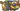

有许多物品可以提升**最大生命值**，不属于[恢复（机制）](pages/%E6%81%A2%E5%A4%8D%EF%BC%88%E6%9C%BA%E5%88%B6%EF%BC%89.html)，但是有其他物品可以影响获得的最大生命值。

最大生命值相关物品
---------

*    [幽灵獾](pages/%E5%B9%BD%E7%81%B5%E7%8D%BE.html)：每4.2s：消耗1点来获得20点**最大生命值**，且每有一个的物品，还会获得2的**最大生命值**加成。
*    [黑色主教](pages/%E9%BB%91%E8%89%B2%E4%B8%BB%E6%95%99.html)：被吃掉时：削弱对手20%的生命恢复效果，还会削弱20%获得的**最大生命值**。
*    [血色护符](pages/%E8%A1%80%E8%89%B2%E6%8A%A4%E7%AC%A6.html)：战斗开始时：获得2层，20**最大生命值**。
*    [奶酪](pages/%E5%A5%B6%E9%85%AA.html)：每3.8s:获得10点**最大生命值**和1个随机增益效果。
*    [奶酪黏黏](pages/%E5%A5%B6%E9%85%AA%E9%BB%8F%E9%BB%8F.html)：的物品激活达到5次：获得22点**最大生命值**和2层随机增益效果。
*    [大象符文](pages/%E5%A4%A7%E8%B1%A1%E7%AC%A6%E6%96%87.html)：放入背包：**最大生命值**增加50。
*    [亡灵庇护](pages/%E4%BA%A1%E7%81%B5%E5%BA%87%E6%8A%A4.html)：物品的**最大生命值**提升效果+20%。 过量治疗时：过量治疗的生命值增加为**最大生命值**。
*    [火坑](pages/%E7%81%AB%E5%9D%91.html)：战斗开始时：火坑里每有一个物品，获得5点**最大生命值**。
*    [姜饼杰瑞](pages/%E5%A7%9C%E9%A5%BC%E6%9D%B0%E7%91%9E.html)：战斗开始时：获得40**最大生命值**。每3s：消耗1点，1层还有1点，获得1层，3层还有20点**最大生命值**。
*    [心之容器](pages/%E5%BF%83%E4%B9%8B%E5%AE%B9%E5%99%A8.html)：消耗7层：获得100点**最大生命值**，2层，且生命恢复效果增加15%（单次触发）。
*    [黑暗心之容器](pages/%E9%BB%91%E6%9A%97%E5%BF%83%E4%B9%8B%E5%AE%B9%E5%99%A8.html)：消耗7层：获得100点**最大生命值**，还有4层，并且你的对手生命恢复效果减低40%（单次触发）。
*    [心形盾牌](pages/%E5%BF%83%E5%BD%A2%E7%9B%BE%E7%89%8C.html)：消耗7层：还能抵挡和伤害，并获得150的**最大生命值**（单次触发）。
*    [投资机会](pages/%E6%8A%95%E8%B5%84%E6%9C%BA%E4%BC%9A.html)：的物品消耗增益效果时：获得4点**最大生命值**。
*    [纯粹加成](pages/%E7%BA%AF%E7%B2%B9%E5%8A%A0%E6%88%90.html)：战斗开始时：获得10%**最大生命值**，10%基础耐力恢复。
*    [升级](pages/%E5%8D%87%E7%BA%A7.html)：每5s：获得10点**最大生命值**，1点耐力，还有1点和1点。
*    [魔法入门指南](pages/%E9%AD%94%E6%B3%95%E5%85%A5%E9%97%A8%E6%8C%87%E5%8D%97.html)：每5s：消耗1点：获得8点**最大生命值**，每有一个的魔法卷轴最大生命值再增加3（打造的魔法卷轴算作2次）。
*    [魔法魔药](pages/%E9%AD%94%E6%B3%95%E9%AD%94%E8%8D%AF.html)：消耗或生命值下降到50%时：消耗此魔药，并且获得4点和18点**最大生命值**。
*    [更多加成](pages/%E6%9B%B4%E5%A4%9A%E5%8A%A0%E6%88%90.html)：战斗开始时：获得10%**最大生命值**。你的武器造成的伤害+5%。
*    [存钱罐](pages/%E5%AD%98%E9%92%B1%E7%BD%90.html)：战斗开始时：每个的带“战斗开始时”触发效果物品提供2点**最大生命值**。
*    [宝石存钱罐](pages/%E5%AE%9D%E7%9F%B3%E5%AD%98%E9%92%B1%E7%BD%90.html)：战斗开始时：每有一个镶入槽位的宝石，获得4点**最大生命值**。
*    [月亮之力](pages/%E6%9C%88%E4%BA%AE%E4%B9%8B%E5%8A%9B.html)：疲惫开始时：增加65%**最大生命值**。
*    [爱的拼图背包](pages/%E7%88%B1%E7%9A%84%E6%8B%BC%E5%9B%BE%E8%83%8C%E5%8C%85.html)：战斗开始时：获得7点**最大生命值**。
*    [彩虹杀戮者黏黏](pages/%E5%BD%A9%E8%99%B9%E6%9D%80%E6%88%AE%E8%80%85%E9%BB%8F%E9%BB%8F.html)：的物品激活达到9次：获得40点**最大生命值**、20点、2层和2层随机增益效果，向对手施加3层，的武器伤害+4。
*    [蛇蛇](pages/%E8%9B%87%E8%9B%87.html)：战斗开始时：每有一个的宠物，将获得4点和50点**最大生命值**。
*    [雪球](pages/%E9%9B%AA%E7%90%83.html)：对手物品的**最大生命值**提升效果降低15%。
*    [强力魔法魔药](pages/%E5%BC%BA%E5%8A%9B%E9%AD%94%E6%B3%95%E9%AD%94%E8%8D%AF.html)：消耗或当生命值低于50%时：消耗此魔药并获得9点和25点**最大生命值**。
*    [荆棘之花](pages/%E8%8D%86%E6%A3%98%E4%B9%8B%E8%8A%B1.html)：每获得1层：获得11点**最大生命值**。
*    [细绳](pages/%E7%BB%86%E7%BB%B3.html)：的物品激活时：有20%的几率获得2点**最大生命值**。每有一个的通用物品，几率再增加20%。

| [v](pages/Template:%E6%B8%B8%E6%88%8F%E6%9C%BA%E5%88%B6.html) · [d](pages/Template_talk:%E6%B8%B8%E6%88%8F%E6%9C%BA%E5%88%B6.html) · [e](pages/Template:%E6%B8%B8%E6%88%8F%E6%9C%BA%E5%88%B6.html) [游戏机制](pages/%E6%B8%B8%E6%88%8F%E6%9C%BA%E5%88%B6.html) |
| --- |
|  |
| 物品栏和商店 | [物品栏](pages/%E7%89%A9%E5%93%81%E6%A0%8F.html) • [合成配方](pages/%E5%90%88%E6%88%90%E9%85%8D%E6%96%B9.html) • [商店机制](pages/%E6%B8%B8%E6%88%8F%E6%9C%BA%E5%88%B6.html#%E5%95%86%E5%BA%97%E6%9C%BA%E5%88%B6 "游戏机制") • [稀有度](pages/%E7%A8%80%E6%9C%89%E5%BA%A6.html) • [宝藏](pages/%E5%AE%9D%E8%97%8F.html) • [交易](pages/%E4%BA%A4%E6%98%93.html) |
|  |
| 战斗 | [伤害](pages/%E4%BC%A4%E5%AE%B3.html) • [命中率](pages/%E5%91%BD%E4%B8%AD%E7%8E%87.html) • [冷却](pages/%E5%86%B7%E5%8D%B4.html) • [暴击](pages/%E6%9A%B4%E5%87%BB.html) • [狂战士之怒](pages/%E7%8B%82%E6%88%98%E5%A3%AB%E4%B9%8B%E6%80%92.html) •  [护盾](pages/%E6%8A%A4%E7%9B%BE.html) • [恢复](pages/%E6%81%A2%E5%A4%8D%EF%BC%88%E6%9C%BA%E5%88%B6%EF%BC%89.html) • [最大生命值](pages/%E6%9C%80%E5%A4%A7%E7%94%9F%E5%91%BD%E5%80%BC.html) • [疲惫](pages/%E7%96%B2%E6%83%AB.html) • [无敌](pages/%E6%97%A0%E6%95%8C.html) • [承受伤害](pages/%E6%89%BF%E5%8F%97%E4%BC%A4%E5%AE%B3.html) • [无效化](pages/%E6%97%A0%E6%95%88%E5%8C%96.html) • [反弹](pages/%E5%8F%8D%E5%BC%B9.html) • [复活](pages/%E5%A4%8D%E6%B4%BB.html) • [抵抗](pages/%E6%8A%B5%E6%8A%97.html) • [眩晕](pages/%E7%9C%A9%E6%99%95.html) • [净化](pages/%E5%87%80%E5%8C%96.html) • [不治](pages/%E4%B8%8D%E6%B2%BB.html) • [几率](pages/%E5%87%A0%E7%8E%87.html) |
|  |
| [增益效果](pages/%E5%A2%9E%E7%9B%8A%E6%95%88%E6%9E%9C.html) |  [充能](pages/%E5%85%85%E8%83%BD.html) •  [狂热](pages/%E7%8B%82%E7%83%AD.html) •  [幸运](pages/%E5%B9%B8%E8%BF%90.html) •  [魔法](pages/%E9%AD%94%E6%B3%95.html) •  [恢复](pages/%E6%81%A2%E5%A4%8D.html) •  [尖刺](pages/%E5%B0%96%E5%88%BA.html) •  [吸血](pages/%E5%90%B8%E8%A1%80.html) |
|  |
| [减益效果](pages/%E5%87%8F%E7%9B%8A%E6%95%88%E6%9E%9C.html) |  [致盲](pages/%E8%87%B4%E7%9B%B2.html) •  [冰冷](pages/%E5%86%B0%E5%86%B7.html) •  [中毒](pages/%E4%B8%AD%E6%AF%92.html) |
|  |
| 其他 | [主客场](pages/%E4%B8%BB%E5%AE%A2%E5%9C%BA.html) • [战斗日志](pages/%E6%88%98%E6%96%97%E6%97%A5%E5%BF%97.html) • [游戏胜负](pages/%E6%B8%B8%E6%88%8F%E6%9C%BA%E5%88%B6.html#%E6%B8%B8%E6%88%8F%E8%83%9C%E8%B4%9F "游戏机制") • [游戏模式](pages/%E6%B8%B8%E6%88%8F%E6%9C%BA%E5%88%B6.html#%E6%B8%B8%E6%88%8F%E6%A8%A1%E5%BC%8F "游戏机制") |
