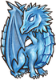
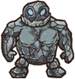
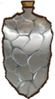
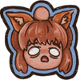
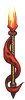
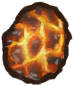
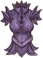
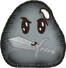

<!-- source: action=render -->

<b>护盾</b>是一种<a href="pages/%E6%B8%B8%E6%88%8F%E6%9C%BA%E5%88%B6.html" title="游戏机制">游戏机制</a>。每层抵挡一层伤害。一些伤害来源会越过护甲直接造成伤害。

<h2>与护盾有关的物品</h2>
<table class="styled items nostyle-list sortable">
<tbody><tr>
<th class="unsortable">
</th>
<th><b>名称</b>
</th>
<th class="unsortable"><b>效果</b>
</th>
<th><b>职业</b>
</th>
<th><b>稀有度</b>
</th>
<th><b>价格</b>
</th></tr>
<tr>
<td>

</td>
<td><a href="pages/%E4%B8%80%E5%9D%A8%E7%85%A4%E7%82%AD.html" title="一坨煤炭">一坨煤炭</a>
</td>
<td>

放入武器槽：

<b>击中对手时：</b>有70%的几率造成+1点额外伤害。

 
放入护甲或其他槽：

<ul><li><b>战斗开始时：</b>获得8点。</li>
<li>还会<a href="pages/%E6%8A%B5%E6%8A%97.html" title="抵抗">抵抗</a>1层<a href="pages/%E5%87%8F%E7%9B%8A%E6%95%88%E6%9E%9C.html" title="减益效果">减益效果</a>。</li></ul>
 
放入背包：

<b>在3s后：</b>获得一个随机<a href="pages/%E5%A2%9E%E7%9B%8A%E6%95%88%E6%9E%9C.html" title="增益效果">增益效果</a>，向对手施加一个随机<a href="pages/%E5%87%8F%E7%9B%8A%E6%95%88%E6%9E%9C.html" title="减益效果">减益效果</a>。

</td>
<td><a href="pages/%E9%80%9A%E7%94%A8.html" title="通用">通用</a>
</td>
<td data-sort-value="1"><a href="pages/%E6%99%AE%E9%80%9A.html" title="普通">普通</a>
</td>
<td>2
</td></tr>
<tr>
<td>

</td>
<td><a href="pages/%E4%B9%8C%E9%BE%9F.html" title="乌龟">乌龟</a>
</td>
<td>
<ul><li>的盾牌抵挡伤害增加100%。</li>
<li><b>战斗开始时：</b>两位玩家的伤害同时削减35%，持续7s。</li>
<li><b>每13s：</b>获得50点，还有你的最大生命值的20%作为。</li></ul>
</td>
<td><a href="pages/%E5%86%92%E9%99%A9%E5%AE%B6.html" title="冒险家">冒险家</a>
</td>
<td data-sort-value="6"><a href="pages/%E7%89%B9%E5%88%AB.html" title="特别">特别</a>
</td>
<td>10
</td></tr>
<tr>
<td>

</td>
<td><a href="pages/%E5%85%A8%E8%BA%AB%E9%98%B2%E6%8A%A4.html" title="全身防护">全身防护</a>
</td>
<td>
<ul><li>的物品提供的+35%。</li>
<li><b>如果你刚好有一个<a href="pages/%E6%8A%A4%E7%94%B2.html" title="护甲">护甲</a>，<a href="pages/%E5%A4%B4%E7%9B%94.html" title="头盔">头盔</a>和<a href="pages/%E9%9E%8B%E5%AD%90.html" title="鞋子">鞋子</a>：</b>减少8点受到的伤害。</li>
<li><b>每5s：</b>获得10层。</li></ul>
</td>
<td><a href="pages/%E9%80%9A%E7%94%A8.html" title="通用">通用</a>
</td>
<td data-sort-value="6"><a href="pages/%E7%89%B9%E5%88%AB.html" title="特别">特别</a>
</td>
<td>5
</td></tr>
<tr>
<td>

</td>
<td><a href="pages/%E5%86%B0%E9%9C%9C%E5%B7%A8%E9%BE%99.html" title="冰霜巨龙">冰霜巨龙</a>
</td>
<td>
<ul><li><b>击中对手时：</b>向对手施加1层。</li>
<li><b>对手的达到10层时：</b>获得60点。你受到的伤害-20%。</li></ul>
</td>
<td><a href="pages/%E6%94%B6%E5%89%B2%E8%80%85.html" title="收割者">收割者</a>
</td>
<td data-sort-value="5"><a href="pages/%E7%A5%9E%E7%BA%A7.html" title="神级">神级</a>
</td>
<td>14
</td></tr>
<tr>
<td>

</td>
<td><a href="pages/%E5%86%B0%E9%9C%9C%E6%8A%A4%E7%94%B2.html" title="冰霜护甲">冰霜护甲</a>
</td>
<td>
<ul><li><b>战斗开始时：</b>获得80点并向对手施加4层。</li>
<li><b>每5s：</b>消耗1层向对手施加2层,并获得10点。</li></ul>
</td>
<td><a href="pages/%E9%80%9A%E7%94%A8.html" title="通用">通用</a>
</td>
<td data-sort-value="3"><a href="pages/%E5%8F%B2%E8%AF%97.html" title="史诗">史诗</a>
</td>
<td>11
</td></tr>
<tr>
<td>

</td>
<td><a href="pages/%E5%88%BA%E7%8C%AC.html" title="刺猬">刺猬</a>
</td>
<td>
<ul><li><b>每5s：</b>造成10点伤害（每层增加0.5点伤害）。</li>
<li><b>当生命值低于70%时：</b>获得2层和25点（单次触发）。</li>
<li>每有一个的<a href="pages/%E5%AE%A0%E7%89%A9.html" title="宠物">宠物</a>或<a href="pages/%E9%A3%9F%E7%89%A9.html" title="食物">食物</a>，效果触发速度快 15%。</li></ul>
</td>
<td><a href="pages/%E6%B8%B8%E4%BE%A0.html" title="游侠">游侠</a>
</td>
<td data-sort-value="3"><a href="pages/%E5%8F%B2%E8%AF%97.html" title="史诗">史诗</a>
</td>
<td>6
</td></tr>
<tr>
<td>

</td>
<td><a href="pages/%E5%89%A7%E6%AF%92%E7%9F%9B.html" title="剧毒矛">剧毒矛</a>
</td>
<td>

<b>击中对手：</b>向对手施加3层，同时想自己施加2层。每有一个的空槽位或物品，破坏6点。

</td>
<td><a href="pages/%E9%80%9A%E7%94%A8.html" title="通用">通用</a>
</td>
<td data-sort-value="4"><a href="pages/%E4%BC%A0%E8%AF%B4.html" title="传说">传说</a>
</td>
<td>13
</td></tr>
<tr>
<td>

</td>
<td><a href="pages/%E5%8A%9B%E9%87%8F%E6%89%8B%E5%A5%97.html" title="力量手套">力量手套</a>
</td>
<td>
<ul><li><b>战斗开始时：</b>的武器造成的伤害+20%，但攻击减慢10%。</li>
<li><b>的武器击中对手时：</b>获得7点。</li></ul>
</td>
<td><a href="pages/%E9%80%9A%E7%94%A8.html" title="通用">通用</a>
</td>
<td data-sort-value="4"><a href="pages/%E4%BC%A0%E8%AF%B4.html" title="传说">传说</a>
</td>
<td>10
</td></tr>
<tr>
<td>

</td>
<td><a href="pages/%E5%8B%87%E6%B0%94%E7%9B%BE%E7%89%8C.html" title="勇气盾牌">勇气盾牌</a>
</td>
<td>
<ul><li>的物品生成30%点额外。</li>
<li><b>受到攻击（）：</b>将有30%的几率抵挡14点伤害并移除对手0.7点<a href="pages/%E8%80%90%E5%8A%9B.html" title="耐力">耐力</a>。</li></ul>
</td>
<td><a href="pages/%E9%80%9A%E7%94%A8.html" title="通用">通用</a>
</td>
<td data-sort-value="4"><a href="pages/%E4%BC%A0%E8%AF%B4.html" title="传说">传说</a>
</td>
<td>12
</td></tr>
<tr>
<td>

</td>
<td><a href="pages/%E5%90%B8%E8%A1%80%E6%8A%A4%E7%94%B2.html" title="吸血护甲">吸血护甲</a>
</td>
<td>
<ul><li><b>战斗开始时：</b>转换45点生命值为100并获得2层。</li>
<li><b>每2.8s：</b>转换10点生命值为20点。</li></ul>
</td>
<td><a href="pages/%E9%80%9A%E7%94%A8.html" title="通用">通用</a>
</td>
<td data-sort-value="4"><a href="pages/%E4%BC%A0%E8%AF%B4.html" title="传说">传说</a>
</td>
<td>15
</td></tr>
<tr>
<td>

</td>
<td><a href="pages/%E5%A4%A7%E8%92%9C.html" title="大蒜">大蒜</a>
</td>
<td>

<b>每4s：</b>获得3点并有30%的几率移除对手1层效果。

</td>
<td><a href="pages/%E9%80%9A%E7%94%A8.html" title="通用">通用</a>
</td>
<td data-sort-value="1"><a href="pages/%E6%99%AE%E9%80%9A.html" title="普通">普通</a>
</td>
<td>2
</td></tr>
<tr>
<td>

</td>
<td><a href="pages/%E5%A4%A7%E8%92%9C%E6%8C%82%E5%A3%81.html" title="大蒜挂壁">大蒜挂壁</a>
</td>
<td>
<ul><li>的<a href="pages/%E5%A4%A7%E8%92%9C.html" title="大蒜">大蒜</a>获得+5点。</li>
<li><b>的物品每获得13点：</b>向对手施加1层。</li></ul>
</td>
<td><a href="pages/%E9%80%9A%E7%94%A8.html" title="通用">通用</a>
</td>
<td data-sort-value="6"><a href="pages/%E7%89%B9%E5%88%AB.html" title="特别">特别</a>
</td>
<td>5
</td></tr>
<tr>
<td>

</td>
<td><a href="pages/%E5%A4%AA%E9%98%B3%E4%B9%8B%E5%8A%9B.html" title="太阳之力">太阳之力</a>
</td>
<td>
<ul><li>有20%几率复制你获得的层数。</li>
<li><b>的<a href="pages/%E6%97%A5%E8%80%80%E7%9B%BE%E7%89%8C.html" title="日耀盾牌">日耀盾牌</a>抵挡伤害时：</b>有60%的几率获得1层。</li>
<li><b>的<a href="pages/%E6%97%A5%E8%80%80%E6%8A%A4%E7%94%B2.html" title="日耀护甲">日耀护甲</a>消耗时：</b>获得16点。</li></ul>
</td>
<td><a href="pages/%E7%81%AB%E7%84%B0%E9%AD%94%E5%AF%BC%E5%A3%AB.html" title="火焰魔导士">火焰魔导士</a>
</td>
<td data-sort-value="6"><a href="pages/%E7%89%B9%E5%88%AB.html" title="特别">特别</a>
</td>
<td>5
</td></tr>
<tr>
<td>

</td>
<td><a href="pages/%E5%AE%88%E6%8A%A4%E9%92%B1%E5%8C%85.html" title="守护钱包">守护钱包</a>
</td>
<td>
<ul><li><b>战斗开始：</b>获得15。</li></ul>
</td>
<td><a href="pages/%E9%80%9A%E7%94%A8.html" title="通用">通用</a>
</td>
<td data-sort-value="5"><a href="pages/%E7%A5%9E%E7%BA%A7.html" title="神级">神级</a>
</td>
<td>2
</td></tr>
<tr>
<td>

</td>
<td><a href="pages/%E5%B7%A5%E4%BD%9C%E6%9C%8D.html" title="工作服">工作服</a>
</td>
<td>
<ul><li><b>商店刷新时：</b>有35%的几率出现交易机会。</li>
<li><b>战斗开始时：</b>获得70点。<a href="pages/%E6%8A%B5%E6%8A%97.html" title="抵抗">抵抗</a>6层<a href="pages/%E5%87%8F%E7%9B%8A%E6%95%88%E6%9E%9C.html" title="减益效果">减益效果</a>。</li></ul>
</td>
<td><a href="pages/%E5%86%92%E9%99%A9%E5%AE%B6.html" title="冒险家">冒险家</a>
</td>
<td data-sort-value="3"><a href="pages/%E5%8F%B2%E8%AF%97.html" title="史诗">史诗</a>
</td>
<td>13
</td></tr>
<tr>
<td>

</td>
<td><a href="pages/%E5%B7%A8%E7%9F%B3%E5%83%8F.html" title="巨石像">巨石像</a>
</td>
<td>
<ul><li><b>击中对手：</b>获得1层。有30%的几率<a href="pages/%E7%9C%A9%E6%99%95.html" title="眩晕">眩晕</a>对手0.5s。</li>
<li><b>消耗7层：</b>冷却时间降低到2.6s并且获得150点（单次触发）。</li>
<li>每个的<a href="pages/%E4%B8%80%E8%A2%8B%E7%9F%B3%E5%A4%B4.html" title="一袋石头">一袋石头</a>造成+10伤害。</li></ul>
</td>
<td><a href="pages/%E9%80%9A%E7%94%A8.html" title="通用">通用</a>
</td>
<td data-sort-value="5"><a href="pages/%E7%A5%9E%E7%BA%A7.html" title="神级">神级</a>
</td>
<td>16
</td></tr>
<tr>
<td>

</td>
<td><a href="pages/%E5%B9%BD%E7%81%B5%E5%8C%95%E9%A6%96.html" title="幽灵匕首">幽灵匕首</a>
</td>
<td>
<ul><li><b>攻击时：</b>消耗1点无视直接攻击对手，造成+6点伤害。</li>
<li><b><a href="pages/%E7%9C%A9%E6%99%95.html" title="眩晕">眩晕</a>对手：</b>触发额外攻击。</li></ul>
</td>
<td><a href="pages/%E9%80%9A%E7%94%A8.html" title="通用">通用</a>
</td>
<td data-sort-value="4"><a href="pages/%E4%BC%A0%E8%AF%B4.html" title="传说">传说</a>
</td>
<td>4
</td></tr>
<tr>
<td>

</td>
<td><a href="pages/%E5%BC%BA%E5%8A%9B%E7%A1%AC%E5%8C%96%E9%AD%94%E8%8D%AF.html" title="强力硬化魔药">强力硬化魔药</a>
</td>
<td>

<b>当你的至少有45点时：</b>消耗此魔药，转换15点生命值为35点，并在4s内获得2点。

</td>
<td><a href="pages/%E9%80%9A%E7%94%A8.html" title="通用">通用</a>
</td>
<td data-sort-value="4"><a href="pages/%E4%BC%A0%E8%AF%B4.html" title="传说">传说</a>
</td>
<td>8
</td></tr>
<tr>
<td>

</td>
<td><a href="pages/%E5%BD%A9%E8%99%B9%E5%B7%A8%E5%A4%A7%E8%A5%BF%E5%85%B0%E8%8A%B1%E9%BB%8F%E9%BB%8F.html" title="彩虹巨大西兰花黏黏">彩虹巨大西兰花黏黏</a>
</td>
<td>

<b>的物品激活达到9次：</b><a href="pages/%E6%81%A2%E5%A4%8D.html" class="mw-disambig" title="恢复">恢复</a>生命值40点，获得20点，还有2层和2层，向对手施加3层，且的武器获得4点伤害加成。

</td>
<td><a href="pages/%E5%86%92%E9%99%A9%E5%AE%B6.html" title="冒险家">冒险家</a>
</td>
<td data-sort-value="5"><a href="pages/%E7%A5%9E%E7%BA%A7.html" title="神级">神级</a>
</td>
<td>53
</td></tr>
<tr>
<td>

</td>
<td><a href="pages/%E5%BD%A9%E8%99%B9%E6%9D%80%E6%88%AE%E8%80%85%E9%BB%8F%E9%BB%8F.html" title="彩虹杀戮者黏黏">彩虹杀戮者黏黏</a>
</td>
<td>

<b>的物品激活达到9次：</b>获得40点最大生命值、20点、2层和2层随机<a href="pages/%E5%A2%9E%E7%9B%8A%E6%95%88%E6%9E%9C.html" title="增益效果">增益效果</a>，向对手施加3层，的武器伤害+4。

</td>
<td><a href="pages/%E7%8B%82%E6%88%98%E5%A3%AB.html" title="狂战士">狂战士</a>
</td>
<td data-sort-value="5"><a href="pages/%E7%A5%9E%E7%BA%A7.html" title="神级">神级</a>
</td>
<td>57
</td></tr>
<tr>
<td>

</td>
<td><a href="pages/%E5%BD%A9%E8%99%B9%E7%A9%B6%E6%9E%81%E5%B8%83%E4%B8%81%E9%BB%8F%E9%BB%8F.html" title="彩虹究极布丁黏黏">彩虹究极布丁黏黏</a>
</td>
<td>
<ul><li><b>的物品激活达到9次：</b><a href="pages/%E6%81%A2%E5%A4%8D.html" class="mw-disambig" title="恢复">恢复</a>40点血量，获得20点，还有2层和2层，并施加3层。并给予的武器+4点伤害。</li></ul>
</td>
<td><a href="pages/%E6%B8%B8%E4%BE%A0.html" title="游侠">游侠</a>
</td>
<td data-sort-value="5"><a href="pages/%E7%A5%9E%E7%BA%A7.html" title="神级">神级</a>
</td>
<td>55
</td></tr>
<tr>
<td>

</td>
<td><a href="pages/%E5%BD%A9%E8%99%B9%E7%BB%88%E6%9E%81%E5%9C%86%E5%9C%86%E6%B5%93%E7%A8%A0%E9%BB%8F%E9%BB%8F.html" title="彩虹终极圆圆浓稠黏黏">彩虹终极圆圆浓稠黏黏</a>
</td>
<td>

<b>的物品激活达到9次：</b><a href="pages/%E6%81%A2%E5%A4%8D.html" class="mw-disambig" title="恢复">恢复</a>40点生命值并获得20点，还获得2层和4层，向对手施加3层。的武器伤害+4。

</td>
<td><a href="pages/%E7%81%AB%E7%84%B0%E9%AD%94%E5%AF%BC%E5%A3%AB.html" title="火焰魔导士">火焰魔导士</a>
</td>
<td data-sort-value="5"><a href="pages/%E7%A5%9E%E7%BA%A7.html" title="神级">神级</a>
</td>
<td>54
</td></tr>
<tr>
<td>

</td>
<td><a href="pages/%E5%BD%A9%E8%99%B9%E8%B6%85%E7%BA%A7%E8%87%B3%E5%B0%8A%E9%BB%8F%E9%BB%8F.html" title="彩虹超级至尊黏黏">彩虹超级至尊黏黏</a>
</td>
<td>

<b>的物品激活达到9次：</b><a href="pages/%E6%81%A2%E5%A4%8D.html" class="mw-disambig" title="恢复">恢复</a>40点生命值，获得20点和2层，施加3层和3层。的武器伤害+4。

</td>
<td><a href="pages/%E6%94%B6%E5%89%B2%E8%80%85.html" title="收割者">收割者</a>
</td>
<td data-sort-value="5"><a href="pages/%E7%A5%9E%E7%BA%A7.html" title="神级">神级</a>
</td>
<td>55
</td></tr>
<tr>
<td>

</td>
<td><a href="pages/%E5%BD%A9%E8%99%B9%E9%B2%9C%E8%89%B3%E7%B3%96%E6%9E%9C%E9%BB%8F%E9%BB%8F.html" title="彩虹鲜艳糖果黏黏">彩虹鲜艳糖果黏黏</a>
</td>
<td>

<b>的物品激活达到9次：</b><a href="pages/%E6%81%A2%E5%A4%8D.html" class="mw-disambig" title="恢复">恢复</a>40点生命值，获得20点，还有2层，2层你现有层数最多的<a href="pages/%E5%A2%9E%E7%9B%8A%E6%95%88%E6%9E%9C.html" title="增益效果">增益效果</a>。向对手施加3层，的武器获得4点伤害加成。

</td>
<td><a href="pages/%E9%AD%94%E6%B3%95%E5%B8%88.html" title="魔法师">魔法师</a>
</td>
<td data-sort-value="5"><a href="pages/%E7%A5%9E%E7%BA%A7.html" title="神级">神级</a>
</td>
<td>56
</td></tr>
<tr>
<td>

</td>
<td><a href="pages/%E5%BF%83%E5%BD%A2%E7%9B%BE%E7%89%8C.html" title="心形盾牌">心形盾牌</a>
</td>
<td>
<ul><li>的物品获得的+30%,生命值<a href="pages/%E6%81%A2%E5%A4%8D.html" class="mw-disambig" title="恢复">恢复</a>效果加强30%，且有30%的几率复制获得的。</li>
<li><b>被攻击时（）：</b>有30%的几率抵挡14点伤害，移除对手0.7点<a href="pages/%E8%80%90%E5%8A%9B.html" title="耐力">耐力</a>并获得1层（最高20层）。</li>
<li><b>消耗7层：</b>还能抵挡和伤害，并获得150的最大生命值（单次触发）。</li></ul>
</td>
<td><a href="pages/%E5%86%92%E9%99%A9%E5%AE%B6.html" title="冒险家">冒险家</a>
</td>
<td data-sort-value="5"><a href="pages/%E7%A5%9E%E7%BA%A7.html" title="神级">神级</a>
</td>
<td>26
</td></tr>
<tr>
<td>

</td>
<td><a href="pages/%E6%8A%95%E7%9F%B3%E6%89%8B.html" title="投石手">投石手</a>
</td>
<td>
<ul><li><b>当使用<a href="pages/%E7%9F%B3%E5%A4%B4.html" title="石头">石头</a>或<a href="pages/%E5%B7%A8%E7%9F%B3%E5%83%8F.html" title="巨石像">巨石像</a>造成伤害时：</b>获得伤害的65%作为。</li>
<li><b>当你拥有时：</b>受到的伤害-20%。</li></ul>
</td>
<td><a href="pages/%E9%80%9A%E7%94%A8.html" title="通用">通用</a>
</td>
<td data-sort-value="6"><a href="pages/%E7%89%B9%E5%88%AB.html" title="特别">特别</a>
</td>
<td>5
</td></tr>
<tr>
<td>

</td>
<td><a href="pages/%E6%8A%A4%E7%94%B2%E7%9D%BF%E6%99%BA%E7%8B%BC%E5%B4%BD.html" title="护甲睿智狼崽">护甲睿智狼崽</a>
</td>
<td>
<ul><li><b>每4s：</b>获得14点并<a href="pages/%E5%87%80%E5%8C%96.html" title="净化">净化</a>1层。狼崽的获得增加1点。</li>
<li>每有一个的<a href="pages/%E5%AE%A0%E7%89%A9.html" title="宠物">宠物</a>，效果触发快15%。</li></ul>
</td>
<td><a href="pages/%E7%8B%82%E6%88%98%E5%A3%AB.html" title="狂战士">狂战士</a>
</td>
<td data-sort-value="5"><a href="pages/%E7%A5%9E%E7%BA%A7.html" title="神级">神级</a>
</td>
<td>7
</td></tr>
<tr>
<td>

</td>
<td><a href="pages/%E6%8A%A4%E7%9B%BE%E5%8A%A0%E5%BC%BA.html" title="护盾加强">护盾加强</a>
</td>
<td>
<ul><li>的<a class="mw-selflink selflink">护盾</a>+30%抵挡效果。</li>
<li>的<a href="pages/%E6%8A%A4%E7%94%B2.html" title="护甲">护甲</a>效果触发快60%。</li></ul>
</td>
<td><a href="pages/%E9%80%9A%E7%94%A8.html" title="通用">通用</a>
</td>
<td data-sort-value="6"><a href="pages/%E7%89%B9%E5%88%AB.html" title="特别">特别</a>
</td>
<td>5
</td></tr>
<tr>
<td>

</td>
<td><a href="pages/%E6%97%85%E8%A1%8C%E8%A2%8B.html" title="旅行袋">旅行袋</a>
</td>
<td>
<ul><li>增加6格背包槽位。</li>
<li><b>战斗开始时：</b>旅行袋内每有一个<a href="pages/%E9%80%9A%E7%94%A8.html" title="通用">通用物品</a>，获得8点。</li></ul>
</td>
<td><a href="pages/%E9%80%9A%E7%94%A8.html" title="通用">通用</a>
</td>
<td data-sort-value="3"><a href="pages/%E5%8F%B2%E8%AF%97.html" title="史诗">史诗</a>
</td>
<td>7
</td></tr>
<tr>
<td>

</td>
<td><a href="pages/%E6%97%A5%E8%80%80%E6%8A%A4%E7%94%B2.html" title="日耀护甲">日耀护甲</a>
</td>
<td>
<ul><li>的物品获得属性。</li>
<li><b>战斗开始时：</b>获得70点。每有一个的物品，获得1层。</li>
<li><b>每3s：</b>消耗1层来获得12点生命<a href="pages/%E6%81%A2%E5%A4%8D.html" class="mw-disambig" title="恢复">恢复</a>，并移除2层减益效果。</li></ul>
</td>
<td><a href="pages/%E7%81%AB%E7%84%B0%E9%AD%94%E5%AF%BC%E5%A3%AB.html" title="火焰魔导士">火焰魔导士</a>
</td>
<td data-sort-value="5"><a href="pages/%E7%A5%9E%E7%BA%A7.html" title="神级">神级</a>
</td>
<td>14
</td></tr>
<tr>
<td>

</td>
<td><a href="pages/%E6%97%A5%E8%80%80%E7%9B%BE%E7%89%8C.html" title="日耀盾牌">日耀盾牌</a>
</td>
<td>
<ul><li><b>的物品每获得12点：</b>造成4点伤害。</li>
<li><b>被攻击时（/）：</b>有30%的几率抵挡17点伤害并移除对手0.7<a href="pages/%E8%80%90%E5%8A%9B.html" title="耐力">耐力</a>。</li></ul>
</td>
<td><a href="pages/%E7%81%AB%E7%84%B0%E9%AD%94%E5%AF%BC%E5%A3%AB.html" title="火焰魔导士">火焰魔导士</a>
</td>
<td data-sort-value="5"><a href="pages/%E7%A5%9E%E7%BA%A7.html" title="神级">神级</a>
</td>
<td>14
</td></tr>
<tr>
<td>

</td>
<td><a href="pages/%E6%9C%88%E5%85%89%E6%8A%A4%E7%94%B2.html" title="月光护甲">月光护甲</a>
</td>
<td>
<ul><li><b>战斗开始时：</b>获得50点，每有一个的物品，获得20点。</li>
<li><b>每2.6s:</b>获得3点并<a href="pages/%E5%8F%8D%E5%BC%B9.html" title="反弹">反弹</a>2层<a href="pages/%E5%87%8F%E7%9B%8A%E6%95%88%E6%9E%9C.html" title="减益效果">减益效果</a>。</li></ul>
</td>
<td><a href="pages/%E9%80%9A%E7%94%A8.html" title="通用">通用</a>
</td>
<td data-sort-value="5"><a href="pages/%E7%A5%9E%E7%BA%A7.html" title="神级">神级</a>
</td>
<td>18
</td></tr>
<tr>
<td>

</td>
<td><a href="pages/%E6%9C%88%E5%85%89%E7%9B%BE.html" title="月光盾">月光盾</a>
</td>
<td>
<ul><li>的物品的到30%的加成。</li>
<li><b>的物品每得到12点：</b>将获得1点。</li>
<li><b>被攻击时（/）：</b>有30%的几率抵挡14点伤害并移除对手0.7点<a href="pages/%E8%80%90%E5%8A%9B.html" title="耐力">耐力</a>。</li></ul>
</td>
<td><a href="pages/%E9%80%9A%E7%94%A8.html" title="通用">通用</a>
</td>
<td data-sort-value="5"><a href="pages/%E7%A5%9E%E7%BA%A7.html" title="神级">神级</a>
</td>
<td>18
</td></tr>
<tr>
<td>

</td>
<td><a href="pages/%E6%B0%B4%E9%93%B6%E5%85%83%E7%B4%A0.html" title="水银元素">水银元素</a>
</td>
<td>
<ul><li><b>造成/伤害时：</b>获得造成伤害的45%作为。</li>
<li><b>每5s：</b>每有一个不重复的的武器，恢复1点<a href="pages/%E8%80%90%E5%8A%9B.html" title="耐力">耐力</a>。</li>
<li><b>每次消耗1点耐力：</b>向对手施加2层，还对自身施加2层。</li></ul>
</td>
<td><a href="pages/%E5%86%92%E9%99%A9%E5%AE%B6.html" title="冒险家">冒险家</a>
</td>
<td data-sort-value="6"><a href="pages/%E7%89%B9%E5%88%AB.html" title="特别">特别</a>
</td>
<td>10
</td></tr>
<tr>
<td>

</td>
<td><a href="pages/%E6%B0%B8%E5%86%BB%E4%B9%8B%E7%81%AB.html" title="永冻之火">永冻之火</a>
</td>
<td>
<ul><li><b>战斗开始时：</b>每有一个的物品获得25点。</li>
<li><b>每获得6点：</b>向对手施加2层。</li>
<li>对手每有一层，的物品获得+1.5%暴击几率和+2%暴击伤害。</li>
<li>商店会出售更多的物品。</li></ul>
</td>
<td><a href="pages/%E7%81%AB%E7%84%B0%E9%AD%94%E5%AF%BC%E5%A3%AB.html" title="火焰魔导士">火焰魔导士</a>
</td>
<td data-sort-value="6"><a href="pages/%E7%89%B9%E5%88%AB.html" title="特别">特别</a>
</td>
<td>10
</td></tr>
<tr>
<td>

</td>
<td><a href="pages/%E7%82%BD%E7%83%AD%E9%95%BF%E7%9F%9B.html" title="炽热长矛">炽热长矛</a>
</td>
<td>
<ul><li><b>攻击落空时：</b>消耗1层来强行命中，本次造成的伤害+5。</li>
<li><b>击中对手时：</b>前方每有一个的物品，摧毁对手5点。</li></ul>
</td>
<td><a href="pages/%E7%81%AB%E7%84%B0%E9%AD%94%E5%AF%BC%E5%A3%AB.html" title="火焰魔导士">火焰魔导士</a>
</td>
<td data-sort-value="3"><a href="pages/%E5%8F%B2%E8%AF%97.html" title="史诗">史诗</a>
</td>
<td>8
</td></tr>
<tr>
<td>

</td>
<td><a href="pages/%E7%87%83%E7%83%A7%E7%85%A4%E7%82%AD.html" title="燃烧煤炭">燃烧煤炭</a>
</td>
<td>

放入武器槽：

<b>击中对手时：</b>有12%的几率造成+6伤害并获得1层。

 
放入护甲或其他槽：

<ul><li><b>战斗开始时：</b>获得12层。</li>
<li><a href="pages/%E6%8A%B5%E6%8A%97.html" title="抵抗">抵抗</a>6层。</li></ul>
 
放入背包：

<b>在5s后：</b>获得2层，<a href="pages/%E5%87%80%E5%8C%96.html" title="净化">净化</a>3层减益效果。

</td>
<td><a href="pages/%E9%80%9A%E7%94%A8.html" title="通用">通用</a>
</td>
<td data-sort-value="2"><a href="pages/%E7%BD%95%E8%A7%81.html" title="罕见">罕见</a>
</td>
<td>2
</td></tr>
<tr>
<td>

</td>
<td><a href="pages/%E7%8B%BC%E5%8D%B0%E8%AE%B0.html" title="狼印记">狼印记</a>
</td>
<td>
<ul><li>狼崽同伴将在商店售出。</li>
<li>的<a href="pages/%E6%AD%A6%E5%99%A8.html" title="武器">武器</a>获得10%的<a href="pages/%E6%9A%B4%E5%87%BB.html" title="暴击">暴击</a>率加成（每有1个的<a href="pages/%E5%AE%A0%E7%89%A9.html" title="宠物">宠物</a>，再获得12%的加成）。</li>
<li><b>每2.3s：</b>如果你至少有10点，就会获得1层，否则获得10点。</li></ul>
</td>
<td><a href="pages/%E7%8B%82%E6%88%98%E5%A3%AB.html" title="狂战士">狂战士</a>
</td>
<td data-sort-value="6"><a href="pages/%E7%89%B9%E5%88%AB.html" title="特别">特别</a>
</td>
<td>10
</td></tr>
<tr>
<td>

</td>
<td><a href="pages/%E7%99%BD%E7%9C%BC%E9%9D%92%E9%BE%99.html" title="白眼青龙">白眼青龙</a>
</td>
<td>
<ul><li><b>翻开时：</b>你承受的伤害-10%。</li>
<li>获得12点。之前每张卡牌提供6点。施加4层。</li></ul>
</td>
<td><a href="pages/%E6%94%B6%E5%89%B2%E8%80%85.html" title="收割者">收割者</a>
</td>
<td data-sort-value="3"><a href="pages/%E5%8F%B2%E8%AF%97.html" title="史诗">史诗</a>
</td>
<td>4
</td></tr>
<tr>
<td>

</td>
<td><a href="pages/%E7%99%BD%E8%89%B2%E5%9F%8E%E5%A0%A1.html" title="白色城堡">白色城堡</a>
</td>
<td>
<ul><li><b>吃掉其他棋子时：</b>获得35点。</li>
<li><b>被吃掉时：</b>减少35%获得的伤害，持续3s。</li></ul>
</td>
<td><a href="pages/%E9%AD%94%E6%B3%95%E5%B8%88.html" title="魔法师">魔法师</a>
</td>
<td data-sort-value="3"><a href="pages/%E5%8F%B2%E8%AF%97.html" title="史诗">史诗</a>
</td>
<td>5
</td></tr>
<tr>
<td>

</td>
<td><a href="pages/%E7%9A%AE%E5%88%B6%E6%8A%A4%E7%94%B2.html" title="皮制护甲">皮制护甲</a>
</td>
<td>

<b>战斗开始时：</b>获得45点，<a href="pages/%E6%8A%B5%E6%8A%97.html" title="抵抗">抵抗</a>3层<a href="pages/%E5%87%8F%E7%9B%8A%E6%95%88%E6%9E%9C.html" title="减益效果">减益效果</a>。

</td>
<td><a href="pages/%E9%80%9A%E7%94%A8.html" title="通用">通用</a>
</td>
<td data-sort-value="2"><a href="pages/%E7%BD%95%E8%A7%81.html" title="罕见">罕见</a>
</td>
<td>7
</td></tr>
<tr>
<td>

</td>
<td><a href="pages/%E7%9A%AE%E8%B4%A8%E9%9D%B4.html" title="皮质靴">皮质靴</a>
</td>
<td>

<b>当你的生命值低于70%时：</b>获得1点和15点，还有1层（单次触发）。

</td>
<td><a href="pages/%E9%80%9A%E7%94%A8.html" title="通用">通用</a>
</td>
<td data-sort-value="3"><a href="pages/%E5%8F%B2%E8%AF%97.html" title="史诗">史诗</a>
</td>
<td>6
</td></tr>
<tr>
<td>

</td>
<td><a href="pages/%E7%9D%BF%E6%99%BA%E7%8B%BC%E5%B4%BD.html" title="睿智狼崽">睿智狼崽</a>
</td>
<td>
<ul><li><b>每4s：</b>获得10点并<a href="pages/%E5%87%80%E5%8C%96.html" title="净化">净化</a>1层。</li>
<li>每有1个的<a href="pages/%E5%AE%A0%E7%89%A9.html" title="宠物">宠物</a>，效果触发快15%。</li></ul>
</td>
<td><a href="pages/%E7%8B%82%E6%88%98%E5%A3%AB.html" title="狂战士">狂战士</a>
</td>
<td data-sort-value="4"><a href="pages/%E4%BC%A0%E8%AF%B4.html" title="传说">传说</a>
</td>
<td>7
</td></tr>
<tr>
<td>

</td>
<td><a href="pages/%E7%9F%B3%E5%88%B6%E5%A4%B4%E7%9B%94.html" title="石制头盔">石制头盔</a>
</td>
<td>
<ul><li><b>战斗开始时：</b>5s秒内减少25%受到的伤害，并获得35点。</li>
<li>有25%的几率抵抗<a href="pages/%E6%9A%B4%E5%87%BB.html" title="暴击">暴击</a>。还有40%的几率抵抗<a href="pages/%E7%9C%A9%E6%99%95.html" title="眩晕">眩晕</a>。</li></ul>
</td>
<td><a href="pages/%E9%80%9A%E7%94%A8.html" title="通用">通用</a>
</td>
<td data-sort-value="4"><a href="pages/%E4%BC%A0%E8%AF%B4.html" title="传说">传说</a>
</td>
<td>13
</td></tr>
<tr>
<td>

</td>
<td><a href="pages/%E7%9F%B3%E5%88%B6%E6%8A%A4%E7%94%B2.html" title="石制护甲">石制护甲</a>
</td>
<td>
<ul><li><a href="pages/%E8%80%90%E5%8A%9B.html" title="耐力">耐力</a>值消耗增加20%。</li>
<li><b>战斗开始时：</b>获得110点。</li>
<li><b>每4s：</b>移除对手1层和2层。</li>
<li><b>当生命值低于50%时：</b>获得等同于40%点损失生命值的（单次触发）。</li></ul>
</td>
<td><a href="pages/%E9%80%9A%E7%94%A8.html" title="通用">通用</a>
</td>
<td data-sort-value="4"><a href="pages/%E4%BC%A0%E8%AF%B4.html" title="传说">传说</a>
</td>
<td>13
</td></tr>
<tr>
<td>

</td>
<td><a href="pages/%E7%9F%B3%E5%A4%B4.html" title="石头">石头</a>
</td>
<td>
<ul><li>每场战斗只能投掷一次</li>
<li><b>击中对手时：</b>摧毁4点。</li></ul>
</td>
<td><a href="pages/%E9%80%9A%E7%94%A8.html" title="通用">通用</a>
</td>
<td data-sort-value="1"><a href="pages/%E6%99%AE%E9%80%9A.html" title="普通">普通</a>
</td>
<td>1
</td></tr>
<tr>
<td>

</td>
<td><a href="pages/%E7%9F%B3%E5%A4%B4%E5%BE%BD%E7%AB%A0.html" title="石头徽章">石头徽章</a>
</td>
<td>
<ul><li>无法获得职业专属物品（即使石头徽章在储存箱也无法获得）。</li>
<li><b>进入商店时：</b>生成价值1枚的物品。</li>
<li><b>每3s：</b>获得4点。</li></ul>
</td>
<td><a href="pages/%E9%80%9A%E7%94%A8.html" title="通用">通用</a>
</td>
<td data-sort-value="6"><a href="pages/%E7%89%B9%E5%88%AB.html" title="特别">特别</a>
</td>
<td>5
</td></tr>
<tr>
<td>

</td>
<td><a href="pages/%E7%9F%B3%E9%9D%B4.html" title="石靴">石靴</a>
</td>
<td>

<b>当生命值低于70%时：</b>获得1点，1层，还有45点。7s内，来自/的伤害减少35%（单次触发）。

</td>
<td><a href="pages/%E9%80%9A%E7%94%A8.html" title="通用">通用</a>
</td>
<td data-sort-value="4"><a href="pages/%E4%BC%A0%E8%AF%B4.html" title="传说">传说</a>
</td>
<td>12
</td></tr>
<tr>
<td>

</td>
<td><a href="pages/%E7%A1%AC%E5%8C%96%E9%AD%94%E8%8D%AF.html" title="硬化魔药">硬化魔药</a>
</td>
<td>
<ul><li><b>当你至少有45点时：</b>消耗此魔药，转换15点生命值为30点。</li></ul>
</td>
<td><a href="pages/%E9%80%9A%E7%94%A8.html" title="通用">通用</a>
</td>
<td data-sort-value="3"><a href="pages/%E5%8F%B2%E8%AF%97.html" title="史诗">史诗</a>
</td>
<td>6
</td></tr>
<tr>
<td>

</td>
<td><a href="pages/%E7%A1%AC%E6%9C%A8.html" title="硬木">硬木</a>
</td>
<td>
<ul><li>的<a href="pages/%E6%99%AE%E9%80%9A.html" title="普通">普通</a>武器造成的伤害+150%。</li>
<li><b>战斗开始时：</b>每有一个的<a href="pages/%E6%99%AE%E9%80%9A.html" title="普通">普通</a>物品，获得20点。</li></ul>
</td>
<td><a href="pages/%E9%80%9A%E7%94%A8.html" title="通用">通用</a>
</td>
<td data-sort-value="6"><a href="pages/%E7%89%B9%E5%88%AB.html" title="特别">特别</a>
</td>
<td>5
</td></tr>
<tr>
<td>

</td>
<td><a href="pages/%E7%A5%9E%E5%9C%A3%E6%8A%A4%E7%94%B2.html" title="神圣护甲">神圣护甲</a>
</td>
<td>
<ul><li><b>战斗开始时：</b>获得65点。每有一个的物品获得2层。</li>
<li><b>每2.2s：</b><a href="pages/%E5%87%80%E5%8C%96.html" title="净化">净化</a>2层。</li></ul>
</td>
<td><a href="pages/%E9%80%9A%E7%94%A8.html" title="通用">通用</a>
</td>
<td data-sort-value="4"><a href="pages/%E4%BC%A0%E8%AF%B4.html" title="传说">传说</a>
</td>
<td>12
</td></tr>
<tr>
<td>

</td>
<td><a href="pages/%E7%A5%9E%E5%9C%A3%E9%95%BF%E7%9F%9B.html" title="神圣长矛">神圣长矛</a>
</td>
<td>
<ul><li><b>击中对手时：</b>前方每有一个的空槽位或者物品，将摧毁对手10点并<a href="pages/%E5%87%80%E5%8C%96.html" title="净化">净化</a>自身1层减益效果。</li>
<li><b>消耗10点：</b>3s内<a href="pages/%E6%97%A0%E6%95%8C.html" title="无敌">无敌</a>，攻击速度快100%（单次触发）。</li></ul>
</td>
<td><a href="pages/%E9%80%9A%E7%94%A8.html" title="通用">通用</a>
</td>
<td data-sort-value="5"><a href="pages/%E7%A5%9E%E7%BA%A7.html" title="神级">神级</a>
</td>
<td>18
</td></tr>
<tr>
<td>

</td>
<td><a href="pages/%E7%A9%BF%E7%94%B2%E7%AE%AD.html" title="穿甲箭">穿甲箭</a>
</td>
<td>
<ul><li>的武器暴击伤害+50%，并在暴击时移除对手15点。</li>
<li><b>当的物品激活时：</b>有40%的几率获得1点。</li></ul>
</td>
<td><a href="pages/%E6%B8%B8%E4%BE%A0.html" title="游侠">游侠</a>
</td>
<td data-sort-value="6"><a href="pages/%E7%89%B9%E5%88%AB.html" title="特别">特别</a>
</td>
<td>10
</td></tr>
<tr>
<td>

</td>
<td><a href="pages/%E7%AC%9B%E5%AD%90.html" title="笛子">笛子</a>
</td>
<td>
<ul><li><b>每4.7s：</b>随机获得14或2点<a href="pages/%E8%80%90%E5%8A%9B.html" title="耐力">耐力</a>或2</li>
<li>每有一个的物品，笛子效果触发快10%。</li></ul>
</td>
<td><a href="pages/%E9%80%9A%E7%94%A8.html" title="通用">通用</a>
</td>
<td data-sort-value="3"><a href="pages/%E5%8F%B2%E8%AF%97.html" title="史诗">史诗</a>
</td>
<td>6
</td></tr>
<tr>
<td>

</td>
<td><a href="pages/%E7%BB%88%E6%9E%81%E5%8D%87%E8%85%BE.html" title="终极升腾">终极升腾</a>
</td>
<td>
<ul><li><b>10s后：</b>每有一个……</li>
<li>的物品：获得1点和2层。</li>
<li>的物品：获得15点，向对手施加1层。</li>
<li>的物品：获得3层。</li>
<li>的物品：偷取1层增益效果。</li>
<li>每有一个的<a href="pages/%E9%AD%94%E6%B3%95%E5%8D%B7%E8%BD%B4.html" title="魔法卷轴">魔法卷轴</a>，此物品触发速度快50%。</li></ul>
</td>
<td><a href="pages/%E9%AD%94%E6%B3%95%E5%B8%88.html" title="魔法师">魔法师</a>
</td>
<td data-sort-value="6"><a href="pages/%E7%89%B9%E5%88%AB.html" title="特别">特别</a>
</td>
<td>5
</td></tr>
<tr>
<td>

</td>
<td><a href="pages/%E8%80%81%E8%99%8E%E7%AC%A6%E6%96%87.html" title="老虎符文">老虎符文</a>
</td>
<td>

放入武器槽：

<b>击中敌人时：</b>有50%的几率获得1层。

 
放入护甲或其他槽：

<b>获得10层<a href="pages/%E5%A2%9E%E7%9B%8A%E6%95%88%E6%9E%9C.html" title="增益效果">增益效果</a>时：</b>获得4点。

 
放入背包：

复制你获得的增益效果的几率+12%。

</td>
<td><a href="pages/%E7%8B%82%E6%88%98%E5%A3%AB.html" title="狂战士">狂战士</a>
</td>
<td data-sort-value="4"><a href="pages/%E4%BC%A0%E8%AF%B4.html" title="传说">传说</a>
</td>
<td>4
</td></tr>
<tr>
<td>

</td>
<td><a href="pages/%E8%83%8C%E5%8C%85%E7%9B%9B%E5%AE%B4.html" title="背包盛宴">背包盛宴</a>
</td>
<td>
<ul><li><a href="pages/%E8%85%B0%E5%8C%85.html" title="腰包">腰包</a>触发速度+5%。</li>
<li><a href="pages/%E8%80%90%E5%8A%9B%E5%8C%85.html" title="耐力包">耐力包</a>获得5%基础<a href="pages/%E8%80%90%E5%8A%9B.html" title="耐力">耐力</a>恢复。</li>
<li><a href="pages/%E9%AD%94%E8%8D%AF%E8%85%B0%E5%B8%A6.html" title="魔药腰带">魔药腰带</a>当背包内<a href="pages/%E9%AD%94%E8%8D%AF.html" title="魔药">魔药</a>被消耗时，获得2层<a href="pages/%E5%A2%9E%E7%9B%8A%E6%95%88%E6%9E%9C.html" title="增益效果">增益效果</a>。</li>
<li><a href="pages/%E5%AE%88%E6%8A%A4%E9%92%B1%E5%8C%85.html" title="守护钱包">守护钱包</a>获得+15点。</li></ul>
</td>
<td><a href="pages/%E9%80%9A%E7%94%A8.html" title="通用">通用</a>
</td>
<td data-sort-value="6"><a href="pages/%E7%89%B9%E5%88%AB.html" title="特别">特别</a>
</td>
<td>5
</td></tr>
<tr>
<td>

</td>
<td><a href="pages/%E8%85%90%E8%B4%A5%E6%8A%A4%E7%94%B2.html" title="腐败护甲">腐败护甲</a>
</td>
<td>
<ul><li>的物品获得属性。</li>
<li>每有一个的物品，将提供8%的几率阻止对手<a href="pages/%E5%87%80%E5%8C%96.html" title="净化">净化</a><a href="pages/%E5%87%8F%E7%9B%8A%E6%95%88%E6%9E%9C.html" title="减益效果">减益效果</a>。</li>
<li><b>战斗开始时：</b>获得100点。</li>
<li><b>每2.4s：</b><a href="pages/%E5%87%80%E5%8C%96.html" title="净化">净化</a>2层<a href="pages/%E5%87%8F%E7%9B%8A%E6%95%88%E6%9E%9C.html" title="减益效果">减益效果</a>并将其施加到对手身上。</li></ul>
</td>
<td><a href="pages/%E9%80%9A%E7%94%A8.html" title="通用">通用</a>
</td>
<td data-sort-value="5"><a href="pages/%E7%A5%9E%E7%BA%A7.html" title="神级">神级</a>
</td>
<td>19
</td></tr>
<tr>
<td>

</td>
<td><a href="pages/%E8%85%90%E8%B4%A5%E6%B0%B4%E6%99%B6.html" title="腐败水晶">腐败水晶</a>
</td>
<td>

放入武器槽：

<b>对手生命值低于30%时：</b>伤害+50%。

 
放入护甲或其他槽：

<b>每施加7次<a href="pages/%E5%87%8F%E7%9B%8A%E6%95%88%E6%9E%9C.html" title="减益效果">减益效果</a>：</b>获得6层。

 
放入背包：

<b>每4.1s：</b>造成<a href="pages/%E7%96%B2%E6%83%AB.html" title="疲惫">疲惫</a>伤害。

</td>
<td><a href="pages/%E9%80%9A%E7%94%A8.html" title="通用">通用</a>
</td>
<td data-sort-value="3"><a href="pages/%E5%8F%B2%E8%AF%97.html" title="史诗">史诗</a>
</td>
<td>7
</td></tr>
<tr>
<td>

</td>
<td><a href="pages/%E8%93%9D%E5%AE%9D%E7%9F%B3.html" title="蓝宝石">蓝宝石</a>
</td>
<td>

放入武器槽：

<b>击中对手：</b>将有15/25/40/60/100%的几率无视直接攻击，并获得1点还会向对手施加1层。

 
放入护甲或其他槽：

<b>每获得5点：</b>将获得2/3/4/5/8点。

 
放入背包：

<b>4.5/4.5/4/3.5/3s后：</b>向对手施加2/3/4/5/8层。

</td>
<td><a href="pages/%E9%80%9A%E7%94%A8.html" title="通用">通用</a>
</td>
<td data-sort-value="0"><a href="pages/Varies.html" class="mw-redirect" title="Varies">Varies</a>
</td>
<td>1/2/4/8/16
</td></tr>
<tr>
<td>

</td>
<td><a href="pages/%E8%93%9D%E5%AE%9D%E7%9F%B3%E5%B9%BC%E9%BE%99.html" title="蓝宝石幼龙">蓝宝石幼龙</a>
</td>
<td>
<ul><li><b>战斗开始时：</b>获得6点。</li>
<li><b>击中对手时：</b>消耗1点来获得8点，并获得一个另外的<a href="pages/%E5%A2%9E%E7%9B%8A%E6%95%88%E6%9E%9C.html" title="增益效果">增益效果</a>。</li></ul>
</td>
<td><a href="pages/%E7%81%AB%E7%84%B0%E9%AD%94%E5%AF%BC%E5%A3%AB.html" title="火焰魔导士">火焰魔导士</a>
</td>
<td data-sort-value="5"><a href="pages/%E7%A5%9E%E7%BA%A7.html" title="神级">神级</a>
</td>
<td>14
</td></tr>
<tr>
<td>

</td>
<td><a href="pages/%E8%B6%85%E7%BA%A7%E5%88%BA%E7%8C%AC.html" title="超级刺猬">超级刺猬</a>
</td>
<td>
<ul><li><b>每5s：</b>造成10点伤害，且每有1层再+0.5伤害，且每有一层再+1点伤害。</li>
<li><b>当生命值低于70%时：</b>获得3层，还有3层和35点（单次触发）。</li>
<li>每有一个的<a href="pages/%E5%AE%A0%E7%89%A9.html" title="宠物">宠物</a>或<a href="pages/%E9%A3%9F%E7%89%A9.html" title="食物">食物</a>，触发速度快15%。</li></ul>
</td>
<td><a href="pages/%E6%B8%B8%E4%BE%A0.html" title="游侠">游侠</a>
</td>
<td data-sort-value="5"><a href="pages/%E7%A5%9E%E7%BA%A7.html" title="神级">神级</a>
</td>
<td>12
</td></tr>
<tr>
<td>

</td>
<td><a href="pages/%E8%B6%85%E9%95%BF%E7%9F%9B.html" title="超长矛">超长矛</a>
</td>
<td>
<ul><li><b>击中对手：</b>每有一个的空格，摧毁对手12点。你的对手受到的伤害+5%。</li></ul>
</td>
<td><a href="pages/%E5%86%92%E9%99%A9%E5%AE%B6.html" title="冒险家">冒险家</a>
</td>
<td data-sort-value="3"><a href="pages/%E5%8F%B2%E8%AF%97.html" title="史诗">史诗</a>
</td>
<td>14
</td></tr>
<tr>
<td>

</td>
<td><a href="pages/%E9%92%A2%E4%B9%8B%E6%8A%A4%E7%AC%A6.html" title="钢之护符">钢之护符</a>
</td>
<td>
<ul><li><b>战斗开始时：</b>获得30点。</li>
<li><b>物品获得35点时：</b>获得一层。</li></ul>
</td>
<td><a href="pages/%E9%80%9A%E7%94%A8.html" title="通用">通用</a>
</td>
<td data-sort-value="2"><a href="pages/%E7%BD%95%E8%A7%81.html" title="罕见">罕见</a>
</td>
<td>6
</td></tr>
<tr>
<td>

</td>
<td><a href="pages/%E9%92%A2%E4%B9%8B%E9%BB%8F%E9%BB%8F.html" title="钢之黏黏">钢之黏黏</a>
</td>
<td>

<b>的物品激活达到6次：</b>的武器+2伤害并获得16点。

</td>
<td><a href="pages/%E9%80%9A%E7%94%A8.html" title="通用">通用</a>
</td>
<td data-sort-value="4"><a href="pages/%E4%BC%A0%E8%AF%B4.html" title="传说">传说</a>
</td>
<td>13
</td></tr>
<tr>
<td>

</td>
<td><a href="pages/%E9%95%BF%E7%9F%9B.html" title="长矛">长矛</a>
</td>
<td>
<ul><li><b>击中对手时：</b>前方每有一个空的槽位，摧毁4点。</li></ul>
</td>
<td><a href="pages/%E9%80%9A%E7%94%A8.html" title="通用">通用</a>
</td>
<td data-sort-value="2"><a href="pages/%E7%BD%95%E8%A7%81.html" title="罕见">罕见</a>
</td>
<td>6
</td></tr>
<tr>
<td>

</td>
<td><a href="pages/%E9%98%BF%E6%8B%89%E4%B8%81%E7%A5%9E%E7%81%AF.html" title="阿拉丁神灯">阿拉丁神灯</a>
</td>
<td>
<ul><li><b>每1.6s：</b>根据你现有最少的项，获得1点或1层或1点。</li>
<li><b>消耗7点，7点，7层，7点和27点生命值：</b>使的武器+27点伤害（单次触发）。</li></ul>
</td>
<td><a href="pages/%E9%80%9A%E7%94%A8.html" title="通用">通用</a>
</td>
<td data-sort-value="5"><a href="pages/%E7%A5%9E%E7%BA%A7.html" title="神级">神级</a>
</td>
<td>11
</td></tr>
<tr>
<td>

</td>
<td><a href="pages/%E9%9C%9C%E5%86%BB%E8%8A%B1.html" title="霜冻花">霜冻花</a>
</td>
<td>
<ul><li><b>的武器进行攻击时：</b>有30%的几率消耗1点来向对手施加3层。</li>
<li><b>的护甲或盾牌激活时：</b>有50%的几率获得1点和17点。</li></ul>
</td>
<td><a href="pages/%E9%AD%94%E6%B3%95%E5%B8%88.html" title="魔法师">魔法师</a>
</td>
<td data-sort-value="5"><a href="pages/%E7%A5%9E%E7%BA%A7.html" title="神级">神级</a>
</td>
<td>10
</td></tr>
<tr>
<td>

</td>
<td><a href="pages/%E9%AD%94%E6%B3%95%E5%8D%B7%E8%BD%B4%EF%BC%9A%E5%86%B0%E5%A2%99.html" title="魔法卷轴：冰墙">魔法卷轴：冰墙</a>
</td>
<td>
<ul><li><b>将要被打败时：</b>对手每有一层，获得2点并移除对手所有（单次触发）。</li>
<li><b>的盾牌或者护甲激活时：</b>有30%的几率向对手施加1层（最高7层）。</li></ul>
</td>
<td><a href="pages/%E9%AD%94%E6%B3%95%E5%B8%88.html" title="魔法师">魔法师</a>
</td>
<td data-sort-value="4"><a href="pages/%E4%BC%A0%E8%AF%B4.html" title="传说">传说</a>
</td>
<td>5
</td></tr>
<tr>
<td>

</td>
<td><a href="pages/%E9%AD%94%E6%B3%95%E5%B8%BD.html" title="魔法帽">魔法帽</a>
</td>
<td>
<ul><li>每有一个的<a href="pages/%E6%99%AE%E9%80%9A.html" title="普通">普通</a>物品，获得10点。</li>
<li>每有一个的<a href="pages/%E7%BD%95%E8%A7%81.html" title="罕见">罕见</a>物品，获得3点。</li>
<li>每有一个的<a href="pages/%E5%8F%B2%E8%AF%97.html" title="史诗">史诗</a>物品，减少10%受到的伤害。</li></ul>
</td>
<td><a href="pages/%E9%AD%94%E6%B3%95%E5%B8%88.html" title="魔法师">魔法师</a>
</td>
<td data-sort-value="3"><a href="pages/%E5%8F%B2%E8%AF%97.html" title="史诗">史诗</a>
</td>
<td>5
</td></tr>
<tr>
<td>

</td>
<td><a href="pages/%E9%BE%99%E9%B3%9E%E6%8A%A4%E7%94%B2.html" title="龙鳞护甲">龙鳞护甲</a>
</td>
<td>
<ul><li><b>进入<a href="pages/%E7%8B%82%E6%88%98%E5%A3%AB%E4%B9%8B%E6%80%92.html" title="狂战士之怒">狂战士之怒</a>时：</b>获得45点。</li>
<li><b><a href="pages/%E7%8B%82%E6%88%98%E5%A3%AB%E4%B9%8B%E6%80%92.html" title="狂战士之怒">狂战士之怒</a>期间：</b>受到的伤害减少8%。</li></ul>
</td>
<td><a href="pages/%E7%8B%82%E6%88%98%E5%A3%AB.html" title="狂战士">狂战士</a>
</td>
<td data-sort-value="3"><a href="pages/%E5%8F%B2%E8%AF%97.html" title="史诗">史诗</a>
</td>
<td>7
</td></tr>
<tr>
<td>

</td>
<td><a href="pages/%E9%BE%99%E9%B3%9E%E9%9D%B4.html" title="龙鳞靴">龙鳞靴</a>
</td>
<td>
<ul><li>有20%的几率<a href="pages/%E6%8A%B5%E6%8A%97.html" title="抵抗">抵抗</a>。</li>
<li><b>进入<a href="pages/%E7%8B%82%E6%88%98%E5%A3%AB%E4%B9%8B%E6%80%92.html" title="狂战士之怒">狂战士之怒</a>时；</b><a href="pages/%E5%87%80%E5%8C%96.html" title="净化">净化</a>3层<a href="pages/%E5%87%8F%E7%9B%8A%E6%95%88%E6%9E%9C.html" title="减益效果">减益效果</a>，获得1层和20点。</li></ul>
</td>
<td><a href="pages/%E7%8B%82%E6%88%98%E5%A3%AB.html" title="狂战士">狂战士</a>
</td>
<td data-sort-value="3"><a href="pages/%E5%8F%B2%E8%AF%97.html" title="史诗">史诗</a>
</td>
<td>6
</td></tr></tbody></table>
<table class="navbox mw-collapsible" data-expandtext="显示" data-collapsetext="隐藏"><tbody><tr class="navbox-title"><th colspan="2" scope="col"><a href="pages/Template:%E6%B8%B8%E6%88%8F%E6%9C%BA%E5%88%B6.html" title="Template:游戏机制">v</a> · <a class="text" href="pages/Template_talk:%E6%B8%B8%E6%88%8F%E6%9C%BA%E5%88%B6.html">d</a> · <a class="text" href="pages/Template:%E6%B8%B8%E6%88%8F%E6%9C%BA%E5%88%B6.html">e</a><a href="pages/%E6%B8%B8%E6%88%8F%E6%9C%BA%E5%88%B6.html" title="游戏机制">游戏机制</a></th></tr><tr class="navbox-gutter"><td colspan="2"></td></tr><tr class="navbox-row"><th class="navbox-group" scope="row">物品栏和商店</th><td class="navbox-list">
<a href="pages/%E7%89%A9%E5%93%81%E6%A0%8F.html" title="物品栏">物品栏</a> • <a href="pages/%E5%90%88%E6%88%90%E9%85%8D%E6%96%B9.html" title="合成配方">合成配方</a> • <a href="pages/%E6%B8%B8%E6%88%8F%E6%9C%BA%E5%88%B6.html#商店机制" title="游戏机制">商店机制</a> • <a href="pages/%E7%A8%80%E6%9C%89%E5%BA%A6.html" title="稀有度">稀有度</a> • <a href="pages/%E5%AE%9D%E8%97%8F.html" title="宝藏">宝藏</a> • <a href="pages/%E4%BA%A4%E6%98%93.html" title="交易">交易</a>
</td></tr><tr class="navbox-gutter"><td colspan="2"></td></tr><tr class="navbox-row alt"><th class="navbox-group" scope="row">战斗</th><td class="navbox-list">
<a href="pages/%E4%BC%A4%E5%AE%B3.html" title="伤害">伤害</a> • <a href="pages/%E5%91%BD%E4%B8%AD%E7%8E%87.html" title="命中率">命中率</a> • <a href="pages/%E5%86%B7%E5%8D%B4.html" title="冷却">冷却</a> • <a href="pages/%E6%9A%B4%E5%87%BB.html" title="暴击">暴击</a> • <a href="pages/%E7%8B%82%E6%88%98%E5%A3%AB%E4%B9%8B%E6%80%92.html" title="狂战士之怒">狂战士之怒</a> • <a class="mw-selflink selflink">护盾</a> • <a href="pages/%E6%81%A2%E5%A4%8D%EF%BC%88%E6%9C%BA%E5%88%B6%EF%BC%89.html" title="恢复（机制）">恢复</a> • <a href="pages/%E7%96%B2%E6%83%AB.html" title="疲惫">疲惫</a> • <a href="pages/%E6%97%A0%E6%95%8C.html" title="无敌">无敌</a> • <a href="pages/%E6%89%BF%E5%8F%97%E4%BC%A4%E5%AE%B3.html" title="承受伤害">承受伤害</a> • <a href="pages/%E6%97%A0%E6%95%88%E5%8C%96.html" title="无效化">无效化</a> • <a href="pages/%E5%8F%8D%E5%BC%B9.html" title="反弹">反弹</a> • <a href="pages/%E5%A4%8D%E6%B4%BB.html" title="复活">复活</a> • <a href="pages/%E6%8A%B5%E6%8A%97.html" title="抵抗">抵抗</a> • <a href="pages/%E7%9C%A9%E6%99%95.html" title="眩晕">眩晕</a> • <a href="pages/%E5%87%80%E5%8C%96.html" title="净化">净化</a> • <a href="pages/%E4%B8%8D%E6%B2%BB.html" title="不治">不治</a> • <a href="pages/%E5%87%A0%E7%8E%87.html" title="几率">几率</a>
</td></tr><tr class="navbox-gutter"><td colspan="2"></td></tr><tr class="navbox-row"><th class="navbox-group" scope="row"><a href="pages/%E5%A2%9E%E7%9B%8A%E6%95%88%E6%9E%9C.html" title="增益效果">增益效果</a></th><td class="navbox-list">
<a href="pages/%E5%85%85%E8%83%BD.html" title="充能">充能</a> • <a href="pages/%E7%8B%82%E7%83%AD.html" title="狂热">狂热</a> • <a href="pages/%E5%B9%B8%E8%BF%90.html" title="幸运">幸运</a> • <a href="pages/%E9%AD%94%E6%B3%95.html" title="魔法">魔法</a> • <a href="pages/%E6%81%A2%E5%A4%8D.html" class="mw-disambig" title="恢复">恢复</a> • <a href="pages/%E5%B0%96%E5%88%BA.html" title="尖刺">尖刺</a> • <a href="pages/%E5%90%B8%E8%A1%80.html" title="吸血">吸血</a>
</td></tr><tr class="navbox-gutter"><td colspan="2"></td></tr><tr class="navbox-row alt"><th class="navbox-group" scope="row"><a href="pages/%E5%87%8F%E7%9B%8A%E6%95%88%E6%9E%9C.html" title="减益效果">减益效果</a></th><td class="navbox-list">
<a href="pages/%E8%87%B4%E7%9B%B2.html" title="致盲">致盲</a> • <a href="pages/%E5%86%B0%E5%86%B7.html" title="冰冷">冰冷</a> • <a href="pages/%E4%B8%AD%E6%AF%92.html" title="中毒">中毒</a>
</td></tr><tr class="navbox-gutter"><td colspan="2"></td></tr><tr class="navbox-row"><th class="navbox-group" scope="row">其他</th><td class="navbox-list">
<a href="pages/%E4%B8%BB%E5%AE%A2%E5%9C%BA.html" title="主客场">主客场</a> • <a href="pages/%E6%88%98%E6%96%97%E6%97%A5%E5%BF%97.html" title="战斗日志">战斗日志</a> • <a href="pages/%E6%B8%B8%E6%88%8F%E6%9C%BA%E5%88%B6.html#游戏胜负" title="游戏机制">游戏胜负</a> • <a href="pages/%E6%B8%B8%E6%88%8F%E6%9C%BA%E5%88%B6.html#游戏模式" title="游戏机制">游戏模式</a>
</td></tr></tbody></table>

<!-- 
NewPP limit report
Cached time: 20251214212347
Cache expiry: 2592000
Reduced expiry: false
Complications: []
CPU time usage: 0.439 seconds
Real time usage: 0.622 seconds
Preprocessor visited node count: 3906/1000000
Revision size: 568/4194304 bytes
Post‐expand include size: 118510/4194304 bytes
Template argument size: 32110/4194304 bytes
Highest expansion depth: 6/100
Expensive parser function count: 0/500
Unstrip recursion depth: 0/20
Unstrip post‐expand size: 0/10000000 bytes
Lua time usage: 0.004/15.000 seconds
Lua memory usage: 610432/52428800 bytes
Number of processed Cargo queries: 1
Time spent processing Cargo queries: 0.177 s (avg. 0.177 s)
Number of Cargo row insertion attempts: 0
-->
<!--
Transclusion expansion time report (%,ms,calls,template)
100.00%  152.020      1 -total
 79.19%  120.391      1 Template:Game_Mechanics
 77.48%  117.779      1 Template:Navbox
 18.72%   28.463     72 Template:Item_table/row
  0.89%    1.347     72 Template:图标/金币
  0.76%    1.159     39 Template:图标/通用
  0.73%    1.112      1 Template:图标/幸运
  0.66%    1.001      7 Template:图标/狂战士
  0.63%    0.964      1 Template:图标/充能
  0.63%    0.960      7 Template:图标/火焰魔导士
-->

<!-- Saved in parser cache with key backpackbattles_zh:pcache:idhash:1272-0!canonical!zh-cn and timestamp 20251214212347 and revision id 3470. Rendering was triggered because: page_view
 -->

