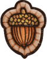
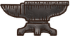
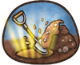
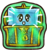
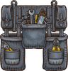
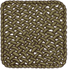

**特别**是一种特殊稀有度，通常是[子职业](pages/%E5%AD%90%E8%81%8C%E4%B8%9A.html)物品、[技能](pages/%E6%8A%80%E8%83%BD.html)和宝藏物品。目前一共有119个特别物品。

|  | **名称** | **效果** | **职业** | **稀有度** | **价格** |
| --- | --- | --- | --- | --- | --- |
|  | [王牌橡子](pages/%E7%8E%8B%E7%89%8C%E6%A9%A1%E5%AD%90.html) | * [橡子颈圈](pages/%E6%A9%A1%E5%AD%90%E9%A2%88%E5%9C%88.html)，[白色百合花项圈](pages/%E7%99%BD%E8%89%B2%E7%99%BE%E5%90%88%E8%8A%B1%E9%A1%B9%E5%9C%88.html)，[红色兰花项圈](pages/%E7%BA%A2%E8%89%B2%E5%85%B0%E8%8A%B1%E9%A1%B9%E5%9C%88.html)，[蓝色鼠尾草花项圈](pages/%E8%93%9D%E8%89%B2%E9%BC%A0%E5%B0%BE%E8%8D%89%E8%8A%B1%E9%A1%B9%E5%9C%88.html)获得更多槽位。 * 这些项圈的物品[耐力](pages/%E8%80%90%E5%8A%9B.html)消耗-10%。 * [暴击法杖](pages/%E6%9A%B4%E5%87%BB%E6%B3%95%E6%9D%96.html)耐力消耗-75%。 |  [游侠](pages/%E6%B8%B8%E4%BE%A0.html) | [特别](pages/%E7%8B%AC%E7%89%B9.html) | 5 |
|  | [铁砧](pages/%E9%93%81%E7%A0%A7.html) | * **打造物品时：**生成一团[火焰](pages/%E7%81%AB%E7%84%B0.html)。 * 每有1个的打造物品，的[武器](pages/%E6%AD%A6%E5%99%A8.html)伤害+1且[耐力](pages/%E8%80%90%E5%8A%9B.html)消耗减少5%。 |  [狂战士](pages/%E7%8B%82%E6%88%98%E5%A3%AB.html) | [特别](pages/%E7%8B%AC%E7%89%B9.html) | 10 |
|  | [魔法视觉](pages/%E9%AD%94%E6%B3%95%E8%A7%86%E8%A7%89.html) | * **购买[魔法卷轴](pages/%E9%AD%94%E6%B3%95%E5%8D%B7%E8%BD%B4.html)：**商店有50%的几率再刷新一本魔法卷轴。 * **购买[魔法书](pages/%E9%AD%94%E6%B3%95%E4%B9%A6.html)：**商店有50%的几率再刷新一本魔法书。 * 的物品触发速度快30%。 |  [魔法师](pages/%E9%AD%94%E6%B3%95%E5%B8%88.html) | [特别](pages/%E7%8B%AC%E7%89%B9.html) | 5 |
|  | [遗迹石：寒冷](pages/%E9%81%97%E8%BF%B9%E7%9F%B3%EF%BC%9A%E5%AF%92%E5%86%B7.html) | * 每场战斗只能投掷一次。 * **击中对手时：**施加3层。 * **的[武器](pages/%E6%AD%A6%E5%99%A8.html)击中对手：**施加1层。 |  [通用](pages/%E9%80%9A%E7%94%A8.html) | [特别](pages/%E7%8B%AC%E7%89%B9.html) | 10 |
|  | [遗迹石：死亡](pages/%E9%81%97%E8%BF%B9%E7%9F%B3%EF%BC%9A%E6%AD%BB%E4%BA%A1.html) | * 每场战斗只能投掷一次。 * **击中对手：**造成[疲惫](pages/%E7%96%B2%E6%83%AB.html)伤害。 * 对手每有一级疲惫效果，的物品+8%暴击几率。 |  [通用](pages/%E9%80%9A%E7%94%A8.html) | [特别](pages/%E7%8B%AC%E7%89%B9.html) | 8 |
|  | [遗迹石：火焰](pages/%E9%81%97%E8%BF%B9%E7%9F%B3%EF%BC%9A%E7%81%AB%E7%84%B0.html) | * 每场战斗只能投掷一次。 * **击中对手时：**获得3层。 * **达到10层：**的武器获得+8点伤害加成。 |  [通用](pages/%E9%80%9A%E7%94%A8.html) | [特别](pages/%E7%8B%AC%E7%89%B9.html) | 9 |
|  | [给予之袋](pages/%E7%BB%99%E4%BA%88%E4%B9%8B%E8%A2%8B.html) | * 增加6格背包槽位。 * 所有职业的物品将在商店出售。 * **进入商店时：**花费全部来生成一个随机物品。 * **背包内职业物品激活时：**获得0.1点最大[耐力](pages/%E8%80%90%E5%8A%9B.html)。 |  [冒险家](pages/%E5%86%92%E9%99%A9%E5%AE%B6.html) | [特别](pages/%E7%8B%AC%E7%89%B9.html) | 16 |
|  | [背包盛宴](pages/%E8%83%8C%E5%8C%85%E7%9B%9B%E5%AE%B4.html) | * [腰包](pages/%E8%85%B0%E5%8C%85.html)触发速度+5%。 * [耐力包](pages/%E8%80%90%E5%8A%9B%E5%8C%85.html)获得5%基础[耐力](pages/%E8%80%90%E5%8A%9B.html)恢复。 * [魔药腰带](pages/%E9%AD%94%E8%8D%AF%E8%85%B0%E5%B8%A6.html)当背包内[魔药](pages/%E9%AD%94%E8%8D%AF.html)被消耗时，获得2层[增益效果](pages/%E5%A2%9E%E7%9B%8A%E6%95%88%E6%9E%9C.html)。 * [守护钱包](pages/%E5%AE%88%E6%8A%A4%E9%92%B1%E5%8C%85.html)获得+15点。 |  [通用](pages/%E9%80%9A%E7%94%A8.html) | [特别](pages/%E7%8B%AC%E7%89%B9.html) | 5 |
|  | [一碗零食](pages/%E4%B8%80%E7%A2%97%E9%9B%B6%E9%A3%9F.html) | * **每4s：**获得2层随机[增益效果](pages/%E5%A2%9E%E7%9B%8A%E6%95%88%E6%9E%9C.html)，且的食物触发快25%（最高100%）。 * 你所有的宠物有20%的几率激活两次。 * [森林之友](pages/%E6%A3%AE%E6%9E%97%E4%B9%8B%E5%8F%8B.html)会在商店出现。 |  [游侠](pages/%E6%B8%B8%E4%BE%A0.html) | [特别](pages/%E7%8B%AC%E7%89%B9.html) | 10 |
|  | [血腥镰刀](pages/%E8%A1%80%E8%85%A5%E9%95%B0%E5%88%80.html) | * 的物品给予+100%。 * 每有一层攻击触发快5%。 |  [通用](pages/%E9%80%9A%E7%94%A8.html) | [特别](pages/%E7%8B%AC%E7%89%B9.html) | 7 |
|  | [鲜血支配](pages/%E9%B2%9C%E8%A1%80%E6%94%AF%E9%85%8D.html) | * 以生命值恢复量的15%作为伤害。 * **每4s：**获得1层。 * 每有一个的物品，效果触发快20%。 |  [通用](pages/%E9%80%9A%E7%94%A8.html) | [特别](pages/%E7%8B%AC%E7%89%B9.html) | 5 |
|  | [铜指虎](pages/%E9%93%9C%E6%8C%87%E8%99%8E.html) | * **击中对手时：**有50%的几率[眩晕](pages/%E7%9C%A9%E6%99%95.html)对手0.3s，[铜指虎](pages/%E9%93%9C%E6%8C%87%E8%99%8E.html)和的伤害类物品都会获得5%[命中率](pages/%E5%91%BD%E4%B8%AD%E7%8E%87.html)加成和5%[暴击](pages/%E6%9A%B4%E5%87%BB.html)率加成。 * **[狂战士之怒](pages/%E7%8B%82%E6%88%98%E5%A3%AB%E4%B9%8B%E6%80%92.html)期间：**效果触发快50%。 |  [狂战士](pages/%E7%8B%82%E6%88%98%E5%A3%AB.html) | [特别](pages/%E7%8B%AC%E7%89%B9.html) | 10 |
|  | [燃烧旗帜](pages/%E7%87%83%E7%83%A7%E6%97%97%E5%B8%9C.html) | * 有25%的几率阻止你的[增益效果](pages/%E5%A2%9E%E7%9B%8A%E6%95%88%E6%9E%9C.html)和对手的[减益效果](pages/%E5%87%8F%E7%9B%8A%E6%95%88%E6%9E%9C.html)被[净化](pages/%E5%87%80%E5%8C%96.html)。 * **的物品激活时：**有80%的几率向对手施加1层，持续5s。 * **每3.8s：**[净化](pages/%E5%87%80%E5%8C%96.html)对手2层[增益效果](pages/%E5%A2%9E%E7%9B%8A%E6%95%88%E6%9E%9C.html)并获得2层。 |  [火焰魔导士](pages/%E7%81%AB%E7%84%B0%E9%AD%94%E5%AF%BC%E5%A3%AB.html) | [特别](pages/%E7%8B%AC%E7%89%B9.html) | 10 |
|  | [神圣特卖](pages/%E7%A5%9E%E5%9C%A3%E7%89%B9%E5%8D%96.html) | * 物品增加20%打折几率。 * [油灯](pages/%E6%B2%B9%E7%81%AF.html)和[阿拉丁神灯](pages/%E9%98%BF%E6%8B%89%E4%B8%81%E7%A5%9E%E7%81%AF.html)获得属性。 * 的物品触发快40%。 |  [通用](pages/%E9%80%9A%E7%94%A8.html) | [特别](pages/%E7%8B%AC%E7%89%B9.html) | 5 |
|  | [大煮锅](pages/%E5%A4%A7%E7%85%AE%E9%94%85.html) | * **进入商店时：**升级一个相邻的魔药。 * **每2.7s：**[恢复](pages/%E6%81%A2%E5%A4%8D.html)20点生命值，或获得6点，或获得5层。 * 每有一个的食物或魔药，效果触发快15%。 |  [收割者](pages/%E6%94%B6%E5%89%B2%E8%80%85.html) | [特别](pages/%E7%8B%AC%E7%89%B9.html) | 10 |
|  | [克总之颅](pages/%E5%85%8B%E6%80%BB%E4%B9%8B%E9%A2%85.html) | * **每2.7s：**造成带有100%生命偷取效果的10点伤害，并触发一个随机的食物效果。 * 的食物获得属性。 * 每有一个的物品，克总之颅触发快15%。 |  [通用](pages/%E9%80%9A%E7%94%A8.html) | [特别](pages/%E7%8B%AC%E7%89%B9.html) | 8 |
|  | [方块黏黏](pages/%E6%96%B9%E5%9D%97%E9%BB%8F%E9%BB%8F.html) | * **的物品激活时：**将有65%的几率获得1层。 * **的物品激活时：**将有65%的几率消耗1层来获得1层。 |  [通用](pages/%E9%80%9A%E7%94%A8.html) | [特别](pages/%E7%8B%AC%E7%89%B9.html) | 8 |
|  | [诅咒匕首](pages/%E8%AF%85%E5%92%92%E5%8C%95%E9%A6%96.html) | * **[眩晕](pages/%E7%9C%A9%E6%99%95.html)对手：**触发额外攻击。 * **击中对手时：**向对手施加2层随机减益效果。 * 对手每有一层减益效果，此物品和的物品获得+1%准确加成和+1%[暴击](pages/%E6%9A%B4%E5%87%BB.html)率加成。 |  [收割者](pages/%E6%94%B6%E5%89%B2%E8%80%85.html) | [特别](pages/%E7%8B%AC%E7%89%B9.html) | 10 |
|  | [舞龙](pages/%E8%88%9E%E9%BE%99.html) | * 每层将获得+0.5点伤害加成。 * 每有一点将获得2%的几率抵挡减益效果。 * **战斗开始时：**每个的物品将获得2层和2点。 |  [通用](pages/%E9%80%9A%E7%94%A8.html) | [特别](pages/%E7%8B%AC%E7%89%B9.html) | 9 |
|  | [黯淡提灯](pages/%E9%BB%AF%E6%B7%A1%E6%8F%90%E7%81%AF.html) | * **战斗开始时：**失去50%生命值。 * **被打败时：**以50%的生命值[复活](pages/%E5%A4%8D%E6%B4%BB.html)，并在1.3s内[无敌](pages/%E6%97%A0%E6%95%8C.html)。 * **[复活](pages/%E5%A4%8D%E6%B4%BB.html)时：**每有1个的物品造成5点伤害，每有1个的物品向对手施加7层[减益效果](pages/%E5%87%8F%E7%9B%8A%E6%95%88%E6%9E%9C.html)。 |  [火焰魔导士](pages/%E7%81%AB%E7%84%B0%E9%AD%94%E5%AF%BC%E5%A3%AB.html) | [特别](pages/%E7%8B%AC%E7%89%B9.html) | 10 |
|  | [黑暗仪式](pages/%E9%BB%91%E6%9A%97%E4%BB%AA%E5%BC%8F.html) | * **17s后：**向对手施加20层[减益效果](pages/%E5%87%8F%E7%9B%8A%E6%95%88%E6%9E%9C.html)，获得10层。 * 每有1个的物品，黑暗仪式的触发快20%。 |  [收割者](pages/%E6%94%B6%E5%89%B2%E8%80%85.html) | [特别](pages/%E7%8B%AC%E7%89%B9.html) | 5 |
|  | [鹿木守护](pages/%E9%B9%BF%E6%9C%A8%E5%AE%88%E6%8A%A4.html) | * 受到的伤害减少15%。 * 每有一个的物品，[狂战士之怒](pages/%E7%8B%82%E6%88%98%E5%A3%AB%E4%B9%8B%E6%80%92.html)持续时间加长0.8s。 * **[狂战士之怒](pages/%E7%8B%82%E6%88%98%E5%A3%AB%E4%B9%8B%E6%80%92.html)期间每1s：**[恢复](pages/%E6%81%A2%E5%A4%8D.html)8点生命值并获得3点。 |  [狂战士](pages/%E7%8B%82%E6%88%98%E5%A3%AB.html) | [特别](pages/%E7%8B%AC%E7%89%B9.html) | 10 |
|  | [挖呀挖](pages/%E6%8C%96%E5%91%80%E6%8C%96.html) | * **需要**[铲铲](pages/%E9%93%B2%E9%93%B2.html)。 * [铲铲](pages/%E9%93%B2%E9%93%B2.html)会挖出更有价值的物品。 * **战斗开始时：**向对手施加2层。 |  [通用](pages/%E9%80%9A%E7%94%A8.html) | [特别](pages/%E7%8B%AC%E7%89%B9.html) | 5 |
|  | [双重彩虹](pages/%E5%8F%8C%E9%87%8D%E5%BD%A9%E8%99%B9.html) | * 有20%的几率复制从物品处获得的增益效果。 * **每6s：**获得一层随机[增益效果](pages/%E5%A2%9E%E7%9B%8A%E6%95%88%E6%9E%9C.html)。 * 每有一个的物品，双重彩虹的触发速度快30%。 |  [通用](pages/%E9%80%9A%E7%94%A8.html) | [特别](pages/%E7%8B%AC%E7%89%B9.html) | 5 |
|  | [龙的巢穴](pages/%E9%BE%99%E7%9A%84%E5%B7%A2%E7%A9%B4.html) | * **战斗开始时：**获得4点，4层，4点，还有4层。 * **的[龙](pages/%E9%BE%99.html)攻击时：**[恢复](pages/%E6%81%A2%E5%A4%8D.html)7点生命值。 * 的龙蛋只需1回合即可孵化。 * 商店会出售更多的龙蛋。 |  [火焰魔导士](pages/%E7%81%AB%E7%84%B0%E9%AD%94%E5%AF%BC%E5%A3%AB.html) | [特别](pages/%E7%8B%AC%E7%89%B9.html) | 10 |
|  | [龙骑士](pages/%E9%BE%99%E9%AA%91%E5%A3%AB.html) | * **[狂战士之怒](pages/%E7%8B%82%E6%88%98%E5%A3%AB%E4%B9%8B%E6%80%92.html)期间每过1s**获得1层。 * **如果你有[龙鳞护甲](pages/%E9%BE%99%E9%B3%9E%E6%8A%A4%E7%94%B2.html)，[龙鳞靴](pages/%E9%BE%99%E9%B3%9E%E9%9D%B4.html)，[龙爪](pages/%E9%BE%99%E7%88%AA.html)：**每有一层，生命值偷取效果+2%（最高叠到20%）。 |  [狂战士](pages/%E7%8B%82%E6%88%98%E5%A3%AB.html) | [特别](pages/%E7%8B%AC%E7%89%B9.html) | 5 |
|  | [双持武器](pages/%E5%8F%8C%E6%8C%81%E6%AD%A6%E5%99%A8.html) | 如果你正好拥有两把消耗[耐力](pages/%E8%80%90%E5%8A%9B.html)的武器，两把武器的攻击速度都加快20%且耐力消耗-30%。 |  [冒险家](pages/%E5%86%92%E9%99%A9%E5%AE%B6.html) | [特别](pages/%E7%8B%AC%E7%89%B9.html) | 5 |
|  | [旅行包](pages/%E6%97%85%E8%A1%8C%E5%8C%85.html) | * 增加6格背包槽位。 * **当生命值低于50%时：**进入[狂战士之怒](pages/%E7%8B%82%E6%88%98%E5%A3%AB%E4%B9%8B%E6%80%92.html)，持续5s（单次触发）。 * **[狂战士之怒](pages/%E7%8B%82%E6%88%98%E5%A3%AB%E4%B9%8B%E6%80%92.html)期间：**包内物品触发快35%。你受到的伤害减少25%。 |  [狂战士](pages/%E7%8B%82%E6%88%98%E5%A3%AB.html) | [特别](pages/%E7%8B%AC%E7%89%B9.html) | 16 |
|  | [回响战嚎](pages/%E5%9B%9E%E5%93%8D%E6%88%98%E5%9A%8E.html) | * **每14s：**触发一个随机物品的**战斗开始时**效果（每个物品最多触发一次）。 * 每有一个的带有**战斗开始时**效果的物品，回响战嚎的触发速度快50%。 |  [通用](pages/%E9%80%9A%E7%94%A8.html) | [特别](pages/%E7%8B%AC%E7%89%B9.html) | 5 |
|  | [附魔武器](pages/%E9%99%84%E9%AD%94%E6%AD%A6%E5%99%A8.html) | * 的[武器](pages/%E6%AD%A6%E5%99%A8.html)的攻击效果有20%的几率再次触发。 * **每5.2s：**获得1层你现有层数最少的[增益效果](pages/%E5%A2%9E%E7%9B%8A%E6%95%88%E6%9E%9C.html)。 |  [通用](pages/%E9%80%9A%E7%94%A8.html) | [特别](pages/%E7%8B%AC%E7%89%B9.html) | 5 |
|  | [永燃之火](pages/%E6%B0%B8%E7%87%83%E4%B9%8B%E7%81%AB.html) | * [火焰短剑](pages/%E7%81%AB%E7%84%B0%E7%9F%AD%E5%89%91.html)和[火焰剑](pages/%E7%81%AB%E7%84%B0%E5%89%91.html)的[耐力](pages/%E8%80%90%E5%8A%9B.html)消耗-60%。 * **7s后:**每有一团[火焰](pages/%E7%81%AB%E7%84%B0.html)，获得1层。 |  [火焰魔导士](pages/%E7%81%AB%E7%84%B0%E9%AD%94%E5%AF%BC%E5%A3%AB.html) | [特别](pages/%E7%8B%AC%E7%89%B9.html) | 5 |
|  | [愤怒加倍](pages/%E6%84%A4%E6%80%92%E5%8A%A0%E5%80%8D.html) | **[狂战士之怒](pages/%E7%8B%82%E6%88%98%E5%A3%AB%E4%B9%8B%E6%80%92.html)结束时：**经过3s，再次进入[狂战士之怒](pages/%E7%8B%82%E6%88%98%E5%A3%AB%E4%B9%8B%E6%80%92.html)，持续正常时间的100%（单次触发）。 |  [狂战士](pages/%E7%8B%82%E6%88%98%E5%A3%AB.html) | [特别](pages/%E7%8B%AC%E7%89%B9.html) | 5 |
|  | [亡灵庇护](pages/%E4%BA%A1%E7%81%B5%E5%BA%87%E6%8A%A4.html) | * 物品的最大生命值提升效果+20%。 * **过量治疗时：**过量治疗的生命值增加为最大生命值。 * **每7s：**[恢复](pages/%E6%81%A2%E5%A4%8D.html)10点生命值，且每有一个的物品，生命值恢复+4。 |  [通用](pages/%E9%80%9A%E7%94%A8.html) | [特别](pages/%E7%8B%AC%E7%89%B9.html) | 5 |
|  | [火坑](pages/%E7%81%AB%E5%9D%91.html) | * 增加9格背包槽位。 * **进入商店时：**花费1枚生成一团[火焰](pages/%E7%81%AB%E7%84%B0.html)。 * **战斗开始时：**火坑里每有一个物品，获得5点最大生命值。 |  [火焰魔导士](pages/%E7%81%AB%E7%84%B0%E9%AD%94%E5%AF%BC%E5%A3%AB.html) | [特别](pages/%E7%8B%AC%E7%89%B9.html) | 20 |
|  | [火焰徽章](pages/%E7%81%AB%E7%84%B0%E5%BE%BD%E7%AB%A0.html) | * 可获得[火焰魔导士](pages/%E7%81%AB%E7%84%B0%E9%AD%94%E5%AF%BC%E5%A3%AB.html)物品。 * **进入商店时：**有65%的几率花费1枚来生成一团[火焰](pages/%E7%81%AB%E7%84%B0.html)。 * **开始战斗时：**获得6层。 |  [通用](pages/%E9%80%9A%E7%94%A8.html) | [特别](pages/%E7%8B%AC%E7%89%B9.html) | 5 |
|  | [锻造锤](pages/%E9%94%BB%E9%80%A0%E9%94%A4.html) | 每有1层造成+1额外伤害。 |  [狂战士](pages/%E7%8B%82%E6%88%98%E5%A3%AB.html) | [特别](pages/%E7%8B%AC%E7%89%B9.html) | 3 |
|  | [财富之吻](pages/%E8%B4%A2%E5%AF%8C%E4%B9%8B%E5%90%BB.html) | * 基于几率触发的的物品获得30%触发[几率](pages/%E5%87%A0%E7%8E%87.html)加成。 * **每4s：**获得1点。如果你至少有5点，则随机获得一层其他[增益效果](pages/%E5%A2%9E%E7%9B%8A%E6%95%88%E6%9E%9C.html)。 |  [通用](pages/%E9%80%9A%E7%94%A8.html) | [特别](pages/%E7%8B%AC%E7%89%B9.html) | 5 |
|  | [快乐小火](pages/%E5%BF%AB%E4%B9%90%E5%B0%8F%E7%81%AB.html) | * **每2.9s：**消耗1点来获得2层。 * 每有一个的物品，效果触发快10%。 * **层数达到20时：**获得5点。 * **层数达到40时：**获得15层。 * **层数达到60时：**造成100点伤害。 |  [火焰魔导士](pages/%E7%81%AB%E7%84%B0%E9%AD%94%E5%AF%BC%E5%A3%AB.html) | [特别](pages/%E7%8B%AC%E7%89%B9.html) | 10 |
|  | [永冻之火](pages/%E6%B0%B8%E5%86%BB%E4%B9%8B%E7%81%AB.html) | * **战斗开始时：**每有一个的物品获得25点。 * **每获得6点：**向对手施加2层。 * 对手每有一层，的物品获得+1.5%暴击几率和+2%暴击伤害。 * 商店会出售更多的物品。 |  [火焰魔导士](pages/%E7%81%AB%E7%84%B0%E9%AD%94%E5%AF%BC%E5%A3%AB.html) | [特别](pages/%E7%8B%AC%E7%89%B9.html) | 10 |
|  | [全身防护](pages/%E5%85%A8%E8%BA%AB%E9%98%B2%E6%8A%A4.html) | * 的物品提供的+35%。 * **如果你刚好有一个[护甲](pages/%E6%8A%A4%E7%94%B2.html)，[头盔](pages/%E5%A4%B4%E7%9B%94.html)和[鞋子](pages/%E9%9E%8B%E5%AD%90.html)：**减少8点受到的  伤害。 * **每5s：**获得10层。 |  [通用](pages/%E9%80%9A%E7%94%A8.html) | [特别](pages/%E7%8B%AC%E7%89%B9.html) | 5 |
|  | [姜饼杰瑞](pages/%E5%A7%9C%E9%A5%BC%E6%9D%B0%E7%91%9E.html) | * **战斗开始时：**获得40最大生命值。 * **每3s：**消耗1点，1层还有1点，获得1层，3层还有20点最大生命值。 |  [通用](pages/%E9%80%9A%E7%94%A8.html) | [特别](pages/%E7%8B%AC%E7%89%B9.html) | 8 |
|  | [怪力少女](pages/%E6%80%AA%E5%8A%9B%E5%B0%91%E5%A5%B3.html) | * **每7s：**获得2层或2层，取决于已拥有的哪种增益效果较少。 * 每有一个的不重复的职业物品，触发速度快25%。 |  [通用](pages/%E9%80%9A%E7%94%A8.html) | [特别](pages/%E7%8B%AC%E7%89%B9.html) | 5 |
|  | [开心炸弹](pages/%E5%BC%80%E5%BF%83%E7%82%B8%E5%BC%B9.html) | * **12s后：**消耗你所有的[增益效果](pages/%E5%A2%9E%E7%9B%8A%E6%95%88%E6%9E%9C.html)，你的对手每消耗一个增益效果就会多受到+4%的伤害。造成30点伤害。 |  [通用](pages/%E9%80%9A%E7%94%A8.html) | [特别](pages/%E7%8B%AC%E7%89%B9.html) | 7 |
|  | [硬木](pages/%E7%A1%AC%E6%9C%A8.html) | * 的[普通](pages/%E6%99%AE%E9%80%9A.html) 武器造成的伤害+150%。 * **战斗开始时：**每有一个的[普通](pages/%E6%99%AE%E9%80%9A.html)物品，获得20点。 |  [通用](pages/%E9%80%9A%E7%94%A8.html) | [特别](pages/%E7%8B%AC%E7%89%B9.html) | 5 |
|  | [哈洛德，仇恨之帽](pages/%E5%93%88%E6%B4%9B%E5%BE%B7%EF%BC%8C%E4%BB%87%E6%81%A8%E4%B9%8B%E5%B8%BD.html) | * **每3s：**获得5层随机[增益效果](pages/%E5%A2%9E%E7%9B%8A%E6%95%88%E6%9E%9C.html)，对手获得5层随机[增益效果](pages/%E5%A2%9E%E7%9B%8A%E6%95%88%E6%9E%9C.html)。 * **每次对手有[增益效果](pages/%E5%A2%9E%E7%9B%8A%E6%95%88%E6%9E%9C.html)被移除：**的物品获得4%[暴击](pages/%E6%9A%B4%E5%87%BB.html)几率加成。 * **每次对自己施加减益效果：**有75%的几率获得1层。 * 向对手造成生命值恢复量的15%伤害（每有一个的物品，再+5%）。 |  [魔法师](pages/%E9%AD%94%E6%B3%95%E5%B8%88.html) | [特别](pages/%E7%8B%AC%E7%89%B9.html) | 10 |
|  | [卡牌之心](pages/%E5%8D%A1%E7%89%8C%E4%B9%8B%E5%BF%83.html) | * **需要：**牌堆 * **卡牌被翻开：**获得3层。如果卡牌在卡链中的位置处于3或者更高，还会获得4点。 |  [收割者](pages/%E6%94%B6%E5%89%B2%E8%80%85.html) | [特别](pages/%E7%8B%AC%E7%89%B9.html) | 5 |
|  | [开怀畅饮](pages/%E5%BC%80%E6%80%80%E7%95%85%E9%A5%AE.html) | * **每10s：**触发一个随机[魔药](pages/%E9%AD%94%E8%8D%AF.html)的效果。 * 每有一个的不重复的[魔药](pages/%E9%AD%94%E8%8D%AF.html)，触发速度快80%。 |  [通用](pages/%E9%80%9A%E7%94%A8.html) | [特别](pages/%E7%8B%AC%E7%89%B9.html) | 5 |
|  | [投资机会](pages/%E6%8A%95%E8%B5%84%E6%9C%BA%E4%BC%9A.html) | * **进入商场时：**获得1枚。 * **的物品消耗[增益效果](pages/%E5%A2%9E%E7%9B%8A%E6%95%88%E6%9E%9C.html)时：**获得4点最大生命值。 |  [通用](pages/%E9%80%9A%E7%94%A8.html) | [特别](pages/%E7%8B%AC%E7%89%B9.html) | 5 |
|  | [黏黏派对](pages/%E9%BB%8F%E9%BB%8F%E6%B4%BE%E5%AF%B9.html) | * [黏宝宝](pages/%E9%BB%8F%E5%AE%9D%E5%AE%9D.html)将在商店出售。 * **购买此物品时：**生成一个黏宝宝。 * **每1.7s：**黏黏和黏宝宝的效果触发激活计数器加1 |  [通用](pages/%E9%80%9A%E7%94%A8.html) | [特别](pages/%E7%8B%AC%E7%89%B9.html) | 5 |
|  | [纯粹加成](pages/%E7%BA%AF%E7%B2%B9%E5%8A%A0%E6%88%90.html) | **战斗开始时：**获得10%最大生命值，10%基础[耐力](pages/%E8%80%90%E5%8A%9B.html)恢复。 |  [通用](pages/%E9%80%9A%E7%94%A8.html) | [特别](pages/%E7%8B%AC%E7%89%B9.html) | 5 |
|  | [刀刀见血](pages/%E5%88%80%E5%88%80%E8%A7%81%E8%A1%80.html) | * [匕首](pages/%E5%8C%95%E9%A6%96.html)武器攻击速度快40%。 * **12s后：**你的[武器](pages/%E6%AD%A6%E5%99%A8.html)造成的伤害+50%。 * 每有一个的[匕首](pages/%E5%8C%95%E9%A6%96.html)，[刀刀见血](pages/%E5%88%80%E5%88%80%E8%A7%81%E8%A1%80.html)的效果触发快40%。 |  [通用](pages/%E9%80%9A%E7%94%A8.html) | [特别](pages/%E7%8B%AC%E7%89%B9.html) | 5 |
|  | [绿叶徽章](pages/%E7%BB%BF%E5%8F%B6%E5%BE%BD%E7%AB%A0.html) | * 可获得[游侠](pages/%E6%B8%B8%E4%BE%A0.html)物品。 * 每有1点，的物品获得2%暴击加成。 * **每2.2s：**获得1点。 |  [通用](pages/%E9%80%9A%E7%94%A8.html) | [特别](pages/%E7%8B%AC%E7%89%B9.html) | 5 |
|  | [升级](pages/%E5%8D%87%E7%BA%A7.html) | * **每5s：**获得10点最大生命值，1点[耐力](pages/%E8%80%90%E5%8A%9B.html)，还有1点和1点。 * 在第3回合后的每回合触发速度都会快10%。 |  [冒险家](pages/%E5%86%92%E9%99%A9%E5%AE%B6.html) | [特别](pages/%E7%8B%AC%E7%89%B9.html) | 5 |
|  | [小板栗](pages/%E5%B0%8F%E6%9D%BF%E6%A0%97.html) | * **商店刷新时：**有30%的几率出现[交易](pages/%E4%BA%A4%E6%98%93.html)机会。 * **每6s：**获得3层你现有最多层数的增益效果。 * 根据的物品价值，每效果触发快1%。 |  [通用](pages/%E9%80%9A%E7%94%A8.html) | [特别](pages/%E7%8B%AC%E7%89%B9.html) | 6 |
|  | [魔法徽章](pages/%E9%AD%94%E6%B3%95%E5%BE%BD%E7%AB%A0.html) | * 可获得[魔法师](pages/%E9%AD%94%E6%B3%95%E5%B8%88.html)物品。 * **战斗开始时：**获得5点。 * 的物品有30%的几率复制获得的。 |  [通用](pages/%E9%80%9A%E7%94%A8.html) | [特别](pages/%E7%8B%AC%E7%89%B9.html) | 5 |
|  | [魔法大师](pages/%E9%AD%94%E6%B3%95%E5%A4%A7%E5%B8%88.html) | * [魔法球](pages/%E9%AD%94%E6%B3%95%E7%90%83.html)获得20层增益效果。 * **每4.5s：**获得3点。 * 每有一个的物品，魔法大师的效果触发快20%。 |  [通用](pages/%E9%80%9A%E7%94%A8.html) | [特别](pages/%E7%8B%AC%E7%89%B9.html) | 5 |
|  | [女射手](pages/%E5%A5%B3%E5%B0%84%E6%89%8B.html) | 的 [武器](pages/%E6%AD%A6%E5%99%A8.html)造成的伤害+20%，攻击速度+35%，且命中率+15%。 |  [游侠](pages/%E6%B8%B8%E4%BE%A0.html) | [特别](pages/%E7%8B%AC%E7%89%B9.html) | 5 |
|  | [巨大四叶草](pages/%E5%B7%A8%E5%A4%A7%E5%9B%9B%E5%8F%B6%E8%8D%89.html) | * **进入商店时:** 生成两个[幸运四叶草](pages/%E5%B9%B8%E8%BF%90%E5%9B%9B%E5%8F%B6%E8%8D%89.html) * 打折几率+5% * 找到物品的几率+20%. * **点数达到15时：** 获得22层其他[增益效果](pages/%E5%A2%9E%E7%9B%8A%E6%95%88%E6%9E%9C.html)。 |  [游侠](pages/%E6%B8%B8%E4%BE%A0.html) | [特别](pages/%E7%8B%AC%E7%89%B9.html) | 10 |
|  | [水银元素](pages/%E6%B0%B4%E9%93%B6%E5%85%83%E7%B4%A0.html) | * **造成/伤害时：**获得造成伤害的45%作为。 * **每5s：**每有一个不重复的的武器，恢复1点[耐力](pages/%E8%80%90%E5%8A%9B.html)。 * **每次消耗1点耐力：**向对手施加2层，还对自身施加2层。 |  [冒险家](pages/%E5%86%92%E9%99%A9%E5%AE%B6.html) | [特别](pages/%E7%8B%AC%E7%89%B9.html) | 10 |
|  | [更多加成](pages/%E6%9B%B4%E5%A4%9A%E5%8A%A0%E6%88%90.html) | * **战斗开始时：**获得10%最大生命值。你的武器造成的伤害+5%。 * 在第10回合必然出现。 |  [通用](pages/%E9%80%9A%E7%94%A8.html) | [特别](pages/%E7%8B%AC%E7%89%B9.html) | 5 |
|  | [抱抱先生](pages/%E6%8A%B1%E6%8A%B1%E5%85%88%E7%94%9F.html) | * **每3s：**向对手造成[疲惫](pages/%E7%96%B2%E6%83%AB.html)伤害。 * **获得[减益效果](pages/%E5%87%8F%E7%9B%8A%E6%95%88%E6%9E%9C.html)时：**有25%的几率向对手施加同样的效果。 * **生命值低于50%时：**的物品8s内触发快100%。 * 填充玩具现在将在商店中出售。 |  [收割者](pages/%E6%94%B6%E5%89%B2%E8%80%85.html) | [特别](pages/%E7%8B%AC%E7%89%B9.html) | 10 |
|  | [蘑菇农场](pages/%E8%98%91%E8%8F%87%E5%86%9C%E5%9C%BA.html) | * **进入商店时：**如果你至少有2个蘑菇，则会生成一个[致幻蘑菇](pages/%E8%87%B4%E5%B9%BB%E8%98%91%E8%8F%87.html)。 * **战斗开始时：**的蘑菇触发速度快50%。 |  [收割者](pages/%E6%94%B6%E5%89%B2%E8%80%85.html) | [特别](pages/%E7%8B%AC%E7%89%B9.html) | 5 |
|  | [吸血鬼梳子](pages/%E5%90%B8%E8%A1%80%E9%AC%BC%E6%A2%B3%E5%AD%90.html) | * **战斗开始时：**获得6层。 * 的武器将会偷取25%生命值（每有一个的物品，效果增强8%）。 * 生命[恢复](pages/%E6%81%A2%E5%A4%8D.html)效果增强30%。 |  [收割者](pages/%E6%94%B6%E5%89%B2%E8%80%85.html) | [特别](pages/%E7%8B%AC%E7%89%B9.html) | 10 |
|  | [别着急](pages/%E5%88%AB%E7%9D%80%E6%80%A5.html) | **战斗开始时：**两名玩家受到的伤害-35%，持续10s。向对手施加4层。 |  [通用](pages/%E9%80%9A%E7%94%A8.html) | [特别](pages/%E7%8B%AC%E7%89%B9.html) | 5 |
|  | [献祭之碗](pages/%E7%8C%AE%E7%A5%AD%E4%B9%8B%E7%A2%97.html) | * 增加4格背包槽位。 * **战斗开始时：**获得1层。 **进入商店时：**献祭碗内所有物品。生成一团[火焰](pages/%E7%81%AB%E7%84%B0.html)，还会根据献祭物品的总价值生成其他物品。 |  [火焰魔导士](pages/%E7%81%AB%E7%84%B0%E9%AD%94%E5%AF%BC%E5%A3%AB.html) | [特别](pages/%E7%8B%AC%E7%89%B9.html) | 8 |
|  | [穿甲箭](pages/%E7%A9%BF%E7%94%B2%E7%AE%AD.html) | * 的武器暴击伤害+50%，并在暴击时移除对手15点。 * **当的物品激活时：**有40%的几率获得1点。 |  [游侠](pages/%E6%B8%B8%E4%BE%A0.html) | [特别](pages/%E7%8B%AC%E7%89%B9.html) | 10 |
|  | [存钱罐皮纳塔](pages/%E5%AD%98%E9%92%B1%E7%BD%90%E7%9A%AE%E7%BA%B3%E5%A1%94.html) | * 摧毁[存钱罐](pages/%E5%AD%98%E9%92%B1%E7%BD%90.html)会生成物品，而不是金币。 * **进入商店时：**[存钱罐](pages/%E5%AD%98%E9%92%B1%E7%BD%90.html)有30%的几率爆炸。 * 物品获得5%暴击几率。 |  [通用](pages/%E9%80%9A%E7%94%A8.html) | [特别](pages/%E7%8B%AC%E7%89%B9.html) | 5 |
|  | [剧毒常春藤](pages/%E5%89%A7%E6%AF%92%E5%B8%B8%E6%98%A5%E8%97%A4.html) | * 每有一个的物品，就会获得5%的几率[抵抗](pages/%E6%8A%B5%E6%8A%97.html) [减益效果](pages/%E5%87%8F%E7%9B%8A%E6%95%88%E6%9E%9C.html)。 * **获得时：**向对手施加2层。 * **对手拥有至少18层时：**受到的伤害+25%。 |  [游侠](pages/%E6%B8%B8%E4%BE%A0.html) | [特别](pages/%E7%8B%AC%E7%89%B9.html) | 10 |
|  | [啵啵](pages/%E5%95%B5%E5%95%B5.html) | * 每有一点，攻击速度快4%（最高可达60%）。 |  [通用](pages/%E9%80%9A%E7%94%A8.html) | [特别](pages/%E7%8B%AC%E7%89%B9.html) | 6 |
|  | [月亮之力](pages/%E6%9C%88%E4%BA%AE%E4%B9%8B%E5%8A%9B.html) | * [疲惫](pages/%E7%96%B2%E6%83%AB.html)提前5s开始。 * **的[月光护甲](pages/%E6%9C%88%E5%85%89%E6%8A%A4%E7%94%B2.html)激活时：**向对手施加一层。 * **的[月光盾](pages/%E6%9C%88%E5%85%89%E7%9B%BE.html)激活时：**[反弹](pages/%E5%8F%8D%E5%BC%B9.html)一层减益效果。 * **疲惫开始时：**增加65%最大生命值。 |  [通用](pages/%E9%80%9A%E7%94%A8.html) | [特别](pages/%E7%8B%AC%E7%89%B9.html) | 5 |
|  | [圣诞礼物](pages/%E5%9C%A3%E8%AF%9E%E7%A4%BC%E7%89%A9.html) | * **进入商店时：**花费所有来生成更高价值的随机物品。 * **战斗开始时：**获得5层随机[增益效果](pages/%E5%A2%9E%E7%9B%8A%E6%95%88%E6%9E%9C.html)。 |  [通用](pages/%E9%80%9A%E7%94%A8.html) | [特别](pages/%E7%8B%AC%E7%89%B9.html) | 10 |
|  | [南瓜头](pages/%E5%8D%97%E7%93%9C%E5%A4%B4.html) | * **击中对手时：**有50%的几率[眩晕](pages/%E7%9C%A9%E6%99%95.html)对手0.5s。 * **开始[疲惫](pages/%E7%96%B2%E6%83%AB.html)时：**获得10层。 |  [通用](pages/%E9%80%9A%E7%94%A8.html) | [特别](pages/%E7%8B%AC%E7%89%B9.html) | 8 |
|  | [拼图徽章](pages/%E6%8B%BC%E5%9B%BE%E5%BE%BD%E7%AB%A0.html) | * 的物品触发速度慢20%。**5s后：**的物品触发速度快50%。 * **购买背包时：**商店有35%的几率再刷新一个拼图背包。 |  [通用](pages/%E9%80%9A%E7%94%A8.html) | [特别](pages/%E7%8B%AC%E7%89%B9.html) | 5 |
|  | [拼图背包](pages/%E6%8B%BC%E5%9B%BE%E8%83%8C%E5%8C%85.html) | * 增加6格背包槽位。 * 背包内物品触发速度慢20%。**5s后：**包内物品触发速度加快55%。 * **购买背包时：**商店有75%的几率再刷新一个拼图背包。 |  [魔法师](pages/%E9%AD%94%E6%B3%95%E5%B8%88.html) | [特别](pages/%E7%8B%AC%E7%89%B9.html) | 16 |
|  | [彩虹徽章](pages/%E5%BD%A9%E8%99%B9%E5%BE%BD%E7%AB%A0.html) | * 可获得所有职业物品。 * **7s后：**每种[增益效果](pages/%E5%A2%9E%E7%9B%8A%E6%95%88%E6%9E%9C.html)都获得1层。 |  [通用](pages/%E9%80%9A%E7%94%A8.html) | [特别](pages/%E7%8B%AC%E7%89%B9.html) | 5 |
|  | [彩虹魔药](pages/%E5%BD%A9%E8%99%B9%E9%AD%94%E8%8D%AF.html) | * 所有法杖将在商店出售。 * **战斗开始时：**每有一个不重复的的[魔法书](pages/%E9%AD%94%E6%B3%95%E4%B9%A6.html)，获得1点最大[耐力](pages/%E8%80%90%E5%8A%9B.html)和1点。每有一个不重复的的法杖，获得5层随机[增益效果](pages/%E5%A2%9E%E7%9B%8A%E6%95%88%E6%9E%9C.html)。 * **每次消耗20层增益效果：**消耗此魔药并触发2瓶不重复的[魔药](pages/%E9%AD%94%E8%8D%AF.html)效果。 |  [魔法师](pages/%E9%AD%94%E6%B3%95%E5%B8%88.html) | [特别](pages/%E7%8B%AC%E7%89%B9.html) | 10 |
|  | [露营背包](pages/%E9%9C%B2%E8%90%A5%E8%83%8C%E5%8C%85.html) | * 增加6格背包槽位。 * 包内物品获得12%[暴击](pages/%E6%9A%B4%E5%87%BB.html)几率加成，每有一点，包内物品还会获得3%[暴击](pages/%E6%9A%B4%E5%87%BB.html)加成。 |  [游侠](pages/%E6%B8%B8%E4%BE%A0.html) | [特别](pages/%E7%8B%AC%E7%89%B9.html) | 16 |
|  | [遗物箱](pages/%E9%81%97%E7%89%A9%E7%AE%B1.html) | * 增加4背包槽位。 * **每2.8s：**箱内武器造成的伤害+5%，且[耐力](pages/%E8%80%90%E5%8A%9B.html)消耗减少5%。 |  [收割者](pages/%E6%94%B6%E5%89%B2%E8%80%85.html) | [特别](pages/%E7%8B%AC%E7%89%B9.html) | 12 |
|  | [重复触发器](pages/%E9%87%8D%E5%A4%8D%E8%A7%A6%E5%8F%91%E5%99%A8.html) | * **12s后：**再次触发的物品**战斗开始时：**效果。 |  [通用](pages/%E9%80%9A%E7%94%A8.html) | [特别](pages/%E7%8B%AC%E7%89%B9.html) | 8 |
|  | [惊喜袋](pages/%E6%83%8A%E5%96%9C%E8%A2%8B.html) | * **游戏开始时：**变成一个随机背包（或袋子），获得随机起始物品。 |  [通用](pages/%E9%80%9A%E7%94%A8.html) | [特别](pages/%E7%8B%AC%E7%89%B9.html) | 10 |
|  | [天平](pages/%E5%A4%A9%E5%B9%B3.html) | * **商店刷新时:**有40%的几率出现[交易](pages/%E4%BA%A4%E6%98%93.html)机会。 * **每2.8s：**根据你现有最少的项，获得4点或3层。 * 对比和两侧物品。 * 在价值较低侧，每价值一枚，天平触发速度快2%。 * **如果两侧价值差距小于5：**和侧物品触发速度快30%。 |  [冒险家](pages/%E5%86%92%E9%99%A9%E5%AE%B6.html) | [特别](pages/%E7%8B%AC%E7%89%B9.html) | 10 |
|  | [魔法学院袋](pages/%E9%AD%94%E6%B3%95%E5%AD%A6%E9%99%A2%E8%A2%8B.html) | * 增加6格背包槽位。 * **战斗开始时：**获得5点。 * 背包内物品有30%的几率复制获得的。 * 还有50%的几率保护不被移除。 |  [魔法师](pages/%E9%AD%94%E6%B3%95%E5%B8%88.html) | [特别](pages/%E7%8B%AC%E7%89%B9.html) | 16 |
|  | [针线包](pages/%E9%92%88%E7%BA%BF%E5%8C%85.html) | * 增加6格背包槽位。 * **购买[细绳](pages/%E7%BB%86%E7%BB%B3.html)时：**商店有70%几率刷新一个新细绳。 * 背包内的打造物品触发快15%，还有15%的几率复制获得的[增益效果](pages/%E5%A2%9E%E7%9B%8A%E6%95%88%E6%9E%9C.html)。 |  [冒险家](pages/%E5%86%92%E9%99%A9%E5%AE%B6.html) | [特别](pages/%E7%8B%AC%E7%89%B9.html) | 16 |
|  | [萨满面具](pages/%E8%90%A8%E6%BB%A1%E9%9D%A2%E5%85%B7.html) | * 卢恩[符文](pages/%E7%AC%A6%E6%96%87.html)将在商店售出。 * **战斗开始时：**每有1个放入槽位的宝石，获得1点。 * **每3.2s：**消耗2点以获得5层随机[增益效果](pages/%E5%A2%9E%E7%9B%8A%E6%95%88%E6%9E%9C.html)。 |  [狂战士](pages/%E7%8B%82%E6%88%98%E5%A3%AB.html) | [特别](pages/%E7%8B%AC%E7%89%B9.html) | 10 |
|  | [护盾加强](pages/%E6%8A%A4%E7%9B%BE%E5%8A%A0%E5%BC%BA.html) | * 的[护盾](pages/%E6%8A%A4%E7%9B%BE.html)+30%抵挡效果。 * 的[护甲](pages/%E6%8A%A4%E7%94%B2.html)效果触发快60%。 |  [通用](pages/%E9%80%9A%E7%94%A8.html) | [特别](pages/%E7%8B%AC%E7%89%B9.html) | 5 |
|  | [辉耀斗篷](pages/%E8%BE%89%E8%80%80%E6%96%97%E7%AF%B7.html) | * **进入商店时：**消耗的物品来生成随机[宝石](pages/%E5%AE%9D%E7%9F%B3.html)。 * **每5.5s：**消耗3点变为[无敌](pages/%E6%97%A0%E6%95%8C.html)，持续1s，且根据拥有的[宝石](pages/%E5%AE%9D%E7%9F%B3.html)总价值，每价值10枚，无敌时间再+0.2s（最高叠加3次）。增加3点消耗。 * **触发无敌：**向对手施加3层。 |  [魔法师](pages/%E9%AD%94%E6%B3%95%E5%B8%88.html) | [特别](pages/%E7%8B%AC%E7%89%B9.html) | 10 |
|  | [骷髅徽章](pages/%E9%AA%B7%E9%AB%85%E5%BE%BD%E7%AB%A0.html) | * 可获得[收割者](pages/%E6%94%B6%E5%89%B2%E8%80%85.html)物品。 * **每1.5s：**向对手施加1层随机[减益效果](pages/%E5%87%8F%E7%9B%8A%E6%95%88%E6%9E%9C.html)。 |  [通用](pages/%E9%80%9A%E7%94%A8.html) | [特别](pages/%E7%8B%AC%E7%89%B9.html) | 5 |
|  | [大蒜挂壁](pages/%E5%A4%A7%E8%92%9C%E6%8C%82%E5%A3%81.html) | * 的[大蒜](pages/%E5%A4%A7%E8%92%9C.html)获得+5点。 * **的物品每获得13点：**向对手施加1层。 |  [通用](pages/%E9%80%9A%E7%94%A8.html) | [特别](pages/%E7%8B%AC%E7%89%B9.html) | 5 |
|  | [铁匠入门指南](pages/%E9%93%81%E5%8C%A0%E5%85%A5%E9%97%A8%E6%8C%87%E5%8D%97.html) | * **购买此物品时：**生成一个[磨刀石](pages/%E7%A3%A8%E5%88%80%E7%9F%B3.html)。 * 的打造类武器伤害+1，且[耐力](pages/%E8%80%90%E5%8A%9B.html)消耗-25%。 |  [通用](pages/%E9%80%9A%E7%94%A8.html) | [特别](pages/%E7%8B%AC%E7%89%B9.html) | 5 |
|  | [蛇蛇](pages/%E8%9B%87%E8%9B%87.html) | * 每有一点将获得4%的几率阻止对手身上的被[净化](pages/%E5%87%80%E5%8C%96.html)。 * **战斗开始时：**每有一个的宠物，将获得4点和50点最大生命值。 * **每2.2s：**向对手施加2层。 |  [收割者](pages/%E6%94%B6%E5%89%B2%E8%80%85.html) | [特别](pages/%E7%8B%AC%E7%89%B9.html) | 10 |
|  | [雪人蛋糕](pages/%E9%9B%AA%E4%BA%BA%E8%9B%8B%E7%B3%95.html) | * **每2.1s：**向对手施加1层。如果对手至少有10层，增加10%伤害并造成10点伤害。 |  [通用](pages/%E9%80%9A%E7%94%A8.html) | [特别](pages/%E7%8B%AC%E7%89%B9.html) | 6 |
|  | [太阳之力](pages/%E5%A4%AA%E9%98%B3%E4%B9%8B%E5%8A%9B.html) | * 有20%几率复制你获得的层数。 * **的[日耀盾牌](pages/%E6%97%A5%E8%80%80%E7%9B%BE%E7%89%8C.html)抵挡伤害时：**有60%的几率获得1层。 * **的[日耀护甲](pages/%E6%97%A5%E8%80%80%E6%8A%A4%E7%94%B2.html)消耗时：**获得16点。 |  [火焰魔导士](pages/%E7%81%AB%E7%84%B0%E9%AD%94%E5%AF%BC%E5%A3%AB.html) | [特别](pages/%E7%8B%AC%E7%89%B9.html) | 5 |
|  | [火辣香蕉](pages/%E7%81%AB%E8%BE%A3%E9%A6%99%E8%95%89.html) | * **的香蕉激活时：**有75%的几率获得1层。 * **每消耗1点[耐力](pages/%E8%80%90%E5%8A%9B.html)：**[恢复](pages/%E6%81%A2%E5%A4%8D.html)3点生命值。 |  [通用](pages/%E9%80%9A%E7%94%A8.html) | [特别](pages/%E7%8B%AC%E7%89%B9.html) | 5 |
|  | [捕梦网](pages/%E6%8D%95%E6%A2%A6%E7%BD%91.html) | * 你可以拥有无限数量的[幽灵动物伙伴](pages/%E5%B9%BD%E7%81%B5%E5%8A%A8%E7%89%A9%E4%BC%99%E4%BC%B4.html)。 * **战斗开始时：**减少30%受到的伤害，持续2s，且每有一只不重复的的[宠物](pages/%E5%AE%A0%E7%89%A9.html)，持续时间再+1s。 * **8s后：**获得当前[增益](pages/%E5%A2%9E%E7%9B%8A%E6%95%88%E6%9E%9C.html)的30%。 |  [魔法师](pages/%E9%AD%94%E6%B3%95%E5%B8%88.html) | [特别](pages/%E7%8B%AC%E7%89%B9.html) | 10 |
|  | [稳定重组器](pages/%E7%A8%B3%E5%AE%9A%E9%87%8D%E7%BB%84%E5%99%A8.html) | * **进入商店时：**分解的物品。根据分解物品的总价值生成新的物品。 * **每2.5s：**获得1层随机[增益效果](pages/%E5%A2%9E%E7%9B%8A%E6%95%88%E6%9E%9C.html)并[净化](pages/%E5%87%80%E5%8C%96.html)一层[减益效果](pages/%E5%87%8F%E7%9B%8A%E6%95%88%E6%9E%9C.html)。 |  [通用](pages/%E9%80%9A%E7%94%A8.html) | [特别](pages/%E7%8B%AC%E7%89%B9.html) | 6 |
|  | [勇气之星](pages/%E5%8B%87%E6%B0%94%E4%B9%8B%E6%98%9F.html) | * 找到物品的几率+5%。 * 你的武器消耗的[耐力](pages/%E8%80%90%E5%8A%9B.html)-5%。 * **（作为选择随机角色的奖励。）** |  [通用](pages/%E9%80%9A%E7%94%A8.html) | [特别](pages/%E7%8B%AC%E7%89%B9.html) | 1 |
|  | [石头徽章](pages/%E7%9F%B3%E5%A4%B4%E5%BE%BD%E7%AB%A0.html) | * 无法获得职业专属物品（即使石头徽章在储存箱也无法获得）。 * **进入商店时：**生成价值1枚的物品。 * **每3s：**获得4点。 |  [通用](pages/%E9%80%9A%E7%94%A8.html) | [特别](pages/%E7%8B%AC%E7%89%B9.html) | 5 |
|  | [投石手](pages/%E6%8A%95%E7%9F%B3%E6%89%8B.html) | * **当使用[石头](pages/%E7%9F%B3%E5%A4%B4.html)或[巨石像](pages/%E5%B7%A8%E7%9F%B3%E5%83%8F.html)造成伤害时：**获得伤害的65%作为。 * **当你拥有时：**受到的伤害-20%。 |  [通用](pages/%E9%80%9A%E7%94%A8.html) | [特别](pages/%E7%8B%AC%E7%89%B9.html) | 5 |
|  | [储物棺材](pages/%E5%82%A8%E7%89%A9%E6%A3%BA%E6%9D%90.html) | * 增加8格背包槽位。 * **棺材内物品激活时：**将有25%几率施加一层。 |  [收割者](pages/%E6%94%B6%E5%89%B2%E8%80%85.html) | [特别](pages/%E7%8B%AC%E7%89%B9.html) | 20 |
|  | [超大容量](pages/%E8%B6%85%E5%A4%A7%E5%AE%B9%E9%87%8F.html) | * [背包](pages/%E8%83%8C%E5%8C%85.html)类物品在商店内出现的可能性变大，且打折几率+40%。 * 每有一个的空槽位，的物品激活快14%。 |  [通用](pages/%E9%80%9A%E7%94%A8.html) | [特别](pages/%E7%8B%AC%E7%89%B9.html) | 5 |
|  | [尖刺爆发](pages/%E5%B0%96%E5%88%BA%E7%88%86%E5%8F%91.html) | * **每6.5s：**[眩晕](pages/%E7%9C%A9%E6%99%95.html)对手0.3s并获得2层（最高5次）。 * 每有1层，触发快5%。 |  [通用](pages/%E9%80%9A%E7%94%A8.html) | [特别](pages/%E7%8B%AC%E7%89%B9.html) | 5 |
|  | [骷髅蒂姆](pages/%E9%AA%B7%E9%AB%85%E8%92%82%E5%A7%86.html) | 放入武器槽： **击中对手时：**有+50%的几率偷取一个随机[增益效果](pages/%E5%A2%9E%E7%9B%8A%E6%95%88%E6%9E%9C.html)。 放入护甲或其他槽： 有25%的几率抵御暴击或[减益效果](pages/%E5%87%8F%E7%9B%8A%E6%95%88%E6%9E%9C.html)。 放入背包： **对手生命值低于30%时：**[恢复](pages/%E6%81%A2%E5%A4%8D.html)50点生命值，获得5层。 |  [通用](pages/%E9%80%9A%E7%94%A8.html) | [特别](pages/%E7%8B%AC%E7%89%B9.html) | 10 |
|  | [时间扩大器](pages/%E6%97%B6%E9%97%B4%E6%89%A9%E5%A4%A7%E5%99%A8.html) | * 你和对手的武器攻击速度减慢30%。 * **每1s：**冷却最长的物品触发速度快6%。 |  [通用](pages/%E9%80%9A%E7%94%A8.html) | [特别](pages/%E7%8B%AC%E7%89%B9.html) | 8 |
|  | [时间融化](pages/%E6%97%B6%E9%97%B4%E8%9E%8D%E5%8C%96.html) | **战斗开始时：**获得5层。 的物品效果持续时间增加60%。 |  [通用](pages/%E9%80%9A%E7%94%A8.html) | [特别](pages/%E7%8B%AC%E7%89%B9.html) | 5 |
|  | [软呢帽](pages/%E8%BD%AF%E5%91%A2%E5%B8%BD.html) | * 找到物品的几率+65%。 * 你能多携带+3个物品。 * **战斗开始时：**每有一个的物品，获得1点，且每有一个的物品，还会获得3点。 * **每2.3s：**消耗1点来偷取2层其他[增益效果](pages/%E5%A2%9E%E7%9B%8A%E6%95%88%E6%9E%9C.html)。 * 基于几率触发的的物品获得25%触发[几率](pages/%E5%87%A0%E7%8E%87.html)加成。 |  [冒险家](pages/%E5%86%92%E9%99%A9%E5%AE%B6.html) | [特别](pages/%E7%8B%AC%E7%89%B9.html) | 10 |
|  | [乌龟](pages/%E4%B9%8C%E9%BE%9F.html) | * 的盾牌抵挡伤害增加100%。 * **战斗开始时：**两位玩家的伤害同时削减35%，持续7s。 * **每13s：**获得50点，还有你的最大生命值的20%作为。 |  [冒险家](pages/%E5%86%92%E9%99%A9%E5%AE%B6.html) | [特别](pages/%E7%8B%AC%E7%89%B9.html) | 10 |
|  | [细绳徽章](pages/%E7%BB%86%E7%BB%B3%E5%BE%BD%E7%AB%A0.html) | * 可获得[冒险家](pages/%E5%86%92%E9%99%A9%E5%AE%B6.html)物品。 * **购买细绳时：**商店有40%的几率刷新一个新[细绳](pages/%E7%BB%86%E7%BB%B3.html)。 * 的打造物品触发速度快20%，还有20%的几率复制获得的[增益效果](pages/%E5%A2%9E%E7%9B%8A%E6%95%88%E6%9E%9C.html)。 |  [通用](pages/%E9%80%9A%E7%94%A8.html) | [特别](pages/%E7%8B%AC%E7%89%B9.html) | 5 |
|  | [尤克里里](pages/%E5%B0%A4%E5%85%8B%E9%87%8C%E9%87%8C.html) | * **的物品激活时：**随机快进一个非物品冷却时间20%。 * 你的生命[恢复](pages/%E6%81%A2%E5%A4%8D.html)效果加强20%。 * +15%的几率复制获得的[增益效果](pages/%E5%A2%9E%E7%9B%8A%E6%95%88%E6%9E%9C.html)。 **每6s：**[恢复](pages/%E6%81%A2%E5%A4%8D.html)生命值30点，或获得5层随机[增益效果](pages/%E5%A2%9E%E7%9B%8A%E6%95%88%E6%9E%9C.html)，或向对手施加4层。 * 每有一个的物品，触发速度快10%。 |  [冒险家](pages/%E5%86%92%E9%99%A9%E5%AE%B6.html) | [特别](pages/%E7%8B%AC%E7%89%B9.html) | 10 |
|  | [终极升腾](pages/%E7%BB%88%E6%9E%81%E5%8D%87%E8%85%BE.html) | * **10s后：**每有一个…… * 的物品：获得1点和2层。 * 的物品：获得15点，向对手施加1层。 * 的物品：获得3层。 * 的物品：偷取1层增益效果。 * 每有一个的[魔法卷轴](pages/%E9%AD%94%E6%B3%95%E5%8D%B7%E8%BD%B4.html)，此物品触发速度快50%。 |  [魔法师](pages/%E9%AD%94%E6%B3%95%E5%B8%88.html) | [特别](pages/%E7%8B%AC%E7%89%B9.html) | 5 |
|  | [未挖掘潜力](pages/%E6%9C%AA%E6%8C%96%E6%8E%98%E6%BD%9C%E5%8A%9B.html) | * **购买此物品时:**用技能池中一个随机技能替代此物品。 * 在第3回合和第10回合必然出现。 |  [通用](pages/%E9%80%9A%E7%94%A8.html) | [特别](pages/%E7%8B%AC%E7%89%B9.html) | 3 |
|  | [万里挑一](pages/%E4%B8%87%E9%87%8C%E6%8C%91%E4%B8%80.html) | * 的物品触发快20%。每有一个的[特别](pages/%E7%8B%AC%E7%89%B9)物品、[会员卡](pages__%E4%BC%9A%E5%91%98%E5%8D%A1.html)或者[白金会员卡](pages__%E7%99%BD%E9%87%91%E4%BC%9A%E5%91%98%E5%8D%A1.html.html)，触发速度+10%。 * 找到物品的几率+50%。 * 你可持有+2件物品。 |  [通用](pages/%E9%80%9A%E7%94%A8.html) | [特别](pages/%E7%8B%AC%E7%89%B9.html) | 5 |
|  | [不恐怖幽灵](pages/%E4%B8%8D%E6%81%90%E6%80%96%E5%B9%BD%E7%81%B5.html) | * 以你恢复量的30%作为伤害。 * **每3s：**消耗一个随机[增益效果](pages/%E5%A2%9E%E7%9B%8A%E6%95%88%E6%9E%9C.html)来[恢复](pages/%E6%81%A2%E5%A4%8D.html)生命值12点。 |  [通用](pages/%E9%80%9A%E7%94%A8.html) | [特别](pages/%E7%8B%AC%E7%89%B9.html) | 10 |
|  | [工具袋](pages/%E5%B7%A5%E5%85%B7%E8%A2%8B.html) | * 增加8格背包槽位。 * 袋内[武器](pages/%E6%AD%A6%E5%99%A8.html)造成的伤害+30%，但攻击速度变慢30%。 * **5s后：**进入[狂战士之怒](pages/%E7%8B%82%E6%88%98%E5%A3%AB%E4%B9%8B%E6%80%92.html)状态5.5s。 * **[狂战士之怒](pages/%E7%8B%82%E6%88%98%E5%A3%AB%E4%B9%8B%E6%80%92.html)期间：**+35%吸血。 |  [狂战士](pages/%E7%8B%82%E6%88%98%E5%A3%AB.html) | [特别](pages/%E7%8B%AC%E7%89%B9.html) | 18 |
|  | [反派之剑](pages/%E5%8F%8D%E6%B4%BE%E4%B9%8B%E5%89%91.html) | * 的武器伤害-2点。 * 但是每有一个的武器，此武器本身的伤害+4点。 |  [通用](pages/%E9%80%9A%E7%94%A8.html) | [特别](pages/%E7%8B%AC%E7%89%B9.html) | 7 |
|  | [藤条编织篮](pages/%E8%97%A4%E6%9D%A1%E7%BC%96%E7%BB%87%E7%AF%AE.html) | * 增加9背包槽位。 * 你的[恢复](pages/%E6%81%A2%E5%A4%8D.html)效果增强10%（篮子内每有一个物品，获得5%增强）。 * 在第1和第10回合，商店打折几率增加20%。 |  [游侠](pages/%E6%B8%B8%E4%BE%A0.html) | [特别](pages/%E7%8B%AC%E7%89%B9.html) | 20 |
|  | [水元素](pages/%E6%B0%B4%E5%85%83%E7%B4%A0.html) | * **击中对手：**获得2点。每有一个的物品，就有10%的几率再获得2点。 * 每有一个的物品，攻击速度快10%。 * **消耗10点：**击中对手时[恢复](pages/%E6%81%A2%E5%A4%8D.html)10点生命值（单次触发）。 * **消耗20点：**获得15点伤害加成（单次触发）。 * **消耗30点：**击中对手时向对手施加3层（单次触发）。 |  [魔法师](pages/%E9%AD%94%E6%B3%95%E5%B8%88.html) | [特别](pages/%E7%8B%AC%E7%89%B9.html) | 10 |
|  | [狼徽章](pages/%E7%8B%BC%E5%BE%BD%E7%AB%A0.html) | * 可获得[狂战士](pages/%E7%8B%82%E6%88%98%E5%A3%AB.html)物品。 * **当生命值低于50%时：**进入[狂战士之怒](pages/%E7%8B%82%E6%88%98%E5%A3%AB%E4%B9%8B%E6%80%92.html)，持续5秒（单次触发）。 * **[狂战士之怒](pages/%E7%8B%82%E6%88%98%E5%A3%AB%E4%B9%8B%E6%80%92.html)期间：**的物品触发快35%，你受到的伤害减少22%。 |  [通用](pages/%E9%80%9A%E7%94%A8.html) | [特别](pages/%E7%8B%AC%E7%89%B9.html) | 5 |
|  | [狼印记](pages/%E7%8B%BC%E5%8D%B0%E8%AE%B0.html) | * 狼崽同伴将在商店售出。 * 的[武器](pages/%E6%AD%A6%E5%99%A8.html)获得10%的[暴击](pages/%E6%9A%B4%E5%87%BB.html)率加成（每有1个的[宠物](pages/%E5%AE%A0%E7%89%A9.html)，再获得12%的加成）。 * **每2.3s：**如果你至少有10点，就会获得1层，否则获得10点。 |  [狂战士](pages/%E7%8B%82%E6%88%98%E5%A3%AB.html) | [特别](pages/%E7%8B%AC%E7%89%B9.html) | 10 |
|  | [世界树树叶](pages/%E4%B8%96%E7%95%8C%E6%A0%91%E6%A0%91%E5%8F%B6.html) | * **战斗开始时：**每有一个的物品，获得2点和1层。 * **每次消耗5点：**[获得](pages/%E6%81%A2%E5%A4%8D.html)15点生命并[净化](pages/%E5%87%80%E5%8C%96.html)2种随机[减益效果](pages/%E5%87%8F%E7%9B%8A%E6%95%88%E6%9E%9C.html)。 |  [游侠](pages/%E6%B8%B8%E4%BE%A0.html) | [特别](pages/%E7%8B%AC%E7%89%B9.html) | 10 |

| [物品](pages/%E7%89%A9%E5%93%81.html) |
| --- |
| | [配饰](pages/%E9%85%8D%E9%A5%B0.html) | | --- | | [武器](pages/%E6%AD%A6%E5%99%A8.html) | | --- | | [护甲](pages/%E6%8A%A4%E7%94%B2.html) | | --- | | [背包](pages/%E8%83%8C%E5%8C%85.html) | | --- | | [食物](pages/%E9%A3%9F%E7%89%A9.html) | | --- | | [宝石](pages/%E5%AE%9D%E7%9F%B3.html) | | --- | | [手套](pages/%E6%89%8B%E5%A5%97.html) | | --- | | [头盔](pages/%E5%A4%B4%E7%9B%94.html) | | --- | | [宠物](pages/%E5%AE%A0%E7%89%A9.html) | | --- | | [卡牌](pages/%E5%8D%A1%E7%89%8C.html) | | --- | | [魔药](pages/%E9%AD%94%E8%8D%AF.html) | | --- | | [盾牌](pages/%E7%9B%BE%E7%89%8C.html) | | --- | | [鞋子](pages/%E9%9E%8B%E5%AD%90.html) | | --- | | [技能](pages/%E6%8A%80%E8%83%BD.html) | | --- | | [魔法卷轴](pages/%E9%AD%94%E6%B3%95%E5%8D%B7%E8%BD%B4.html) | | --- | | [魔法书](pages/%E9%AD%94%E6%B3%95%E4%B9%A6.html) | | --- | | [棋子](pages/%E6%A3%8B%E5%AD%90.html) | | --- | |
