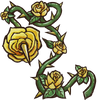
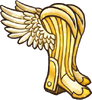

目前一共有83个神级物品。

|  | **名称** | **效果** | **职业** | **稀有度** | **价格** |
| --- | --- | --- | --- | --- | --- |
|  | [紫水晶幼龙](pages/%E7%B4%AB%E6%B0%B4%E6%99%B6%E5%B9%BC%E9%BE%99.html) | * **战斗开始时：**向对手施加4层随机[减益效果](pages/%E5%87%8F%E7%9B%8A%E6%95%88%E6%9E%9C.html)。 * **击中对手时：**移除对手一个随机[增益效果](pages/%E5%A2%9E%E7%9B%8A%E6%95%88%E6%9E%9C.html)。 |  [火焰魔导士](pages/%E7%81%AB%E7%84%B0%E9%AD%94%E5%AF%BC%E5%A3%AB.html) | [神级](pages/%E7%A5%9E%E7%BA%A7.html) | 14 |
|  | [护甲勇敢狼崽](pages/%E6%8A%A4%E7%94%B2%E5%8B%87%E6%95%A2%E7%8B%BC%E5%B4%BD.html) | * 每有1个的[宠物](pages/%E5%AE%A0%E7%89%A9.html)，造成的伤害+2。 * 狼崽的攻击不会触发护盾类物品的效果，也不会触发。 |  [狂战士](pages/%E7%8B%82%E6%88%98%E5%A3%AB.html) | [神级](pages/%E7%A5%9E%E7%BA%A7.html) | 7 |
|  | [护甲全能狼崽](pages/%E6%8A%A4%E7%94%B2%E5%85%A8%E8%83%BD%E7%8B%BC%E5%B4%BD.html) | * **每2.8s：**随机获得以下加成中的一种，1点、1层、1层。 * 每有一个的[宠物](pages/%E5%AE%A0%E7%89%A9.html)，效果触发快10%。每有一个的[食物](pages/%E9%A3%9F%E7%89%A9.html)，效果触发快20%。 |  [狂战士](pages/%E7%8B%82%E6%88%98%E5%A3%AB.html) | [神级](pages/%E7%A5%9E%E7%BA%A7.html) | 7 |
|  | [护甲睿智狼崽](pages/%E6%8A%A4%E7%94%B2%E7%9D%BF%E6%99%BA%E7%8B%BC%E5%B4%BD.html) | * **每4s：**获得14点并[净化](pages/%E5%87%80%E5%8C%96.html)1层。狼崽的获得增加1点。 * 每有一个的[宠物](pages/%E5%AE%A0%E7%89%A9.html)，效果触发快15%。 |  [狂战士](pages/%E7%8B%82%E6%88%98%E5%A3%AB.html) | [神级](pages/%E7%A5%9E%E7%BA%A7.html) | 7 |
|  | [大得离谱的荆棘剑](pages/%E5%A4%A7%E5%BE%97%E7%A6%BB%E8%B0%B1%E7%9A%84%E8%8D%86%E6%A3%98%E5%89%91.html) | * **当你至少有5层：**耐力消耗减少到2，冷却时间降低到2s。 * **击中对手：**消耗3层来获得6层，还会获得6层。 * 每有一层或，造成的伤害+2。 |  [冒险家](pages/%E5%86%92%E9%99%A9%E5%AE%B6.html) | [神级](pages/%E7%A5%9E%E7%BA%A7.html) | 31 |
|  | [黑色国王](pages/%E9%BB%91%E8%89%B2%E5%9B%BD%E7%8E%8B.html) | * **吃掉其他棋子时：**你的武器攻击速度加快5%。 * **黑色棋子吃掉其他棋子时：**移除对手1层随机[增益效果](pages/%E5%A2%9E%E7%9B%8A%E6%95%88%E6%9E%9C.html)。如果这个黑色棋子是第一次吃掉其他棋子，则移除2层[增益效果](pages/%E5%A2%9E%E7%9B%8A%E6%95%88%E6%9E%9C.html)。 |  [魔法师](pages/%E9%AD%94%E6%B3%95%E5%B8%88.html) | [神级](pages/%E7%A5%9E%E7%BA%A7.html) | 5 |
|  | [血棘](pages/%E8%A1%80%E6%A3%98.html) | * **击中对手时：**消耗1层以获得1层和1层。 * 每有一层或，伤害+1。 |  [通用](pages/%E9%80%9A%E7%94%A8.html) | [神级](pages/%E7%A5%9E%E7%BA%A7.html) | 15 |
|  | [紫水晶](pages/%E7%B4%AB%E6%B0%B4%E6%99%B6.html) | 放入武器槽： **击中对手：** 将有25/35/50/75/100% 的几率移除对手2个随机增益效果。 放入护甲或其他槽： 对手的生命值[恢复](pages/%E6%81%A2%E5%A4%8D.html)效果降低12/18/25/30/45%。 放入背包： **每3.2/2.5/2/1.6/1s：**[净化](pages/%E5%87%80%E5%8C%96.html)自身1个随机减益效果。 |  [通用](pages/%E9%80%9A%E7%94%A8.html) | [Varies](pages/Varies.html) | 1/2/4/8/16 |
|  | [翡翠](pages/%E7%BF%A1%E7%BF%A0.html) | 放入武器槽： **击中对手：** 将有35/50/80/80/80% 的几率向对手施加1/1/1/2/4层。 放入护甲或其他槽： 将有10/15/20/25/40%的几率抵挡。 放入背包： **3/4/4/3.5/3s后：**获得1/2/3/4/7层。 |  [通用](pages/%E9%80%9A%E7%94%A8.html) | [Varies](pages/Varies.html) | 1/2/4/8/16 |
|  | [红宝石](pages/%E7%BA%A2%E5%AE%9D%E7%9F%B3.html) | 放入武器槽： **击中对手：**偷取造成伤害量的7/10/15/20/35%为生命值。 放入护甲或其他槽： 生命值[恢复效果](pages/%E6%81%A2%E5%A4%8D%EF%BC%88%E6%9C%BA%E5%88%B6%EF%BC%89.html)增强10/15/20/25/40%。 放入背包： **5s后：**造成带有150%生命偷取效果的4/6/10/15/35点伤害。 |  [通用](pages/%E9%80%9A%E7%94%A8.html) | [Varies](pages/Varies.html) | 1/2/4/8/16 |
|  | [蓝宝石](pages/%E8%93%9D%E5%AE%9D%E7%9F%B3.html) | 放入武器槽： **击中对手：**将有15/25/40/60/100%的几率无视直接攻击，并获得1点还会向对手施加1层。 放入护甲或其他槽： **每获得5点：**将获得2/3/4/5/8点。 放入背包： **4.5/4.5/4/3.5/3s后：**向对手施加2/3/4/5/8层。 |  [通用](pages/%E9%80%9A%E7%94%A8.html) | [Varies](pages/Varies.html) | 1/2/4/8/16 |
|  | [黄宝石](pages/%E9%BB%84%E5%AE%9D%E7%9F%B3.html) | 放入武器槽： 武器攻击触发快10/15/20/25/40%。 放入护甲或其他槽： 有10/15/20/30/50%的几率抵挡[眩晕](pages/%E7%9C%A9%E6%99%95.html)，还有5/7/10/15/30%的几率抵挡暴击。 放入背包： 增加8/12/20/30/50%基础[耐力](pages/%E8%80%90%E5%8A%9B.html)值恢复。 |  [通用](pages/%E9%80%9A%E7%94%A8.html) | [Varies](pages/Varies.html) | 1/2/4/8/16 |
|  | [锻造巨剑](pages/%E9%94%BB%E9%80%A0%E5%B7%A8%E5%89%91.html) | * **[狂战士之怒](pages/%E7%8B%82%E6%88%98%E5%A3%AB%E4%B9%8B%E6%80%92.html)期间：**耐力消耗降低至3，冷却时间降低至3s。 * 每有1层伤害+5。 |  [狂战士](pages/%E7%8B%82%E6%88%98%E5%A3%AB.html) | [神级](pages/%E7%A5%9E%E7%BA%A7.html) | 14 |
|  | [奶酪黏黏](pages/%E5%A5%B6%E9%85%AA%E9%BB%8F%E9%BB%8F.html) | **的物品激活达到5次：**获得22点最大生命值和2层随机[增益效果](pages/%E5%A2%9E%E7%9B%8A%E6%95%88%E6%9E%9C.html)。 |  [狂战士](pages/%E7%8B%82%E6%88%98%E5%A3%AB.html) | [神级](pages/%E7%A5%9E%E7%BA%A7.html) | 14 |
|  | [腐败护甲](pages/%E8%85%90%E8%B4%A5%E6%8A%A4%E7%94%B2.html) | * 的物品获得属性。 * 每有一个的物品，将提供8%的几率阻止对手[净化](pages/%E5%87%80%E5%8C%96.html) [减益效果](pages/%E5%87%8F%E7%9B%8A%E6%95%88%E6%9E%9C.html)。 * **战斗开始时：**获得100点。 * **每2.4s：**[净化](pages/%E5%87%80%E5%8C%96.html)2层[减益效果](pages/%E5%87%8F%E7%9B%8A%E6%95%88%E6%9E%9C.html)并将其施加到对手身上。 |  [通用](pages/%E9%80%9A%E7%94%A8.html) | [神级](pages/%E7%A5%9E%E7%BA%A7.html) | 19 |
|  | [十字剑](pages/%E5%8D%81%E5%AD%97%E5%89%91.html) | * **战斗开始时：**的武器造成的伤害+10.的物品触发快60%。 * **击中对手时：**获得伤害+1与触发速度快4%加成。 |  [通用](pages/%E9%80%9A%E7%94%A8.html) | [神级](pages/%E7%A5%9E%E7%BA%A7.html) | 30 |
|  | [乌鸦](pages/%E4%B9%8C%E9%B8%A6.html) | * **每3s：**的物品触发速度快6%，且有6%的几率复制施加的[减益效果](pages/%E5%87%8F%E7%9B%8A%E6%95%88%E6%9E%9C.html)（最高10次）。偷取对手1点。 |  [收割者](pages/%E6%94%B6%E5%89%B2%E8%80%85.html) | [神级](pages/%E7%A5%9E%E7%BA%A7.html) | 13 |
|  | [杯糕法杖](pages/%E6%9D%AF%E7%B3%95%E6%B3%95%E6%9D%96.html) | * **攻击时：**消耗3点来获得4层你现有层数最多的增益效果。 * 每有一层增益效果，造成的伤害+0.2。 |  [魔法师](pages/%E9%AD%94%E6%B3%95%E5%B8%88.html) | [神级](pages/%E7%A5%9E%E7%BA%A7.html) | 16 |
|  | [黑暗莲花](pages/%E9%BB%91%E6%9A%97%E8%8E%B2%E8%8A%B1.html) | * **翻开时：**之前的每张卡牌提供4点，并且移除对手3层增益效果。 |  [收割者](pages/%E6%94%B6%E5%89%B2%E8%80%85.html) | [神级](pages/%E7%A5%9E%E7%BA%A7.html) | 6 |
|  | [黑暗剑](pages/%E9%BB%91%E6%9A%97%E5%89%91.html) | * **攻击时：**消耗1点来施加1层。 * 你的对手每有一层[减益效果](pages/%E5%87%8F%E7%9B%8A%E6%95%88%E6%9E%9C.html)，造成的伤害+0.5点。 |  [通用](pages/%E9%80%9A%E7%94%A8.html) | [神级](pages/%E7%A5%9E%E7%BA%A7.html) | 17 |
|  | [魔法卷轴：黑暗爆发](pages/%E9%AD%94%E6%B3%95%E5%8D%B7%E8%BD%B4%EF%BC%9A%E9%BB%91%E6%9A%97%E7%88%86%E5%8F%91.html) | * **每3s：**的物品触发速度快10%，对自己施加1层（最高触发10次）。 * 每有一个的物品，卷轴触发速度快15%。 |  [魔法师](pages/%E9%AD%94%E6%B3%95%E5%B8%88.html) | [神级](pages/%E7%A5%9E%E7%BA%A7.html) | 5 |
|  | [死亡莲花](pages/%E6%AD%BB%E4%BA%A1%E8%8E%B2%E8%8A%B1.html) | * **每3.2s：**获得3点并移除对手3层[增益效果](pages/%E5%A2%9E%E7%9B%8A%E6%95%88%E6%9E%9C.html)，消耗1点来生成1.5点[耐力](pages/%E8%80%90%E5%8A%9B.html)。 * 每有一个的物品，此物品触发快10%。 |  [收割者](pages/%E6%94%B6%E5%89%B2%E8%80%85.html),  [魔法师](pages/%E9%AD%94%E6%B3%95%E5%B8%88.html) | [神级](pages/%E7%A5%9E%E7%BA%A7.html) | 10 |
|  | [恶魔烧瓶](pages/%E6%81%B6%E9%AD%94%E7%83%A7%E7%93%B6.html) | **当你对手的生命值降低到50%时：**消耗此魔药，对手每有一层减益效果，对其造成额外0.3点伤害。 |  [收割者](pages/%E6%94%B6%E5%89%B2%E8%80%85.html) | [神级](pages/%E7%A5%9E%E7%BA%A7.html) | 7 |
|  | [吞噬圆球](pages/%E5%90%9E%E5%99%AC%E5%9C%86%E7%90%83.html) | * **每1.9s：**获得1层并造成10点伤害，带有100%吸血效果。 * 对手每有一层，此物品触发快1%。 * 对手每有一层，此物品触发速度也会快2%。 |  [魔法师](pages/%E9%AD%94%E6%B3%95%E5%B8%88.html) | [神级](pages/%E7%A5%9E%E7%BA%A7.html) | 10 |
|  | [神圣魔药](pages/%E7%A5%9E%E5%9C%A3%E9%AD%94%E8%8D%AF.html) | **如果你的减益效果达到10层：：**消耗此魔药获得并[净化](pages/%E5%87%80%E5%8C%96.html)10[减益效果](pages/%E5%87%8F%E7%9B%8A%E6%95%88%E6%9E%9C.html)。 |  [通用](pages/%E9%80%9A%E7%94%A8.html) | [神级](pages/%E7%A5%9E%E7%BA%A7.html) | 7 |
|  | [阿拉丁神灯](pages/%E9%98%BF%E6%8B%89%E4%B8%81%E7%A5%9E%E7%81%AF.html) | * **每1.6s：**根据你现有最少的项，获得1点或1层或1点。 * **消耗7点，7点，7层，7点和27点生命值：**使的武器+27点伤害（单次触发）。 |  [通用](pages/%E9%80%9A%E7%94%A8.html) | [神级](pages/%E7%A5%9E%E7%BA%A7.html) | 11 |
|  | [致死蘑菇](pages/%E8%87%B4%E6%AD%BB%E8%98%91%E8%8F%87.html) | **每2.9s：**向对手施加3层并让对手的生命[恢复](pages/%E6%81%A2%E5%A4%8D.html)效果削弱10%。 |  [收割者](pages/%E6%94%B6%E5%89%B2%E8%80%85.html) | [神级](pages/%E7%A5%9E%E7%BA%A7.html) | 10 |
|  | [黏黏龙骑士](pages/%E9%BB%8F%E9%BB%8F%E9%BE%99%E9%AA%91%E5%A3%AB.html) | * **战斗开始时：**获得5层。[反弹](pages/%E5%8F%8D%E5%BC%B9.html)4层减益效果。 * **击中对手：**[恢复](pages/%E6%81%A2%E5%A4%8D.html)生命值10点。 * **的物品激活时：**快进15%冷却时间。 |  [冒险家](pages/%E5%86%92%E9%99%A9%E5%AE%B6.html) | [神级](pages/%E7%A5%9E%E7%BA%A7.html) | 18 |
|  | [翡翠幼龙](pages/%E7%BF%A1%E7%BF%A0%E5%B9%BC%E9%BE%99.html) | * **战斗开始时：**获得3点。 * **击中对手时：**施加3层。 |  [火焰魔导士](pages/%E7%81%AB%E7%84%B0%E9%AD%94%E5%AF%BC%E5%A3%AB.html) | [神级](pages/%E7%A5%9E%E7%BA%A7.html) | 14 |
|  | [酷炫西洋剑](pages/%E9%85%B7%E7%82%AB%E8%A5%BF%E6%B4%8B%E5%89%91.html) | * **击中对手：**消耗3点获得3点伤害加成。 * **未命中：**获得3点。 |  [通用](pages/%E9%80%9A%E7%94%A8.html) | [神级](pages/%E7%A5%9E%E7%BA%A7.html) | 12 |
|  | [号角](pages/%E5%8F%B7%E8%A7%92.html) | * **每3s：**随机获得1层，或者获得3点并移除对手2点，或者移除对手1点[耐力](pages/%E8%80%90%E5%8A%9B.html)。 * 每有一个物品，号角的效果触发快10%。 |  [通用](pages/%E9%80%9A%E7%94%A8.html) | [神级](pages/%E7%A5%9E%E7%BA%A7.html) | 7 |
|  | [辉耀王冠](pages/%E8%BE%89%E8%80%80%E7%8E%8B%E5%86%A0.html) | * **每2.4s：**[净化](pages/%E5%87%80%E5%8C%96.html)1层并[恢复](pages/%E6%81%A2%E5%A4%8D.html)5点生命值。 * **消耗10点：**变为[无敌](pages/%E6%97%A0%E6%95%8C.html)，持续2s（单次触发）。 |  [通用](pages/%E9%80%9A%E7%94%A8.html) | [神级](pages/%E7%A5%9E%E7%BA%A7.html) | 12 |
|  | [笨重巨剑](pages/%E7%AC%A8%E9%87%8D%E5%B7%A8%E5%89%91.html) | * **当你至少有5层：**耐力消耗减少到2，冷却时间缩短到2s。 |  [通用](pages/%E9%80%9A%E7%94%A8.html) | [神级](pages/%E7%A5%9E%E7%BA%A7.html) | 14 |
|  | [心之容器](pages/%E5%BF%83%E4%B9%8B%E5%AE%B9%E5%99%A8.html) | * **每3s：**获得1层。 * **消耗7层：**获得100点最大生命值，2层，且生命[恢复](pages/%E6%81%A2%E5%A4%8D.html)效果增加15%（单词触发）。 |  [通用](pages/%E9%80%9A%E7%94%A8.html) | [神级](pages/%E7%A5%9E%E7%BA%A7.html) | 12 |
|  | [黑暗心之容器](pages/%E9%BB%91%E6%9A%97%E5%BF%83%E4%B9%8B%E5%AE%B9%E5%99%A8.html) | * **每4s：**偷取2层[增益效果](pages/%E5%A2%9E%E7%9B%8A%E6%95%88%E6%9E%9C.html)，优先偷取。 * 每有一个的物品，效果触发快20%。 * **消耗7层：**获得100点最大生命值，还有4层，并且你的对手[生命恢复](pages/%E6%81%A2%E5%A4%8D%EF%BC%88%E6%9C%BA%E5%88%B6%EF%BC%89.html)效果减低40%（单次触发）。 |  [通用](pages/%E9%80%9A%E7%94%A8.html) | [神级](pages/%E7%A5%9E%E7%BA%A7.html) | 19 |
|  | [心形盾牌](pages/%E5%BF%83%E5%BD%A2%E7%9B%BE%E7%89%8C.html) | * 的物品获得的+30%,生命值[恢复](pages/%E6%81%A2%E5%A4%8D.html)效果加强30%，且有30%的几率复制获得的。 * **被攻击时（）：**有30%的几率抵挡14点伤害，移除对手0.7点[耐力](pages/%E8%80%90%E5%8A%9B.html)并获得1层（最高20层）。 * **消耗7层：**还能抵挡和伤害，并获得150的最大生命值（单次触发）。 |  [冒险家](pages/%E5%86%92%E9%99%A9%E5%AE%B6.html) | [神级](pages/%E7%A5%9E%E7%BA%A7.html) | 26 |
|  | [神圣长矛](pages/%E7%A5%9E%E5%9C%A3%E9%95%BF%E7%9F%9B.html) | * **击中对手时：**前方每有一个的空槽位或者物品，将摧毁对手10点并[净化](pages/%E5%87%80%E5%8C%96.html)自身1层减益效果。 * **消耗10点：**3s内[无敌](pages/%E6%97%A0%E6%95%8C.html)，攻击速度快100%（单次触发）。 |  [通用](pages/%E9%80%9A%E7%94%A8.html) | [神级](pages/%E7%A5%9E%E7%BA%A7.html) | 18 |
|  | [超级刺猬](pages/%E8%B6%85%E7%BA%A7%E5%88%BA%E7%8C%AC.html) | * **每5s：**造成10点伤害，且每有1层再+0.5伤害，且每有一层再+1点伤害。 * **当生命值低于70%时：**获得3层，还有3层和35点（单次触发）。 * 每有一个的[宠物](pages/%E5%AE%A0%E7%89%A9.html)或[食物](pages/%E9%A3%9F%E7%89%A9.html)，触发速度快15%。 |  [游侠](pages/%E6%B8%B8%E4%BE%A0.html) | [神级](pages/%E7%A5%9E%E7%BA%A7.html) | 12 |
|  | [冰霜巨龙](pages/%E5%86%B0%E9%9C%9C%E5%B7%A8%E9%BE%99.html) | * **击中对手时：**向对手施加1层。 * **对手的达到10层时：**获得60点。你受到的伤害-20%。 |  [收割者](pages/%E6%94%B6%E5%89%B2%E8%80%85.html) | [神级](pages/%E7%A5%9E%E7%BA%A7.html) | 14 |
|  | [霜冻花](pages/%E9%9C%9C%E5%86%BB%E8%8A%B1.html) | * **的武器进行攻击时：**有30%的几率消耗1点来向对手施加3层。 * **的护甲或盾牌激活时：**有50%的几率获得1点和17点。 |  [魔法师](pages/%E9%AD%94%E6%B3%95%E5%B8%88.html) | [神级](pages/%E7%A5%9E%E7%BA%A7.html) | 10 |
|  | [小丑牌](pages/%E5%B0%8F%E4%B8%91%E7%89%8C.html) | * **翻开时：**获得6层随机[增益效果](pages/%E5%A2%9E%E7%9B%8A%E6%95%88%E6%9E%9C.html)。 * **之前每有一个对子：**抵抗一次[暴击](pages/%E6%9A%B4%E5%87%BB.html)， * **之前每有一个三条：**你的武器消耗的[耐力](pages/%E8%80%90%E5%8A%9B.html)减少25%。 * **之前每有一个四条：**随机激活2张翻开的卡牌（小丑牌除外）。 |  [收割者](pages/%E6%94%B6%E5%89%B2%E8%80%85.html) | [神级](pages/%E7%A5%9E%E7%BA%A7.html) | 5 |
|  | [小鸟法杖](pages/%E5%B0%8F%E9%B8%9F%E6%B3%95%E6%9D%96.html) | * **攻击时：**消耗3点：获得2点伤害加成。 * 的物品触发速度快10%（最高10次）。 * 移除对手2点。 |  [冒险家](pages/%E5%86%92%E9%99%A9%E5%AE%B6.html) | [神级](pages/%E7%A5%9E%E7%BA%A7.html) | 18 |
|  | [武士刀](pages/%E6%AD%A6%E5%A3%AB%E5%88%80.html) | **击中对手时：**从对手所有的武器中，移除1点在战斗中获得的伤害。并获得1点伤害。如果对手至少有20层增益效果，层数最多的增益效果移除2层。 |  [通用](pages/%E9%80%9A%E7%94%A8.html) | [神级](pages/%E7%A5%9E%E7%BA%A7.html) | 13 |
|  | [国王王冠](pages/%E5%9B%BD%E7%8E%8B%E7%8E%8B%E5%86%A0.html) | * **每2.4s：**[恢复](pages/%E6%81%A2%E5%A4%8D.html)8点生命值，并保护1层增益效果不被移除。 * **消耗10点：**在2.5s内[无敌](pages/%E6%97%A0%E6%95%8C.html)（单次触发）。 * 镶嵌的[宝石](pages/%E5%AE%9D%E7%9F%B3.html)获得50%效果增强。 |  [通用](pages/%E9%80%9A%E7%94%A8.html) | [神级](pages/%E7%A5%9E%E7%BA%A7.html) | 17 |
|  | [国王黏黏](pages/%E5%9B%BD%E7%8E%8B%E9%BB%8F%E9%BB%8F.html) | * **的物品激活达到6次：**获得35点生命值[恢复](pages/%E6%81%A2%E5%A4%8D.html)，保护3层[增益效果](pages/%E5%A2%9E%E7%9B%8A%E6%95%88%E6%9E%9C.html)不被移除，消耗4点在1.5s内变为[无敌](pages/%E6%97%A0%E6%95%8C.html)（可触发3次）。 * 镶嵌的[宝石](pages/%E5%AE%9D%E7%9F%B3.html)获得50%效果增强。 |  [通用](pages/%E9%80%9A%E7%94%A8.html) | [神级](pages/%E7%A5%9E%E7%BA%A7.html) | 23 |
|  | [光之黏黏](pages/%E5%85%89%E4%B9%8B%E9%BB%8F%E9%BB%8F.html) | * **的物品激活达到6次：**[恢复](pages/%E6%81%A2%E5%A4%8D.html)25点生命值。向对手施加7层，持续3s。 |  [通用](pages/%E9%80%9A%E7%94%A8.html) | [神级](pages/%E7%A5%9E%E7%BA%A7.html) | 16 |
|  | [光剑](pages/%E5%85%89%E5%89%91.html) | * **消耗3点：**施加8层，持续6s（无法叠加）。 * 你的对手每有一层，对其造成额外1点伤害。 |  [通用](pages/%E9%80%9A%E7%94%A8.html) | [神级](pages/%E7%A5%9E%E7%BA%A7.html) | 10 |
|  | [霜冻魔镜](pages/%E9%9C%9C%E5%86%BB%E9%AD%94%E9%95%9C.html) | * 有20%的几率[反弹](pages/%E5%8F%8D%E5%BC%B9.html) [减益效果](pages/%E5%87%8F%E7%9B%8A%E6%95%88%E6%9E%9C.html)（每有一个的物品，反弹几率+2%）。 * **6s后:**获得20%你现有的[增益效果](pages/%E5%A2%9E%E7%9B%8A%E6%95%88%E6%9E%9C.html)（最高20层）。 |  [魔法师](pages/%E9%AD%94%E6%B3%95%E5%B8%88.html) | [神级](pages/%E7%A5%9E%E7%BA%A7.html) | 10 |
|  | [炽热巨剑](pages/%E7%82%BD%E7%83%AD%E5%B7%A8%E5%89%91.html) | * **击中对手：**消耗2层来获得3层。 * **当你至少有5层：**耐力消耗将减少到1.5，冷却时间降低到2s。 * 算作5个物品。 |  [火焰魔导士](pages/%E7%81%AB%E7%84%B0%E9%AD%94%E5%AF%BC%E5%A3%AB.html) | [神级](pages/%E7%A5%9E%E7%BA%A7.html) | 18 |
|  | [月光护甲](pages/%E6%9C%88%E5%85%89%E6%8A%A4%E7%94%B2.html) | * **战斗开始时：**获得50点，每有一个的物品，获得20点。 * **每2.6s:**获得3点并[反弹](pages/%E5%8F%8D%E5%BC%B9.html)2层[减益效果](pages/%E5%87%8F%E7%9B%8A%E6%95%88%E6%9E%9C.html)。 |  [通用](pages/%E9%80%9A%E7%94%A8.html) | [神级](pages/%E7%A5%9E%E7%BA%A7.html) | 18 |
|  | [月光盾](pages/%E6%9C%88%E5%85%89%E7%9B%BE.html) | * 的物品的到30%的加成。 * **的物品每得到12点：**将获得1点。 * **被攻击时（/）：**有30%的几率抵挡14点伤害并移除对手0.7点[耐力](pages/%E8%80%90%E5%8A%9B.html)。 |  [通用](pages/%E9%80%9A%E7%94%A8.html) | [神级](pages/%E7%A5%9E%E7%BA%A7.html) | 18 |
|  | [虚无之刃](pages/%E8%99%9A%E6%97%A0%E4%B9%8B%E5%88%83.html) | **击中对手：**消耗1点来获得2点伤害加成。消耗1层来移除对手3层[增益效果](pages/%E5%A2%9E%E7%9B%8A%E6%95%88%E6%9E%9C.html)，如果对手没有[增益效果](pages/%E5%A2%9E%E7%9B%8A%E6%95%88%E6%9E%9C.html)，则此物品的攻击速度加快5%。 |  [魔法师](pages/%E9%AD%94%E6%B3%95%E5%B8%88.html) | [神级](pages/%E7%A5%9E%E7%BA%A7.html) | 10 |
|  | [黑晶龙](pages/%E9%BB%91%E6%99%B6%E9%BE%99.html) | **每获得5层：**获得2点伤害加成，的[武器](pages/%E6%AD%A6%E5%99%A8.html)下次击中对手必定[暴击](pages/%E6%9A%B4%E5%87%BB.html)。 |  [火焰魔导士](pages/%E7%81%AB%E7%84%B0%E9%AD%94%E5%AF%BC%E5%A3%AB.html) | [神级](pages/%E7%A5%9E%E7%BA%A7.html) | 18 |
|  | [极乐小鸟](pages/%E6%9E%81%E4%B9%90%E5%B0%8F%E9%B8%9F.html) | * **每2.7s：**有7%的几率复制从物品处获得的增益效果，生命[恢复](pages/%E6%81%A2%E5%A4%8D.html)效果+7%，触发速度+7%（最多10次）。 |  [通用](pages/%E9%80%9A%E7%94%A8.html) | [神级](pages/%E7%A5%9E%E7%BA%A7.html) | 20 |
|  | [彩虹球](pages/%E5%BD%A9%E8%99%B9%E7%90%83.html) | * **开始战斗时：**每有一个…… * 的物品：获得2点。 * 的物品：获得1点。 * 的物品：[恢复](pages/%E6%81%A2%E5%A4%8D%EF%BC%88%E6%9C%BA%E5%88%B6%EF%BC%89.html)效果增强4%。 * 的物品：向对手施加一个随机[减益效果](pages/%E5%87%8F%E7%9B%8A%E6%95%88%E6%9E%9C.html)。 * **每8s：**获得每种[增益效果](pages/%E5%A2%9E%E7%9B%8A%E6%95%88%E6%9E%9C.html)1层。 |  [通用](pages/%E9%80%9A%E7%94%A8.html) | [神级](pages/%E7%A5%9E%E7%BA%A7.html) | 14 |
|  | [彩虹剑](pages/%E5%BD%A9%E8%99%B9%E5%89%91.html) | * **每个的物品：**彩虹剑获得+8%攻击速度。 * **每个的物品：**彩虹剑获得+15%吸血效果。 * **每个的物品：**彩虹剑击中对手时获得+0.3伤害加成。 * **每个的物品：**彩虹剑击中对手时，+10%的几率施加4层随机[减益效果](pages/%E5%87%8F%E7%9B%8A%E6%95%88%E6%9E%9C.html)。 |  [通用](pages/%E9%80%9A%E7%94%A8.html) | [神级](pages/%E7%A5%9E%E7%BA%A7.html) | 17 |
|  | [彩虹魔棒](pages/%E5%BD%A9%E8%99%B9%E9%AD%94%E6%A3%92.html) | * **每4.5s：**获得每种[增益效果](pages/%E5%A2%9E%E7%9B%8A%E6%95%88%E6%9E%9C.html)1层。 * 如果你最少有20点，20点或者20层：消耗5//（扣除你现有最多的项）来获得5层。 |  [魔法师](pages/%E9%AD%94%E6%B3%95%E5%B8%88.html) | [神级](pages/%E7%A5%9E%E7%BA%A7.html) | 18 |
|  | [守护钱包](pages/%E5%AE%88%E6%8A%A4%E9%92%B1%E5%8C%85.html) | * **战斗开始：**获得15。 |  [通用](pages/%E9%80%9A%E7%94%A8.html) | [神级](pages/%E7%A5%9E%E7%BA%A7.html) | 2 |
|  | [耐力拼图背包](pages/%E8%80%90%E5%8A%9B%E6%8B%BC%E5%9B%BE%E8%83%8C%E5%8C%85.html) | * 增加4格背包槽位。 * 背包内物品的效果持续施加增加30%。 |  [魔法师](pages/%E9%AD%94%E6%B3%95%E5%B8%88.html) | [神级](pages/%E7%A5%9E%E7%BA%A7.html) | 5 |
|  | [彩虹巨大西兰花黏黏](pages/%E5%BD%A9%E8%99%B9%E5%B7%A8%E5%A4%A7%E8%A5%BF%E5%85%B0%E8%8A%B1%E9%BB%8F%E9%BB%8F.html) | **的物品激活达到9次：**[恢复](pages/%E6%81%A2%E5%A4%8D.html)生命值40点，获得20点，还有2层和2层，向对手施加3层，且的武器获得4点伤害加成。 |  [冒险家](pages/%E5%86%92%E9%99%A9%E5%AE%B6.html) | [神级](pages/%E7%A5%9E%E7%BA%A7.html) | 53 |
|  | [彩虹杀戮者黏黏](pages/%E5%BD%A9%E8%99%B9%E6%9D%80%E6%88%AE%E8%80%85%E9%BB%8F%E9%BB%8F.html) | **的物品激活达到9次：**获得40点最大生命值、20点、2层和2层随机[增益效果](pages/%E5%A2%9E%E7%9B%8A%E6%95%88%E6%9E%9C.html)，向对手施加3层，的武器伤害+4。 |  [狂战士](pages/%E7%8B%82%E6%88%98%E5%A3%AB.html) | [神级](pages/%E7%A5%9E%E7%BA%A7.html) | 57 |
|  | [彩虹终极圆圆浓稠黏黏](pages/%E5%BD%A9%E8%99%B9%E7%BB%88%E6%9E%81%E5%9C%86%E5%9C%86%E6%B5%93%E7%A8%A0%E9%BB%8F%E9%BB%8F.html) | **的物品激活达到9次：**[恢复](pages/%E6%81%A2%E5%A4%8D.html)40点生命值并获得20点，还获得2层和4层，向对手施加3层。的武器伤害+4。 |  [火焰魔导士](pages/%E7%81%AB%E7%84%B0%E9%AD%94%E5%AF%BC%E5%A3%AB.html) | [神级](pages/%E7%A5%9E%E7%BA%A7.html) | 54 |
|  | [彩虹鲜艳糖果黏黏](pages/%E5%BD%A9%E8%99%B9%E9%B2%9C%E8%89%B3%E7%B3%96%E6%9E%9C%E9%BB%8F%E9%BB%8F.html) | **的物品激活达到9次：**[恢复](pages/%E6%81%A2%E5%A4%8D.html)40点生命值，获得20点，还有2层，2层你现有层数最多的[增益效果](pages/%E5%A2%9E%E7%9B%8A%E6%95%88%E6%9E%9C.html)。向对手施加3层，的武器获得4点伤害加成。 |  [魔法师](pages/%E9%AD%94%E6%B3%95%E5%B8%88.html) | [神级](pages/%E7%A5%9E%E7%BA%A7.html) | 56 |
|  | [彩虹究极布丁黏黏](pages/%E5%BD%A9%E8%99%B9%E7%A9%B6%E6%9E%81%E5%B8%83%E4%B8%81%E9%BB%8F%E9%BB%8F.html) | * **的物品激活达到9次：**[恢复](pages/%E6%81%A2%E5%A4%8D.html)40点血量，获得20点，还有2层和2层，并施加3层。并给予的武器+4点伤害。 |  [游侠](pages/%E6%B8%B8%E4%BE%A0.html) | [神级](pages/%E7%A5%9E%E7%BA%A7.html) | 55 |
|  | [彩虹超级至尊黏黏](pages/%E5%BD%A9%E8%99%B9%E8%B6%85%E7%BA%A7%E8%87%B3%E5%B0%8A%E9%BB%8F%E9%BB%8F.html) | **的物品激活达到9次：**[恢复](pages/%E6%81%A2%E5%A4%8D.html)40点生命值，获得20点和2层，施加3层和3层。的武器伤害+4。 |  [收割者](pages/%E6%94%B6%E5%89%B2%E8%80%85.html) | [神级](pages/%E7%A5%9E%E7%BA%A7.html) | 55 |
|  | [红宝石巨龙](pages/%E7%BA%A2%E5%AE%9D%E7%9F%B3%E5%B7%A8%E9%BE%99.html) | **击中对手时：**获得1层。当你拥有12层时，将有30%的几率[眩晕](pages/%E7%9C%A9%E6%99%95.html)对手0.4s。 |  [收割者](pages/%E6%94%B6%E5%89%B2%E8%80%85.html) | [神级](pages/%E7%A5%9E%E7%BA%A7.html) | 15 |
|  | [红宝石幼龙](pages/%E7%BA%A2%E5%AE%9D%E7%9F%B3%E5%B9%BC%E9%BE%99.html) | * **战斗开始时：**获得4层。[反弹](pages/%E5%8F%8D%E5%BC%B9.html)3层[减益效果](pages/%E5%87%8F%E7%9B%8A%E6%95%88%E6%9E%9C.html)。 |  [通用](pages/%E9%80%9A%E7%94%A8.html) | [神级](pages/%E7%A5%9E%E7%BA%A7.html) | 10 |
|  | [蓝宝石幼龙](pages/%E8%93%9D%E5%AE%9D%E7%9F%B3%E5%B9%BC%E9%BE%99.html) | * **战斗开始时：**获得6点。 * **击中对手时：**消耗1点来获得8点，并获得一个另外的[增益效果](pages/%E5%A2%9E%E7%9B%8A%E6%95%88%E6%9E%9C.html)。 |  [火焰魔导士](pages/%E7%81%AB%E7%84%B0%E9%AD%94%E5%AF%BC%E5%A3%AB.html) | [神级](pages/%E7%A5%9E%E7%BA%A7.html) | 14 |
|  | [剑剪刀](pages/%E5%89%91%E5%89%AA%E5%88%80.html) | * **消耗3点：**向两位玩家同时施加10层，持续5s（无法叠加）。 * **攻击落空：**获得5点。 * **击中对手：**消耗3点来获得3点伤害加成和1层。 * 对手每有一层，造成的伤害+1。 |  [冒险家](pages/%E5%86%92%E9%99%A9%E5%AE%B6.html) | [神级](pages/%E7%A5%9E%E7%BA%A7.html) | 24 |
|  | [光之圣典](pages/%E5%85%89%E4%B9%8B%E5%9C%A3%E5%85%B8.html) | * **每3s：**消耗1点来获得1层，并[恢复](pages/%E6%81%A2%E5%A4%8D.html)12点生命值。 * 每有一个的[魔法卷轴](pages/%E9%AD%94%E6%B3%95%E5%8D%B7%E8%BD%B4.html)，此物品的触发速度快10%（的魔法卷轴算作2次）。 |  [魔法师](pages/%E9%AD%94%E6%B3%95%E5%B8%88.html) | [神级](pages/%E7%A5%9E%E7%BA%A7.html) | 6 |
|  | [尖刺墙](pages/%E5%B0%96%E5%88%BA%E5%A2%99.html) | * 基础[耐力](pages/%E8%80%90%E5%8A%9B.html)恢复-30%。 * 狂战士之怒持续时间加长2s。 * 对抗和攻击时的反弹伤害上限+30%。 * **被攻击时（/）：**有30%的几率抵挡15点伤害，还会移除对手0.3点[耐力](pages/%E8%80%90%E5%8A%9B.html)，并获得3层（最高12）。 |  [狂战士](pages/%E7%8B%82%E6%88%98%E5%A3%AB.html) | [神级](pages/%E7%A5%9E%E7%BA%A7.html) | 14 |
|  | [不愈法杖](pages/%E4%B8%8D%E6%84%88%E6%B3%95%E6%9D%96.html) | **每2s：**[恢复](pages/%E6%81%A2%E5%A4%8D.html)25生命值。消耗4点：2s内，向对手造成你治疗量100%的伤害。 |  [收割者](pages/%E6%94%B6%E5%89%B2%E8%80%85.html) | [神级](pages/%E7%A5%9E%E7%BA%A7.html) | 17 |
|  | [巨石像](pages/%E5%B7%A8%E7%9F%B3%E5%83%8F.html) | * **击中对手：**获得1层。有30%的几率[眩晕](pages/%E7%9C%A9%E6%99%95.html)对手0.5s。 * **消耗7层：**冷却时间降低到2.6s并且获得150点（单次触发）。 * 每个的[一袋石头](pages/%E4%B8%80%E8%A2%8B%E7%9F%B3%E5%A4%B4.html)造成+10伤害。 |  [通用](pages/%E9%80%9A%E7%94%A8.html) | [神级](pages/%E7%A5%9E%E7%BA%A7.html) | 16 |
|  | [强力恶魔烧瓶](pages/%E5%BC%BA%E5%8A%9B%E6%81%B6%E9%AD%94%E7%83%A7%E7%93%B6.html) | **当你对手的生命值降低到50%或你的生命值减低到25%时：**消耗此魔药，根据对手身上的[减益效果](pages/%E5%87%8F%E7%9B%8A%E6%95%88%E6%9E%9C.html)层数，每层造成带有100%生命偷取效果的0.6点伤害。在3s内，对手生命值[恢复](pages/%E6%81%A2%E5%A4%8D.html)效果降低30%。 |  [收割者](pages/%E6%94%B6%E5%89%B2%E8%80%85.html) | [神级](pages/%E7%A5%9E%E7%BA%A7.html) | 14 |
|  | [强力神圣魔药](pages/%E5%BC%BA%E5%8A%9B%E7%A5%9E%E5%9C%A3%E9%AD%94%E8%8D%AF.html) | **如果你的减益效果达到10层：**消耗此魔药并[净化](pages/%E5%87%80%E5%8C%96.html)10层[减益效果](pages/%E5%87%8F%E7%9B%8A%E6%95%88%E6%9E%9C.html)，还会获得8层随机[增益效果](pages/%E5%A2%9E%E7%9B%8A%E6%95%88%E6%9E%9C.html)。 |  [收割者](pages/%E6%94%B6%E5%89%B2%E8%80%85.html) | [神级](pages/%E7%A5%9E%E7%BA%A7.html) | 15 |
|  | [强力吸血魔药](pages/%E5%BC%BA%E5%8A%9B%E5%90%B8%E8%A1%80%E9%AD%94%E8%8D%AF.html) | **你和对手的生命值都低于80%时：**消耗此魔药获得5层并在6s内获得35%生命值偷取。 |  [收割者](pages/%E6%94%B6%E5%89%B2%E8%80%85.html) | [神级](pages/%E7%A5%9E%E7%BA%A7.html) | 12 |
|  | [日耀护甲](pages/%E6%97%A5%E8%80%80%E6%8A%A4%E7%94%B2.html) | * 的物品获得属性。 * **战斗开始时：**获得70点。每有一个的物品，获得1层。 * **每3s：**消耗1层来获得12点生命[恢复](pages/%E6%81%A2%E5%A4%8D.html)，并移除2层减益效果。 |  [火焰魔导士](pages/%E7%81%AB%E7%84%B0%E9%AD%94%E5%AF%BC%E5%A3%AB.html) | [神级](pages/%E7%A5%9E%E7%BA%A7.html) | 14 |
|  | [日耀盾牌](pages/%E6%97%A5%E8%80%80%E7%9B%BE%E7%89%8C.html) | * **的物品每获得12点：**造成4点伤害。 * **被攻击时（/）：**有30%的几率抵挡17点伤害并移除对手0.7[耐力](pages/%E8%80%90%E5%8A%9B.html)。 |  [火焰魔导士](pages/%E7%81%AB%E7%84%B0%E9%AD%94%E5%AF%BC%E5%A3%AB.html) | [神级](pages/%E7%A5%9E%E7%BA%A7.html) | 14 |
|  | [荆棘之花](pages/%E8%8D%86%E6%A3%98%E4%B9%8B%E8%8A%B1.html) | * **击中对手时：**获得1层。有60%的几率获得1层。 * **每获得1层：**获得11点最大生命值。 * 每有一层，此武器造成+1伤害。 |  [通用](pages/%E9%80%9A%E7%94%A8.html) | [神级](pages/%E7%A5%9E%E7%BA%A7.html) | 14 |
|  | [吸血手套](pages/%E5%90%B8%E8%A1%80%E6%89%8B%E5%A5%97.html) | **4s后：**获得6层且的物品触发快35%。 |  [通用](pages/%E9%80%9A%E7%94%A8.html) | [神级](pages/%E7%A5%9E%E7%BA%A7.html) | 12 |
|  | [白色国王](pages/%E7%99%BD%E8%89%B2%E5%9B%BD%E7%8E%8B.html) | * **吃掉其他棋子时：**获得1层。 * **白色棋子吃掉其他棋子时：**获得1层随机[增益效果](pages/%E5%A2%9E%E7%9B%8A%E6%95%88%E6%9E%9C.html)。如果这个白色棋子是第一次吃掉其他棋子，则获得2层[增益效果](pages/%E5%A2%9E%E7%9B%8A%E6%95%88%E6%9E%9C.html)。 |  [魔法师](pages/%E9%AD%94%E6%B3%95%E5%B8%88.html) | [神级](pages/%E7%A5%9E%E7%BA%A7.html) | 5 |
|  | [飞鞋](pages/%E9%A3%9E%E9%9E%8B.html) | **当生命值低于70%时：**获得1层，[净化](pages/%E5%87%80%E5%8C%96.html)20层[减益效果](pages/%E5%87%8F%E7%9B%8A%E6%95%88%E6%9E%9C.html)。躲开3次/（单次触发）。 |  [通用](pages/%E9%80%9A%E7%94%A8.html) | [神级](pages/%E7%A5%9E%E7%BA%A7.html) | 13 |
|  | [鹿角翼兔](pages/%E9%B9%BF%E8%A7%92%E7%BF%BC%E5%85%94.html) | * 每有一层增益效果，[耐力](pages/%E8%80%90%E5%8A%9B.html)基础恢复增加0.7% * **每5s：**获得3层你现有层数最少的增益效果。 * 每有一个的[宠物](pages/%E5%AE%A0%E7%89%A9.html)，效果触发快15%。 |  [通用](pages/%E9%80%9A%E7%94%A8.html) | [神级](pages/%E7%A5%9E%E7%BA%A7.html) | 12 |

| [物品](pages/%E7%89%A9%E5%93%81.html) |
| --- |
| | [配饰](pages/%E9%85%8D%E9%A5%B0.html) | | --- | | [武器](pages/%E6%AD%A6%E5%99%A8.html) | | --- | | [护甲](pages/%E6%8A%A4%E7%94%B2.html) | | --- | | [背包](pages/%E8%83%8C%E5%8C%85.html) | | --- | | [食物](pages/%E9%A3%9F%E7%89%A9.html) | | --- | | [宝石](pages/%E5%AE%9D%E7%9F%B3.html) | | --- | | [手套](pages/%E6%89%8B%E5%A5%97.html) | | --- | | [头盔](pages/%E5%A4%B4%E7%9B%94.html) | | --- | | [宠物](pages/%E5%AE%A0%E7%89%A9.html) | | --- | | [卡牌](pages/%E5%8D%A1%E7%89%8C.html) | | --- | | [魔药](pages/%E9%AD%94%E8%8D%AF.html) | | --- | | [盾牌](pages/%E7%9B%BE%E7%89%8C.html) | | --- | | [鞋子](pages/%E9%9E%8B%E5%AD%90.html) | | --- | | [技能](pages/%E6%8A%80%E8%83%BD.html) | | --- | | [魔法卷轴](pages/%E9%AD%94%E6%B3%95%E5%8D%B7%E8%BD%B4.html) | | --- | | [魔法书](pages/%E9%AD%94%E6%B3%95%E4%B9%A6.html) | | --- | | [棋子](pages/%E6%A3%8B%E5%AD%90.html) | | --- | |
