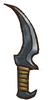
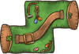
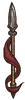

**罕见**是一种[稀有度](pages/%E7%A8%80%E6%9C%89%E5%BA%A6.html)。目前一共有58个罕见物品。

|  | **名称** | **效果** | **职业** | **稀有度** | **价格** |
| --- | --- | --- | --- | --- | --- |
|  | [黑桃A](pages/%E9%BB%91%E6%A1%83A.html) | * **翻开时：**你的下一次攻击为暴击。 * 如果之前翻开的卡牌数量是奇数，获得2点和3层。 |  [收割者](pages/%E6%94%B6%E5%89%B2%E8%80%85.html) | [罕见](pages/%E7%BD%95%E8%A7%81.html) | 3 |
|  | [炼金护符](pages/%E7%82%BC%E9%87%91%E6%8A%A4%E7%AC%A6.html) | * **战斗开始时：** 获得3层随机[增益效果](pages/%E5%A2%9E%E7%9B%8A%E6%95%88%E6%9E%9C.html)。 * 的[魔药](pages/%E9%AD%94%E8%8D%AF.html)被消耗时：在2.5秒后，有70%的几率触发被消耗魔药的效果。 |  [通用](pages/%E9%80%9A%E7%94%A8.html) | [罕见](pages/%E7%BD%95%E8%A7%81.html) | 6 |
|  | [黑暗护符](pages/%E9%BB%91%E6%9A%97%E6%8A%A4%E7%AC%A6.html) | * **造成22点伤害后：**向对手施加一层随机[减益效果](pages/%E5%87%8F%E7%9B%8A%E6%95%88%E6%9E%9C.html)。 * ** 的物品激活时：**有30%的几率造成7点伤害。 |  [通用](pages/%E9%80%9A%E7%94%A8.html) | [罕见](pages/%E7%BD%95%E8%A7%81.html) | 6 |
|  | [能量护符](pages/%E8%83%BD%E9%87%8F%E6%8A%A4%E7%AC%A6.html) | * **战斗开始时：**的物品触发快100%，持续1s。 * **[增益效果](pages/%E5%A2%9E%E7%9B%8A%E6%95%88%E6%9E%9C.html)消耗时：**返回25%消耗的[增益效果](pages/%E5%A2%9E%E7%9B%8A%E6%95%88%E6%9E%9C.html)。 |  [通用](pages/%E9%80%9A%E7%94%A8.html) | [罕见](pages/%E7%BD%95%E8%A7%81.html) | 6 |
|  | [食物护符](pages/%E9%A3%9F%E7%89%A9%E6%8A%A4%E7%AC%A6.html) | * 的[食物](pages/%E9%A3%9F%E7%89%A9.html)触发快40%。 * **购买[食物](pages/%E9%A3%9F%E7%89%A9.html)时：**商店刷新一个随机[食物](pages/%E9%A3%9F%E7%89%A9.html)。 |  [通用](pages/%E9%80%9A%E7%94%A8.html) | [罕见](pages/%E7%BD%95%E8%A7%81.html) | 6 |
|  | [财富护符](pages/%E8%B4%A2%E5%AF%8C%E6%8A%A4%E7%AC%A6.html) | * 基于几率触发的的物品获得15%触发[几率](pages/%E5%87%A0%E7%8E%87.html)加成。 * **5秒后：**获得2层你现有最多的增益效果。 |  [通用](pages/%E9%80%9A%E7%94%A8.html) | [罕见](pages/%E7%BD%95%E8%A7%81.html) | 6 |
|  | [生命护符](pages/%E7%94%9F%E5%91%BD%E6%8A%A4%E7%AC%A6.html) | * **战斗开始时：**获得20点生命值上限。 * 你的[恢复](pages/%E6%81%A2%E5%A4%8D%EF%BC%88%E6%9C%BA%E5%88%B6%EF%BC%89.html)效果增强20%。 |  [通用](pages/%E9%80%9A%E7%94%A8.html) | [罕见](pages/%E7%BD%95%E8%A7%81.html) | 6 |
|  | [钢之护符](pages/%E9%92%A2%E4%B9%8B%E6%8A%A4%E7%AC%A6.html) | * **战斗开始时：**获得30点。 * **物品获得35点时：**获得一层。 |  [通用](pages/%E9%80%9A%E7%94%A8.html) | [罕见](pages/%E7%BD%95%E8%A7%81.html) | 6 |
|  | [自然护符](pages/%E8%87%AA%E7%84%B6%E6%8A%A4%E7%AC%A6.html) | * **5秒后：**触发的[宠物](pages/%E5%AE%A0%E7%89%A9.html)效果，并获得4层。 * 和触发的最高伤害 + 50%。 |  [通用](pages/%E9%80%9A%E7%94%A8.html) | [罕见](pages/%E7%BD%95%E8%A7%81.html) | 6 |
|  | [战斧](pages/%E6%88%98%E6%96%A7.html) | **击中对手时：**获得+1伤害加成。 |  [狂战士](pages/%E7%8B%82%E6%88%98%E5%A3%AB.html) | [罕见](pages/%E7%BD%95%E8%A7%81.html) | 6 |
|  | [一袋石头](pages/%E4%B8%80%E8%A2%8B%E7%9F%B3%E5%A4%B4.html) | 上方的石头可以反复投掷。 |  [通用](pages/%E9%80%9A%E7%94%A8.html) | [罕见](pages/%E7%BD%95%E8%A7%81.html) | 3 |
|  | [黑色主教](pages/%E9%BB%91%E8%89%B2%E4%B8%BB%E6%95%99.html) | * **吃掉其他棋子时：**向对手施加5层随机[减益效果](pages/%E5%87%8F%E7%9B%8A%E6%95%88%E6%9E%9C.html)。 * **被吃掉时：**削弱对手20%的生命[恢复](pages/%E6%81%A2%E5%A4%8D.html)效果，还会削弱20%获得的最大生命值。 |  [魔法师](pages/%E9%AD%94%E6%B3%95%E5%B8%88.html) | [罕见](pages/%E7%BD%95%E8%A7%81.html) | 3 |
|  | [黑色骑士](pages/%E9%BB%91%E8%89%B2%E9%AA%91%E5%A3%AB.html) | * **吃掉其他棋子时：**获得3层。 * **被吃掉时：**移除对手2.5点[耐力](pages/%E8%80%90%E5%8A%9B.html)。 |  [魔法师](pages/%E9%AD%94%E6%B3%95%E5%B8%88.html) | [罕见](pages/%E7%BD%95%E8%A7%81.html) | 3 |
|  | [蓝莓](pages/%E8%93%9D%E8%8E%93.html) | **每3.5s：**获得1点。如果你至少有10点，则改为获得1点。 |  [通用](pages/%E9%80%9A%E7%94%A8.html) | [罕见](pages/%E7%BD%95%E8%A7%81.html) | 2 |
|  | [回旋镖](pages/%E5%9B%9E%E6%97%8B%E9%95%96.html) | * **击中对手：**耐力消耗减少20%。有50%的几率偷取一层随机[增益效果](pages/%E5%A2%9E%E7%9B%8A%E6%95%88%E6%9E%9C.html)。 |  [冒险家](pages/%E5%86%92%E9%99%A9%E5%AE%B6.html) | [罕见](pages/%E7%BD%95%E8%A7%81.html) | 8 |
|  | [宝石盒](pages/%E5%AE%9D%E7%9F%B3%E7%9B%92.html) | * 商店会出售更多的[宝石](pages/%E5%AE%9D%E7%9F%B3.html)。 * **进入商店：**生成一个宝石碎片。 |  [通用](pages/%E9%80%9A%E7%94%A8.html) | [罕见](pages/%E7%BD%95%E8%A7%81.html) |  |
|  | [紫水晶](pages/%E7%B4%AB%E6%B0%B4%E6%99%B6.html) | 放入武器槽： **击中对手：** 将有25/35/50/75/100% 的几率移除对手2个随机增益效果。 放入护甲或其他槽： 对手的生命值[恢复](pages/%E6%81%A2%E5%A4%8D.html)效果降低12/18/25/30/45%。 放入背包： **每3.2/2.5/2/1.6/1s：**[净化](pages/%E5%87%80%E5%8C%96.html)自身1个随机减益效果。 |  [通用](pages/%E9%80%9A%E7%94%A8.html) | [Varies](pages/Varies.html) | 1/2/4/8/16 |
|  | [翡翠](pages/%E7%BF%A1%E7%BF%A0.html) | 放入武器槽： **击中对手：** 将有35/50/80/80/80% 的几率向对手施加1/1/1/2/4层。 放入护甲或其他槽： 将有10/15/20/25/40%的几率抵挡。 放入背包： **3/4/4/3.5/3s后：**获得1/2/3/4/7层。 |  [通用](pages/%E9%80%9A%E7%94%A8.html) | [Varies](pages/Varies.html) | 1/2/4/8/16 |
|  | [红宝石](pages/%E7%BA%A2%E5%AE%9D%E7%9F%B3.html) | 放入武器槽： **击中对手：**偷取造成伤害量的7/10/15/20/35%为生命值。 放入护甲或其他槽： 生命值[恢复效果](pages/%E6%81%A2%E5%A4%8D%EF%BC%88%E6%9C%BA%E5%88%B6%EF%BC%89.html)增强10/15/20/25/40%。 放入背包： **5s后：**造成带有150%生命偷取效果的4/6/10/15/35点伤害。 |  [通用](pages/%E9%80%9A%E7%94%A8.html) | [Varies](pages/Varies.html) | 1/2/4/8/16 |
|  | [蓝宝石](pages/%E8%93%9D%E5%AE%9D%E7%9F%B3.html) | 放入武器槽： **击中对手：**将有15/25/40/60/100%的几率无视直接攻击，并获得1点还会向对手施加1层。 放入护甲或其他槽： **每获得5点：**将获得2/3/4/5/8点。 放入背包： **4.5/4.5/4/3.5/3s后：**向对手施加2/3/4/5/8层。 |  [通用](pages/%E9%80%9A%E7%94%A8.html) | [Varies](pages/Varies.html) | 1/2/4/8/16 |
|  | [黄宝石](pages/%E9%BB%84%E5%AE%9D%E7%9F%B3.html) | 放入武器槽： 武器攻击触发快10/15/20/25/40%。 放入护甲或其他槽： 有10/15/20/30/50%的几率抵挡[眩晕](pages/%E7%9C%A9%E6%99%95.html)，还有5/7/10/15/30%的几率抵挡暴击。 放入背包： 增加8/12/20/30/50%基础[耐力](pages/%E8%80%90%E5%8A%9B.html)值恢复。 |  [通用](pages/%E9%80%9A%E7%94%A8.html) | [Varies](pages/Varies.html) | 1/2/4/8/16 |
|  | [西兰花](pages/%E8%A5%BF%E5%85%B0%E8%8A%B1.html) | **每6s：**获得2点。如果你至少有5点，则会获得2层。 |  [冒险家](pages/%E5%86%92%E9%99%A9%E5%AE%B6.html) | [罕见](pages/%E7%BD%95%E8%A7%81.html) | 4 |
|  | [一堆金币](pages/%E4%B8%80%E5%A0%86%E9%87%91%E5%B8%81.html) | 就是一堆金币，除了卖掉没有其他作用。 |  [通用](pages/%E9%80%9A%E7%94%A8.html) | [罕见](pages/%E7%BD%95%E8%A7%81.html) | 9 |
|  | [燃烧煤炭](pages/%E7%87%83%E7%83%A7%E7%85%A4%E7%82%AD.html) | 放入武器槽： **击中对手时：**有12%的几率造成+6伤害并获得1层。 放入护甲或其他槽： * **战斗开始时：**获得12层。 * [抵抗](pages/%E6%8A%B5%E6%8A%97.html)6层。 放入背包： **在5s后：**获得2层，[净化](pages/%E5%87%80%E5%8C%96.html)3层减益效果。 |  [通用](pages/%E9%80%9A%E7%94%A8.html) | [罕见](pages/%E7%BD%95%E8%A7%81.html) | 2 |
|  | [萝卜](pages/%E8%90%9D%E5%8D%9C.html) | * **每2.7s：**随机[净化](pages/%E5%87%80%E5%8C%96.html)1个[减益效果](pages/%E5%87%8F%E7%9B%8A%E6%95%88%E6%9E%9C.html)。如果你有4点以上，将有55%的几率获得1层。 |  [游侠](pages/%E6%B8%B8%E4%BE%A0.html) | [罕见](pages/%E7%BD%95%E8%A7%81.html) | 3 |
|  | [棋盘](pages/%E6%A3%8B%E7%9B%98.html) | * [棋子](pages/%E6%A3%8B%E5%AD%90.html)会在商店出售。 * **购买此物品时：**花费2生成一枚[黑色棋子](pages/%E9%BB%91%E8%89%B2%E5%A3%AB%E5%85%B5.html)和一枚[白色棋子](pages/%E7%99%BD%E8%89%B2%E5%A3%AB%E5%85%B5.html)。 * **每0.7s：**棋子将进行下一回合。 * 规则： * 1.白棋先走。 * 2.棋子可以吃掉的棋子。 * 3.如果棋子可以吃掉其他棋子，那就会去吃掉。 * 4.如果没有棋子可以吃，那就会移动到方格。 |  [魔法师](pages/%E9%AD%94%E6%B3%95%E5%B8%88.html) | [罕见](pages/%E7%BD%95%E8%A7%81.html) | 2 |
|  | [红辣椒](pages/%E7%BA%A2%E8%BE%A3%E6%A4%92.html) | * **每4.5s：**获得1层并[恢复](pages/%E6%81%A2%E5%A4%8D.html)5点生命值。当你至少有10层时，还会[净化](pages/%E5%87%80%E5%8C%96.html)1层[减益效果](pages/%E5%87%8F%E7%9B%8A%E6%95%88%E6%9E%9C.html)。 |  [火焰魔导士](pages/%E7%81%AB%E7%84%B0%E9%AD%94%E5%AF%BC%E5%A3%AB.html) | [罕见](pages/%E7%BD%95%E8%A7%81.html) | 5 |
|  | [会员卡](pages/%E4%BC%9A%E5%91%98%E5%8D%A1.html) | **商店刷新时：**增加一个物品的稀有度。有10%的几率出现[交易](pages/%E4%BA%A4%E6%98%93.html)机会 |  [通用](pages/%E9%80%9A%E7%94%A8.html) | [罕见](pages/%E7%BD%95%E8%A7%81.html) | 4 |
|  | [匕首](pages/%E5%8C%95%E9%A6%96.html) | **[眩晕](pages/%E7%9C%A9%E6%99%95.html)对手：**触发额外攻击。 |  [通用](pages/%E9%80%9A%E7%94%A8.html) | [罕见](pages/%E7%BD%95%E8%A7%81.html) | 4 |
|  | [牌堆](pages/%E7%89%8C%E5%A0%86.html) | * [卡牌](pages/%E5%8D%A1%E7%89%8C.html)将会在商店中出售。 * **战斗开始时：** 获得2点。并开始翻开的卡牌。 |  [收割者](pages/%E6%94%B6%E5%89%B2%E8%80%85.html) | [罕见](pages/%E7%BD%95%E8%A7%81.html) | 3 |
|  | [腰包](pages/%E8%85%B0%E5%8C%85.html) | * 增加2格背包槽位。 * 包内的物品触发快10%。 |  [通用](pages/%E9%80%9A%E7%94%A8.html) | [罕见](pages/%E7%BD%95%E8%A7%81.html) | 3 |
|  | [致幻蘑菇](pages/%E8%87%B4%E5%B9%BB%E8%98%91%E8%8F%87.html) | **每3.6s：**施加1层。 |  [收割者](pages/%E6%94%B6%E5%89%B2%E8%80%85.html) | [罕见](pages/%E7%BD%95%E8%A7%81.html) | 3 |
|  | [迅捷手套](pages/%E8%BF%85%E6%8D%B7%E6%89%8B%E5%A5%97.html) | **战斗开始时：**的物品触发快20%。 |  [通用](pages/%E9%80%9A%E7%94%A8.html) | [罕见](pages/%E7%BD%95%E8%A7%81.html) | 4 |
|  | [黏黏](pages/%E9%BB%8F%E9%BB%8F.html) | * **的物品激活达到5次：**[恢复](pages/%E6%81%A2%E5%A4%8D.html)9点生命值。 |  [通用](pages/%E9%80%9A%E7%94%A8.html) | [罕见](pages/%E7%BD%95%E8%A7%81.html) | 6 |
|  | [锤子](pages/%E9%94%A4%E5%AD%90.html) | **击中对手时：**有45%的几率[眩晕](pages/%E7%9C%A9%E6%99%95.html)对手0.5s。 |  [通用](pages/%E9%80%9A%E7%94%A8.html) | [罕见](pages/%E7%BD%95%E8%A7%81.html) | 8 |
|  | [生命魔药](pages/%E7%94%9F%E5%91%BD%E9%AD%94%E8%8D%AF.html) | **当你的生命值低于50%时：**消耗此魔药，[恢复](pages/%E6%81%A2%E5%A4%8D.html)12点生命值并[净化](pages/%E5%87%80%E5%8C%96.html)4层。 |  [通用](pages/%E9%80%9A%E7%94%A8.html) | [罕见](pages/%E7%BD%95%E8%A7%81.html) | 4 |
|  | [英雄盾牌](pages/%E8%8B%B1%E9%9B%84%E7%9B%BE%E7%89%8C.html) | * **战斗开始时：**的武器获得+1 +15%伤害加成。 * **被攻击时（）：**有30%的几率抵挡15点伤害并移除对手0.4点[耐力](pages/%E8%80%90%E5%8A%9B.html)。 |  [冒险家](pages/%E5%86%92%E9%99%A9%E5%AE%B6.html) | [罕见](pages/%E7%BD%95%E8%A7%81.html) | 10 |
|  | [皮制护甲](pages/%E7%9A%AE%E5%88%B6%E6%8A%A4%E7%94%B2.html) | **战斗开始时：**获得45点，[抵抗](pages/%E6%8A%B5%E6%8A%97.html)3层[减益效果](pages/%E5%87%8F%E7%9B%8A%E6%95%88%E6%9E%9C.html)。 |  [通用](pages/%E9%80%9A%E7%94%A8.html) | [罕见](pages/%E7%BD%95%E8%A7%81.html) | 7 |
|  | [幸运四叶草](pages/%E5%B9%B8%E8%BF%90%E5%9B%9B%E5%8F%B6%E8%8D%89.html) | **战斗开始时：**获得1点。 |  [游侠](pages/%E6%B8%B8%E4%BE%A0.html) | [罕见](pages/%E7%BD%95%E8%A7%81.html) | 2 |
|  | [魔法卷轴：重生](pages/%E9%AD%94%E6%B3%95%E5%8D%B7%E8%BD%B4%EF%BC%9A%E9%87%8D%E7%94%9F.html) | * **的物品每消耗4点耐力时：**消耗1点来获得1点[耐力](pages/%E8%80%90%E5%8A%9B.html)。 |  [魔法师](pages/%E9%AD%94%E6%B3%95%E5%B8%88.html) | [罕见](pages/%E7%BD%95%E8%A7%81.html) | 5 |
|  | [改良的拼图背包](pages/%E6%94%B9%E8%89%AF%E7%9A%84%E6%8B%BC%E5%9B%BE%E8%83%8C%E5%8C%85.html) | * 增加4格背包槽位。 * 背包内物品有20%的几率复制获得的[增益效果](pages/%E5%A2%9E%E7%9B%8A%E6%95%88%E6%9E%9C.html)。 |  [魔法师](pages/%E9%AD%94%E6%B3%95%E5%B8%88.html) | [罕见](pages/%E7%BD%95%E8%A7%81.html) | 5 |
|  | [鼠大厨](pages/%E9%BC%A0%E5%A4%A7%E5%8E%A8.html) | * **战斗开始时：**每有一个的食物，获得1层。 * **每7s：**恢复2点[耐力](pages/%E8%80%90%E5%8A%9B.html)并获得1层。 * 每有一个的宠物或食物，效果触发快15%。 |  [游侠](pages/%E6%B8%B8%E4%BE%A0.html) | [罕见](pages/%E7%BD%95%E8%A7%81.html) | 8 |
|  | [反弹！](pages/%E5%8F%8D%E5%BC%B9%EF%BC%81.html) | * **翻开时：**[反弹](pages/%E5%8F%8D%E5%BC%B9.html)3层减益效果。 * 如果之前没有重复的卡牌，偷取3层增益效果。 |  [收割者](pages/%E6%94%B6%E5%89%B2%E8%80%85.html) | [罕见](pages/%E7%BD%95%E8%A7%81.html) | 3 |
|  | [麻绳](pages/%E9%BA%BB%E7%BB%B3.html) | **的物品激活时：**的物品触发速度快10%，持续6s（多个麻绳效果不叠加，最多50%）。 |  [冒险家](pages/%E5%86%92%E9%99%A9%E5%AE%B6.html) | [罕见](pages/%E7%BD%95%E8%A7%81.html) | 4 |
|  | [贝壳图腾](pages/%E8%B4%9D%E5%A3%B3%E5%9B%BE%E8%85%BE.html) | * **每3.6s：**如果你的生命值高于70%，获得1层。否则将会[恢复](pages/%E6%81%A2%E5%A4%8D.html)生命值8点。 * 每有一个的物品，耐力值消耗-15%。 |  [通用](pages/%E9%80%9A%E7%94%A8.html) | [罕见](pages/%E7%BD%95%E8%A7%81.html) | 5 |
|  | [小蜗](pages/%E5%B0%8F%E8%9C%97.html) | * [净化](pages/%E5%87%80%E5%8C%96.html)类效果触发时有25%的几率再额外净化一层[减益效果](pages/%E5%87%8F%E7%9B%8A%E6%95%88%E6%9E%9C.html)。 * **每12s：**[净化](pages/%E5%87%80%E5%8C%96.html)6层[减益效果](pages/%E5%87%8F%E7%9B%8A%E6%95%88%E6%9E%9C.html)并[恢复](pages/%E6%81%A2%E5%A4%8D.html)40点生命值。 * 每有一个的[魔药](pages/%E9%AD%94%E8%8D%AF.html)，效果触发快15%。 |  [通用](pages/%E9%80%9A%E7%94%A8.html) | [罕见](pages/%E7%BD%95%E8%A7%81.html) | 6 |
|  | [牧羊人的曲柄杖](pages/%E7%89%A7%E7%BE%8A%E4%BA%BA%E7%9A%84%E6%9B%B2%E6%9F%84%E6%9D%96.html) | * **战斗开始时：**的武器获得2点伤害。 * 有35%的几率保护你的[增益效果](pages/%E5%A2%9E%E7%9B%8A%E6%95%88%E6%9E%9C.html)不被移除。 * 还有50%的几率[抵抗](pages/%E6%8A%B5%E6%8A%97.html) 和。 |  [通用](pages/%E9%80%9A%E7%94%A8.html) | [罕见](pages/%E7%BD%95%E8%A7%81.html) | 8 |
|  | [铲铲](pages/%E9%93%B2%E9%93%B2.html) | * **进入商店：**随机挖出一件物品。 * **击中对手时：**有40%的几率施加1层 |  [通用](pages/%E9%80%9A%E7%94%A8.html) | [罕见](pages/%E7%BD%95%E8%A7%81.html) | 8 |
|  | [长矛](pages/%E9%95%BF%E7%9F%9B.html) | * **击中对手时：**前方每有一个空的槽位，摧毁4点。 |  [通用](pages/%E9%80%9A%E7%94%A8.html) | [罕见](pages/%E7%BD%95%E8%A7%81.html) | 6 |
|  | [芙莉莲的冰魔法手册](pages/%E8%8A%99%E8%8E%89%E8%8E%B2%E7%9A%84%E5%86%B0%E9%AD%94%E6%B3%95%E6%89%8B%E5%86%8C.html) | * **每2.8s：**消耗一点来向对手施加2层。 * **每有一个的[魔法卷轴](pages/%E9%AD%94%E6%B3%95%E5%8D%B7%E8%BD%B4.html)：**，此物品的触发速度快10%（魔法卷轴算作2次。 |  [魔法师](pages/%E9%AD%94%E6%B3%95%E5%B8%88.html) | [罕见](pages/%E7%BD%95%E8%A7%81.html) | 6 |
|  | [魔法卷轴：冰霜箭](pages/%E9%AD%94%E6%B3%95%E5%8D%B7%E8%BD%B4%EF%BC%9A%E5%86%B0%E9%9C%9C%E7%AE%AD.html) | * **每3s：**造成5点伤害，向对手施加4层持续3s。 * **最大使用次数：**3次，且每有一个的物品（不包括魔法卷轴：冰霜箭）使用次数+1次。 |  [火焰魔导士](pages/%E7%81%AB%E7%84%B0%E9%AD%94%E5%AF%BC%E5%A3%AB.html) | [罕见](pages/%E7%BD%95%E8%A7%81.html) | 4 |
|  | [尖刺盾牌](pages/%E5%B0%96%E5%88%BA%E7%9B%BE%E7%89%8C.html) | **被攻击时（）：**有30%的几率抵挡9点伤害，移除对手0.3点[耐力](pages/%E8%80%90%E5%8A%9B.html)值，并获得1层（最高5层）。 |  [通用](pages/%E9%80%9A%E7%94%A8.html) | [罕见](pages/%E7%BD%95%E8%A7%81.html) | 8 |
|  | [松鼠](pages/%E6%9D%BE%E9%BC%A0.html) | * **每4s：**偷取一个随机[增益效果](pages/%E5%A2%9E%E7%9B%8A%E6%95%88%E6%9E%9C.html)。 * '每有一个的宠物或食物，效果触发快15%。 |  [游侠](pages/%E6%B8%B8%E4%BE%A0.html) | [罕见](pages/%E7%BD%95%E8%A7%81.html) | 5 |
|  | [火把](pages/%E7%81%AB%E6%8A%8A.html) | **击中对手时：**有25%的几率获得1伤害加成。 |  [通用](pages/%E9%80%9A%E7%94%A8.html) | [罕见](pages/%E7%BD%95%E8%A7%81.html) | 5 |
|  | [尖牙短弓](pages/%E5%B0%96%E7%89%99%E7%9F%AD%E5%BC%93.html) | **击中对手时：** 50%的几率获得1层。 |  [游侠](pages/%E6%B8%B8%E4%BE%A0.html) | [罕见](pages/%E7%BD%95%E8%A7%81.html) | 8 |
|  | [未知护符](pages/%E6%9C%AA%E7%9F%A5%E6%8A%A4%E7%AC%A6.html) | **购买此物品时：**获得一个随机效果。 |  [通用](pages/%E9%80%9A%E7%94%A8.html) | [罕见](pages/%E7%BD%95%E8%A7%81.html) | 6 |
|  | [白色主教](pages/%E7%99%BD%E8%89%B2%E4%B8%BB%E6%95%99.html) | * **吃掉其他棋子时：**[净化](pages/%E5%87%80%E5%8C%96.html)10层[减益效果](pages/%E5%87%8F%E7%9B%8A%E6%95%88%E6%9E%9C.html)。 * **被吃掉时：**生命[恢复](pages/%E6%81%A2%E5%A4%8D.html)效果增加25%。 |  [魔法师](pages/%E9%AD%94%E6%B3%95%E5%B8%88.html) | [罕见](pages/%E7%BD%95%E8%A7%81.html) | 3 |
|  | [白色骑士](pages/%E7%99%BD%E8%89%B2%E9%AA%91%E5%A3%AB.html) | * **吃掉其他棋子时：**棋盘的效果触发速度快50%。 * **被吃掉时：**获得2.5最大[耐力](pages/%E8%80%90%E5%8A%9B.html)。 |  [魔法师](pages/%E9%AD%94%E6%B3%95%E5%B8%88.html) | [罕见](pages/%E7%BD%95%E8%A7%81.html) | 3 |

| [物品](pages/%E7%89%A9%E5%93%81.html) |
| --- |
| | [配饰](pages/%E9%85%8D%E9%A5%B0.html) | | --- | | [武器](pages/%E6%AD%A6%E5%99%A8.html) | | --- | | [护甲](pages/%E6%8A%A4%E7%94%B2.html) | | --- | | [背包](pages/%E8%83%8C%E5%8C%85.html) | | --- | | [食物](pages/%E9%A3%9F%E7%89%A9.html) | | --- | | [宝石](pages/%E5%AE%9D%E7%9F%B3.html) | | --- | | [手套](pages/%E6%89%8B%E5%A5%97.html) | | --- | | [头盔](pages/%E5%A4%B4%E7%9B%94.html) | | --- | | [宠物](pages/%E5%AE%A0%E7%89%A9.html) | | --- | | [卡牌](pages/%E5%8D%A1%E7%89%8C.html) | | --- | | [魔药](pages/%E9%AD%94%E8%8D%AF.html) | | --- | | [盾牌](pages/%E7%9B%BE%E7%89%8C.html) | | --- | | [鞋子](pages/%E9%9E%8B%E5%AD%90.html) | | --- | | [技能](pages/%E6%8A%80%E8%83%BD.html) | | --- | | [魔法卷轴](pages/%E9%AD%94%E6%B3%95%E5%8D%B7%E8%BD%B4.html) | | --- | | [魔法书](pages/%E9%AD%94%E6%B3%95%E4%B9%A6.html) | | --- | | [棋子](pages/%E6%A3%8B%E5%AD%90.html) | | --- | |
