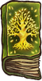
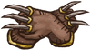
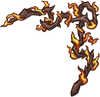
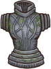

**尖刺**是一种[增益效果](pages/%E5%A2%9E%E7%9B%8A%E6%95%88%E6%9E%9C.html)。当被敌人用武器击中时，每层造成1点伤害。（最高造成100%受到伤害的量）

[自然护符](pages/%E8%87%AA%E7%84%B6%E6%8A%A4%E7%AC%A6.html)和[尖刺墙](pages/%E5%B0%96%E5%88%BA%E5%A2%99.html)可以提高造成的最高尖刺伤害量并使其对也造成尖刺伤害。例单个自然护符：最高造成150%伤害量的尖刺伤害，最高造成50%伤害量的尖刺伤害。

与尖刺有关的物品
--------

|  | **名称** | **效果** | **职业** | **稀有度** | **价格** |
| --- | --- | --- | --- | --- | --- |
|  | [刺猬](pages/%E5%88%BA%E7%8C%AC.html) | * **每5s：**造成10点伤害（每层增加0.5点伤害）。 * **当生命值低于70%时：**获得2层和25点（单次触发）。 * 每有一个的[宠物](pages/%E5%AE%A0%E7%89%A9.html)或[食物](pages/%E9%A3%9F%E7%89%A9.html)，效果触发速度快 15%。 |  [游侠](pages/%E6%B8%B8%E4%BE%A0.html) | [史诗](pages/%E5%8F%B2%E8%AF%97.html) | 6 |
|  | [剧毒常春藤](pages/%E5%89%A7%E6%AF%92%E5%B8%B8%E6%98%A5%E8%97%A4.html) | * 每有一个的物品，就会获得5%的几率[抵抗](pages/%E6%8A%B5%E6%8A%97.html) [减益效果](pages/%E5%87%8F%E7%9B%8A%E6%95%88%E6%9E%9C.html)。 * **获得时：**向对手施加2层。 * **对手拥有至少18层时：**受到的伤害+25%。 |  [游侠](pages/%E6%B8%B8%E4%BE%A0.html) | [特别](pages/%E7%89%B9%E5%88%AB.html) | 10 |
|  | [大得离谱的荆棘剑](pages/%E5%A4%A7%E5%BE%97%E7%A6%BB%E8%B0%B1%E7%9A%84%E8%8D%86%E6%A3%98%E5%89%91.html) | * **当你至少有5层：**耐力消耗减少到2，冷却时间降低到2s。 * **击中对手：**消耗3层来获得6层，还会获得6层。 * 每有一层或，造成的伤害+2。 |  [冒险家](pages/%E5%86%92%E9%99%A9%E5%AE%B6.html) | [神级](pages/%E7%A5%9E%E7%BA%A7.html) | 31 |
|  | [大自然编年史：林木](pages/%E5%A4%A7%E8%87%AA%E7%84%B6%E7%BC%96%E5%B9%B4%E5%8F%B2%EF%BC%9A%E6%9E%97%E6%9C%A8.html) | * **每2.5s：**消耗1层来获得1点和2层。 * 每有一个的[魔法卷轴](pages/%E9%AD%94%E6%B3%95%E5%8D%B7%E8%BD%B4.html)，此物品的触发速度快10%（的[魔法卷轴](pages/%E9%AD%94%E6%B3%95%E5%8D%B7%E8%BD%B4.html)算作2次）。 |  [魔法师](pages/%E9%AD%94%E6%B3%95%E5%B8%88.html) | [史诗](pages/%E5%8F%B2%E8%AF%97.html) | 6 |
|  | [尖刺墙](pages/%E5%B0%96%E5%88%BA%E5%A2%99.html) | * 基础[耐力](pages/%E8%80%90%E5%8A%9B.html)恢复-30%。 * 狂战士之怒持续时间加长2s。 * 对抗和攻击时的反弹伤害上限+30%。 * **被攻击时（/）：**有30%的几率抵挡15点伤害，还会移除对手0.3点[耐力](pages/%E8%80%90%E5%8A%9B.html)，并获得3层（最高12）。 |  [狂战士](pages/%E7%8B%82%E6%88%98%E5%A3%AB.html) | [神级](pages/%E7%A5%9E%E7%BA%A7.html) | 14 |
|  | [尖刺法杖](pages/%E5%B0%96%E5%88%BA%E6%B3%95%E6%9D%96.html) | **攻击时：**消耗3点来获得2层，并在[狂战士之怒](pages/%E7%8B%82%E6%88%98%E5%A3%AB%E4%B9%8B%E6%80%92.html)期间获得2层。 |  [狂战士](pages/%E7%8B%82%E6%88%98%E5%A3%AB.html) | [传说](pages/%E4%BC%A0%E8%AF%B4.html) | 16 |
|  | [尖刺爆发](pages/%E5%B0%96%E5%88%BA%E7%88%86%E5%8F%91.html) | * **每6.5s：**[眩晕](pages/%E7%9C%A9%E6%99%95.html)对手0.3s并获得2层（最高5次）。 * 每有1层，触发快5%。 |  [通用](pages/%E9%80%9A%E7%94%A8.html) | [特别](pages/%E7%89%B9%E5%88%AB.html) | 5 |
|  | [尖刺盾牌](pages/%E5%B0%96%E5%88%BA%E7%9B%BE%E7%89%8C.html) | **被攻击时（）：**有30%的几率抵挡9点伤害，移除对手0.3点[耐力](pages/%E8%80%90%E5%8A%9B.html)值，并获得1层（最高5层）。 |  [通用](pages/%E9%80%9A%E7%94%A8.html) | [罕见](pages/%E7%BD%95%E8%A7%81.html) | 8 |
|  | [尖刺项圈](pages/%E5%B0%96%E5%88%BA%E9%A1%B9%E5%9C%88.html) | * 狂战士之怒持续时间加长2s。 * **进入狂战士之怒时：**获得1层。 |  [狂战士](pages/%E7%8B%82%E6%88%98%E5%A3%AB.html) | [传说](pages/%E4%BC%A0%E8%AF%B4.html) | 6 |
|  | [尖牙弓](pages/%E5%B0%96%E7%89%99%E5%BC%93.html) | * **战斗开始时：**获得4层。 * **的[武器](pages/%E6%AD%A6%E5%99%A8.html)击中对手时：**消耗1层，尖牙弓下次攻击造成的伤害+9。 |  [游侠](pages/%E6%B8%B8%E4%BE%A0.html) | [传说](pages/%E4%BC%A0%E8%AF%B4.html) | 11 |
|  | [尖牙短弓](pages/%E5%B0%96%E7%89%99%E7%9F%AD%E5%BC%93.html) | **击中对手时：** 50%的几率获得1层。 |  [游侠](pages/%E6%B8%B8%E4%BE%A0.html) | [罕见](pages/%E7%BD%95%E8%A7%81.html) | 8 |
|  | [强力硬化魔药](pages/%E5%BC%BA%E5%8A%9B%E7%A1%AC%E5%8C%96%E9%AD%94%E8%8D%AF.html) | **当你的至少有45点时：**消耗此魔药，转换15点生命值为35点，并在4s内获得2点。 |  [通用](pages/%E9%80%9A%E7%94%A8.html) | [传说](pages/%E4%BC%A0%E8%AF%B4.html) | 8 |
|  | [护甲勇敢狼崽](pages/%E6%8A%A4%E7%94%B2%E5%8B%87%E6%95%A2%E7%8B%BC%E5%B4%BD.html) | * 每有1个的[宠物](pages/%E5%AE%A0%E7%89%A9.html)，造成的伤害+2。 * 狼崽的攻击不会触发护盾类物品的效果，也不会触发。 |  [狂战士](pages/%E7%8B%82%E6%88%98%E5%A3%AB.html) | [神级](pages/%E7%A5%9E%E7%BA%A7.html) | 7 |
|  | [攻击之爪](pages/%E6%94%BB%E5%87%BB%E4%B9%8B%E7%88%AA.html) | * 每有一层，攻击触发快5%。 * 每击中对手4次，获得1层。 |  [通用](pages/%E9%80%9A%E7%94%A8.html) | [史诗](pages/%E5%8F%B2%E8%AF%97.html) | 8 |
|  | [海象尖牙](pages/%E6%B5%B7%E8%B1%A1%E5%B0%96%E7%89%99.html) | **战斗开始时：**获得1层。 |  [通用](pages/%E9%80%9A%E7%94%A8.html) | [普通](pages/%E6%99%AE%E9%80%9A.html) | 4 |
|  | [烈火之鞭](pages/%E7%83%88%E7%81%AB%E4%B9%8B%E9%9E%AD.html) | **击中对手时：**消耗1层来获得4层并造成+8点伤害。 |  [火焰魔导士](pages/%E7%81%AB%E7%84%B0%E9%AD%94%E5%AF%BC%E5%A3%AB.html) | [传说](pages/%E4%BC%A0%E8%AF%B4.html) | 10 |
|  | [石制护甲](pages/%E7%9F%B3%E5%88%B6%E6%8A%A4%E7%94%B2.html) | * [耐力](pages/%E8%80%90%E5%8A%9B.html)值消耗增加20%。 * **战斗开始时：**获得110点。 * **每4s：**移除对手1层和2层。 * **当生命值低于50%时：**获得等同于40%点损失生命值的（单次触发）。 |  [通用](pages/%E9%80%9A%E7%94%A8.html) | [传说](pages/%E4%BC%A0%E8%AF%B4.html) | 13 |
|  | [终极升腾](pages/%E7%BB%88%E6%9E%81%E5%8D%87%E8%85%BE.html) | * **10s后：**每有一个…… * 的物品：获得1点和2层。 * 的物品：获得15点，向对手施加1层。 * 的物品：获得3层。 * 的物品：偷取1层增益效果。 * 每有一个的[魔法卷轴](pages/%E9%AD%94%E6%B3%95%E5%8D%B7%E8%BD%B4.html)，此物品触发速度快50%。 |  [魔法师](pages/%E9%AD%94%E6%B3%95%E5%B8%88.html) | [特别](pages/%E7%89%B9%E5%88%AB.html) | 5 |
|  | [自然护符](pages/%E8%87%AA%E7%84%B6%E6%8A%A4%E7%AC%A6.html) | * **5秒后：**触发的[宠物](pages/%E5%AE%A0%E7%89%A9.html)效果，并获得4层。 * 和触发的最高伤害 + 50%。 |  [通用](pages/%E9%80%9A%E7%94%A8.html) | [罕见](pages/%E7%BD%95%E8%A7%81.html) | 6 |
|  | [荆棘之花](pages/%E8%8D%86%E6%A3%98%E4%B9%8B%E8%8A%B1.html) | * **击中对手时：**获得1层。有60%的几率获得1层。 * **每获得1层：**获得11点最大生命值。 * 每有一层，此武器造成+1伤害。 |  [通用](pages/%E9%80%9A%E7%94%A8.html) | [神级](pages/%E7%A5%9E%E7%BA%A7.html) | 14 |
|  | [荆棘之鞭](pages/%E8%8D%86%E6%A3%98%E4%B9%8B%E9%9E%AD.html) | * **击中对手时：**获得一层。 * 每层造成+1额外伤害。 |  [通用](pages/%E9%80%9A%E7%94%A8.html) | [史诗](pages/%E5%8F%B2%E8%AF%97.html) | 8 |
|  | [菠萝](pages/%E8%8F%A0%E8%90%9D.html) | **每3.3s：**获得1层并[恢复](pages/%E6%81%A2%E5%A4%8D.html)4点生命值。 |  [通用](pages/%E9%80%9A%E7%94%A8.html) | [传说](pages/%E4%BC%A0%E8%AF%B4.html) | 6 |
|  | [血棘](pages/%E8%A1%80%E6%A3%98.html) | * **击中对手时：**消耗1层以获得1层和1层。 * 每有一层或，伤害+1。 |  [通用](pages/%E9%80%9A%E7%94%A8.html) | [神级](pages/%E7%A5%9E%E7%BA%A7.html) | 15 |
|  | [超级刺猬](pages/%E8%B6%85%E7%BA%A7%E5%88%BA%E7%8C%AC.html) | * **每5s：**造成10点伤害，且每有1层再+0.5伤害，且每有一层再+1点伤害。 * **当生命值低于70%时：**获得3层，还有3层和35点（单次触发）。 * 每有一个的[宠物](pages/%E5%AE%A0%E7%89%A9.html)或[食物](pages/%E9%A3%9F%E7%89%A9.html)，触发速度快15%。 |  [游侠](pages/%E6%B8%B8%E4%BE%A0.html) | [神级](pages/%E7%A5%9E%E7%BA%A7.html) | 12 |
|  | [阿拉丁神灯](pages/%E9%98%BF%E6%8B%89%E4%B8%81%E7%A5%9E%E7%81%AF.html) | * **每1.6s：**根据你现有最少的项，获得1点或1层或1点。 * **消耗7点，7点，7层，7点和27点生命值：**使的武器+27点伤害（单次触发）。 |  [通用](pages/%E9%80%9A%E7%94%A8.html) | [神级](pages/%E7%A5%9E%E7%BA%A7.html) | 11 |
|  | [黑桃A](pages/%E9%BB%91%E6%A1%83A.html) | * **翻开时：**你的下一次攻击为暴击。 * 如果之前翻开的卡牌数量是奇数，获得2点和3层。 |  [收割者](pages/%E6%94%B6%E5%89%B2%E8%80%85.html) | [罕见](pages/%E7%BD%95%E8%A7%81.html) | 3 |
|  | [黑色城堡](pages/%E9%BB%91%E8%89%B2%E5%9F%8E%E5%A0%A1.html) | * **吃掉其他棋子时：**获得3层。 * **被吃掉时：**增加35%暴击几率，持续3s。 |  [魔法师](pages/%E9%AD%94%E6%B3%95%E5%B8%88.html) | [史诗](pages/%E5%8F%B2%E8%AF%97.html) | 5 |
|  | [龙铭珠](pages/%E9%BE%99%E9%93%AD%E7%8F%A0.html) | * **层数达到15时：**你之后3次攻击必为[暴击](pages/%E6%9A%B4%E5%87%BB.html)。 * **每3.8s：**移除对手1层，每移除对手一层获得1层。 |  [火焰魔导士](pages/%E7%81%AB%E7%84%B0%E9%AD%94%E5%AF%BC%E5%A3%AB.html) | [史诗](pages/%E5%8F%B2%E8%AF%97.html) | 8 |

| [v](pages/Template:%E6%B8%B8%E6%88%8F%E6%9C%BA%E5%88%B6.html) · [d](pages/Template_talk:%E6%B8%B8%E6%88%8F%E6%9C%BA%E5%88%B6.html) · [e](pages/Template:%E6%B8%B8%E6%88%8F%E6%9C%BA%E5%88%B6.html) [游戏机制](pages/%E6%B8%B8%E6%88%8F%E6%9C%BA%E5%88%B6.html) |
| --- |
|  |
| 物品栏和商店 | [物品栏](pages/%E7%89%A9%E5%93%81%E6%A0%8F.html) • [合成配方](pages/%E5%90%88%E6%88%90%E9%85%8D%E6%96%B9.html) • [商店机制](pages/%E6%B8%B8%E6%88%8F%E6%9C%BA%E5%88%B6.html#%E5%95%86%E5%BA%97%E6%9C%BA%E5%88%B6 "游戏机制") • [稀有度](pages/%E7%A8%80%E6%9C%89%E5%BA%A6.html) • [宝藏](pages/%E5%AE%9D%E8%97%8F.html) • [交易](pages/%E4%BA%A4%E6%98%93.html) |
|  |
| 战斗 | [伤害](pages/%E4%BC%A4%E5%AE%B3.html) • [命中率](pages/%E5%91%BD%E4%B8%AD%E7%8E%87.html) • [冷却](pages/%E5%86%B7%E5%8D%B4.html) • [暴击](pages/%E6%9A%B4%E5%87%BB.html) • [狂战士之怒](pages/%E7%8B%82%E6%88%98%E5%A3%AB%E4%B9%8B%E6%80%92.html) •  [护盾](pages/%E6%8A%A4%E7%9B%BE.html) • [恢复](pages/%E6%81%A2%E5%A4%8D%EF%BC%88%E6%9C%BA%E5%88%B6%EF%BC%89.html) • [最大生命值](pages/%E6%9C%80%E5%A4%A7%E7%94%9F%E5%91%BD%E5%80%BC.html) • [疲惫](pages/%E7%96%B2%E6%83%AB.html) • [无敌](pages/%E6%97%A0%E6%95%8C.html) • [承受伤害](pages/%E6%89%BF%E5%8F%97%E4%BC%A4%E5%AE%B3.html) • [无效化](pages/%E6%97%A0%E6%95%88%E5%8C%96.html) • [反弹](pages/%E5%8F%8D%E5%BC%B9.html) • [复活](pages/%E5%A4%8D%E6%B4%BB.html) • [抵抗](pages/%E6%8A%B5%E6%8A%97.html) • [眩晕](pages/%E7%9C%A9%E6%99%95.html) • [净化](pages/%E5%87%80%E5%8C%96.html) • [不治](pages/%E4%B8%8D%E6%B2%BB.html) • [几率](pages/%E5%87%A0%E7%8E%87.html) |
|  |
| [增益效果](pages/%E5%A2%9E%E7%9B%8A%E6%95%88%E6%9E%9C.html) |  [充能](pages/%E5%85%85%E8%83%BD.html) •  [狂热](pages/%E7%8B%82%E7%83%AD.html) •  [幸运](pages/%E5%B9%B8%E8%BF%90.html) •  [魔法](pages/%E9%AD%94%E6%B3%95.html) •  [恢复](pages/%E6%81%A2%E5%A4%8D.html) •  [尖刺](pages/%E8%8D%86%E6%A3%98.html) •  [吸血](pages/%E5%90%B8%E8%A1%80.html) |
|  |
| [减益效果](pages/%E5%87%8F%E7%9B%8A%E6%95%88%E6%9E%9C.html) |  [致盲](pages/%E8%87%B4%E7%9B%B2.html) •  [冰冷](pages/%E5%86%B0%E5%86%B7.html) •  [中毒](pages/%E4%B8%AD%E6%AF%92.html) |
|  |
| 其他 | [主客场](pages/%E4%B8%BB%E5%AE%A2%E5%9C%BA.html) • [战斗日志](pages/%E6%88%98%E6%96%97%E6%97%A5%E5%BF%97.html) • [游戏胜负](pages/%E6%B8%B8%E6%88%8F%E6%9C%BA%E5%88%B6.html#%E6%B8%B8%E6%88%8F%E8%83%9C%E8%B4%9F "游戏机制") • [游戏模式](pages/%E6%B8%B8%E6%88%8F%E6%9C%BA%E5%88%B6.html#%E6%B8%B8%E6%88%8F%E6%A8%A1%E5%BC%8F "游戏机制") |
