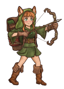
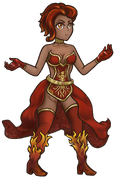
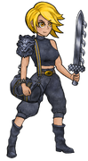
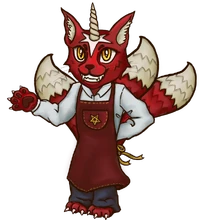
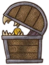

<!-- source: action=render -->

<h2>可选择角色</h2>

游戏目前有6个<b>可玩角色</b>，游侠、收割者、狂战士、火焰魔导士，魔法师和冒险家。他们的初始生命值和金币以及每回合收益都是一样的。

<ul class="gallery mw-gallery-nolines">
		<li class="gallerybox" style="width: 185px">

			

			
<a href="pages/%E6%B8%B8%E4%BE%A0.html" title="游侠">游侠</a>

		
</li>
		<li class="gallerybox" style="width: 185px">

			

			
<a href="pages/%E6%94%B6%E5%89%B2%E8%80%85.html" title="收割者">收割者</a>

		
</li>
		<li class="gallerybox" style="width: 185px">

			

			
<a href="pages/%E7%81%AB%E7%84%B0%E9%AD%94%E5%AF%BC%E5%A3%AB.html" title="火焰魔导士">火焰魔导士</a>

		
</li>
		<li class="gallerybox" style="width: 185px">

			

			
<a href="pages/%E7%8B%82%E6%88%98%E5%A3%AB.html" title="狂战士">狂战士</a>

		
</li>
		<li class="gallerybox" style="width: 185px">

			

			
<a href="pages/%E9%AD%94%E6%B3%95%E5%B8%88.html" title="魔法师">魔法师</a>

		
</li>
		<li class="gallerybox" style="width: 185px">

			

			
<a href="pages/%E5%86%92%E9%99%A9%E5%AE%B6.html" title="冒险家">冒险家</a>

		
</li>
</ul>
<h2>其他角色</h2>
<h3><a href="pages/%E7%A6%8F%E8%A5%BF%E6%B3%95.html" title="福西法">店主福西法</a></h3>

  

店主福西法 Furcifer

点击时会给出 <i><b>实用</b></i> 提示。
将所有的提示都访问一遍后，便从第一条提示重新开始显示。

<h3>小板栗</h3>

  

小板栗

小板栗是商店老板旁边的一个箱子。小板栗会回收掉拖到它身上的物品，并将物品价格的一半（四舍五入）返还，详情请见<a href="pages/%E6%B8%B8%E6%88%8F%E6%9C%BA%E5%88%B6.html#出售" title="游戏机制">商店机制</a>。有时候小板栗还可以进行以物换物的<a href="pages/%E4%BA%A4%E6%98%93.html" title="交易">交易</a>。

<a href="pages/%E5%B0%8F%E6%9D%BF%E6%A0%97.html" title="小板栗">小板栗</a>还是一个可购买的物品。

<!-- 
NewPP limit report
Cached time: 20251208134633
Cache expiry: 2592000
Reduced expiry: false
Complications: [no‐toc]
CPU time usage: 0.146 seconds
Real time usage: 0.304 seconds
Preprocessor visited node count: 52/1000000
Revision size: 1468/4194304 bytes
Post‐expand include size: 500/4194304 bytes
Template argument size: 10/4194304 bytes
Highest expansion depth: 3/100
Expensive parser function count: 0/500
Unstrip recursion depth: 0/20
Unstrip post‐expand size: 4762/10000000 bytes
-->
<!--
Transclusion expansion time report (%,ms,calls,template)
100.00%   54.087      1 -total
 10.19%    5.509      1 Template:图标/游侠
  3.81%    2.059      1 Template:图标/火焰魔导士
  3.76%    2.036      2 Template:Clear
  3.76%    2.034      1 Template:图标/收割者
  3.30%    1.783      1 Template:图标/冒险家
  3.28%    1.774      1 Template:图标/魔法师
  3.27%    1.770      1 Template:图标/狂战士
  3.26%    1.761      1 Template:图标/宝藏
-->

<!-- Saved in parser cache with key backpackbattles_zh:pcache:idhash:35-0!canonical!zh-cn and timestamp 20251208134633 and revision id 4628. Rendering was triggered because: page_view
 -->

