财富之吻 - Backpack Battles Wiki
===============

*   [创建账号](pages/Special:%E5%88%9B%E5%BB%BA%E8%B4%A6%E6%88%B7.html "我们推荐您创建账号并登录，但这不是强制性的")
*   [登录](pages/Special:%E7%94%A8%E6%88%B7%E7%99%BB%E5%BD%95.html "我们推荐您登录，但这不是强制性的​[alt-shift-o]")

- [x] Toggle personal tools menu 

*   [创建账号](pages/Special:%E5%88%9B%E5%BB%BA%E8%B4%A6%E6%88%B7.html "我们推荐您创建账号并登录，但这不是强制性的")
*   [登录](pages/Special:%E7%94%A8%E6%88%B7%E7%99%BB%E5%BD%95.html "我们推荐您登录，但这不是强制性的​[alt-shift-o]")

导航菜单
----

### 命名空间

*   [页面](pages/%E8%B4%A2%E5%AF%8C%E4%B9%8B%E5%90%BB.html "查看内容页面​[alt-shift-c]")
*   [讨论](pages/Talk:%E8%B4%A2%E5%AF%8C%E4%B9%8B%E5%90%BB.html "有关内容页面的讨论（页面不存在）​[alt-shift-t]")

- [x] 不转换 

*   [不转换](pages/%E8%B4%A2%E5%AF%8C%E4%B9%8B%E5%90%BB.html)
*   [简体](pages/%E8%B4%A2%E5%AF%8C%E4%B9%8B%E5%90%BB.html)
*   [繁體](pages/%E8%B4%A2%E5%AF%8C%E4%B9%8B%E5%90%BB.html)
*   [大陆简体](pages/%E8%B4%A2%E5%AF%8C%E4%B9%8B%E5%90%BB.html)
*   [香港繁體](pages/%E8%B4%A2%E5%AF%8C%E4%B9%8B%E5%90%BB.html)
*   [澳門繁體](pages/%E8%B4%A2%E5%AF%8C%E4%B9%8B%E5%90%BB.html)
*   [大马简体](pages/%E8%B4%A2%E5%AF%8C%E4%B9%8B%E5%90%BB.html)
*   [新加坡简体](pages/%E8%B4%A2%E5%AF%8C%E4%B9%8B%E5%90%BB.html)
*   [臺灣正體](pages/%E8%B4%A2%E5%AF%8C%E4%B9%8B%E5%90%BB.html)

### 查看

*   [阅读](pages/%E8%B4%A2%E5%AF%8C%E4%B9%8B%E5%90%BB.html)
*   [Sign up to edit](pages/Special:%E5%88%9B%E5%BB%BA%E8%B4%A6%E6%88%B7.html "编辑该页面​[alt-shift-e]")
*   [查看源代码](pages/%E8%B4%A2%E5%AF%8C%E4%B9%8B%E5%90%BB.html "本页面受到保护。
您可以查看其源代码​[alt-shift-e]")
*   [查看历史](pages/%E8%B4%A2%E5%AF%8C%E4%B9%8B%E5%90%BB.html "该页面过去的修订​[alt-shift-h]")

- [x] 更多 

### 搜索

### 导航

*   [首页](index.html "访问首页​[alt-shift-z]")
*   [最近更改](pages/Special:%E6%9C%80%E8%BF%91%E6%9B%B4%E6%94%B9.html "本wiki的最近更改列表​[alt-shift-r]")
*   [随机页面](pages/Special:%E9%9A%8F%E6%9C%BA%E9%A1%B5%E9%9D%A2.html "随机加载页面​[alt-shift-x]")
*   [MediaWiki帮助](https://www.mediawiki.org/wiki/Special:MyLanguage/Help:Contents)

### 游戏内容

*   [物品](pages/%E7%89%A9%E5%93%81.html)
*   [游戏机制](pages/%E6%B8%B8%E6%88%8F%E6%9C%BA%E5%88%B6.html)
*   [角色](pages/%E8%A7%92%E8%89%B2.html)
*   [版本更新](pages/%E7%89%88%E6%9C%AC%E6%9B%B4%E6%96%B0.html)

### 工具

*   [链入页面](pages/Special:%E9%93%BE%E5%85%A5%E9%A1%B5%E9%9D%A2__%E8%B4%A2%E5%AF%8C%E4%B9%8B%E5%90%BB.html "所有链接至本页面的wiki页面列表​[alt-shift-j]")
*   [相关更改](pages/Special:%E9%93%BE%E5%87%BA%E6%9B%B4%E6%94%B9__%E8%B4%A2%E5%AF%8C%E4%B9%8B%E5%90%BB.html "链自本页的页面的最近更改")
*   [新建页面](https://backpackbattles.wiki.gg/zh/wiki/Special:NewPage)
*   [特殊页面](pages/Special:%E7%89%B9%E6%AE%8A%E9%A1%B5%E9%9D%A2.html "所有特殊页面的列表​[alt-shift-q]")
*   [打印版本](javascript:print(); "本页面的可打印版本​[alt-shift-p]")
*   [页面信息](pages/%E8%B4%A2%E5%AF%8C%E4%B9%8B%E5%90%BB.html "关于此页面的更多信息")
*   [数据库数据](pages/%E8%B4%A2%E5%AF%8C%E4%B9%8B%E5%90%BB.html)
*   [全部展开](pages/%E8%B4%A2%E5%AF%8C%E4%B9%8B%E5%90%BB.html "展开当前页面上的所有可折叠元素")

财富之吻
====

来自Backpack Battles Wiki

[跳转到导航](pages/%E8%B4%A2%E5%AF%8C%E4%B9%8B%E5%90%BB.html#mw-head) [跳转到搜索](pages/%E8%B4%A2%E5%AF%8C%E4%B9%8B%E5%90%BB.html#searchInput)

财富之吻 

_来自财富女神的香吻。_

数据

| [稀有度](pages/%E7%A8%80%E6%9C%89%E5%BA%A6.html "稀有度") | [特别](pages/%E7%89%B9%E5%88%AB.html "特别") |
| --- |
| 类型 | [技能](pages/%E6%8A%80%E8%83%BD.html "技能") |
| 价格 | 5  |
| [职业](pages/%E8%A7%92%E8%89%B2.html "角色") |  [通用](pages/%E9%80%9A%E7%94%A8%E7%89%A9%E5%93%81.html "通用物品") |
| 效果 | * 基于几率触发的的物品获得30%触发[几率](pages/%E5%87%A0%E7%8E%87.html "几率")加成。 * **每4s：**获得1点。如果你至少有5点，则随机获得一层其他[增益效果](pages/%E5%A2%9E%E7%9B%8A%E6%95%88%E6%9E%9C.html "增益效果")。 |
| 是否在商店 | 将在第3和第10回合出现 |

格子

 

**财富之吻**是一个[技能](pages/%E6%8A%80%E8%83%BD.html "技能")，可以大幅提升物品[几率](pages/%E5%87%A0%E7%8E%87.html "几率")。

历史
--

[版本历史](pages/%E7%89%88%E6%9C%AC%E5%8E%86%E5%8F%B2.html "版本历史")| 版本 | 改动 |
| --- | --- |
| [1.0.0](pages/1.0.0.html "1.0.0") | 加入游戏 |

| [物品](pages/%E7%89%A9%E5%93%81.html "物品") |
| --- |
| | ▼ [配饰](pages/%E9%85%8D%E9%A5%B0.html "配饰") | | --- | |  [阿拉丁神灯](pages/%E9%98%BF%E6%8B%89%E4%B8%81%E7%A5%9E%E7%81%AF.html "阿拉丁神灯")•  [黯淡提灯](pages/%E9%BB%AF%E6%B7%A1%E6%8F%90%E7%81%AF.html "黯淡提灯")• [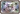](pages/%E7%99%BD%E9%87%91%E4%BC%9A%E5%91%98%E5%8D%A1.html "白金会员卡") [白金会员卡](pages/%E7%99%BD%E9%87%91%E4%BC%9A%E5%91%98%E5%8D%A1.html "白金会员卡")•  [白色百合花项圈](pages/%E7%99%BD%E8%89%B2%E7%99%BE%E5%90%88%E8%8A%B1%E9%A1%B9%E5%9C%88.html "白色百合花项圈")• [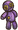](pages/%E6%8A%B1%E6%8A%B1%E5%85%88%E7%94%9F.html "抱抱先生") [抱抱先生](pages/%E6%8A%B1%E6%8A%B1%E5%85%88%E7%94%9F.html "抱抱先生")•  [宝藏箱](pages/%E5%AE%9D%E8%97%8F%E7%AE%B1.html "宝藏箱")•  [宝石存钱罐](pages/%E5%AE%9D%E7%9F%B3%E5%AD%98%E9%92%B1%E7%BD%90.html "宝石存钱罐")•  [宝石盒](pages/%E5%AE%9D%E7%9F%B3%E7%9B%92.html "宝石盒")•  [捕梦网](pages/%E6%8D%95%E6%A2%A6%E7%BD%91.html "捕梦网")•  [不稳定重组器](pages/%E4%B8%8D%E7%A8%B3%E5%AE%9A%E9%87%8D%E7%BB%84%E5%99%A8.html "不稳定重组器")•  [财富护符](pages/%E8%B4%A2%E5%AF%8C%E6%8A%A4%E7%AC%A6.html "财富护符")•  [彩虹徽章](pages/%E5%BD%A9%E8%99%B9%E5%BE%BD%E7%AB%A0.html "彩虹徽章")•  [彩虹魔棒](pages/%E5%BD%A9%E8%99%B9%E9%AD%94%E6%A3%92.html "彩虹魔棒")•  [彩虹球](pages/%E5%BD%A9%E8%99%B9%E7%90%83.html "彩虹球")•  [重复触发器](pages/%E9%87%8D%E5%A4%8D%E8%A7%A6%E5%8F%91%E5%99%A8.html "重复触发器")•  [穿甲箭](pages/%E7%A9%BF%E7%94%B2%E7%AE%AD.html "穿甲箭")•  [存钱罐](pages/%E5%AD%98%E9%92%B1%E7%BD%90.html "存钱罐")•  [大煮锅](pages/%E5%A4%A7%E7%85%AE%E9%94%85.html "大煮锅")•  [笛子](pages/%E7%AC%9B%E5%AD%90.html "笛子")•  [钢之护符](pages/%E9%92%A2%E4%B9%8B%E6%8A%A4%E7%AC%A6.html "钢之护符")•  [海象尖牙](pages/%E6%B5%B7%E8%B1%A1%E5%B0%96%E7%89%99.html "海象尖牙")•  [号角](pages/%E5%8F%B7%E8%A7%92.html "号角")•  [黑暗护符](pages/%E9%BB%91%E6%9A%97%E6%8A%A4%E7%AC%A6.html "黑暗护符")•  [黑暗心之容器](pages/%E9%BB%91%E6%9A%97%E5%BF%83%E4%B9%8B%E5%AE%B9%E5%99%A8.html "黑暗心之容器")•  [红色兰花项圈](pages/%E7%BA%A2%E8%89%B2%E5%85%B0%E8%8A%B1%E9%A1%B9%E5%9C%88.html "红色兰花项圈")•  [会员卡](pages/%E4%BC%9A%E5%91%98%E5%8D%A1.html "会员卡")•  [火焰](pages/%E7%81%AB%E7%84%B0.html "火焰")•  [火焰徽章](pages/%E7%81%AB%E7%84%B0%E5%BE%BD%E7%AB%A0.html "火焰徽章")•  [尖刺项圈](pages/%E5%B0%96%E5%88%BA%E9%A1%B9%E5%9C%88.html "尖刺项圈")•  [巨大四叶草](pages/%E5%B7%A8%E5%A4%A7%E5%9B%9B%E5%8F%B6%E8%8D%89.html "巨大四叶草")•  [剧毒常春藤](pages/%E5%89%A7%E6%AF%92%E5%B8%B8%E6%98%A5%E8%97%A4.html "剧毒常春藤")•  [开心炸弹](pages/%E5%BC%80%E5%BF%83%E7%82%B8%E5%BC%B9.html "开心炸弹")•  [骷髅徽章](pages/%E9%AA%B7%E9%AB%85%E5%BE%BD%E7%AB%A0.html "骷髅徽章")•  [蓝色鼠尾草花项圈](pages/%E8%93%9D%E8%89%B2%E9%BC%A0%E5%B0%BE%E8%8D%89%E8%8A%B1%E9%A1%B9%E5%9C%88.html "蓝色鼠尾草花项圈")•  [狼徽章](pages/%E7%8B%BC%E5%BE%BD%E7%AB%A0.html "狼徽章")•  [狼印记](pages/%E7%8B%BC%E5%8D%B0%E8%AE%B0.html "狼印记")•  [炼金护符](pages/%E7%82%BC%E9%87%91%E6%8A%A4%E7%AC%A6.html "炼金护符")•  [龙的巢穴](pages/%E9%BE%99%E7%9A%84%E5%B7%A2%E7%A9%B4.html "龙的巢穴")•  [龙铭珠](pages/%E9%BE%99%E9%93%AD%E7%8F%A0.html "龙铭珠")•  [鹿木守护](pages/%E9%B9%BF%E6%9C%A8%E5%AE%88%E6%8A%A4.html "鹿木守护")• [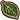](pages/%E7%BB%BF%E5%8F%B6%E5%BE%BD%E7%AB%A0.html "绿叶徽章") [绿叶徽章](pages/%E7%BB%BF%E5%8F%B6%E5%BE%BD%E7%AB%A0.html "绿叶徽章")•  [麻绳](pages/%E9%BA%BB%E7%BB%B3.html "麻绳")•  [命运小姐](pages/%E5%91%BD%E8%BF%90%E5%B0%8F%E5%A7%90.html "命运小姐")•  [磨刀石](pages/%E7%A3%A8%E5%88%80%E7%9F%B3.html "磨刀石")•  [魔法徽章](pages/%E9%AD%94%E6%B3%95%E5%BE%BD%E7%AB%A0.html "魔法徽章")•  [魔法球](pages/%E9%AD%94%E6%B3%95%E7%90%83.html "魔法球")•  [牧羊人的曲柄杖](pages/%E7%89%A7%E7%BE%8A%E4%BA%BA%E7%9A%84%E6%9B%B2%E6%9F%84%E6%9D%96.html "牧羊人的曲柄杖")•  [能量护符](pages/%E8%83%BD%E9%87%8F%E6%8A%A4%E7%AC%A6.html "能量护符")•  [牌堆](pages/%E7%89%8C%E5%A0%86.html "牌堆")•  [拼图徽章](pages/%E6%8B%BC%E5%9B%BE%E5%BE%BD%E7%AB%A0.html "拼图徽章")•  [平衡魔棒](pages/%E5%B9%B3%E8%A1%A1%E9%AD%94%E6%A3%92.html "平衡魔棒")•  [棋盘](pages/%E6%A3%8B%E7%9B%98.html "棋盘")•  [燃烧旗帜](pages/%E7%87%83%E7%83%A7%E6%97%97%E5%B8%9C.html "燃烧旗帜")•  [萨满面具](pages/%E8%90%A8%E6%BB%A1%E9%9D%A2%E5%85%B7.html "萨满面具")•  [沙包先生](pages/%E6%B2%99%E5%8C%85%E5%85%88%E7%94%9F.html "沙包先生")•  [闪光蜗牛壳](pages/%E9%97%AA%E5%85%89%E8%9C%97%E7%89%9B%E5%A3%B3.html "闪光蜗牛壳")•  [圣诞礼物](pages/%E5%9C%A3%E8%AF%9E%E7%A4%BC%E7%89%A9.html "圣诞礼物")•  [生命护符](pages/%E7%94%9F%E5%91%BD%E6%8A%A4%E7%AC%A6.html "生命护符")•  [时间扩大器](pages/%E6%97%B6%E9%97%B4%E6%89%A9%E5%A4%A7%E5%99%A8.html "时间扩大器")•  [世界树树叶](pages/%E4%B8%96%E7%95%8C%E6%A0%91%E6%A0%91%E5%8F%B6.html "世界树树叶")•  [石头徽章](pages/%E7%9F%B3%E5%A4%B4%E5%BE%BD%E7%AB%A0.html "石头徽章")• [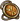](pages/%E9%A3%9F%E7%89%A9%E6%8A%A4%E7%AC%A6.html "食物护符") [食物护符](pages/%E9%A3%9F%E7%89%A9%E6%8A%A4%E7%AC%A6.html "食物护符")•  [天平](pages/%E5%A4%A9%E5%B9%B3.html "天平")• [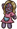](pages/%E8%B4%B4%E8%B4%B4%E5%A5%B3%E5%A3%AB.html "贴贴女士") [贴贴女士](pages/%E8%B4%B4%E8%B4%B4%E5%A5%B3%E5%A3%AB.html "贴贴女士")•  [铁砧](pages/%E9%93%81%E7%A0%A7.html "铁砧")•  [未知护符](pages/%E6%9C%AA%E7%9F%A5%E6%8A%A4%E7%AC%A6.html "未知护符")•  [稳定重组器](pages/%E7%A8%B3%E5%AE%9A%E9%87%8D%E7%BB%84%E5%99%A8.html "稳定重组器")•  [细绳](pages/%E7%BB%86%E7%BB%B3.html "细绳")•  [细绳徽章](pages/%E7%BB%86%E7%BB%B3%E5%BE%BD%E7%AB%A0.html "细绳徽章")•  [吸血鬼梳子](pages/%E5%90%B8%E8%A1%80%E9%AC%BC%E6%A2%B3%E5%AD%90.html "吸血鬼梳子")•  [橡子颈圈](pages/%E6%A9%A1%E5%AD%90%E9%A2%88%E5%9C%88.html "橡子颈圈")•  [血色护符](pages/%E8%A1%80%E8%89%B2%E6%8A%A4%E7%AC%A6.html "血色护符")•  [心之容器](pages/%E5%BF%83%E4%B9%8B%E5%AE%B9%E5%99%A8.html "心之容器")•  [幸运存钱罐](pages/%E5%B9%B8%E8%BF%90%E5%AD%98%E9%92%B1%E7%BD%90.html "幸运存钱罐")•  [幸运四叶草](pages/%E5%B9%B8%E8%BF%90%E5%9B%9B%E5%8F%B6%E8%8D%89.html "幸运四叶草")•  [幸运招财猫](pages/%E5%B9%B8%E8%BF%90%E6%8B%9B%E8%B4%A2%E7%8C%AB.html "幸运招财猫")•  [雪球](pages/%E9%9B%AA%E7%90%83.html "雪球")•  [摇晃雪人](pages/%E6%91%87%E6%99%83%E9%9B%AA%E4%BA%BA.html "摇晃雪人")•  [一袋石头](pages/%E4%B8%80%E8%A2%8B%E7%9F%B3%E5%A4%B4.html "一袋石头")•  [一堆金币](pages/%E4%B8%80%E5%A0%86%E9%87%91%E5%B8%81.html "一堆金币")•  [一口袋沙子](pages/%E4%B8%80%E5%8F%A3%E8%A2%8B%E6%B2%99%E5%AD%90.html "一口袋沙子")•  [永冻之火](pages/%E6%B0%B8%E5%86%BB%E4%B9%8B%E7%81%AB.html "永冻之火")•  [勇气之星](pages/%E5%8B%87%E6%B0%94%E4%B9%8B%E6%98%9F.html "勇气之星")•  [油灯](pages/%E6%B2%B9%E7%81%AF.html "油灯")•  [尤克里里](pages/%E5%B0%A4%E5%85%8B%E9%87%8C%E9%87%8C.html "尤克里里")•  [治疗草药](pages/%E6%B2%BB%E7%96%97%E8%8D%89%E8%8D%AF.html "治疗草药")•  [自然护符](pages/%E8%87%AA%E7%84%B6%E6%8A%A4%E7%AC%A6.html "自然护符") | | ▼ [武器](pages/%E6%AD%A6%E5%99%A8.html "武器") | | --- | |  [暴击法杖](pages/%E6%9A%B4%E5%87%BB%E6%B3%95%E6%9D%96.html "暴击法杖")•  [杯糕法杖](pages/%E6%9D%AF%E7%B3%95%E6%B3%95%E6%9D%96.html "杯糕法杖")• [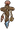](pages/%E8%B4%9D%E5%A3%B3%E5%9B%BE%E8%85%BE.html "贝壳图腾") [贝壳图腾](pages/%E8%B4%9D%E5%A3%B3%E5%9B%BE%E8%85%BE.html "贝壳图腾")•  [笨重巨剑](pages/%E7%AC%A8%E9%87%8D%E5%B7%A8%E5%89%91.html "笨重巨剑")•  [匕首](pages/%E5%8C%95%E9%A6%96.html "匕首")•  [匕首回旋镖](pages/%E5%8C%95%E9%A6%96%E5%9B%9E%E6%97%8B%E9%95%96.html "匕首回旋镖")•  [冰霜巨龙](pages/%E5%86%B0%E9%9C%9C%E5%B7%A8%E9%BE%99.html "冰霜巨龙")•  [啵啵](pages/%E5%95%B5%E5%95%B5.html "啵啵")•  [不愈法杖](pages/%E4%B8%8D%E6%84%88%E6%B3%95%E6%9D%96.html "不愈法杖")• [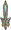](pages/%E5%BD%A9%E8%99%B9%E5%89%91.html "彩虹剑") [彩虹剑](pages/%E5%BD%A9%E8%99%B9%E5%89%91.html "彩虹剑")•  [铲铲](pages/%E9%93%B2%E9%93%B2.html "铲铲")•  [长矛](pages/%E9%95%BF%E7%9F%9B.html "长矛")•  [超长矛](pages/%E8%B6%85%E9%95%BF%E7%9F%9B.html "超长矛")•  [炽热匕首](pages/%E7%82%BD%E7%83%AD%E5%8C%95%E9%A6%96.html "炽热匕首")•  [炽热长矛](pages/%E7%82%BD%E7%83%AD%E9%95%BF%E7%9F%9B.html "炽热长矛")•  [炽热巨剑](pages/%E7%82%BD%E7%83%AD%E5%B7%A8%E5%89%91.html "炽热巨剑")•  [锤子](pages/%E9%94%A4%E5%AD%90.html "锤子")•  [大得离谱的荆棘剑](pages/%E5%A4%A7%E5%BE%97%E7%A6%BB%E8%B0%B1%E7%9A%84%E8%8D%86%E6%A3%98%E5%89%91.html "大得离谱的荆棘剑")•  [颠茄剧毒短弓](pages/%E9%A2%A0%E8%8C%84%E5%89%A7%E6%AF%92%E7%9F%AD%E5%BC%93.html "颠茄剧毒短弓")•  [颠茄剧毒弓](pages/%E9%A2%A0%E8%8C%84%E5%89%A7%E6%AF%92%E5%BC%93.html "颠茄剧毒弓")•  [短弓](pages/%E7%9F%AD%E5%BC%93.html "短弓")•  [锻造锤](pages/%E9%94%BB%E9%80%A0%E9%94%A4.html "锻造锤")•  [锻造巨剑](pages/%E9%94%BB%E9%80%A0%E5%B7%A8%E5%89%91.html "锻造巨剑")•  [法杖](pages/%E6%B3%95%E6%9D%96.html "法杖")•  [反派之剑](pages/%E5%8F%8D%E6%B4%BE%E4%B9%8B%E5%89%91.html "反派之剑")•  [翡翠幼龙](pages/%E7%BF%A1%E7%BF%A0%E5%B9%BC%E9%BE%99.html "翡翠幼龙")• [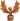](pages/%E5%87%A4%E5%87%B0.html "凤凰") [凤凰](pages/%E5%87%A4%E5%87%B0.html "凤凰")•  [腐败熊猫之锅](pages/%E8%85%90%E8%B4%A5%E7%86%8A%E7%8C%AB%E4%B9%8B%E9%94%85.html "腐败熊猫之锅")• [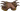](pages/%E6%94%BB%E5%87%BB%E4%B9%8B%E7%88%AA.html "攻击之爪") [攻击之爪](pages/%E6%94%BB%E5%87%BB%E4%B9%8B%E7%88%AA.html "攻击之爪")•  [弓箭](pages/%E5%BC%93%E7%AE%AD.html "弓箭")•  [光剑](pages/%E5%85%89%E5%89%91.html "光剑")•  [荷包蛋圣锅](pages/%E8%8D%B7%E5%8C%85%E8%9B%8B%E5%9C%A3%E9%94%85.html "荷包蛋圣锅")•  [黑暗剑](pages/%E9%BB%91%E6%9A%97%E5%89%91.html "黑暗剑")•  [黑晶龙](pages/%E9%BB%91%E6%99%B6%E9%BE%99.html "黑晶龙")•  [红宝石巨龙](pages/%E7%BA%A2%E5%AE%9D%E7%9F%B3%E5%B7%A8%E9%BE%99.html "红宝石巨龙")•  [红宝石幼龙](pages/%E7%BA%A2%E5%AE%9D%E7%9F%B3%E5%B9%BC%E9%BE%99.html "红宝石幼龙")• [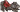](pages/%E6%8A%A4%E7%94%B2%E5%8B%87%E6%95%A2%E7%8B%BC%E5%B4%BD.html "护甲勇敢狼崽") [护甲勇敢狼崽](pages/%E6%8A%A4%E7%94%B2%E5%8B%87%E6%95%A2%E7%8B%BC%E5%B4%BD.html "护甲勇敢狼崽")•  [回旋镖](pages/%E5%9B%9E%E6%97%8B%E9%95%96.html "回旋镖")• [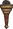](pages/%E7%81%AB%E6%8A%8A.html "火把") [火把](pages/%E7%81%AB%E6%8A%8A.html "火把")•  [火焰短剑](pages/%E7%81%AB%E7%84%B0%E7%9F%AD%E5%89%91.html "火焰短剑")•  [火焰剑](pages/%E7%81%AB%E7%84%B0%E5%89%91.html "火焰剑")•  [饥饿之刃](pages/%E9%A5%A5%E9%A5%BF%E4%B9%8B%E5%88%83.html "饥饿之刃")• [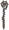](pages/%E5%B0%96%E5%88%BA%E6%B3%95%E6%9D%96.html "尖刺法杖") [尖刺法杖](pages/%E5%B0%96%E5%88%BA%E6%B3%95%E6%9D%96.html "尖刺法杖")• [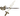](pages/%E5%89%91%E5%89%AA%E5%88%80.html "剑剪刀") [剑剪刀](pages/%E5%89%91%E5%89%AA%E5%88%80.html "剑剪刀")•  [尖牙短弓](pages/%E5%B0%96%E7%89%99%E7%9F%AD%E5%BC%93.html "尖牙短弓")•  [尖牙弓](pages/%E5%B0%96%E7%89%99%E5%BC%93.html "尖牙弓")•  [荆棘之鞭](pages/%E8%8D%86%E6%A3%98%E4%B9%8B%E9%9E%AD.html "荆棘之鞭")•  [荆棘之花](pages/%E8%8D%86%E6%A3%98%E4%B9%8B%E8%8A%B1.html "荆棘之花")•  [剧毒匕首](pages/%E5%89%A7%E6%AF%92%E5%8C%95%E9%A6%96.html "剧毒匕首")•  [剧毒矛](pages/%E5%89%A7%E6%AF%92%E7%9F%9B.html "剧毒矛")• [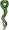](pages/%E5%89%A7%E6%AF%92%E8%9B%87%E6%9D%96.html "剧毒蛇杖") [剧毒蛇杖](pages/%E5%89%A7%E6%AF%92%E8%9B%87%E6%9D%96.html "剧毒蛇杖")•  [锯刃](pages/%E9%94%AF%E5%88%83.html "锯刃")•  [巨石像](pages/%E5%B7%A8%E7%9F%B3%E5%83%8F.html "巨石像")•  [酷炫西洋剑](pages/%E9%85%B7%E7%82%AB%E8%A5%BF%E6%B4%8B%E5%89%91.html "酷炫西洋剑")• [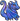](pages/%E8%93%9D%E5%AE%9D%E7%9F%B3%E5%B9%BC%E9%BE%99.html "蓝宝石幼龙") [蓝宝石幼龙](pages/%E8%93%9D%E5%AE%9D%E7%9F%B3%E5%B9%BC%E9%BE%99.html "蓝宝石幼龙")•  [烈火之鞭](pages/%E7%83%88%E7%81%AB%E4%B9%8B%E9%9E%AD.html "烈火之鞭")•  [烈火之杖](pages/%E7%83%88%E7%81%AB%E4%B9%8B%E6%9D%96.html "烈火之杖")•  [猎鹰战刃](pages/%E7%8C%8E%E9%B9%B0%E6%88%98%E5%88%83.html "猎鹰战刃")•  [魔法火把](pages/%E9%AD%94%E6%B3%95%E7%81%AB%E6%8A%8A.html "魔法火把")•  [木剑](pages/%E6%9C%A8%E5%89%91.html "木剑")•  [南瓜头](pages/%E5%8D%97%E7%93%9C%E5%A4%B4.html "南瓜头")•  [黏黏龙骑士](pages/%E9%BB%8F%E9%BB%8F%E9%BE%99%E9%AA%91%E5%A3%AB.html "黏黏龙骑士")•  [平底锅](pages/%E5%B9%B3%E5%BA%95%E9%94%85.html "平底锅")•  [燃烧火把](pages/%E7%87%83%E7%83%A7%E7%81%AB%E6%8A%8A.html "燃烧火把")•  [扫把](pages/%E6%89%AB%E6%8A%8A.html "扫把")•  [神圣长矛](pages/%E7%A5%9E%E5%9C%A3%E9%95%BF%E7%9F%9B.html "神圣长矛")•  [石头](pages/%E7%9F%B3%E5%A4%B4.html "石头")•  [十字剑](pages/%E5%8D%81%E5%AD%97%E5%89%91.html "十字剑")•  [霜冻之剑](pages/%E9%9C%9C%E5%86%BB%E4%B9%8B%E5%89%91.html "霜冻之剑")•  [双刃斧](pages/%E5%8F%8C%E5%88%83%E6%96%A7.html "双刃斧")•  [水元素](pages/%E6%B0%B4%E5%85%83%E7%B4%A0.html "水元素")•  [死神镰刀](pages/%E6%AD%BB%E7%A5%9E%E9%95%B0%E5%88%80.html "死神镰刀")• [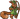](pages/%E6%9D%BE%E9%BC%A0%E5%B0%84%E6%89%8B.html "松鼠射手") [松鼠射手](pages/%E6%9D%BE%E9%BC%A0%E5%B0%84%E6%89%8B.html "松鼠射手")•  [锁链鞭](pages/%E9%94%81%E9%93%BE%E9%9E%AD.html "锁链鞭")•  [天命短弓](pages/%E5%A4%A9%E5%91%BD%E7%9F%AD%E5%BC%93.html "天命短弓")•  [天命弓](pages/%E5%A4%A9%E5%91%BD%E5%BC%93.html "天命弓")•  [铜指虎](pages/%E9%93%9C%E6%8C%87%E8%99%8E.html "铜指虎")•  [舞龙](pages/%E8%88%9E%E9%BE%99.html "舞龙")•  [武士刀](pages/%E6%AD%A6%E5%A3%AB%E5%88%80.html "武士刀")•  [吸魔剑](pages/%E5%90%B8%E9%AD%94%E5%89%91.html "吸魔剑")•  [吸血匕首](pages/%E5%90%B8%E8%A1%80%E5%8C%95%E9%A6%96.html "吸血匕首")•  [小鸟法杖](pages/%E5%B0%8F%E9%B8%9F%E6%B3%95%E6%9D%96.html "小鸟法杖")•  [血棘](pages/%E8%A1%80%E6%A3%98.html "血棘")•  [血腥镰刀](pages/%E8%A1%80%E8%85%A5%E9%95%B0%E5%88%80.html "血腥镰刀")•  [虚无之刃](pages/%E8%99%9A%E6%97%A0%E4%B9%8B%E5%88%83.html "虚无之刃")•  [雪杖](pages/%E9%9B%AA%E6%9D%96.html "雪杖")•  [遗迹石：寒冷](pages/%E9%81%97%E8%BF%B9%E7%9F%B3%EF%BC%9A%E5%AF%92%E5%86%B7.html "遗迹石：寒冷")•  [遗迹石：火焰](pages/%E9%81%97%E8%BF%B9%E7%9F%B3%EF%BC%9A%E7%81%AB%E7%84%B0.html "遗迹石：火焰")•  [遗迹石：死亡](pages/%E9%81%97%E8%BF%B9%E7%9F%B3%EF%BC%9A%E6%AD%BB%E4%BA%A1.html "遗迹石：死亡")• [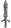](pages/%E8%8B%B1%E9%9B%84%E9%95%BF%E5%89%91.html "英雄长剑") [英雄长剑](pages/%E8%8B%B1%E9%9B%84%E9%95%BF%E5%89%91.html "英雄长剑")•  [勇敢狼崽](pages/%E5%8B%87%E6%95%A2%E7%8B%BC%E5%B4%BD.html "勇敢狼崽")•  [勇者之剑](pages/%E5%8B%87%E8%80%85%E4%B9%8B%E5%89%91.html "勇者之剑")•  [幽灵匕首](pages/%E5%B9%BD%E7%81%B5%E5%8C%95%E9%A6%96.html "幽灵匕首")•  [战斧](pages/%E6%88%98%E6%96%A7.html "战斧")•  [紫水晶幼龙](pages/%E7%B4%AB%E6%B0%B4%E6%99%B6%E5%B9%BC%E9%BE%99.html "紫水晶幼龙")•  [诅咒匕首](pages/%E8%AF%85%E5%92%92%E5%8C%95%E9%A6%96.html "诅咒匕首") | | ▼ [护甲](pages/%E6%8A%A4%E7%94%B2.html "护甲") | | --- | |  [冰霜护甲](pages/%E5%86%B0%E9%9C%9C%E6%8A%A4%E7%94%B2.html "冰霜护甲")•  [腐败护甲](pages/%E8%85%90%E8%B4%A5%E6%8A%A4%E7%94%B2.html "腐败护甲")•  [工作服](pages/%E5%B7%A5%E4%BD%9C%E6%9C%8D.html "工作服")•  [辉耀斗篷](pages/%E8%BE%89%E8%80%80%E6%96%97%E7%AF%B7.html "辉耀斗篷")•  [龙鳞护甲](pages/%E9%BE%99%E9%B3%9E%E6%8A%A4%E7%94%B2.html "龙鳞护甲")•  [皮制护甲](pages/%E7%9A%AE%E5%88%B6%E6%8A%A4%E7%94%B2.html "皮制护甲")• [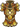](pages/%E6%97%A5%E8%80%80%E6%8A%A4%E7%94%B2.html "日耀护甲") [日耀护甲](pages/%E6%97%A5%E8%80%80%E6%8A%A4%E7%94%B2.html "日耀护甲")•  [神圣护甲](pages/%E7%A5%9E%E5%9C%A3%E6%8A%A4%E7%94%B2.html "神圣护甲")•  [石制护甲](pages/%E7%9F%B3%E5%88%B6%E6%8A%A4%E7%94%B2.html "石制护甲")•  [吸血护甲](pages/%E5%90%B8%E8%A1%80%E6%8A%A4%E7%94%B2.html "吸血护甲")•  [月光护甲](pages/%E6%9C%88%E5%85%89%E6%8A%A4%E7%94%B2.html "月光护甲") | | ▼ [背包](pages/%E8%83%8C%E5%8C%85.html "背包") | | --- | |  [爱的拼图背包](pages/%E7%88%B1%E7%9A%84%E6%8B%BC%E5%9B%BE%E8%83%8C%E5%8C%85.html "爱的拼图背包")•  [财富之盒](pages/%E8%B4%A2%E5%AF%8C%E4%B9%8B%E7%9B%92.html "财富之盒")•  [储物棺材](pages/%E5%82%A8%E7%89%A9%E6%A3%BA%E6%9D%90.html "储物棺材")•  [改良的拼图背包](pages/%E6%94%B9%E8%89%AF%E7%9A%84%E6%8B%BC%E5%9B%BE%E8%83%8C%E5%8C%85.html "改良的拼图背包")•  [给予之袋](pages/%E7%BB%99%E4%BA%88%E4%B9%8B%E8%A2%8B.html "给予之袋")•  [工具袋](pages/%E5%B7%A5%E5%85%B7%E8%A2%8B.html "工具袋")•  [毁坏的拼图背包](pages/%E6%AF%81%E5%9D%8F%E7%9A%84%E6%8B%BC%E5%9B%BE%E8%83%8C%E5%8C%85.html "毁坏的拼图背包")•  [火坑](pages/%E7%81%AB%E5%9D%91.html "火坑")•  [惊喜袋](pages/%E6%83%8A%E5%96%9C%E8%A2%8B.html "惊喜袋")•  [露营背包](pages/%E9%9C%B2%E8%90%A5%E8%83%8C%E5%8C%85.html "露营背包")•  [旅行包](pages/%E6%97%85%E8%A1%8C%E5%8C%85.html "旅行包")• [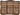](pages/%E6%97%85%E8%A1%8C%E8%A2%8B.html "旅行袋") [旅行袋](pages/%E6%97%85%E8%A1%8C%E8%A2%8B.html "旅行袋")•  [魔法学院袋](pages/%E9%AD%94%E6%B3%95%E5%AD%A6%E9%99%A2%E8%A2%8B.html "魔法学院袋")•  [魔药腰带](pages/%E9%AD%94%E8%8D%AF%E8%85%B0%E5%B8%A6.html "魔药腰带")•  [耐力包](pages/%E8%80%90%E5%8A%9B%E5%8C%85.html "耐力包")•  [耐力拼图背包](pages/%E8%80%90%E5%8A%9B%E6%8B%BC%E5%9B%BE%E8%83%8C%E5%8C%85.html "耐力拼图背包")•  [能量拼图背包](pages/%E8%83%BD%E9%87%8F%E6%8B%BC%E5%9B%BE%E8%83%8C%E5%8C%85.html "能量拼图背包")• [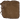](pages/%E7%9A%AE%E5%8C%85.html "皮包") [皮包](pages/%E7%9A%AE%E5%8C%85.html "皮包")•  [拼图背包](pages/%E6%8B%BC%E5%9B%BE%E8%83%8C%E5%8C%85.html "拼图背包")•  [守护钱包](pages/%E5%AE%88%E6%8A%A4%E9%92%B1%E5%8C%85.html "守护钱包")•  [藤条编织篮](pages/%E8%97%A4%E6%9D%A1%E7%BC%96%E7%BB%87%E7%AF%AE.html "藤条编织篮")•  [献祭之碗](pages/%E7%8C%AE%E7%A5%AD%E4%B9%8B%E7%A2%97.html "献祭之碗")•  [腰包](pages/%E8%85%B0%E5%8C%85.html "腰包")•  [遗物箱](pages/%E9%81%97%E7%89%A9%E7%AE%B1.html "遗物箱")•  [针线包](pages/%E9%92%88%E7%BA%BF%E5%8C%85.html "针线包") | | ▼ [食物](pages/%E9%A3%9F%E7%89%A9.html "食物") | | --- | |  [菠萝](pages/%E8%8F%A0%E8%90%9D.html "菠萝")•  [大蒜](pages/%E5%A4%A7%E8%92%9C.html "大蒜")•  [红辣椒](pages/%E7%BA%A2%E8%BE%A3%E6%A4%92.html "红辣椒")•  [姜饼杰瑞](pages/%E5%A7%9C%E9%A5%BC%E6%9D%B0%E7%91%9E.html "姜饼杰瑞")•  [浆果提灯](pages/%E6%B5%86%E6%9E%9C%E6%8F%90%E7%81%AF.html "浆果提灯")•  [蓝莓](pages/%E8%93%9D%E8%8E%93.html "蓝莓")•  [萝卜](pages/%E8%90%9D%E5%8D%9C.html "萝卜")•  [魔法杯糕](pages/%E9%AD%94%E6%B3%95%E6%9D%AF%E7%B3%95.html "魔法杯糕")•  [奶酪](pages/%E5%A5%B6%E9%85%AA.html "奶酪")•  [南瓜头](pages/%E5%8D%97%E7%93%9C%E5%A4%B4.html "南瓜头")•  [西兰花](pages/%E8%A5%BF%E5%85%B0%E8%8A%B1.html "西兰花")•  [香蕉](pages/%E9%A6%99%E8%95%89.html "香蕉")•  [雪人蛋糕](pages/%E9%9B%AA%E4%BA%BA%E8%9B%8B%E7%B3%95.html "雪人蛋糕")•  [一碗零食](pages/%E4%B8%80%E7%A2%97%E9%9B%B6%E9%A3%9F.html "一碗零食")•  [致幻蘑菇](pages/%E8%87%B4%E5%B9%BB%E8%98%91%E8%8F%87.html "致幻蘑菇")•  [致死蘑菇](pages/%E8%87%B4%E6%AD%BB%E8%98%91%E8%8F%87.html "致死蘑菇") | | ▼ [宝石](pages/%E5%AE%9D%E7%9F%B3.html "宝石") | | --- | |  [大象符文](pages/%E5%A4%A7%E8%B1%A1%E7%AC%A6%E6%96%87.html "大象符文")•  [翡翠](pages/%E7%BF%A1%E7%BF%A0.html "翡翠")•  [腐败水晶](pages/%E8%85%90%E8%B4%A5%E6%B0%B4%E6%99%B6.html "腐败水晶")•  [红宝石](pages/%E7%BA%A2%E5%AE%9D%E7%9F%B3.html "红宝石")•  [獾符文](pages/%E7%8D%BE%E7%AC%A6%E6%96%87.html "獾符文")•  [黄宝石](pages/%E9%BB%84%E5%AE%9D%E7%9F%B3.html "黄宝石")•  [骷髅蒂姆](pages/%E9%AA%B7%E9%AB%85%E8%92%82%E5%A7%86.html "骷髅蒂姆")•  [蓝宝石](pages/%E8%93%9D%E5%AE%9D%E7%9F%B3.html "蓝宝石")•  [老虎符文](pages/%E8%80%81%E8%99%8E%E7%AC%A6%E6%96%87.html "老虎符文")•  [猎鹰符文](pages/%E7%8C%8E%E9%B9%B0%E7%AC%A6%E6%96%87.html "猎鹰符文")•  [燃烧煤炭](pages/%E7%87%83%E7%83%A7%E7%85%A4%E7%82%AD.html "燃烧煤炭")• [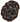](pages/%E4%B8%80%E5%9D%A8%E7%85%A4%E7%82%AD.html "一坨煤炭") [一坨煤炭](pages/%E4%B8%80%E5%9D%A8%E7%85%A4%E7%82%AD.html "一坨煤炭")•  [紫水晶](pages/%E7%B4%AB%E6%B0%B4%E6%99%B6.html "紫水晶") | | ▼ [手套](pages/%E6%89%8B%E5%A5%97.html "手套") | | --- | |  [力量手套](pages/%E5%8A%9B%E9%87%8F%E6%89%8B%E5%A5%97.html "力量手套")•  [龙爪](pages/%E9%BE%99%E7%88%AA.html "龙爪")•  [吸血手套](pages/%E5%90%B8%E8%A1%80%E6%89%8B%E5%A5%97.html "吸血手套")•  [迅捷手套](pages/%E8%BF%85%E6%8D%B7%E6%89%8B%E5%A5%97.html "迅捷手套") | | ▼ [头盔](pages/%E5%A4%B4%E7%9B%94.html "头盔") | | --- | |  [腐败头盔](pages/%E8%85%90%E8%B4%A5%E5%A4%B4%E7%9B%94.html "腐败头盔")•  [国王王冠](pages/%E5%9B%BD%E7%8E%8B%E7%8E%8B%E5%86%A0.html "国王王冠")•  [哈洛德，仇恨之帽](pages/%E5%93%88%E6%B4%9B%E5%BE%B7%EF%BC%8C%E4%BB%87%E6%81%A8%E4%B9%8B%E5%B8%BD.html "哈洛德，仇恨之帽")•  [辉耀王冠](pages/%E8%BE%89%E8%80%80%E7%8E%8B%E5%86%A0.html "辉耀王冠")•  [坚韧头盔](pages/%E5%9D%9A%E9%9F%A7%E5%A4%B4%E7%9B%94.html "坚韧头盔")•  [魔法帽](pages/%E9%AD%94%E6%B3%95%E5%B8%BD.html "魔法帽")•  [软呢帽](pages/%E8%BD%AF%E5%91%A2%E5%B8%BD.html "软呢帽")•  [石制头盔](pages/%E7%9F%B3%E5%88%B6%E5%A4%B4%E7%9B%94.html "石制头盔") | | ▼ [宠物](pages/%E5%AE%A0%E7%89%A9.html "宠物") | | --- | |  [冰霜巨龙](pages/%E5%86%B0%E9%9C%9C%E5%B7%A8%E9%BE%99.html "冰霜巨龙")•  [啵啵](pages/%E5%95%B5%E5%95%B5.html "啵啵")•  [不恐怖幽灵](pages/%E4%B8%8D%E6%81%90%E6%80%96%E5%B9%BD%E7%81%B5.html "不恐怖幽灵")•  [彩虹超级至尊黏黏](pages/%E5%BD%A9%E8%99%B9%E8%B6%85%E7%BA%A7%E8%87%B3%E5%B0%8A%E9%BB%8F%E9%BB%8F.html "彩虹超级至尊黏黏")•  [彩虹究极布丁黏黏](pages/%E5%BD%A9%E8%99%B9%E7%A9%B6%E6%9E%81%E5%B8%83%E4%B8%81%E9%BB%8F%E9%BB%8F.html "彩虹究极布丁黏黏")•  [彩虹巨大西兰花黏黏](pages/%E5%BD%A9%E8%99%B9%E5%B7%A8%E5%A4%A7%E8%A5%BF%E5%85%B0%E8%8A%B1%E9%BB%8F%E9%BB%8F.html "彩虹巨大西兰花黏黏")•  [彩虹杀戮者黏黏](pages/%E5%BD%A9%E8%99%B9%E6%9D%80%E6%88%AE%E8%80%85%E9%BB%8F%E9%BB%8F.html "彩虹杀戮者黏黏")•  [彩虹鲜艳糖果黏黏](pages/%E5%BD%A9%E8%99%B9%E9%B2%9C%E8%89%B3%E7%B3%96%E6%9E%9C%E9%BB%8F%E9%BB%8F.html "彩虹鲜艳糖果黏黏")•  [彩虹终极圆圆浓稠黏黏](pages/%E5%BD%A9%E8%99%B9%E7%BB%88%E6%9E%81%E5%9C%86%E5%9C%86%E6%B5%93%E7%A8%A0%E9%BB%8F%E9%BB%8F.html "彩虹终极圆圆浓稠黏黏")•  [蟾蜍](pages/%E8%9F%BE%E8%9C%8D.html "蟾蜍")•  [超级刺猬](pages/%E8%B6%85%E7%BA%A7%E5%88%BA%E7%8C%AC.html "超级刺猬")•  [刺猬](pages/%E5%88%BA%E7%8C%AC.html "刺猬")•  [大师雪人](pages/%E5%A4%A7%E5%B8%88%E9%9B%AA%E4%BA%BA.html "大师雪人")•  [方块黏黏](pages/%E6%96%B9%E5%9D%97%E9%BB%8F%E9%BB%8F.html "方块黏黏")•  [翡翠龙蛋](pages/%E7%BF%A1%E7%BF%A0%E9%BE%99%E8%9B%8B.html "翡翠龙蛋")•  [翡翠幼龙](pages/%E7%BF%A1%E7%BF%A0%E5%B9%BC%E9%BE%99.html "翡翠幼龙")•  [凤凰](pages/%E5%87%A4%E5%87%B0.html "凤凰")•  [钢之黏黏](pages/%E9%92%A2%E4%B9%8B%E9%BB%8F%E9%BB%8F.html "钢之黏黏")•  [光之黏黏](pages/%E5%85%89%E4%B9%8B%E9%BB%8F%E9%BB%8F.html "光之黏黏")•  [国王黏黏](pages/%E5%9B%BD%E7%8E%8B%E9%BB%8F%E9%BB%8F.html "国王黏黏")•  [哈洛德，仇恨之帽](pages/%E5%93%88%E6%B4%9B%E5%BE%B7%EF%BC%8C%E4%BB%87%E6%81%A8%E4%B9%8B%E5%B8%BD.html "哈洛德，仇恨之帽")•  [黑晶龙](pages/%E9%BB%91%E6%99%B6%E9%BE%99.html "黑晶龙")•  [红宝石巨龙](pages/%E7%BA%A2%E5%AE%9D%E7%9F%B3%E5%B7%A8%E9%BE%99.html "红宝石巨龙")•  [红宝石龙蛋](pages/%E7%BA%A2%E5%AE%9D%E7%9F%B3%E9%BE%99%E8%9B%8B.html "红宝石龙蛋")•  [红宝石幼龙](pages/%E7%BA%A2%E5%AE%9D%E7%9F%B3%E5%B9%BC%E9%BE%99.html "红宝石幼龙")• [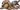](pages/%E6%8A%A4%E7%94%B2%E5%85%A8%E8%83%BD%E7%8B%BC%E5%B4%BD.html "护甲全能狼崽") [护甲全能狼崽](pages/%E6%8A%A4%E7%94%B2%E5%85%A8%E8%83%BD%E7%8B%BC%E5%B4%BD.html "护甲全能狼崽")•  [护甲睿智狼崽](pages/%E6%8A%A4%E7%94%B2%E7%9D%BF%E6%99%BA%E7%8B%BC%E5%B4%BD.html "护甲睿智狼崽")•  [护甲勇敢狼崽](pages/%E6%8A%A4%E7%94%B2%E5%8B%87%E6%95%A2%E7%8B%BC%E5%B4%BD.html "护甲勇敢狼崽")•  [极乐小鸟](pages/%E6%9E%81%E4%B9%90%E5%B0%8F%E9%B8%9F.html "极乐小鸟")•  [急速小蜗](pages/%E6%80%A5%E9%80%9F%E5%B0%8F%E8%9C%97.html "急速小蜗")•  [剧毒黏黏](pages/%E5%89%A7%E6%AF%92%E9%BB%8F%E9%BB%8F.html "剧毒黏黏")•  [剧毒蛙](pages/%E5%89%A7%E6%AF%92%E8%9B%99.html "剧毒蛙")•  [巨石像](pages/%E5%B7%A8%E7%9F%B3%E5%83%8F.html "巨石像")•  [克总之颅](pages/%E5%85%8B%E6%80%BB%E4%B9%8B%E9%A2%85.html "克总之颅")•  [快乐小火](pages/%E5%BF%AB%E4%B9%90%E5%B0%8F%E7%81%AB.html "快乐小火")•  [辣椒黏黏](pages/%E8%BE%A3%E6%A4%92%E9%BB%8F%E9%BB%8F.html "辣椒黏黏")•  [蓝宝石龙蛋](pages/%E8%93%9D%E5%AE%9D%E7%9F%B3%E9%BE%99%E8%9B%8B.html "蓝宝石龙蛋")•  [蓝宝石幼龙](pages/%E8%93%9D%E5%AE%9D%E7%9F%B3%E5%B9%BC%E9%BE%99.html "蓝宝石幼龙")•  [鹿角翼兔](pages/%E9%B9%BF%E8%A7%92%E7%BF%BC%E5%85%94.html "鹿角翼兔")•  [萝卜头黏黏](pages/%E8%90%9D%E5%8D%9C%E5%A4%B4%E9%BB%8F%E9%BB%8F.html "萝卜头黏黏")•  [魔法杯糕黏黏](pages/%E9%AD%94%E6%B3%95%E6%9D%AF%E7%B3%95%E9%BB%8F%E9%BB%8F.html "魔法杯糕黏黏")•  [奶酪黏黏](pages/%E5%A5%B6%E9%85%AA%E9%BB%8F%E9%BB%8F.html "奶酪黏黏")•  [黏宝宝](pages/%E9%BB%8F%E5%AE%9D%E5%AE%9D.html "黏宝宝")•  [黏黏](pages/%E9%BB%8F%E9%BB%8F.html "黏黏")•  [黏黏龙骑士](pages/%E9%BB%8F%E9%BB%8F%E9%BE%99%E9%AA%91%E5%A3%AB.html "黏黏龙骑士")•  [全能狼崽](pages/%E5%85%A8%E8%83%BD%E7%8B%BC%E5%B4%BD.html "全能狼崽")•  [睿智狼崽](pages/%E7%9D%BF%E6%99%BA%E7%8B%BC%E5%B4%BD.html "睿智狼崽")•  [蛇蛇](pages/%E8%9B%87%E8%9B%87.html "蛇蛇")•  [鼠大厨](pages/%E9%BC%A0%E5%A4%A7%E5%8E%A8.html "鼠大厨")•  [鼠鼠](pages/%E9%BC%A0%E9%BC%A0.html "鼠鼠")•  [水银元素](pages/%E6%B0%B4%E9%93%B6%E5%85%83%E7%B4%A0.html "水银元素")•  [水元素](pages/%E6%B0%B4%E5%85%83%E7%B4%A0.html "水元素")•  [松鼠](pages/%E6%9D%BE%E9%BC%A0.html "松鼠")•  [松鼠射手](pages/%E6%9D%BE%E9%BC%A0%E5%B0%84%E6%89%8B.html "松鼠射手")•  [歪脖鸟](pages/%E6%AD%AA%E8%84%96%E9%B8%9F.html "歪脖鸟")•  [乌龟](pages/%E4%B9%8C%E9%BE%9F.html "乌龟")•  [乌鸦](pages/%E4%B9%8C%E9%B8%A6.html "乌鸦")•  [西兰花黏黏](pages/%E8%A5%BF%E5%85%B0%E8%8A%B1%E9%BB%8F%E9%BB%8F.html "西兰花黏黏")•  [小板栗](pages/%E5%B0%8F%E6%9D%BF%E6%A0%97.html "小板栗")•  [小鸟法杖](pages/%E5%B0%8F%E9%B8%9F%E6%B3%95%E6%9D%96.html "小鸟法杖")•  [小蜗](pages/%E5%B0%8F%E8%9C%97.html "小蜗")•  [血之黏黏](pages/%E8%A1%80%E4%B9%8B%E9%BB%8F%E9%BB%8F.html "血之黏黏")•  [勇敢狼崽](pages/%E5%8B%87%E6%95%A2%E7%8B%BC%E5%B4%BD.html "勇敢狼崽")•  [幽灵獾](pages/%E5%B9%BD%E7%81%B5%E7%8D%BE.html "幽灵獾")•  [幽灵猫](pages/%E5%B9%BD%E7%81%B5%E7%8C%AB.html "幽灵猫")•  [幽灵猫头鹰](pages/%E5%B9%BD%E7%81%B5%E7%8C%AB%E5%A4%B4%E9%B9%B0.html "幽灵猫头鹰")•  [紫水晶龙蛋](pages/%E7%B4%AB%E6%B0%B4%E6%99%B6%E9%BE%99%E8%9B%8B.html "紫水晶龙蛋")•  [紫水晶幼龙](pages/%E7%B4%AB%E6%B0%B4%E6%99%B6%E5%B9%BC%E9%BE%99.html "紫水晶幼龙") | | ▼ [卡牌](pages/%E5%8D%A1%E7%89%8C.html "卡牌") | | --- | | [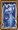](pages/%E7%99%BD%E7%9C%BC%E9%9D%92%E9%BE%99.html "白眼青龙") [白眼青龙](pages/%E7%99%BD%E7%9C%BC%E9%9D%92%E9%BE%99.html "白眼青龙")•  [大火龙](pages/%E5%A4%A7%E7%81%AB%E9%BE%99.html "大火龙")•  [反弹！](pages/%E5%8F%8D%E5%BC%B9%EF%BC%81.html "反弹！")•  [黑暗莲花](pages/%E9%BB%91%E6%9A%97%E8%8E%B2%E8%8A%B1.html "黑暗莲花")•  [黑桃A](pages/%E9%BB%91%E6%A1%83A.html "黑桃A")•  [恋人](pages/%E6%81%8B%E4%BA%BA.html "恋人")•  [小丑牌](pages/%E5%B0%8F%E4%B8%91%E7%89%8C.html "小丑牌")• [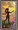](pages/%E6%84%9A%E8%80%85.html "愚者") [愚者](pages/%E6%84%9A%E8%80%85.html "愚者") | | ▼ [魔药](pages/%E9%AD%94%E8%8D%AF.html "魔药") | | --- | |  [彩虹魔药](pages/%E5%BD%A9%E8%99%B9%E9%AD%94%E8%8D%AF.html "彩虹魔药")•  [恶魔烧瓶](pages/%E6%81%B6%E9%AD%94%E7%83%A7%E7%93%B6.html "恶魔烧瓶")•  [魔法魔药](pages/%E9%AD%94%E6%B3%95%E9%AD%94%E8%8D%AF.html "魔法魔药")•  [强力恶魔烧瓶](pages/%E5%BC%BA%E5%8A%9B%E6%81%B6%E9%AD%94%E7%83%A7%E7%93%B6.html "强力恶魔烧瓶")•  [强力魔法魔药](pages/%E5%BC%BA%E5%8A%9B%E9%AD%94%E6%B3%95%E9%AD%94%E8%8D%AF.html "强力魔法魔药")•  [强力神圣魔药](pages/%E5%BC%BA%E5%8A%9B%E7%A5%9E%E5%9C%A3%E9%AD%94%E8%8D%AF.html "强力神圣魔药")•  [强力生命魔药](pages/%E5%BC%BA%E5%8A%9B%E7%94%9F%E5%91%BD%E9%AD%94%E8%8D%AF.html "强力生命魔药")•  [强力瘟疫烧瓶](pages/%E5%BC%BA%E5%8A%9B%E7%98%9F%E7%96%AB%E7%83%A7%E7%93%B6.html "强力瘟疫烧瓶")•  [强力吸血魔药](pages/%E5%BC%BA%E5%8A%9B%E5%90%B8%E8%A1%80%E9%AD%94%E8%8D%AF.html "强力吸血魔药")•  [强力硬化魔药](pages/%E5%BC%BA%E5%8A%9B%E7%A1%AC%E5%8C%96%E9%AD%94%E8%8D%AF.html "强力硬化魔药")•  [强力英勇魔药](pages/%E5%BC%BA%E5%8A%9B%E8%8B%B1%E5%8B%87%E9%AD%94%E8%8D%AF.html "强力英勇魔药")•  [神圣魔药](pages/%E7%A5%9E%E5%9C%A3%E9%AD%94%E8%8D%AF.html "神圣魔药")•  [生命魔药](pages/%E7%94%9F%E5%91%BD%E9%AD%94%E8%8D%AF.html "生命魔药")•  [瘟疫烧瓶](pages/%E7%98%9F%E7%96%AB%E7%83%A7%E7%93%B6.html "瘟疫烧瓶")•  [吸血魔药](pages/%E5%90%B8%E8%A1%80%E9%AD%94%E8%8D%AF.html "吸血魔药")•  [硬化魔药](pages/%E7%A1%AC%E5%8C%96%E9%AD%94%E8%8D%AF.html "硬化魔药")•  [英勇魔药](pages/%E8%8B%B1%E5%8B%87%E9%AD%94%E8%8D%AF.html "英勇魔药") | | ▼ [盾牌](pages/%E7%9B%BE%E7%89%8C.html "盾牌") | | --- | |  [冰霜盾牌](pages/%E5%86%B0%E9%9C%9C%E7%9B%BE%E7%89%8C.html "冰霜盾牌")•  [尖刺盾牌](pages/%E5%B0%96%E5%88%BA%E7%9B%BE%E7%89%8C.html "尖刺盾牌")•  [尖刺墙](pages/%E5%B0%96%E5%88%BA%E5%A2%99.html "尖刺墙")•  [木盾](pages/%E6%9C%A8%E7%9B%BE.html "木盾")•  [日耀盾牌](pages/%E6%97%A5%E8%80%80%E7%9B%BE%E7%89%8C.html "日耀盾牌")•  [心形盾牌](pages/%E5%BF%83%E5%BD%A2%E7%9B%BE%E7%89%8C.html "心形盾牌")•  [英雄盾牌](pages/%E8%8B%B1%E9%9B%84%E7%9B%BE%E7%89%8C.html "英雄盾牌")•  [勇气盾牌](pages/%E5%8B%87%E6%B0%94%E7%9B%BE%E7%89%8C.html "勇气盾牌")•  [月光盾](pages/%E6%9C%88%E5%85%89%E7%9B%BE.html "月光盾") | | ▼ [鞋子](pages/%E9%9E%8B%E5%AD%90.html "鞋子") | | --- | |  [飞鞋](pages/%E9%A3%9E%E9%9E%8B.html "飞鞋")•  [龙鳞靴](pages/%E9%BE%99%E9%B3%9E%E9%9D%B4.html "龙鳞靴")• [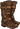](pages/%E7%9A%AE%E8%B4%A8%E9%9D%B4.html "皮质靴") [皮质靴](pages/%E7%9A%AE%E8%B4%A8%E9%9D%B4.html "皮质靴")• [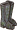](pages/%E7%9F%B3%E9%9D%B4.html "石靴") [石靴](pages/%E7%9F%B3%E9%9D%B4.html "石靴") | | ▲ [技能](pages/%E6%8A%80%E8%83%BD.html "技能") | | --- | |  [背包盛宴](pages/%E8%83%8C%E5%8C%85%E7%9B%9B%E5%AE%B4.html "背包盛宴")•  [别着急](pages/%E5%88%AB%E7%9D%80%E6%80%A5.html "别着急")•  [财富之吻](pages/%E8%B4%A2%E5%AF%8C%E4%B9%8B%E5%90%BB.html)•  [超大容量](pages/%E8%B6%85%E5%A4%A7%E5%AE%B9%E9%87%8F.html "超大容量")•  [纯粹加成](pages/%E7%BA%AF%E7%B2%B9%E5%8A%A0%E6%88%90.html "纯粹加成")•  [存钱罐皮纳塔](pages/%E5%AD%98%E9%92%B1%E7%BD%90%E7%9A%AE%E7%BA%B3%E5%A1%94.html "存钱罐皮纳塔")•  [大蒜挂壁](pages/%E5%A4%A7%E8%92%9C%E6%8C%82%E5%A3%81.html "大蒜挂壁")•  [刀刀见血](pages/%E5%88%80%E5%88%80%E8%A7%81%E8%A1%80.html "刀刀见血")•  [愤怒加倍](pages/%E6%84%A4%E6%80%92%E5%8A%A0%E5%80%8D.html "愤怒加倍")•  [附魔武器](pages/%E9%99%84%E9%AD%94%E6%AD%A6%E5%99%A8.html "附魔武器")•  [更多加成](pages/%E6%9B%B4%E5%A4%9A%E5%8A%A0%E6%88%90.html "更多加成")•  [怪力少女](pages/%E6%80%AA%E5%8A%9B%E5%B0%91%E5%A5%B3.html "怪力少女")•  [黑暗仪式](pages/%E9%BB%91%E6%9A%97%E4%BB%AA%E5%BC%8F.html "黑暗仪式")•  [护盾加强](pages/%E6%8A%A4%E7%9B%BE%E5%8A%A0%E5%BC%BA.html "护盾加强")•  [回响战嚎](pages/%E5%9B%9E%E5%93%8D%E6%88%98%E5%9A%8E.html "回响战嚎")•  [火辣香蕉](pages/%E7%81%AB%E8%BE%A3%E9%A6%99%E8%95%89.html "火辣香蕉")•  [尖刺爆发](pages/%E5%B0%96%E5%88%BA%E7%88%86%E5%8F%91.html "尖刺爆发")•  [开怀畅饮](pages/%E5%BC%80%E6%80%80%E7%95%85%E9%A5%AE.html "开怀畅饮")•  [龙骑士](pages/%E9%BE%99%E9%AA%91%E5%A3%AB.html "龙骑士")•  [魔法大师](pages/%E9%AD%94%E6%B3%95%E5%A4%A7%E5%B8%88.html "魔法大师")•  [魔法视觉](pages/%E9%AD%94%E6%B3%95%E8%A7%86%E8%A7%89.html "魔法视觉")•  [蘑菇农场](pages/%E8%98%91%E8%8F%87%E5%86%9C%E5%9C%BA.html "蘑菇农场")•  [黏黏派对](pages/%E9%BB%8F%E9%BB%8F%E6%B4%BE%E5%AF%B9.html "黏黏派对")•  [女射手](pages/%E5%A5%B3%E5%B0%84%E6%89%8B.html "女射手")•  [卡牌之心](pages/%E5%8D%A1%E7%89%8C%E4%B9%8B%E5%BF%83.html "卡牌之心")•  [全身防护](pages/%E5%85%A8%E8%BA%AB%E9%98%B2%E6%8A%A4.html "全身防护")•  [神圣特卖](pages/%E7%A5%9E%E5%9C%A3%E7%89%B9%E5%8D%96.html "神圣特卖")•  [升级](pages/%E5%8D%87%E7%BA%A7.html "升级")•  [时间融化](pages/%E6%97%B6%E9%97%B4%E8%9E%8D%E5%8C%96.html "时间融化")•  [双持武器](pages/%E5%8F%8C%E6%8C%81%E6%AD%A6%E5%99%A8.html "双持武器")•  [双重彩虹](pages/%E5%8F%8C%E9%87%8D%E5%BD%A9%E8%99%B9.html "双重彩虹")•  [太阳之力](pages/%E5%A4%AA%E9%98%B3%E4%B9%8B%E5%8A%9B.html "太阳之力")•  [铁匠入门指南](pages/%E9%93%81%E5%8C%A0%E5%85%A5%E9%97%A8%E6%8C%87%E5%8D%97.html "铁匠入门指南")•  [投石手](pages/%E6%8A%95%E7%9F%B3%E6%89%8B.html "投石手")•  [投资机会](pages/%E6%8A%95%E8%B5%84%E6%9C%BA%E4%BC%9A.html "投资机会")•  [挖呀挖](pages/%E6%8C%96%E5%91%80%E6%8C%96.html "挖呀挖")•  [万里挑一](pages/%E4%B8%87%E9%87%8C%E6%8C%91%E4%B8%80.html "万里挑一")•  [亡灵庇护](pages/%E4%BA%A1%E7%81%B5%E5%BA%87%E6%8A%A4.html "亡灵庇护")•  [王牌橡子](pages/%E7%8E%8B%E7%89%8C%E6%A9%A1%E5%AD%90.html "王牌橡子")•  [未挖掘潜力](pages/%E6%9C%AA%E6%8C%96%E6%8E%98%E6%BD%9C%E5%8A%9B.html "未挖掘潜力")•  [鲜血支配](pages/%E9%B2%9C%E8%A1%80%E6%94%AF%E9%85%8D.html "鲜血支配")•  [硬木](pages/%E7%A1%AC%E6%9C%A8.html "硬木")•  [永燃之火](pages/%E6%B0%B8%E7%87%83%E4%B9%8B%E7%81%AB.html "永燃之火")•  [月亮之力](pages/%E6%9C%88%E4%BA%AE%E4%B9%8B%E5%8A%9B.html "月亮之力")•  [终极升腾](pages/%E7%BB%88%E6%9E%81%E5%8D%87%E8%85%BE.html "终极升腾") | | ▼ [魔法卷轴](pages/%E9%AD%94%E6%B3%95%E5%8D%B7%E8%BD%B4.html "魔法卷轴") | | --- | |  [浆果提灯](pages/%E6%B5%86%E6%9E%9C%E6%8F%90%E7%81%AF.html "浆果提灯")•  [魔法卷轴：冰墙](pages/%E9%AD%94%E6%B3%95%E5%8D%B7%E8%BD%B4%EF%BC%9A%E5%86%B0%E5%A2%99.html "魔法卷轴：冰墙")•  [魔法卷轴：冰霜箭](pages/%E9%AD%94%E6%B3%95%E5%8D%B7%E8%BD%B4%EF%BC%9A%E5%86%B0%E9%9C%9C%E7%AE%AD.html "魔法卷轴：冰霜箭")•  [魔法卷轴：重生](pages/%E9%AD%94%E6%B3%95%E5%8D%B7%E8%BD%B4%EF%BC%9A%E9%87%8D%E7%94%9F.html "魔法卷轴：重生")•  [魔法卷轴：黑暗爆发](pages/%E9%AD%94%E6%B3%95%E5%8D%B7%E8%BD%B4%EF%BC%9A%E9%BB%91%E6%9A%97%E7%88%86%E5%8F%91.html "魔法卷轴：黑暗爆发")•  [魔法卷轴：净化祝福](pages/%E9%AD%94%E6%B3%95%E5%8D%B7%E8%BD%B4%EF%BC%9A%E5%87%80%E5%8C%96%E7%A5%9D%E7%A6%8F.html "魔法卷轴：净化祝福")•  [霜冻花](pages/%E9%9C%9C%E5%86%BB%E8%8A%B1.html "霜冻花")•  [霜冻魔镜](pages/%E9%9C%9C%E5%86%BB%E9%AD%94%E9%95%9C.html "霜冻魔镜")•  [死亡莲花](pages/%E6%AD%BB%E4%BA%A1%E8%8E%B2%E8%8A%B1.html "死亡莲花")•  [吞噬圆球](pages/%E5%90%9E%E5%99%AC%E5%9C%86%E7%90%83.html "吞噬圆球")•  [虚无之刃](pages/%E8%99%9A%E6%97%A0%E4%B9%8B%E5%88%83.html "虚无之刃") | | ▼ [魔法书](pages/%E9%AD%94%E6%B3%95%E4%B9%A6.html "魔法书") | | --- | |  [大自然编年史：林木](pages/%E5%A4%A7%E8%87%AA%E7%84%B6%E7%BC%96%E5%B9%B4%E5%8F%B2%EF%BC%9A%E6%9E%97%E6%9C%A8.html "大自然编年史：林木")•  [芙莉莲的冰魔法手册](pages/%E8%8A%99%E8%8E%89%E8%8E%B2%E7%9A%84%E5%86%B0%E9%AD%94%E6%B3%95%E6%89%8B%E5%86%8C.html "芙莉莲的冰魔法手册")•  [光之圣典](pages/%E5%85%89%E4%B9%8B%E5%9C%A3%E5%85%B8.html "光之圣典")•  [黑暗百科](pages/%E9%BB%91%E6%9A%97%E7%99%BE%E7%A7%91.html "黑暗百科")•  [魔法入门指南](pages/%E9%AD%94%E6%B3%95%E5%85%A5%E9%97%A8%E6%8C%87%E5%8D%97.html "魔法入门指南") | | ▼ [棋子](pages/%E6%A3%8B%E5%AD%90.html "棋子") | | --- | |  [白色城堡](pages/%E7%99%BD%E8%89%B2%E5%9F%8E%E5%A0%A1.html "白色城堡")•  [白色国王](pages/%E7%99%BD%E8%89%B2%E5%9B%BD%E7%8E%8B.html "白色国王")•  [白色皇后](pages/%E7%99%BD%E8%89%B2%E7%9A%87%E5%90%8E.html "白色皇后")•  [白色骑士](pages/%E7%99%BD%E8%89%B2%E9%AA%91%E5%A3%AB.html "白色骑士")•  [白色士兵](pages/%E7%99%BD%E8%89%B2%E5%A3%AB%E5%85%B5.html "白色士兵")•  [白色主教](pages/%E7%99%BD%E8%89%B2%E4%B8%BB%E6%95%99.html "白色主教")•  [黑色城堡](pages/%E9%BB%91%E8%89%B2%E5%9F%8E%E5%A0%A1.html "黑色城堡")•  [黑色国王](pages/%E9%BB%91%E8%89%B2%E5%9B%BD%E7%8E%8B.html "黑色国王")•  [黑色皇后](pages/%E9%BB%91%E8%89%B2%E7%9A%87%E5%90%8E.html "黑色皇后")•  [黑色骑士](pages/%E9%BB%91%E8%89%B2%E9%AA%91%E5%A3%AB.html "黑色骑士")•  [黑色士兵](pages/%E9%BB%91%E8%89%B2%E5%A3%AB%E5%85%B5.html "黑色士兵")•  [黑色主教](pages/%E9%BB%91%E8%89%B2%E4%B8%BB%E6%95%99.html "黑色主教") | |

检索自“[https://backpackbattles.wiki.gg/zh/wiki/财富之吻?oldid=5720](pages/%E8%B4%A2%E5%AF%8C%E4%B9%8B%E5%90%BB.html)”

[分类](pages/Special:%E9%A1%B5%E9%9D%A2%E5%88%86%E7%B1%BB.html "Special:页面分类")：​
*   [物品](pages/Category:%E7%89%A9%E5%93%81.html "Category:物品")
*   [特别](pages/Category:%E7%89%B9%E5%88%AB.html "Category:特别")
*   [技能](pages/Category:%E6%8A%80%E8%83%BD.html "Category:技能")
*   [幸运](pages/Category:%E5%B9%B8%E8%BF%90.html "Category:幸运")
*   [增益效果](pages/Category:%E5%A2%9E%E7%9B%8A%E6%95%88%E6%9E%9C.html "Category:增益效果")

[Report bad advertisement](https://www.wiki.gg/t/bad-ad)

*    此页面最后编辑于2025年11月22日 (星期六) 04:06。
*   2023 年 11 月之前创建的页面改编自Backpack Battles Fandom wiki。

除非另有说明，页面内容受[知识共享署名-相同方式共享 4.0 许可协议](https://creativecommons.org/licenses/by-sa/4.0/deed.zh-hans)约束。 

*   [使用条款](https://www.indie.io/terms-of-service)
*   [隐私政策](https://www.indie.io/privacy-policy)
*   [支持 Wiki](https://support.wiki.gg/)
*   [向 wiki.gg 提交工单](https://wiki.gg/go/servicedesk)
*   [状态页面](https://wikiggstatus.com/)
*   [Manage US Privacy Settings](pages/%E8%B4%A2%E5%AF%8C%E4%B9%8B%E5%90%BB.html)

*   
*   
*   
