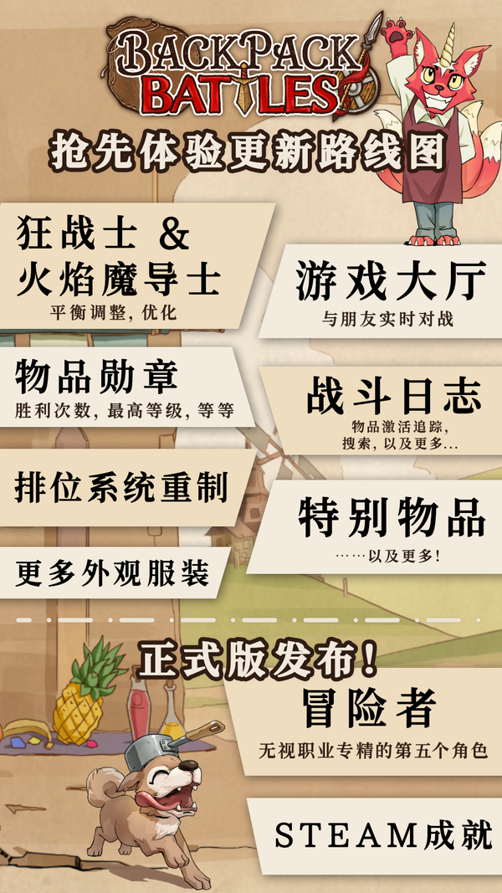

<!-- source: action=render -->

 

    
0.9.0

    

        <table class="stat">
            <tbody><tr>
                <th>日期</th>
                <td>2024-3-8</td>
            </tr>
        </tbody></table>
    

    

        <table class="stat">
            <tbody><tr>
                <td>← <a href="pages/0.8.4.html" title="0.8.4">0.8.4</a></td>
                <td style="text-align:right"><a href="pages/0.9.1.html" title="0.9.1">0.9.1</a> →</td>
            </tr>
        </tbody></table>
    

带上你的背包！
大家好,

激动人心的时刻终于到了！《背包乱斗》在Steam上已经正式发售！大家现在终于可以玩到我们努力开发许久的游戏，我们简直高兴得不行，背上背包开玩吧！

现在你可以选择四个职业：<a href="pages/%E6%B8%B8%E4%BE%A0.html" title="游侠">游侠</a>、<a href="pages/%E6%94%B6%E5%89%B2%E8%80%85.html" title="收割者">收割者</a>、<a href="pages/%E7%81%AB%E7%84%B0%E9%AD%94%E5%AF%BC%E5%A3%AB.html" title="火焰魔导士">火焰魔导士</a>，还有<a href="pages/%E7%8B%82%E6%88%98%E5%A3%AB.html" title="狂战士">狂战士</a>！
每个职业在第八回合都有5个<a href="pages/%E5%AD%90%E8%81%8C%E4%B8%9A.html" title="子职业">子职业</a>专精可供选择。有超多新内容等你去发现！

点此查看最新预告片！

 

<input type="checkbox" role="button" id="toctogglecheckbox" class="toctogglecheckbox" style="display:none">
<h2 id="mw-toc-heading">目录</h2><label class="toctogglelabel" for="toctogglecheckbox"></label>

<ul>
<li class="toclevel-1 tocsection-1"><a href="#抢先体验计划">1 抢先体验计划</a></li>
<li class="toclevel-1 tocsection-2"><a href="#完整版发布">2 完整版发布</a></li>
<li class="toclevel-1 tocsection-3"><a href="#更新补丁&amp;Demo">3 更新补丁&amp;Demo</a></li>
<li class="toclevel-1 tocsection-4"><a href="#火辣辣捆绑包">4 火辣辣捆绑包</a></li>
<li class="toclevel-1 tocsection-5"><a href="#更新日志">5 更新日志</a>
<ul>
<li class="toclevel-2 tocsection-6"><a href="#通用">5.1 通用</a></li>
<li class="toclevel-2 tocsection-7"><a href="#游侠">5.2 游侠</a></li>
<li class="toclevel-2 tocsection-8"><a href="#收割者">5.3 收割者</a></li>
<li class="toclevel-2 tocsection-9"><a href="#狂战士">5.4 狂战士</a></li>
<li class="toclevel-2 tocsection-10"><a href="#火焰魔导士">5.5 火焰魔导士</a></li>
<li class="toclevel-2 tocsection-11"><a href="#外部链接">5.6 外部链接</a></li>
</ul>
</li>
</ul>

<h2>抢先体验计划</h2>

我们的工作还没完成。在抢先体验阶段还会添加很多内容。下面是我们的路线图！

  

这些节点是初步制定的，很多事情会同步平行进展。但是最重要的还是新职业 - 与此同时还有会有BUG修复和平衡性调整。

大厅功能一直以来呼声较高。在幕后我们一直在开发这个功能，而且概念已经定下来了，但是像这么大的功能我们现在也不知道需要花费多久的时间。

另一个我们计划已久的功能是为玩家提供更多关于物品库中每个物品的统计数据，如果能够看到大家购买某个物品的频率，使用该物品到达了几回合，例如，使用该物品获得的最高排位是多少，我们觉得这样的功能很棒，也会非常有趣。还新加了一些物品趣味描述文本，也计划这里显示。

战斗日志自从加入后一直是玩家的最爱，而且我们打算在发售前加入更多功能。有些功能会很有用，比如搜索，或者查找某个物品激活的精确时间点。

我们还打算弄一下排位系统。现在还不能说太多，但是很有可能是赛季制。发售后，玩家在Demo中达到的排名会重置，如果将来有巨大改动或者采用赛季制，还会有更多重置。

特别物品池已经增加了很多的物品，大多数都是赛季物品。我们还想加入更多特别物品，而且已经有了很多想法了！

当然，我们还会为角色制作新的外观皮肤。现在来说，新角色有2套默认风格皮肤、2套chibi画风皮肤。

<h2>完整版发布</h2>

抢先体验结束，完整版将要发布的标志就是第五个职业的加入和Steam成就功能。我们计划加入“<a href="pages/%E5%86%92%E9%99%A9%E5%AE%B6.html" title="冒险家">冒险家</a>”，一个跨越职业限制的角色，每回合开始还会有一个随机物品，和“圣诞礼物”物品机制相似。我们有收到很多请求，加强“圣诞礼物”，通过这个方式加强，我们觉得很酷！按照计划，那这个“冒险家”不会有（或者很少）职业专精物品。请大家留意，现在还只是概念阶段，之后很有可能有变更。

<h2>更新补丁&amp;Demo</h2>

接下来游戏将会改变更新周期。之前我们连续39周，每周日更新，对此我们感到非常自豪。现在进入抢先体验阶段后，更新会变为长周期大更新。这样会利于我们去专注于先前计划好重要内容的开发。

关于Demo：将会继续保留在Steam和Itch.io上！如果你还在犹豫是否要买游戏，那就先试试Demo吧！

<h2>火辣辣捆绑包</h2>

我们很高兴宣布我们和《杀戮尖塔》和《土豆兄弟》打了捆绑包！购买此捆绑包，您可以享受 10% 的额外折扣！
《杀戮尖塔》和《土豆兄弟》都是非常棒的游戏，快来看看这两个捆绑包！

背包乱斗 + 杀戮尖塔
背包乱斗 + 杀戮尖塔
捆绑包包含 2 个物品
Slay the Spire
背包乱斗：福西法的宝藏 Backpack Battles
¥126.00
背包乱斗 + 杀戮尖塔

 
背包乱斗 + 土豆兄弟
背包乱斗 + 土豆兄弟
捆绑包包含 2 个物品
土豆兄弟(Brotato)
背包乱斗：福西法的宝藏 Backpack Battles
¥66.60
背包乱斗 + 土豆兄弟

 
感谢大家

真的非常感谢各位玩家，我们很重视！游戏现在已经远远超出我们最不实际的预期了。作为游戏开发者，我们想要的就是让各位玩家享受到我们的游戏。能做出一个让这么多玩家喜欢的游戏简直是梦想成真。我们会继续努力，竭尽所能将《背包乱斗》做到最好。

我们还要感谢一下IndieArk，在非常多的地方都帮了我们！！

如果你喜欢这个游戏，支持我们最好的方式就是在Steam上写一篇评测。评测对于游戏在商店的可见度曝光极度重要！非常感谢大家！

我们很期待大家的意见和对游戏的讨论，欢迎来我们的Discord频道或是官方QQ群：825229329。大家可以分享自己物品想法和最喜欢的流派！

游戏愉快！🤍

<h1>更新日志</h1>
<ul><li>新增职业<a href="pages/%E7%81%AB%E7%84%B0%E9%AD%94%E5%AF%BC%E5%A3%AB.html" title="火焰魔导士">火焰魔导士</a></li>
<li>新增职业<a href="pages/%E7%8B%82%E6%88%98%E5%A3%AB.html" title="狂战士">狂战士</a></li>
<li>重置排名</li></ul>
<h3>通用</h3>
<ul><li>新物品：<a href="pages/%E7%A5%9E%E5%9C%A3%E9%AD%94%E8%8D%AF.html" title="神圣魔药">神圣魔药</a></li>
<li>新物品：<a href="pages/%E5%90%B8%E8%A1%80%E9%AD%94%E8%8D%AF.html" title="吸血魔药">吸血魔药</a></li>
<li>新配方：<a href="pages/%E5%8A%9B%E9%87%8F%E6%89%8B%E5%A5%97.html" title="力量手套">力量手套</a></li>
<li>新配方：<a href="pages/%E6%9C%88%E5%85%89%E6%8A%A4%E7%94%B2.html" title="月光护甲">月光护甲</a></li>
<li>新配方：<a href="pages/%E7%9F%B3%E5%88%B6%E6%8A%A4%E7%94%B2.html" title="石制护甲">石制护甲</a></li></ul>
<h3>游侠</h3>
<ul><li>新的子职业：<a href="pages/%E4%B8%80%E7%A2%97%E9%9B%B6%E9%A3%9F.html" title="一碗零食">一碗零食</a></li>
<li>新的子职业：<a href="pages/%E5%B7%A8%E5%A4%A7%E5%9B%9B%E5%8F%B6%E8%8D%89.html" title="巨大四叶草">巨大四叶草</a></li>
<li>新物品：<a href="pages/%E5%88%BA%E7%8C%AC.html" title="刺猬">刺猬</a></li>
<li>新物品：<a href="pages/%E9%BC%A0%E9%BC%A0.html" title="鼠鼠">鼠鼠</a></li>
<li>新物品：<a href="pages/%E7%9F%AD%E5%BC%93.html" title="短弓">短弓</a></li>
<li>新物品：<a href="pages/%E6%9D%BE%E9%BC%A0.html" title="松鼠">松鼠</a></li>
<li>新配方：<a href="pages/%E9%A2%A0%E8%8C%84%E5%89%A7%E6%AF%92%E7%9F%AD%E5%BC%93.html" title="颠茄剧毒短弓">颠茄剧毒短弓</a></li>
<li>新配方：<a href="pages/%E5%A4%A9%E5%91%BD%E7%9F%AD%E5%BC%93.html" title="天命短弓">天命短弓</a></li>
<li>新配方：<a href="pages/%E5%B0%96%E7%89%99%E7%9F%AD%E5%BC%93.html" title="尖牙短弓">尖牙短弓</a></li></ul>
<h3>收割者</h3>
<ul><li>新的子职业：<a href="pages/%E5%A4%A7%E7%85%AE%E9%94%85.html" title="大煮锅">大煮锅</a></li>
<li>新的子职业：<a href="pages/%E8%9B%87%E8%9B%87.html" title="蛇蛇">蛇蛇</a></li>
<li>新物品：<a href="pages/%E5%91%BD%E8%BF%90%E5%B0%8F%E5%A7%90.html" title="命运小姐">命运小姐</a></li>
<li>新物品：<a href="pages/%E8%B4%B4%E8%B4%B4%E5%A5%B3%E5%A3%AB.html" title="贴贴女士">贴贴女士</a></li>
<li>新物品：<a href="pages/%E5%8F%8D%E5%BC%B9%EF%BC%81.html" title="反弹！">反弹！</a></li>
<li>新配方：<a href="pages/%E5%BC%BA%E5%8A%9B%E7%A5%9E%E5%9C%A3%E9%AD%94%E8%8D%AF.html" title="强力神圣魔药">强力神圣魔药</a></li>
<li>新物品：<a href="pages/%E5%BC%BA%E5%8A%9B%E9%AD%94%E6%B3%95%E9%AD%94%E8%8D%AF.html" title="强力魔法魔药">强力魔法魔药</a></li>
<li>新配方：<a href="pages/%E5%BC%BA%E5%8A%9B%E5%90%B8%E8%A1%80%E9%AD%94%E8%8D%AF.html" title="强力吸血魔药">强力吸血魔药</a></li></ul>
<h3>狂战士</h3>
<ul><li>新的子职业：<a href="pages/%E9%93%81%E7%A0%A7.html" title="铁砧">铁砧</a></li>
<li>新的子职业：<a href="pages/%E9%93%9C%E6%8C%87%E8%99%8E.html" title="铜指虎">铜指虎</a></li>
<li>新的子职业：<a href="pages/%E9%B9%BF%E6%9C%A8%E5%AE%88%E6%8A%A4.html" title="鹿木守护">鹿木守护</a></li>
<li>新的子职业：<a href="pages/%E8%90%A8%E6%BB%A1%E9%9D%A2%E5%85%B7.html" title="萨满面具">萨满面具</a></li>
<li>新的子职业：<a href="pages/%E7%8B%BC%E5%BE%BD%E7%AB%A0.html" title="狼徽章">狼徽章</a></li>
<li>新物品：<a href="pages/%E6%88%98%E6%96%A7.html" title="战斧">战斧</a></li>
<li>新物品：<a href="pages/%E7%8D%BE%E7%AC%A6%E6%96%87.html" title="獾符文">獾符文</a></li>
<li>新物品：<a href="pages/%E5%A5%B6%E9%85%AA.html" title="奶酪">奶酪</a></li>
<li>新物品：<a href="pages/%E5%8B%87%E6%95%A2%E7%8B%BC%E5%B4%BD.html" title="勇敢狼崽">勇敢狼崽</a></li>
<li>新物品：<a href="pages/%E6%97%85%E8%A1%8C%E5%8C%85.html" title="旅行包">旅行包</a></li>
<li>新物品：<a href="pages/%E5%A4%A7%E8%B1%A1%E7%AC%A6%E6%96%87.html" title="大象符文">大象符文</a></li>
<li>新物品：<a href="pages/%E9%94%BB%E9%80%A0%E9%94%A4.html" title="锻造锤">锻造锤</a></li>
<li>新物品：<a href="pages/%E7%8C%8E%E9%B9%B0%E7%AC%A6%E6%96%87.html" title="猎鹰符文">猎鹰符文</a></li>
<li>新物品：<a href="pages/%E5%85%A8%E8%83%BD%E7%8B%BC%E5%B4%BD.html" title="全能狼崽">全能狼崽</a></li>
<li>新物品：<a href="pages/%E5%B0%96%E5%88%BA%E9%A1%B9%E5%9C%88.html" title="尖刺项圈">尖刺项圈</a></li>
<li>新物品：<a href="pages/%E7%9D%BF%E6%99%BA%E7%8B%BC%E5%B4%BD.html" title="睿智狼崽">睿智狼崽</a></li>
<li>新配方：<a href="pages/%E6%8A%A4%E7%94%B2%E5%8B%87%E6%95%A2%E7%8B%BC%E5%B4%BD.html" title="护甲勇敢狼崽">护甲勇敢狼崽</a></li>
<li>新配方：<a href="pages/%E6%8A%A4%E7%94%B2%E5%85%A8%E8%83%BD%E7%8B%BC%E5%B4%BD.html" title="护甲全能狼崽">护甲全能狼崽</a></li>
<li>新配方：<a href="pages/%E6%8A%A4%E7%94%B2%E7%9D%BF%E6%99%BA%E7%8B%BC%E5%B4%BD.html" title="护甲睿智狼崽">护甲睿智狼崽</a></li>
<li>新配方：<a href="pages/%E9%94%BB%E9%80%A0%E5%B7%A8%E5%89%91.html" title="锻造巨剑">锻造巨剑</a></li>
<li>新配方：<a href="pages/%E9%94%81%E9%93%BE%E9%9E%AD.html" title="锁链鞭">锁链鞭</a></li>
<li>新配方：<a href="pages/%E5%A5%B6%E9%85%AA%E9%BB%8F%E9%BB%8F.html" title="奶酪黏黏">奶酪黏黏</a></li>
<li>新配方：<a href="pages/%E5%8F%8C%E5%88%83%E6%96%A7.html" title="双刃斧">双刃斧</a></li>
<li>新配方：<a href="pages/%E9%BE%99%E9%B3%9E%E6%8A%A4%E7%94%B2.html" title="龙鳞护甲">龙鳞护甲</a></li>
<li>新配方：<a href="pages/%E9%BE%99%E9%B3%9E%E9%9D%B4.html" title="龙鳞靴">龙鳞靴</a></li>
<li>新配方：<a href="pages/%E9%BE%99%E7%88%AA.html" title="龙爪">龙爪</a></li>
<li>新配方：<a href="pages/%E5%BD%A9%E8%99%B9%E6%9D%80%E6%88%AE%E8%80%85%E9%BB%8F%E9%BB%8F.html" title="彩虹杀戮者黏黏">彩虹杀戮者黏黏</a></li></ul>
<h3>火焰魔导士</h3>
<ul><li>新的子职业：<a href="pages/%E7%87%83%E7%83%A7%E6%97%97%E5%B8%9C.html" title="燃烧旗帜">燃烧旗帜</a></li>
<li>新的子职业：<a href="pages/%E9%BB%AF%E6%B7%A1%E6%8F%90%E7%81%AF.html" title="黯淡提灯">黯淡提灯</a></li>
<li>新的子职业：<a href="pages/%E9%BE%99%E7%9A%84%E5%B7%A2%E7%A9%B4.html" title="龙的巢穴">龙的巢穴</a></li>
<li>新的子职业：<a href="pages/%E5%BF%AB%E4%B9%90%E5%B0%8F%E7%81%AB.html" title="快乐小火">快乐小火</a></li>
<li>新的子职业：<a href="pages/%E6%B0%B8%E5%86%BB%E4%B9%8B%E7%81%AB.html" title="永冻之火">永冻之火</a></li>
<li>新物品：<a href="pages/%E7%B4%AB%E6%B0%B4%E6%99%B6%E9%BE%99%E8%9B%8B.html" title="紫水晶龙蛋">紫水晶龙蛋</a></li>
<li>新物品：<a href="pages/%E7%B4%AB%E6%B0%B4%E6%99%B6%E5%B9%BC%E9%BE%99.html" title="紫水晶幼龙">紫水晶幼龙</a></li>
<li>新物品：<a href="pages/%E5%86%B0%E9%9C%9C%E4%B9%8B%E4%B9%A6.html" title="冰霜之书">冰霜之书</a></li>
<li>新物品：<a href="pages/%E7%BA%A2%E8%BE%A3%E6%A4%92.html" title="红辣椒">红辣椒</a></li>
<li>新物品：<a href="pages/%E9%BE%99%E9%93%AD%E7%8F%A0.html" title="龙铭珠">龙铭珠</a></li>
<li>新物品：<a href="pages/%E7%BF%A1%E7%BF%A0%E9%BE%99%E8%9B%8B.html" title="翡翠龙蛋">翡翠龙蛋</a></li>
<li>新物品：<a href="pages/%E7%BF%A1%E7%BF%A0%E5%B9%BC%E9%BE%99.html" title="翡翠幼龙">翡翠幼龙</a></li>
<li>新物品：<a href="pages/%E7%81%AB%E5%9D%91.html" title="火坑">火坑</a></li>
<li>新物品：<a href="pages/%E7%81%AB%E7%84%B0.html" title="火焰">火焰</a></li>
<li>新物品：<a href="pages/%E5%87%A4%E5%87%B0.html" title="凤凰">凤凰</a></li>
<li>新物品：<a href="pages/%E8%93%9D%E5%AE%9D%E7%9F%B3%E9%BE%99%E8%9B%8B.html" title="蓝宝石龙蛋">蓝宝石龙蛋</a></li>
<li>新物品：<a href="pages/%E8%93%9D%E5%AE%9D%E7%9F%B3%E5%B9%BC%E9%BE%99.html" title="蓝宝石幼龙">蓝宝石幼龙</a></li>
<li>新物品：<a href="pages/%E9%AD%94%E6%B3%95%E5%8D%B7%E8%BD%B4%EF%BC%9A%E5%86%B0%E9%9C%9C%E7%AE%AD.html" title="魔法卷轴：冰霜箭">魔法卷轴：冰霜箭</a></li>
<li>新配方：<a href="pages/%E7%81%AB%E7%84%B0%E7%9F%AD%E5%89%91.html" title="火焰短剑">火焰短剑</a></li>
<li>新配方：<a href="pages/%E7%81%AB%E7%84%B0%E5%89%91.html" title="火焰剑">火焰剑</a></li>
<li>新配方：<a href="pages/%E8%BE%A3%E6%A4%92%E9%BB%8F%E9%BB%8F.html" title="辣椒黏黏">辣椒黏黏</a></li>
<li>新配方：<a href="pages/%E7%83%88%E7%81%AB%E4%B9%8B%E9%9E%AD.html" title="烈火之鞭">烈火之鞭</a></li>
<li>新配方：<a href="pages/%E9%9C%9C%E5%86%BB%E4%B9%8B%E5%89%91.html" title="霜冻之剑">霜冻之剑</a></li>
<li>新配方：<a href="pages/%E5%86%B0%E9%9C%9C%E7%9B%BE%E7%89%8C.html" title="冰霜盾牌">冰霜盾牌</a></li>
<li>新配方：<a href="pages/%E5%86%B0%E9%9C%9C%E6%8A%A4%E7%94%B2.html" title="冰霜护甲">冰霜护甲</a></li>
<li>新配方：<a href="pages/%E5%86%B0%E9%9C%9C%E5%B7%A8%E9%BE%99.html" title="冰霜巨龙">冰霜巨龙</a></li>
<li>新配方：<a href="pages/%E7%82%BD%E7%83%AD%E5%8C%95%E9%A6%96.html" title="炽热匕首">炽热匕首</a></li>
<li>新配方：<a href="pages/%E7%82%BD%E7%83%AD%E9%95%BF%E7%9F%9B.html" title="炽热长矛">炽热长矛</a></li>
<li>新配方：<a href="pages/%E9%BB%91%E6%99%B6%E9%BE%99.html" title="黑晶龙">黑晶龙</a></li>
<li>新配方：<a href="pages/%E5%BD%A9%E8%99%B9%E7%BB%88%E6%9E%81%E5%9C%86%E5%9C%86%E6%B5%93%E7%A8%A0%E9%BB%8F%E9%BB%8F.html" title="彩虹终极圆圆浓稠黏黏">彩虹终极圆圆浓稠黏黏</a></li>
<li>新配方：<a href="pages/%E7%83%88%E7%81%AB%E4%B9%8B%E6%9D%96.html" title="烈火之杖">烈火之杖</a></li>
<li>新配方：<a href="pages/%E6%97%A5%E8%80%80%E6%8A%A4%E7%94%B2.html" title="日耀护甲">日耀护甲</a></li>
<li>新配方：<a href="pages/%E6%97%A5%E8%80%80%E7%9B%BE%E7%89%8C.html" title="日耀盾牌">日耀盾牌</a></li></ul>
<h2>外部链接</h2>

<a rel="nofollow" class="external text" href="https://store.steampowered.com/news/app/2427700/view/4112420334823518834">0.9.0</a>

<table class="navbox mw-collapsible" data-expandtext="显示" data-collapsetext="隐藏"><tbody><tr class="navbox-title"><th colspan="2" scope="col"><a href="pages/Template:%E7%89%88%E6%9C%AC%E5%8E%86%E5%8F%B2.html" title="Template:版本历史">v</a> · <a class="text" href="pages/Template_talk:%E7%89%88%E6%9C%AC%E5%8E%86%E5%8F%B2.html">d</a> · <a class="text" href="pages/Template:%E7%89%88%E6%9C%AC%E5%8E%86%E5%8F%B2.html">e</a><a href="pages/%E7%89%88%E6%9C%AC%E5%8E%86%E5%8F%B2.html" title="版本历史">版本历史</a></th></tr><tr class="navbox-gutter"><td colspan="2"></td></tr><tr class="navbox-row"><th class="navbox-group" scope="row">正式版</th><td class="navbox-list">
<a href="pages/1.0.9.html" title="1.0.9">1.0.9</a>&nbsp;• <a href="pages/1.0.8.html" title="1.0.8">1.0.8</a>&nbsp;• <a href="pages/1.0.7.html" title="1.0.7">1.0.7</a>&nbsp;• <a href="pages/1.0.6.html" title="1.0.6">1.0.6</a>&nbsp;• <a href="pages/1.0.5.html" title="1.0.5">1.0.5</a>&nbsp;• <a href="pages/1.0.4.html" title="1.0.4">1.0.4</a>&nbsp;• <a href="pages/1.0.3.html" title="1.0.3">1.0.3</a>&nbsp;• <a href="pages/1.0.2.html" title="1.0.2">1.0.2</a>&nbsp;• <a href="pages/1.0.1.html" title="1.0.1">1.0.1</a>&nbsp;• <a href="pages/1.0.0.html" title="1.0.0">1.0.0</a>
</td></tr><tr class="navbox-gutter"><td colspan="2"></td></tr><tr class="navbox-row alt"><th class="navbox-group" scope="row">EA阶段</th><td class="navbox-list">
<a href="pages/0.9.41.html" title="0.9.41">0.9.41</a>&nbsp;• <a href="pages/0.9.40.html" title="0.9.40">0.9.40</a>&nbsp;• <a href="pages/0.9.39.html" title="0.9.39">0.9.39</a>&nbsp;• <a href="pages/0.9.38.html" title="0.9.38">0.9.38</a>&nbsp;• <a href="pages/0.9.37.html" title="0.9.37">0.9.37</a>&nbsp;• <a href="pages/0.9.36.html" title="0.9.36">0.9.36</a>&nbsp;• <a href="pages/0.9.35.html" title="0.9.35">0.9.35</a>&nbsp;• <a href="pages/0.9.34.html" title="0.9.34">0.9.34</a>&nbsp;• <a href="pages/0.9.33.html" title="0.9.33">0.9.33</a>&nbsp;• <a href="pages/0.9.32.html" title="0.9.32">0.9.32</a>&nbsp;• <a href="pages/0.9.31.html" title="0.9.31">0.9.31</a>&nbsp;• <a href="pages/0.9.30.html" title="0.9.30">0.9.30</a>&nbsp;• <a href="pages/0.9.29.html" title="0.9.29">0.9.29</a>&nbsp;• <a href="pages/0.9.28.html" title="0.9.28">0.9.28</a>&nbsp;• <a href="pages/0.9.27.html" title="0.9.27">0.9.27</a>&nbsp;• <a href="pages/0.9.26.html" title="0.9.26">0.9.26</a>&nbsp;• <a href="pages/0.9.25.html" title="0.9.25">0.9.25</a>&nbsp;• <a href="pages/0.9.24.html" title="0.9.24">0.9.24</a>&nbsp;• <a href="pages/0.9.23d.html" title="0.9.23d">0.9.23d</a>&nbsp;• <a href="pages/0.9.23.html" title="0.9.23">0.9.23</a>&nbsp;• <a href="pages/0.9.22.html" title="0.9.22">0.9.22</a>&nbsp;• <a href="pages/0.9.21.html" title="0.9.21">0.9.21</a>&nbsp;• <a href="pages/0.9.20.html" title="0.9.20">0.9.20</a>&nbsp;• <a href="pages/0.9.19.html" title="0.9.19">0.9.19</a>&nbsp;• <a href="pages/0.9.18.html" title="0.9.18">0.9.18</a>&nbsp;• <a href="pages/0.9.17.html" title="0.9.17">0.9.17</a>&nbsp;• <a href="pages/0.9.16.html" title="0.9.16">0.9.16</a>&nbsp;• <a href="pages/0.9.15.html" title="0.9.15">0.9.15</a>&nbsp;• <a href="pages/0.9.14.html" title="0.9.14">0.9.14</a>&nbsp;• <a href="pages/0.9.13.html" title="0.9.13">0.9.13</a>&nbsp;• <a href="pages/0.9.12.html" title="0.9.12">0.9.12</a>&nbsp;• <a href="pages/0.9.11.html" title="0.9.11">0.9.11</a>&nbsp;• <a href="pages/0.9.10.html" title="0.9.10">0.9.10</a>&nbsp;• <a href="pages/0.9.9.html" title="0.9.9">0.9.9</a>&nbsp;• <a href="pages/0.9.8.html" title="0.9.8">0.9.8</a>&nbsp;• <a href="pages/0.9.7.html" title="0.9.7">0.9.7</a>&nbsp;• <a href="pages/0.9.6.html" title="0.9.6">0.9.6</a>&nbsp;• <a href="pages/0.9.5.html" title="0.9.5">0.9.5</a>&nbsp;• <a href="pages/0.9.4.html" title="0.9.4">0.9.4</a>&nbsp;• <a href="pages/0.9.3.html" title="0.9.3">0.9.3</a>&nbsp;• <a href="pages/0.9.2c.html" title="0.9.2c">0.9.2c</a>&nbsp;• <a href="pages/0.9.2.html" title="0.9.2">0.9.2</a>&nbsp;• <a href="pages/0.9.1.html" title="0.9.1">0.9.1</a>&nbsp;• <a class="mw-selflink selflink">0.9.0</a>
</td></tr><tr class="navbox-gutter"><td colspan="2"></td></tr><tr class="navbox-row"><th class="navbox-group" scope="row">DEMO</th><td class="navbox-list">
<a href="pages/0.8.4.html" title="0.8.4">0.8.4</a>&nbsp;• <a href="pages/0.8.3.html" title="0.8.3">0.8.3</a>&nbsp;• <a href="pages/0.8.2.html" title="0.8.2">0.8.2</a>&nbsp;• <a href="pages/0.8.1.html" title="0.8.1">0.8.1</a>&nbsp;• <a href="pages/0.8.0b.html" title="0.8.0b">0.8.0b</a>&nbsp;• <a href="pages/0.8.0.html" title="0.8.0">0.8.0</a>&nbsp;• <a href="pages/0.7.6.html" title="0.7.6">0.7.6</a>&nbsp;• <a href="pages/0.7.5.html" title="0.7.5">0.7.5</a>&nbsp;• <a href="pages/0.7.4.html" title="0.7.4">0.7.4</a>&nbsp;• <a href="pages/0.7.3.html" title="0.7.3">0.7.3</a>&nbsp;• <a href="pages/0.7.2.html" title="0.7.2">0.7.2</a>&nbsp;• <a href="pages/0.7.1.html" title="0.7.1">0.7.1</a>&nbsp;• <a href="pages/0.7.0.html" title="0.7.0">0.7.0</a>&nbsp;• <a href="pages/0.6.4.html" title="0.6.4">0.6.4</a>&nbsp;• <a href="pages/0.6.3.html" title="0.6.3">0.6.3</a>&nbsp;• <a href="pages/0.6.2.html" title="0.6.2">0.6.2</a>&nbsp;• <a href="pages/0.6.1b.html" title="0.6.1b">0.6.1b</a>&nbsp;• <a href="pages/0.6.1.html" title="0.6.1">0.6.1</a>&nbsp;• <a href="pages/0.6.0.html" title="0.6.0">0.6.0</a>&nbsp;• <a href="pages/0.5.6c.html" title="0.5.6c">0.5.6c</a>&nbsp;• <a href="pages/0.5.6b.html" title="0.5.6b">0.5.6b</a>&nbsp;• <a href="pages/0.5.6.html" title="0.5.6">0.5.6</a>&nbsp;• <a href="pages/0.5.5.html" title="0.5.5">0.5.5</a>&nbsp;• <a href="pages/0.5.4d.html" title="0.5.4d">0.5.4d</a>&nbsp;• <a href="pages/0.5.4e.html" title="0.5.4e">0.5.4e</a>&nbsp;• <a href="pages/0.5.4c.html" title="0.5.4c">0.5.4c</a>&nbsp;• <a href="pages/0.5.4.html" title="0.5.4">0.5.4</a>&nbsp;• <a href="pages/0.5.4b.html" title="0.5.4b">0.5.4b</a>&nbsp;• <a href="pages/0.5.3.html" title="0.5.3">0.5.3</a>&nbsp;• <a href="pages/0.5.2.html" title="0.5.2">0.5.2</a>&nbsp;• <a href="pages/0.5.1.html" title="0.5.1">0.5.1</a>&nbsp;• <a href="pages/0.5.0.html" title="0.5.0">0.5.0</a>&nbsp;• <a href="pages/0.4.3.html" title="0.4.3">0.4.3</a>&nbsp;• <a href="pages/0.4.2.html" title="0.4.2">0.4.2</a>&nbsp;• <a href="pages/0.4.1.html" title="0.4.1">0.4.1</a>&nbsp;• <a href="pages/0.4.0b.html" title="0.4.0b">0.4.0b</a>&nbsp;• <a href="pages/0.4.0.html" title="0.4.0">0.4.0</a>&nbsp;• <a href="pages/0.3.9.html" title="0.3.9">0.3.9</a>&nbsp;• <a href="pages/0.3.8b.html" title="0.3.8b">0.3.8b</a>&nbsp;• <a href="pages/0.3.8.html" title="0.3.8">0.3.8</a>&nbsp;• <a href="pages/0.3.7b.html" title="0.3.7b">0.3.7b</a>&nbsp;• <a href="pages/0.3.7.html" title="0.3.7">0.3.7</a>&nbsp;• <a href="pages/0.3.6b.html" title="0.3.6b">0.3.6b</a>&nbsp;• <a href="pages/0.3.6.html" title="0.3.6">0.3.6</a>&nbsp;• <a href="pages/0.3.5.html" title="0.3.5">0.3.5</a>&nbsp;• <a href="pages/0.3.4b.html" title="0.3.4b">0.3.4b</a>&nbsp;• <a href="pages/0.3.4.html" title="0.3.4">0.3.4</a>&nbsp;• <a href="pages/0.3.3c.html" title="0.3.3c">0.3.3c</a>&nbsp;• <a href="pages/0.3.3b.html" title="0.3.3b">0.3.3b</a>&nbsp;• <a href="pages/0.3.3.html" title="0.3.3">0.3.3</a>&nbsp;• <a href="pages/0.3.2b.html" title="0.3.2b">0.3.2b</a>&nbsp;• <a href="pages/0.3.2.html" title="0.3.2">0.3.2</a>&nbsp;• <a href="pages/0.3.1b.html" title="0.3.1b">0.3.1b</a>&nbsp;• <a href="pages/0.3.1.html" title="0.3.1">0.3.1</a>&nbsp;• <a href="pages/0.3.0.html" title="0.3.0">0.3.0</a>&nbsp;• <a href="pages/0.2.0.html" title="0.2.0">0.2.0</a>&nbsp;• <a href="pages/0.2.1.html" title="0.2.1">0.2.1</a>&nbsp;• <a href="pages/0.1.1.html" title="0.1.1">0.1.1</a>&nbsp;• <a href="pages/0.1.1b.html" title="0.1.1b">0.1.1b</a>
</td></tr></tbody></table>
<!-- 
NewPP limit report
Cached time: 20251203165012
Cache expiry: 2592000
Reduced expiry: false
Complications: [show‐toc]
CPU time usage: 0.149 seconds
Real time usage: 0.233 seconds
Preprocessor visited node count: 353/1000000
Revision size: 7584/4194304 bytes
Post‐expand include size: 4588/4194304 bytes
Template argument size: 100/4194304 bytes
Highest expansion depth: 6/100
Expensive parser function count: 0/500
Unstrip recursion depth: 0/20
Unstrip post‐expand size: 3159/10000000 bytes
Lua time usage: 0.006/15.000 seconds
Lua memory usage: 607247/52428800 bytes
Number of processed Cargo queries: 3
Time spent processing Cargo queries: 0.026 s (avg. 0.009 s)
Number of Cargo row insertion attempts: 1
-->
<!--
Transclusion expansion time report (%,ms,calls,template)
100.00%  164.280      1 -total
 97.45%  160.098      1 Template:版本历史
 96.34%  158.269      1 Template:Navbox
  2.15%    3.534      1 Template:更新信息
-->

<!-- Saved in parser cache with key backpackbattles_zh:pcache:idhash:1581-0!canonical!zh-cn and timestamp 20251203165012 and revision id 5358. Rendering was triggered because: page_view_oldid
 -->

