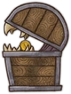

<!-- source: action=render -->

欢迎来到 背包乱斗：福西法的宝藏 中文Wiki！

这是由 PlayWithFurcifer 制作的游戏《<a href="pages/%E8%83%8C%E5%8C%85%E4%B9%B1%E6%96%97.html" title="背包乱斗">背包乱斗：福西法的宝藏（Backpack Battles）</a>》的中文Wiki。背包乱斗Wiki作为玩家在游戏外查找<a href="pages/%E7%89%A9%E5%93%81.html" title="物品">物品</a>、<a href="pages/%E5%90%88%E6%88%90%E9%85%8D%E6%96%B9.html" title="合成配方">配方</a>和信息的途径。

如果您有任何问题在这里找不到答案，请到Discord的#bpb-general或者官方QQ群中提问。

游戏内容

<ul class="gallery mw-gallery-nolines">
		<li class="gallerybox" style="width: 125px">

			

			
<a href="pages/%E7%89%A9%E5%93%81.html" title="物品">物品</a>

		
</li>
		<li class="gallerybox" style="width: 125px">

			

			
<a href="pages/%E5%90%88%E6%88%90%E9%85%8D%E6%96%B9.html" title="合成配方">合成配方</a>

		
</li>
		<li class="gallerybox" style="width: 125px">

			

			
<a href="pages/%E6%B8%B8%E6%88%8F%E6%9C%BA%E5%88%B6.html" title="游戏机制">游戏机制</a>

		
</li>
		<li class="gallerybox" style="width: 125px">

			

			
<a href="pages/%E8%A7%92%E8%89%B2.html" title="角色">角色</a>

		
</li>
</ul>

版本更新

2025-12-05 版本<a href="pages/1.0.9b.html" title="1.0.9b">1.0.9b</a>  2025-11-14 版本<a href="pages/1.0.9.html" title="1.0.9">1.0.9</a>  2025-09-26 版本<a href="pages/1.0.8.html" title="1.0.8">1.0.8</a>

<a href="pages/%E7%89%88%E6%9C%AC%E5%8E%86%E5%8F%B2.html" title="版本历史">查看更多...</a>

站外链接

官方链接：  
  
  
  
  

关于背包乱斗wiki

<ul><li>《背包乱斗：福西法的宝藏（Backpack Battles）》一款需要背包管理的自走棋游戏！购买稀有装备搭配出强力组合，然后去和其他玩家一较高下！</li>
<li>背包乱斗wiki是由玩家创建并维护的非官方wiki网站，方便在游戏外查看相关内容。</li>
<li>如果你对编辑此wiki感兴趣，有新的想法想要加入中文wiki，可以直接编辑，也欢迎加入编辑群<a rel="nofollow" class="external text" href="https://qm.qq.com/q/5MwQcXLEXK">822547393</a>交流讨论。</li>
<li>已经有<a href="pages/Special:%E7%BB%9F%E8%AE%A1.html" title="Special:统计">1,655项页面（637项内容页及415个文件）</a>，<a href="pages/Special:%E6%9C%80%E8%BF%91%E6%9B%B4%E6%94%B9.html" title="Special:最近更改">5,895</a>次编辑！</li>
<li>其他语言的Backpack Battles Wiki: <a href="https://backpackbattles.wiki.gg/wiki/" class="extiw" title="en:">English</a></li></ul>

<!-- 
NewPP limit report
Cached time: 20251223094122
Cache expiry: 3600
Reduced expiry: true
Complications: []
CPU time usage: 0.129 seconds
Real time usage: 0.280 seconds
Preprocessor visited node count: 100/1000000
Revision size: 307/4194304 bytes
Post‐expand include size: 8005/4194304 bytes
Template argument size: 1856/4194304 bytes
Highest expansion depth: 5/100
Expensive parser function count: 0/500
Unstrip recursion depth: 0/20
Unstrip post‐expand size: 2169/10000000 bytes
Number of processed Cargo queries: 1
Time spent processing Cargo queries: 0.016 s (avg. 0.016 s)
Number of Cargo row insertion attempts: 0
-->
<!--
Transclusion expansion time report (%,ms,calls,template)
100.00%   52.246      1 -total
 69.83%   36.483      5 Template:H2
 35.11%   18.342      1 Template:首页/版本更新
 33.59%   17.552      1 Template:首页/游戏内容
  8.85%    4.623      1 Template:首页/欢迎
  8.43%    4.405      1 Template:首页/关于Wiki
  4.05%    2.118      1 Template:首页/站外链接
  3.30%    1.723      1 Template:Clear
-->

